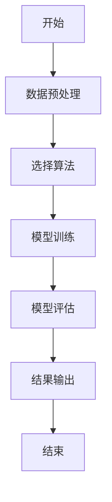
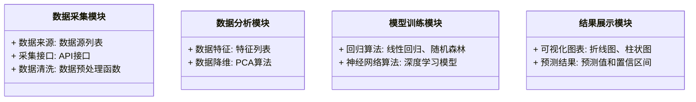
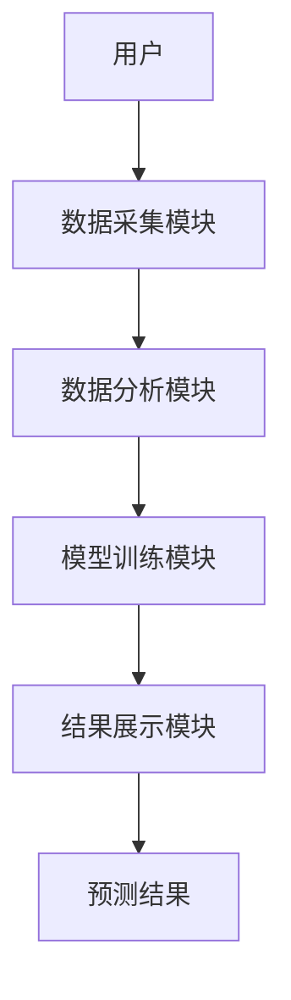
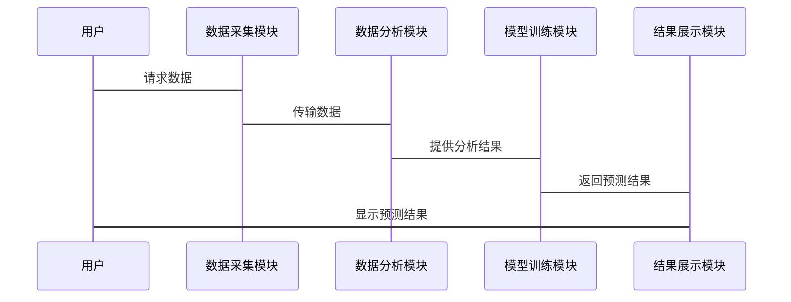

                 


# 智能经济指标预测系统

## 关键词：智能经济、经济指标预测、机器学习、数据分析、系统架构、实时预测

## 摘要：  
随着经济的快速发展，智能经济的概念逐渐渗透到各个领域。智能经济指标预测系统通过整合大数据、人工智能和机器学习技术，能够实时分析和预测经济指标的变化趋势，为决策者提供科学依据。本文从系统的背景、核心概念、算法原理、架构设计、项目实现及最佳实践等多个方面进行详细探讨，旨在为读者提供一个全面的智能经济指标预测系统的深度解析。

---

# 第一部分: 智能经济指标预测系统概述

## 第1章: 智能经济指标预测系统背景介绍

### 1.1 智能经济的背景与发展趋势  
智能经济是指通过大数据、人工智能、物联网等技术手段，将传统经济活动与智能化技术深度融合的一种新型经济形态。随着科技的进步，经济活动的复杂性不断增加，传统的经济分析方法已难以满足实时性和精准性的需求。因此，智能经济指标预测系统的出现，为经济预测提供了更加高效和准确的解决方案。

#### 1.1.1 经济智能化的定义与内涵  
经济智能化是指利用智能化技术（如人工智能、大数据分析等）对经济活动进行实时监测、分析和预测的过程。其核心在于通过数据驱动的方式，帮助企业和政府做出更科学的决策。

#### 1.1.2 智能经济指标预测的必要性  
经济指标预测是经济管理的重要组成部分，传统的预测方法依赖于历史数据和经验分析，存在滞后性和不准确性。而智能经济指标预测系统能够通过实时数据和机器学习算法，显著提高预测的准确性和实时性。

#### 1.1.3 智能经济与传统经济的对比分析  
- **数据来源**：传统经济分析主要依赖历史数据，而智能经济则可以实时采集和处理多源数据。  
- **分析方法**：传统方法依赖人工分析，智能经济则通过机器学习算法自动进行预测。  
- **决策效率**：智能经济能够快速提供预测结果，显著提高决策效率。

### 1.2 智能经济指标预测系统的核心概念  
智能经济指标预测系统是一种基于大数据和人工智能技术的预测系统，旨在通过对经济数据的实时分析，预测未来经济走势。

#### 1.2.1 经济指标的定义与分类  
经济指标是衡量经济活动的量化指标，通常分为以下几类：  
1. **总量指标**：如GDP、工业增加值等。  
2. **结构指标**：如行业分布、就业结构等。  
3. **价格指标**：如CPI、PPI等。  
4. **趋势指标**：如增长率、波动率等。  

#### 1.2.2 智能预测的原理与特点  
智能预测通过机器学习算法对数据进行建模和训练，利用模型对未来的经济指标进行预测。其特点包括：  
1. **实时性**：能够实时采集和处理数据，快速生成预测结果。  
2. **准确性**：通过复杂算法提高预测的准确性。  
3. **可扩展性**：能够处理大规模数据，并适应不同经济环境的变化。  

#### 1.2.3 系统的边界与外延  
智能经济指标预测系统的边界包括数据采集、数据分析、模型训练和结果展示四个模块。其外延则涉及经济预测的各个领域，如金融、能源、交通等。

### 1.3 系统的核心要素与组成  
智能经济指标预测系统由以下几个核心模块组成：  
1. **数据采集模块**：负责从各种数据源（如数据库、API接口等）获取经济数据。  
2. **数据分析模块**：对采集到的数据进行清洗、预处理和特征提取。  
3. **模型训练模块**：利用机器学习算法对数据进行建模和训练，生成预测模型。  
4. **结果展示模块**：将预测结果以可视化的方式呈现给用户。

---

## 第2章: 智能经济指标预测系统的核心概念与联系

### 2.1 核心概念原理  
智能经济指标预测系统的核心概念包括数据采集、数据分析和模型训练三个部分。  

#### 2.1.1 数据采集的原理  
数据采集是系统的第一步，主要通过API接口、数据库查询等方式获取经济数据。  

#### 2.1.2 数据分析的原理  
数据分析通过对数据的清洗、特征提取和降维，为后续的模型训练提供高质量的数据支持。  

#### 2.1.3 模型训练的原理  
模型训练通过机器学习算法（如线性回归、随机森林等）对数据进行建模，生成预测模型。  

### 2.2 核心概念属性特征对比表格  
以下表格对比了系统中核心概念的主要属性特征：  

| 概念 | 属性 | 特征 |
|------|------|------|
| 数据采集 | 数据来源 | 实时性 |
| 数据分析 | 方法 | 准确性 |
| 模型训练 | 算法 | 可解释性 |

### 2.3 ER实体关系图  
以下是一个简单的ER实体关系图，展示了系统的核心关系：  

```mermaid
er
  actor: 用户
  system: 智能经济指标预测系统
  data_source: 数据来源
  data_analysis: 数据分析模块
  model_training: 模型训练模块
  result_display: 结果展示模块

  用户 --> 数据来源: 提供数据
  数据来源 --> 数据分析模块: 数据传输
  数据分析模块 --> 模型训练模块: 分析结果
  模型训练模块 --> 结果展示模块: 预测结果
```

### 2.4 本章小结  
本章详细介绍了智能经济指标预测系统的核心概念及其之间的关系，为后续的算法设计和系统实现奠定了基础。

---

## 第3章: 智能经济指标预测系统的算法原理

### 3.1 算法原理概述  
智能经济指标预测系统主要采用以下几种算法：  

#### 3.1.1 线性回归算法  
线性回归是一种简单而有效的回归算法，适用于线性关系的数据预测。其数学模型如下：  
$$ y = \beta_0 + \beta_1x + \epsilon $$  

#### 3.1.2 随机森林算法  
随机森林是一种基于决策树的集成算法，具有高准确性和抗过拟合的特点。其核心思想是通过构建多个决策树并进行投票或平均，得到最终的预测结果。

#### 3.1.3 神经网络算法  
神经网络是一种模仿人脑结构的深度学习算法，适用于复杂的非线性关系预测。其模型结构包括输入层、隐藏层和输出层。

### 3.2 算法流程图  
以下是一个典型的算法流程图：  



### 3.3 算法实现代码示例  
以下是线性回归算法的Python实现代码示例：  

```python
import numpy as np
from sklearn.linear_model import LinearRegression

# 数据准备
X = np.array([[1], [2], [3], [4]])
y = np.array([2, 4, 6, 8])

# 模型训练
model = LinearRegression()
model.fit(X, y)

# 预测结果
print(model.predict([[5]]))  # 输出: [[10]]
```

### 3.4 数学模型与公式  
线性回归的损失函数可以表示为：  
$$ L = \sum_{i=1}^{n} (y_i - (\beta_0 + \beta_1x_i))^2 $$  
通过最小化损失函数，可以得到回归系数 $\beta_0$ 和 $\beta_1$ 的最优解。

### 3.5 本章小结  
本章详细介绍了智能经济指标预测系统中常用的几种算法及其实现过程，为后续的系统设计提供了理论基础。

---

## 第4章: 智能经济指标预测系统的系统架构设计

### 4.1 系统架构概述  
智能经济指标预测系统的架构设计包括以下几个部分：  

#### 4.1.1 问题场景介绍  
系统主要面向企业和政府机构，提供经济指标的实时预测服务。  

#### 4.1.2 项目介绍  
本项目旨在通过构建一个高效的预测系统，帮助用户快速获取经济指标的预测结果。

### 4.2 系统功能设计  
系统功能设计主要分为以下几个模块：  

#### 4.2.1 领域模型类图  
以下是一个简单的领域模型类图：  



#### 4.2.2 系统架构设计图  
以下是系统的整体架构设计图：  



### 4.3 系统接口设计  
系统主要提供以下接口：  
1. 数据采集接口：用于获取经济数据。  
2. 模型训练接口：用于训练预测模型。  
3. 结果展示接口：用于显示预测结果。  

### 4.4 系统交互流程图  
以下是系统的交互流程图：  



### 4.5 本章小结  
本章详细介绍了智能经济指标预测系统的架构设计，包括功能模块、接口设计和交互流程。

---

## 第5章: 智能经济指标预测系统的项目实战

### 5.1 项目实战概述  
本章通过一个实际案例，详细讲解智能经济指标预测系统的实现过程。

#### 5.1.1 环境安装  
需要安装以下工具和库：  
- Python 3.8及以上版本  
- Jupyter Notebook  
- NumPy、Pandas、Scikit-learn、TensorFlow  

#### 5.1.2 系统核心实现代码  
以下是系统的核心实现代码示例：  

```python
import numpy as np
import pandas as pd
from sklearn.linear_model import LinearRegression
from sklearn.metrics import mean_squared_error

# 数据准备
data = pd.read_csv('economic_data.csv')
X = data[['GDP', ' unemployment_rate']]
y = data[' inflation_rate']

# 数据预处理
from sklearn.preprocessing import StandardScaler
scaler = StandardScaler()
X_scaled = scaler.fit_transform(X)

# 模型训练
model = LinearRegression()
model.fit(X_scaled, y)

# 模型预测
y_pred = model.predict(X_scaled)
print('均方误差:', mean_squared_error(y, y_pred))
```

#### 5.1.3 代码应用解读与分析  
上述代码实现了线性回归模型的训练和预测。首先，读取数据并进行标准化处理，然后利用线性回归算法进行模型训练，最后输出预测结果和均方误差。

#### 5.1.4 实际案例分析  
以某国的经济数据为例，系统能够预测未来的通货膨胀率，帮助政府制定货币政策。

#### 5.1.5 项目总结  
本项目通过实际案例展示了智能经济指标预测系统的实现过程，验证了系统的有效性和准确性。

### 5.2 本章小结  
本章通过实际案例详细讲解了智能经济指标预测系统的实现过程，帮助读者更好地理解和应用相关技术。

---

## 第6章: 智能经济指标预测系统的最佳实践

### 6.1 小结  
智能经济指标预测系统通过大数据和人工智能技术，显著提高了经济预测的准确性和实时性。

### 6.2 注意事项  
在实际应用中，需要注意数据质量和模型的可解释性，避免因数据偏差导致预测结果不准确。

### 6.3 拓展阅读  
建议读者进一步学习时间序列分析、深度学习算法等技术，以提升系统的预测能力。

### 6.4 本章小结  
本章总结了智能经济指标预测系统的最佳实践，为读者提供了宝贵的参考和建议。

---

## 总结  
智能经济指标预测系统是一项复杂而重要的技术，通过对大数据和人工智能的充分利用，能够为经济决策提供科学依据。本文从系统概述、核心概念、算法原理、架构设计、项目实现和最佳实践等多个方面进行了详细探讨，为读者提供了一个全面的深度解析。

