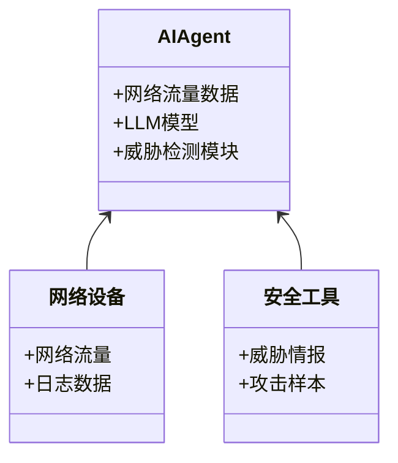
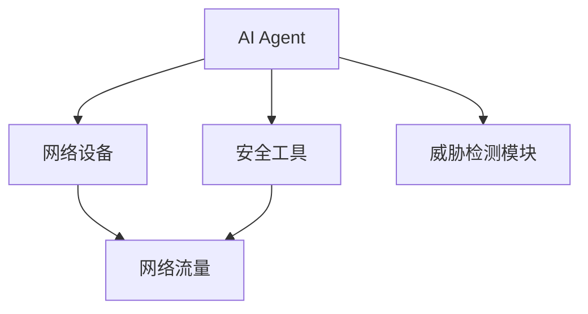

                 


# 智能网络安全分析 AI Agent：LLM 在网络防御中的应用

---

## 关键词
智能网络安全分析，AI Agent，LLM，网络防御，大语言模型

---

## 摘要
随着网络安全威胁的日益复杂化和智能化，传统的安全防御方法已经难以应对新型攻击手段。本文探讨了如何利用大语言模型（LLM）构建智能网络安全分析 AI Agent，以提升网络防御能力。通过分析LLM在网络安全中的应用，本文详细介绍了AI Agent的设计原理、实现方法以及实际应用场景，展示了如何利用LLM的强大能力解决网络安全中的复杂问题。

---

# 正文

## 第一部分：背景与基础

### 第1章：智能网络安全分析的背景与意义

#### 1.1 智能网络安全分析的背景
网络安全威胁的复杂性和多样性使得传统的基于规则的安全解决方案逐渐失效。攻击者不断进化其技术，利用高级持续性威胁（APT）、零日攻击和人工智能（AI）驱动的攻击手段，给企业网络带来了前所未有的挑战。为了应对这些挑战，网络安全分析需要更加智能化和自动化。

#### 1.2 问题背景
- **问题背景**：传统的基于规则的防火墙和入侵检测系统（IDS）难以应对未知的、复杂的攻击模式。
- **问题描述**：攻击者利用AI技术进行攻击，传统的防御手段无法有效识别和应对这些复杂攻击。
- **解决思路**：引入AI技术，特别是大语言模型（LLM），构建智能网络安全分析 AI Agent，实时监控和分析网络流量，识别潜在威胁。

#### 1.3 边界与外延
智能网络安全分析 AI Agent 的边界在于其处理的网络流量数据，外延则包括与之交互的网络设备、安全工具和用户。

### 第2章：AI Agent与LLM的核心概念

#### 2.1 AI Agent的基本原理
- **定义**：AI Agent 是一种能够感知环境、自主决策并执行任务的智能体。
- **特点**：
  - 自主性
  - 反应性
  - 社会能力
- **应用场景**：网络监控、威胁检测、响应处理。

#### 2.2 LLM的基本原理
- **定义**：大语言模型（LLM）是一种基于深度学习的自然语言处理模型，能够理解和生成人类语言。
- **特点**：
  - 强大的上下文理解能力
  - 多语言支持
  - 自适应学习能力

#### 2.3 核心概念联系
- **LLM与AI Agent的结合**：AI Agent利用LLM进行自然语言处理和模式识别，提升威胁检测和分析能力。

## 第二部分：技术原理

### 第3章：LLM在网络安全中的应用

#### 3.1 LLM的训练过程
- **训练数据**：包括网络流量日志、安全事件数据、攻击样本等。
- **训练目标**：通过监督学习，使模型能够识别异常流量和攻击模式。

#### 3.2 LLM的推理机制
- **输入处理**：接收网络流量数据，提取特征并生成上下文。
- **输出处理**：生成威胁分析结果，包括攻击类型、严重程度和建议的响应措施。

#### 3.3 网络安全中的LLM应用
- **异常流量检测**：通过LLM分析流量模式，识别潜在攻击。
- **威胁情报分析**：利用LLM处理安全报告和情报，提取关键信息。

### 第4章：算法原理

#### 4.1 损失函数
$$ \text{损失函数} = \text{交叉熵损失} + \text{正则化项} $$

#### 4.2 优化器
- **Adam优化器**：结合动量和自适应学习率调整，优化模型参数。

#### 4.3 注意力机制
$$ \text{注意力权重} = \text{ softmax}(\frac{QK^T}{\sqrt{d_k}}) $$

## 第三部分：系统架构

### 第5章：系统设计

#### 5.1 领域模型


#### 5.2 系统架构


## 第四部分：项目实战

### 第6章：实战案例

#### 6.1 环境安装
```bash
pip install transformers
pip install torch
```

#### 6.2 核心代码实现
```python
import torch
from transformers import AutoModelForSequenceClassification, AutoTokenizer

class SecurityAgent:
    def __init__(self, model_name):
        self.model = AutoModelForSequenceClassification.from_pretrained(model_name)
        self.tokenizer = AutoTokenizer.from_pretrained(model_name)

    def analyze_traffic(self, text):
        inputs = self.tokenizer(text, return_tensors='np')
        outputs = self.model(**inputs)
        return outputs.logits.argmax(-1).item()

agent = SecurityAgent('facebook/bart-large')
result = agent.analyze_traffic('检测到异常流量')
```

#### 6.3 案例分析
通过对实际网络流量的分析，AI Agent能够准确识别异常行为，并生成相应的威胁报告。

## 第五部分：总结与展望

### 第7章：总结
通过引入LLM技术，AI Agent在网络安全分析中展现出强大的能力，能够有效应对复杂威胁。

### 第8章：展望
未来，LLM在网络安全中的应用将更加广泛，AI Agent将变得更加智能和自主。

---

## 注意事项
- **数据隐私**：确保训练数据和模型的安全性。
- **模型更新**：定期更新模型以应对新的威胁。
- **性能优化**：优化模型推理速度和准确性。

---

通过以上步骤，我们可以构建一个完整的智能网络安全分析 AI Agent，利用LLM的强大能力提升网络防御能力。

