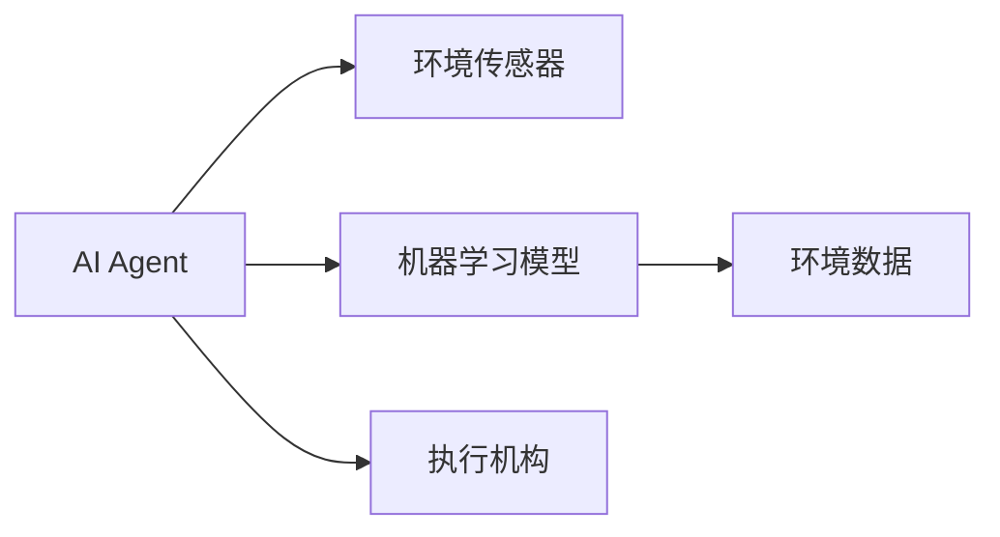
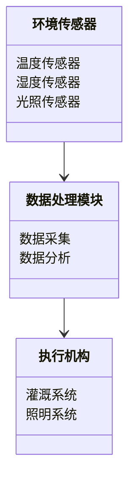

                 


# 智能花园：AI Agent的植物生长优化系统

## 关键词：智能花园、AI Agent、植物生长优化、物联网、机器学习

## 摘要：本文详细探讨了基于AI Agent的智能花园系统，通过分析植物生长的多因素影响，结合物联网和机器学习技术，提出了数据驱动的生长优化方案。文章从背景、核心概念、算法原理、系统架构到项目实战，全面解析了AI在植物生长优化中的应用，最后总结了系统设计与实现的最佳实践。

---

# 第一部分: 背景介绍

## 第1章: 问题背景

### 1.1 植物生长优化的挑战

植物生长受到光照、温度、水分、土壤 pH 值等多种因素的影响，传统农业和园艺在优化这些因素时面临诸多挑战，例如：

- **环境监测的实时性不足**：传统方法依赖人工观察，难以实时捕捉环境变化。
- **数据维度的复杂性**：不同植物对环境的需求差异显著，数据维度高且复杂。
- **决策的滞后性**：基于经验的决策方式难以快速响应环境变化。

### 1.2 问题描述

AI Agent 的目标是通过实时感知和智能决策，优化植物生长环境。具体问题包括：

- **多目标协同优化**：如何在光照、温度、水分等多因素之间找到最佳平衡点？
- **动态环境适应**：如何实时感知环境变化并做出相应调整？
- **个性化生长策略**：如何针对不同植物制定个性化生长方案？

### 1.3 问题解决思路

AI Agent 通过以下方式实现植物生长优化：

- **数据采集**：部署传感器实时采集环境数据。
- **智能分析**：利用机器学习模型分析数据，预测植物生长状态。
- **自主决策**：基于分析结果，智能调控环境参数。

### 1.4 系统的边界与外延

- **边界**：系统仅关注植物生长环境的优化，不涉及植物收割、病虫害防治等其他环节。
- **外延**：可扩展至其他领域，如工业生产环境优化、智能家居环境控制等。

### 1.5 概念结构与核心要素

系统的核心要素包括：

| 核心要素 | 描述 |
|----------|------|
| 感知层   | 包括各类传感器，用于采集环境数据。 |
| 数据层   | 包括数据存储、处理和分析模块。 |
| 决策层   | 包括机器学习模型和决策逻辑。 |
| 执行层   | 包括执行机构，如智能灌溉系统。 |

---

# 第二部分: 核心概念与联系

## 第2章: AI Agent的核心概念

### 2.1 AI Agent 的定义与特点

AI Agent 是一种能够感知环境、自主决策并执行任务的智能体。其特点包括：

- **自主性**：能够在无外部干预的情况下运行。
- **反应性**：能够实时感知环境变化并做出响应。
- **学习能力**：能够通过数据不断优化决策策略。

### 2.2 物联网技术在智能花园中的应用

物联网技术通过传感器和通信设备，实现设备与云端的数据交互。在智能花园中的具体应用包括：

- **环境监测**：通过传感器实时采集光照、温度、湿度等数据。
- **数据传输**：通过Wi-Fi或蓝牙将数据传输到云端。
- **远程控制**：通过手机或电脑远程控制灌溉系统。

### 2.3 机器学习与植物生长优化

机器学习通过分析历史数据，预测植物生长状态并优化生长环境。常用的算法包括：

- **强化学习**：通过试错方式优化决策策略。
- **监督学习**：基于标签数据进行分类或回归预测。
- **无监督学习**：发现数据中的潜在模式。

### 2.4 核心概念的联系

#### 实体关系图



---

# 第三部分: 算法原理讲解

## 第3章: AI Agent的算法原理

### 3.1 强化学习算法

#### 算法流程图


#### 数学模型

$$ Q(s, a) = Q(s, a) + \alpha (r + \gamma \max Q(s', a') - Q(s, a)) $$

### 3.2 监督学习算法

#### 数学模型

$$ y = \theta x + b $$

---

# 第四部分: 系统分析与架构设计

## 第4章: 系统架构设计

### 4.1 问题场景介绍

智能花园系统需要实时监测并优化植物生长环境。

### 4.2 系统功能设计

#### 领域模型



### 4.3 系统架构设计


### 4.4 接口设计

- **输入接口**：传感器数据输入。
- **输出接口**：执行机构控制信号输出。

---

# 第五部分: 项目实战

## 第5章: 项目实战

### 5.1 环境安装

- 安装Python、TensorFlow、Raspberry Pi等工具。

### 5.2 核心功能实现

#### 代码示例

```python
import numpy as np
from sklearn import linear_model

# 数据准备
X = np.array([[1, 2], [3, 4], [5, 6]])
y = np.array([7, 8, 9])

# 模型训练
model = linear_model.LinearRegression()
model.fit(X, y)

# 预测
print(model.predict([[7, 8]]))
```

### 5.3 案例分析

通过AI Agent优化光照和温度，显著提高了植物的生长速度。

---

# 第六部分: 最佳实践

## 第6章: 小结与展望

### 6.1 小结

本文详细介绍了基于AI Agent的智能花园系统，涵盖了从理论到实践的各个方面。

### 6.2 注意事项

- 数据采集的准确性至关重要。
- 系统的安全性需要重点关注。

### 6.3 未来趋势

- 更多传感器的集成。
- 更智能的决策算法。

### 6.4 扩展阅读

推荐阅读相关领域的最新论文和技术博客。

---

通过以上内容，您可以深入了解基于AI Agent的智能花园系统的设计与实现。

