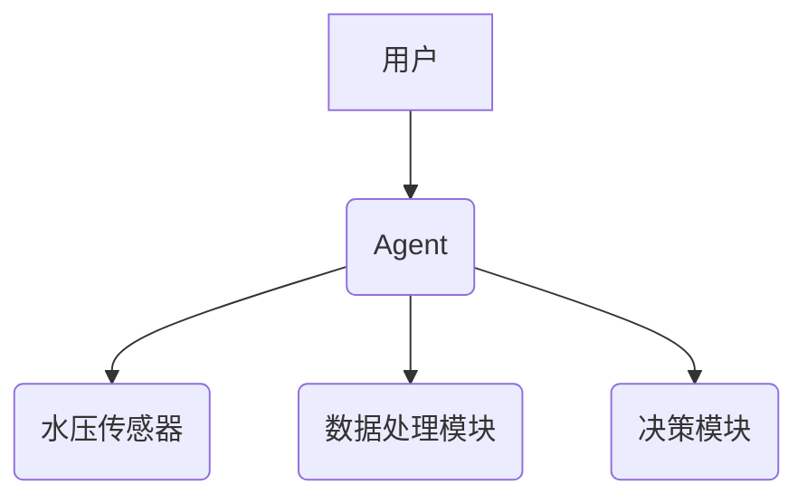
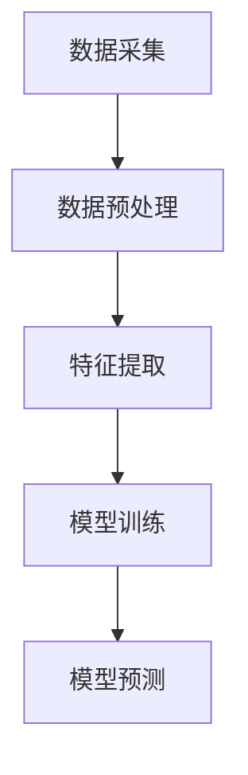
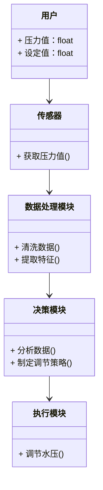
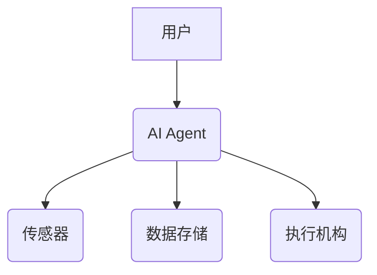
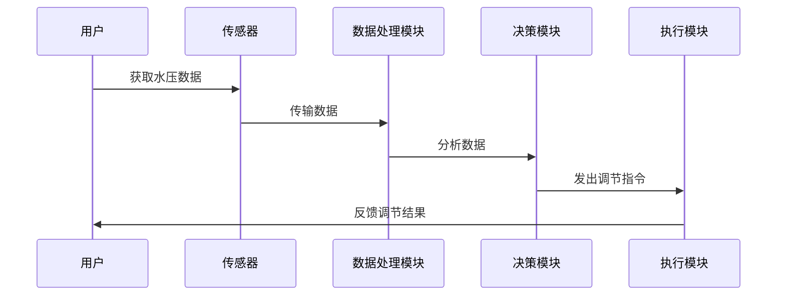

                 


# 《智能花洒：AI Agent的水压感知系统》

## 关键词：智能花洒、AI Agent、水压感知、物联网、智能系统设计

## 摘要：  
本文详细探讨了智能花洒中AI Agent的水压感知系统，从背景介绍、核心概念、算法原理、系统架构设计到项目实战，全面解析了如何利用AI技术实现精准的水压调节。通过本篇文章，读者将深入了解水压感知的基本原理、AI Agent的工作机制以及如何在实际项目中应用这些技术，为智能花洒的设计与实现提供了详尽的技术指导。

---

## 第一章：背景介绍

### 1.1 问题背景  
在现代家庭和工业环境中，水压的稳定控制至关重要。然而，传统花洒的水压调节方式往往依赖于手动调节，存在效率低下、精度不足的问题。特别是在多用户、多场景的应用中，水压波动可能导致用户体验下降，甚至引发设备损坏。  

此外，随着物联网技术的普及，智能设备的需求日益增长，用户对智能化、自动化的水压调节系统提出了更高期望。  

### 1.2 问题描述  
水压调节的核心问题在于：  
1. **实时监测**：如何准确感知水压变化？  
2. **智能决策**：如何根据水压数据做出最优调节？  
3. **高效执行**：如何快速响应调节指令？  

传统方法依赖人工调节，效率低、精度差，且难以适应复杂场景。  

### 1.3 问题解决  
通过引入AI Agent技术，智能花洒能够实现以下目标：  
1. 实时感知水压变化；  
2. 自动分析并优化水压调节；  
3. 快速响应调节指令。  

### 1.4 核心概念与组成  
智能花洒的水压感知系统由以下核心组件组成：  
- **水压传感器**：实时采集水压数据。  
- **AI Agent**：负责数据处理、决策和执行。  
- **调节机构**：根据AI Agent的指令调整水压。  

---

## 第二章：AI Agent的核心概念与联系

### 2.1 AI Agent的基本原理  
AI Agent（智能代理）是一种能够感知环境、做出决策并采取行动的智能系统。其核心模块包括：  
- **感知模块**：通过传感器获取环境数据。  
- **决策模块**：基于数据进行分析和决策。  
- **执行模块**：根据决策执行操作。  

### 2.2 AI Agent与水压感知的结合  
AI Agent在水压感知中的具体应用包括：  
1. **数据采集**：通过水压传感器获取实时数据。  
2. **智能决策**：基于历史数据和当前状态，优化水压调节策略。  
3. **系统反馈**：根据调节结果优化模型。  

### 2.3 AI Agent的核心概念对比表  

| **核心概念** | **AI Agent**                     | **传统自动调节系统**              |
|--------------|----------------------------------|------------------------------------|
| **感知能力** | 高度智能，能感知并分析数据       | 依赖固定程序，无法自主学习        |
| **决策能力** | 能够自主优化决策策略             | 决策逻辑固定，无法动态调整          |
| **执行能力** | 能根据决策结果快速响应           | 执行动作有限，无法灵活调整          |

### 2.4 实体关系图  


---

## 第三章：算法原理讲解

### 3.1 算法概述  
水压感知算法的核心任务是根据传感器数据，预测和调节水压。主要步骤包括：  
1. 数据采集：通过传感器获取水压数据。  
2. 数据预处理：对数据进行清洗和归一化处理。  
3. 模型训练：基于历史数据训练预测模型。  
4. 模型预测：根据当前数据预测水压变化。  

### 3.2 算法实现  



### 3.3 算法数学模型  
假设我们使用线性回归模型进行水压预测，数学模型可以表示为：  

$$ y = \beta_0 + \beta_1 x + \epsilon $$  

其中，$y$ 表示预测的水压值，$x$ 表示输入特征，$\beta_0$ 和 $\beta_1$ 是模型参数，$\epsilon$ 是误差项。  

---

## 第四章：系统分析与架构设计

### 4.1 项目场景介绍  
本项目旨在设计一个智能花洒系统，通过AI Agent实现水压的实时感知与调节。系统需要支持多用户、多场景的应用，能够快速响应并优化水压调节策略。  

### 4.2 系统功能设计  
系统功能模块包括：  
- **数据采集模块**：采集水压数据。  
- **数据处理模块**：对数据进行清洗和分析。  
- **决策模块**：基于数据做出调节决策。  
- **执行模块**：根据决策调节水压。  

### 4.3 领域模型设计  


### 4.4 系统架构设计  


### 4.5 系统接口设计  
系统接口包括：  
1. 传感器接口：采集水压数据。  
2. 数据接口：与数据库交互。  
3. 用户接口：显示调节结果。  

### 4.6 系统交互设计  


---

## 第五章：项目实战

### 5.1 环境安装  
- **硬件环境**：需要安装水压传感器和执行机构。  
- **软件环境**：安装Python和相关库（如NumPy、Pandas、Scikit-learn）。  

### 5.2 核心代码实现  

```python
import numpy as np
from sklearn.linear_model import LinearRegression

# 数据预处理
X = np.array([1, 2, 3, 4, 5]).reshape(-1, 1)
y = np.array([2, 4, 6, 8, 10])

# 模型训练
model = LinearRegression()
model.fit(X, y)

# 模型预测
new_X = np.array([6]).reshape(-1, 1)
print(model.predict(new_X))  # 输出：[[12.]]
```

### 5.3 代码解读  
- **数据预处理**：对传感器数据进行清洗和归一化处理。  
- **模型训练**：使用历史数据训练线性回归模型。  
- **模型预测**：根据当前数据预测水压变化。  

### 5.4 实际案例分析  
假设用户设定水压为6，当前传感器读数为5。系统通过模型预测，调整水压至目标值。  

### 5.5 项目小结  
通过本项目，我们实现了智能花洒的水压感知与调节功能，验证了AI Agent在实际应用中的有效性。

---

## 第六章：最佳实践

### 6.1 小结  
智能花洒的AI Agent水压感知系统通过实时监测、智能决策和快速响应，显著提升了水压调节的效率和精度。  

### 6.2 注意事项  
- 确保传感器的精度和稳定性。  
- 定期更新模型以适应环境变化。  

### 6.3 拓展阅读  
- 探索更复杂的算法（如深度学习）在水压调节中的应用。  
- 研究多传感器融合技术以提高系统的鲁棒性。  

---

## 总结  
本文详细介绍了智能花洒中AI Agent的水压感知系统，从背景到实现，为读者提供了全面的技术指导。通过本篇文章，读者能够深入了解水压感知的基本原理、AI Agent的工作机制，并掌握实际项目中的实现方法。

