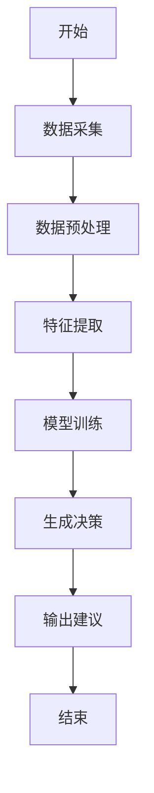
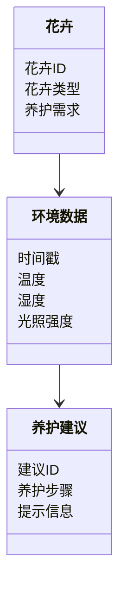
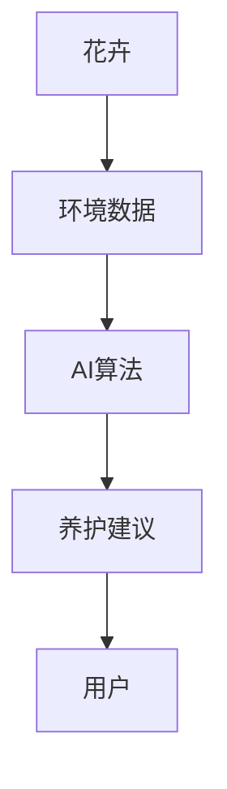
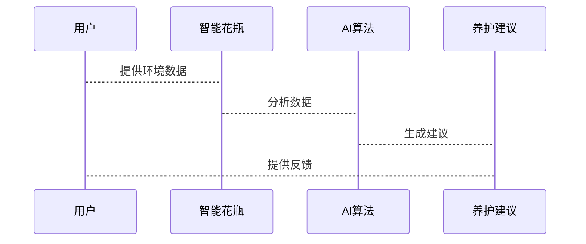

                 


```markdown
# 智能花瓶：AI Agent的花卉养护专家

> 关键词：智能花瓶，AI Agent，花卉养护，算法原理，系统架构，项目实战

> 摘要：本文详细探讨了智能花瓶作为AI Agent在花卉养护领域的应用。通过背景介绍、核心概念、算法原理、系统架构、项目实战和最佳实践，系统地分析了AI在花卉养护中的技术实现和应用场景。文章从问题背景到解决方案，从算法实现到系统设计，再到实际应用，全面阐述了智能花瓶的技术细节和创新点，为读者提供了一个完整的AI驱动的花卉养护解决方案。

---

# 第一部分: 智能花瓶与AI Agent的背景与概念

## 第1章: 花卉养护的智能化需求

### 1.1 问题背景
#### 1.1.1 花卉养护的基本挑战
- 环境因素对植物生长的影响
- 养护知识的获取难度
- 传统养护方法的局限性

#### 1.1.2 智能化养护的必要性
- 提高养护效率
- 减少资源浪费
- 适应不同植物的个性化需求

### 1.2 问题描述
#### 1.2.1 花卉养护中的关键问题
- 环境监测的准确性
- 养护建议的及时性
- 用户交互的便捷性

#### 1.2.2 智能花瓶的目标与功能
- 提供实时环境监测
- 自动生成养护建议
- 支持用户交互

### 1.3 问题解决思路
#### 1.3.1 AI Agent的作用
- 自动感知环境数据
- 分析数据并生成决策
- 执行决策并反馈结果

#### 1.3.2 智能花瓶的解决方案
- 集成传感器和AI算法
- 提供用户友好的交互界面
- 实现实时监测和远程控制

---

## 第2章: AI Agent的核心概念与结构

### 2.1 核心概念定义
#### 2.1.1 AI Agent的定义
- AI Agent的定义与特征
- AI Agent在智能花瓶中的具体应用

#### 2.1.2 智能花瓶的功能模块
- 环境感知模块
- 数据分析模块
- 用户交互模块

### 2.2 核心要素组成
#### 2.2.1 系统架构的核心要素
- 传感器模块
- AI算法模块
- 用户界面模块

#### 2.2.2 功能模块的构成
- 数据采集功能
- 数据分析功能
- 决策生成功能
- 用户反馈功能

---

# 第二部分: AI Agent的核心原理与花卉养护的关系

## 第3章: AI Agent的核心原理

### 3.1 AI Agent的工作原理
#### 3.1.1 感知层的实现
- 传感器数据的采集与处理
- 数据预处理与特征提取

#### 3.1.2 决策层的逻辑
- 数据分析与模式识别
- 养护策略的生成与优化

#### 3.1.3 执行层的机制
- 决策的执行与反馈
- 系统的自适应调整

### 3.2 AI Agent与花卉养护的结合
#### 3.2.1 AI Agent在环境监测中的应用
- 温度、湿度、光照的实时监测
- 土壤湿度的智能检测

#### 3.2.2 AI Agent在养护建议中的作用
- 基于历史数据的分析
- 个性化养护方案的生成

---

## 第4章: 核心概念与花卉养护的关系

### 4.1 核心概念属性对比
#### 4.1.1 不同AI Agent的对比分析
- 基于规则的AI Agent
- 基于机器学习的AI Agent
- 基于深度学习的AI Agent

#### 4.1.2 智能花瓶AI Agent的特征
- 实时性
- 个性化
- �易用性

### 4.2 核心概念的ER图展示
```mermaid
er
    entity 花卉 {
        key: 花卉ID
        属性: 花卉类型, 养护需求
    }
    entity 环境数据 {
        key: 时间戳
        属性: 温度, 湿度, 光照强度
    }
    entity 养护建议 {
        key: 建议ID
        属性: 养护步骤, 提示信息
    }
    花卉 --> 环境数据: 感知
    环境数据 --> 养护建议: 分析
    养护建议 --> 用户: 提示
```

---

# 第三部分: 算法原理与实现

## 第5章: 算法原理与流程

### 5.1 算法原理
#### 5.1.1 数据流处理
- 传感器数据的实时采集
- 数据的预处理与特征提取

#### 5.1.2 决策模型
- 基于机器学习的分类算法
- 基于规则的决策树

### 5.2 算法流程图


---

## 第6章: 算法实现与代码分析

### 6.1 算法实现
#### 6.1.1 数据采集与处理
```python
import pandas as pd

# 示例数据
data = {
    '温度': [22, 23, 24, 22, 23],
    '湿度': [65, 67, 66, 64, 65],
    '光照强度': [800, 750, 820, 780, 800]
}
df = pd.DataFrame(data)
print(df)
```

#### 6.1.2 决策模型训练
```python
from sklearn.tree import DecisionTreeClassifier

# 示例训练数据
X = df[['温度', '湿度', '光照强度']]
y = df['花卉类型']

model = DecisionTreeClassifier()
model.fit(X, y)
```

#### 6.1.3 模型预测与建议生成
```python
# 示例输入
new_data = [[23, 66, 790]]
prediction = model.predict(new_data)
print(f'预测花卉类型: {prediction[0]}')
```

---

## 第7章: 数学模型与公式

### 7.1 数据分析的数学模型
#### 7.1.1 线性回归模型
$$ y = \beta_0 + \beta_1x_1 + \beta_2x_2 + \epsilon $$

#### 7.1.2 决策树模型
$$ Gini指数 = \sum_{i=1}^{n} p_i(1-p_i) $$

---

# 第四部分: 系统分析与架构设计

## 第8章: 系统架构与设计

### 8.1 系统功能设计
#### 8.1.1 领域模型类图


### 8.2 系统架构图


---

## 第9章: 系统接口与交互

### 9.1 系统接口设计
#### 9.1.1 数据接口
- 传感器数据接口
- 养护建议接口

#### 9.1.2 用户接口
- 图形界面
- 声控指令

### 9.2 系统交互流程


---

# 第五部分: 项目实战与应用

## 第10章: 项目实战

### 10.1 环境安装与配置
#### 10.1.1 硬件安装
- 传感器模块的安装
- 网络连接配置

#### 10.1.2 软件安装
- AI算法框架安装
- 数据库安装

### 10.2 系统核心实现
#### 10.2.1 传感器数据采集
```python
import serial

ser = serial.Serial('COM3', 9600)
data = ser.readline().decode().strip()
print(data)
```

#### 10.2.2 养护建议生成
```python
def generate_tip(temp, humidity, light):
    if temp < 18:
        return "建议提高温度"
    elif humidity < 50:
        return "建议增加湿度"
    else:
        return "环境适宜，无需调整"
```

### 10.3 代码应用与案例分析
#### 10.3.1 示例代码实现
```python
from sklearn.tree import DecisionTreeClassifier

# 训练数据
X = df[['温度', '湿度', '光照强度']]
y = df['花卉类型']

model = DecisionTreeClassifier()
model.fit(X, y)

# 测试数据
new_data = [[22, 65, 800]]
prediction = model.predict(new_data)
print(f'预测花卉类型: {prediction[0]}')
```

#### 10.3.2 实际案例分析
- 数据分析与结果验证
- 系统优化与改进

---

## 第11章: 项目小结

### 11.1 项目总结
- 项目目标的实现情况
- 系统性能的评估
- 用户反馈与改进方向

---

# 第六部分: 最佳实践与注意事项

## 第12章: 最佳实践与注意事项

### 12.1 最佳实践
#### 12.1.1 系统维护
- 数据更新与模型再训练
- 系统性能优化

#### 12.1.2 用户教育
- 提供详细的使用说明
- 开展用户培训

### 12.2 注意事项
#### 12.2.1 系统安全性
- 数据隐私保护
- 系统抗干扰能力

#### 12.2.2 环境适应性
- 不同植物的适用性
- 不同环境的适应性

---

## 第13章: 拓展阅读与未来展望

### 13.1 拓展阅读
- AI在农业中的应用
- 智能设备的最新技术

### 13.2 未来展望
- 更智能化的养护方案
- 更广泛的植物应用场景

---

# 总结

通过以上详细的分析与设计，智能花瓶作为AI Agent在花卉养护中的应用已经得到了充分的阐述。从算法原理到系统架构，从项目实战到最佳实践，本文为读者提供了一个全面的技术指南，帮助读者理解和实现这一创新的AI应用。
```

