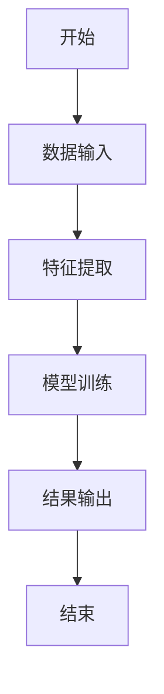
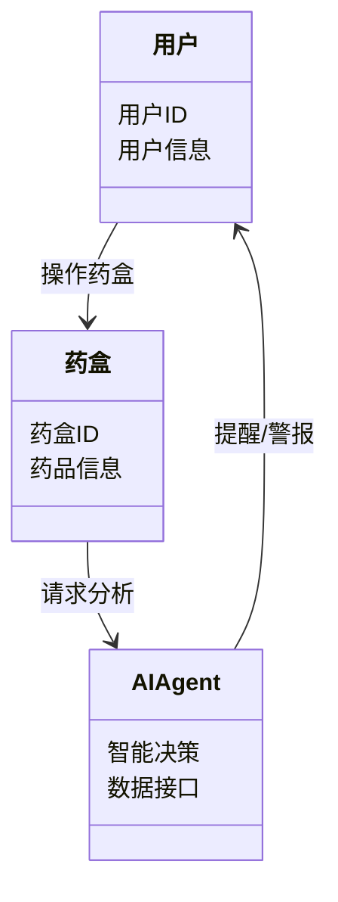
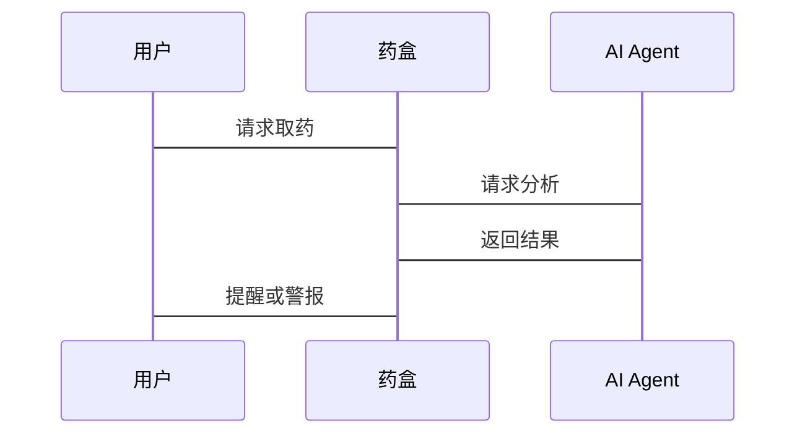

                 


```markdown
# 智能药盒：AI Agent的用药安全监督助手

> 关键词：AI Agent, 智能药盒, 用药安全, 医疗健康, 人工智能

> 摘要：本文探讨了AI Agent在智能药盒中的应用，重点分析了其在用药安全监督中的核心作用。通过背景介绍、核心概念与联系、算法原理的详细讲解，系统分析与架构设计，以及项目实战的案例分析，本文旨在为读者提供一个全面的技术视角，理解如何通过AI技术提升用药安全性和智能化水平。文章结合理论与实践，深入剖析了智能药盒的设计思路、实现方法和实际应用，为相关领域的研究和实践提供了参考。

---

## 第一部分: 背景介绍

### 第1章: AI Agent与智能药盒的背景与问题背景

#### 1.1 问题背景

##### 1.1.1 药品安全问题的现状
全球范围内，每年因用药错误导致的医疗事故数量庞大，造成巨大的经济损失和人员伤亡。药品误用、过期药使用、药物相互作用等问题尤为突出。

##### 1.1.2 用药错误的严重性
用药错误可能导致患者病情加重，甚至死亡。据统计，每年约有10%的住院患者因药物使用不当而出现不良反应。

##### 1.1.3 AI在医疗健康领域的潜力
人工智能技术在医疗健康领域的应用日益广泛，尤其是在药物管理、疾病诊断和治疗方案优化方面展现出巨大潜力。

#### 1.2 问题描述

##### 1.2.1 用药安全监督的需求
患者和医护人员需要实时监督用药过程，确保药物的正确使用和安全性。

##### 1.2.2 智能药盒的目标与功能
智能药盒旨在通过AI技术实现用药提醒、剂量监控、药物过期提醒等功能，确保用药安全。

##### 1.2.3 AI Agent在药盒中的角色
AI Agent作为智能药盒的核心组件，负责接收用户指令、处理数据、执行操作，并与外部系统进行交互。

#### 1.3 问题解决

##### 1.3.1 AI Agent如何实现用药监督
通过实时数据分析和机器学习算法，AI Agent能够识别用药错误并及时发出警报。

##### 1.3.2 智能药盒的技术实现路径
利用物联网技术采集用药数据，结合AI算法进行分析，实现智能化的用药监督。

##### 1.3.3 用户需求与技术解决方案的匹配
智能药盒的设计充分考虑了用户的实际需求，确保技术解决方案能够有效满足用药安全监督的要求。

#### 1.4 边界与外延

##### 1.4.1 智能药盒的功能边界
智能药盒的功能主要集中在用药监督和提醒，不涉及药物配送和处方管理。

##### 1.4.2 AI Agent的适用场景
适用于家庭用药、慢性病患者管理、医疗机构药品管理等场景。

##### 1.4.3 与其他医疗设备的协同关系
智能药盒可以与智能手环、血压计等设备协同工作，形成全面的健康监测系统。

#### 1.5 概念结构与核心要素

##### 1.5.1 智能药盒的核心组成
- 药盒硬件：用于存储和 dispensing 药物
- AI Agent：负责数据处理和智能决策
- 用户交互界面：便于用户操作和查看信息

##### 1.5.2 AI Agent的功能模块
- 数据采集模块：收集用药数据
- 分析模块：识别异常用药行为
- 通知模块：发出警报或提醒

##### 1.5.3 用药安全监督的实现机制
通过实时数据监控、异常检测算法和用户反馈机制，确保用药安全。

#### 1.6 本章小结
本章通过分析药品安全问题的现状，明确了智能药盒和AI Agent在用药安全监督中的重要性，并界定了功能边界和适用场景。

---

## 第二部分: 核心概念与联系

### 第2章: AI Agent与智能药盒的关系

#### 2.1 核心概念原理

##### 2.1.1 AI Agent的基本原理
AI Agent是一种能够感知环境、自主决策并执行任务的智能实体，通过传感器和执行器与外部环境交互。

##### 2.1.2 智能药盒的实现机制
智能药盒通过嵌入AI Agent，实现对用药行为的实时监控和智能提醒。

##### 2.1.3 两者结合的逻辑关系
AI Agent作为智能药盒的核心，通过数据处理和智能决策，实现用药安全监督的功能。

#### 2.2 概念属性特征对比

| 属性       | AI Agent                     | 智能药盒                   |
|------------|----------------------------|---------------------------|
| 功能       | 数据处理、决策、执行         | 存储药物、提醒、监控       |
| 输入       | 用户指令、传感器数据         | 药物信息、用户数据         |
| 输出       | 智能决策结果                 | 用药提醒、警报             |
| 技术基础   | 机器学习、自然语言处理       | 物联网、传感器技术         |
| 应用场景   | 医疗健康、智能家居           | 家庭用药、医疗机构         |

#### 2.3 ER实体关系图
```mermaid
er
    actor: 用户
    entity: 药盒
    entity: AI Agent
    entity: 药品信息
    entity: 用药记录
    entity: 安全监督日志
    actor --> entity: 用户操作
    entity --> entity: AI Agent调用
    entity --> entity: 数据交互
```

#### 2.4 本章小结
本章通过对比分析和ER图，明确了AI Agent与智能药盒之间的关系及其各自的功能属性。

---

## 第三部分: 算法原理讲解

### 第3章: AI Agent的算法实现

#### 3.1 算法原理

##### 3.1.1 监督学习算法
监督学习通过标注数据训练模型，使其能够预测新的数据点。例如，使用随机森林算法进行分类。

##### 3.1.2 强化学习算法
强化学习通过奖励机制，使AI Agent学会最优策略。例如，使用Q-learning算法进行决策。

##### 3.1.3 知识图谱构建算法
知识图谱通过实体识别和关系抽取，构建结构化的知识库，支持智能推理。

#### 3.2 算法流程图


#### 3.3 算法实现的数学模型

##### 3.3.1 监督学习模型
$$\text{损失函数} = \sum_{i=1}^{n} (y_i - \hat{y_i})^2$$
其中，$y_i$ 是真实标签，$\hat{y_i}$ 是预测标签。

##### 3.3.2 强化学习模型
$$Q(s,a) = r + \gamma \max_{a'} Q(s',a')$$
其中，$s$ 是状态，$a$ 是动作，$r$ 是奖励，$\gamma$ 是折扣因子。

##### 3.3.3 知识图谱构建模型
$$\text{实体识别} = \text{基于上下文的特征向量}$$
$$\text{关系抽取} = \text{基于上下文的特征向量}$$

#### 3.4 本章小结
本章通过算法流程图和数学模型，详细讲解了AI Agent的算法实现原理。

---

### 第4章: 系统分析与架构设计

#### 4.1 问题场景介绍
智能药盒的使用场景包括家庭用药、医疗机构药品管理等。

#### 4.2 系统功能设计

##### 4.2.1 领域模型类图


#### 4.3 系统架构设计

##### 4.3.1 系统架构图
```mermaid
archi
    前端 --> 后端
    后端 --> 数据库
    后端 --> AI Agent
    AI Agent --> 外部系统
```

#### 4.4 系统接口设计
- 用户与药盒交互接口：HTTP API
- 药盒与AI Agent交互接口：消息队列

#### 4.5 系统交互流程图


#### 4.6 本章小结
本章通过系统架构图和交互流程图，详细描述了智能药盒的系统设计。

---

### 第5章: 项目实战

#### 5.1 环境安装
- 安装Python和相关库（如TensorFlow、Scikit-learn）

#### 5.2 核心实现代码

##### 5.2.1 监督学习代码示例
```python
from sklearn.ensemble import RandomForestClassifier
model = RandomForestClassifier()
model.fit(X_train, y_train)
```

##### 5.2.2 强化学习代码示例
```python
import numpy as np
Q = np.zeros((state_space, action_space))
```

##### 5.2.3 知识图谱构建代码示例
```python
from spacy import pipeline
nlp = pipeline("en_core_web_sm")
doc = nlp(text)
```

#### 5.3 代码应用解读与分析
解释代码的功能和应用场景，展示如何通过代码实现AI Agent的核心功能。

#### 5.4 实际案例分析
分析智能药盒在实际应用中的案例，如慢性病患者的用药管理。

#### 5.5 项目小结
总结项目实现的关键点和成功经验。

---

## 第四部分: 最佳实践与总结

### 第6章: 最佳实践与总结

#### 6.1 最佳实践
- 定期更新模型，确保AI Agent的准确性
- 提供多语言支持，满足不同用户需求

#### 6.2 小结
总结全文，强调AI Agent在智能药盒中的重要性，展望未来的发展方向。

#### 6.3 注意事项
- 数据隐私保护
- 系统稳定性保障

#### 6.4 拓展阅读
推荐相关领域的书籍和论文，供读者深入学习。

---

## 参考文献

（此处列出相关参考文献）

---

## 附录

（此处列出附录内容，如代码片段、数据表等）
```

