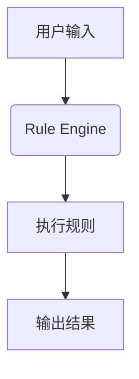
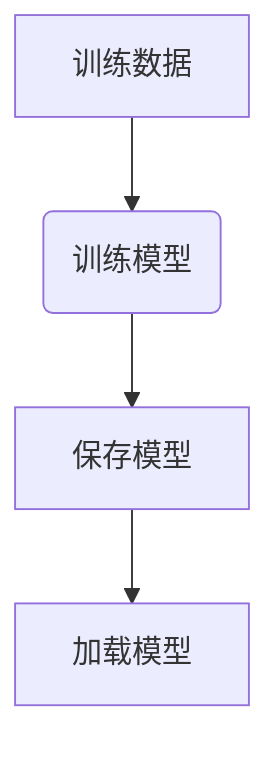
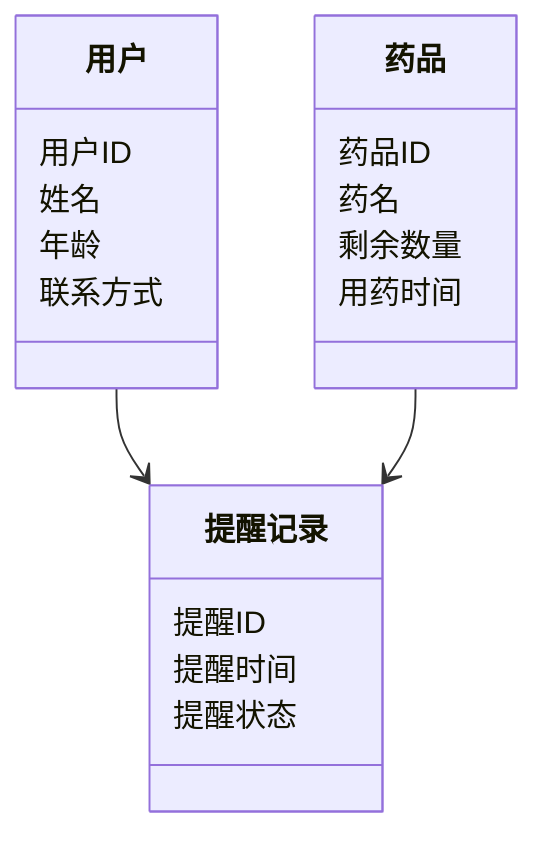
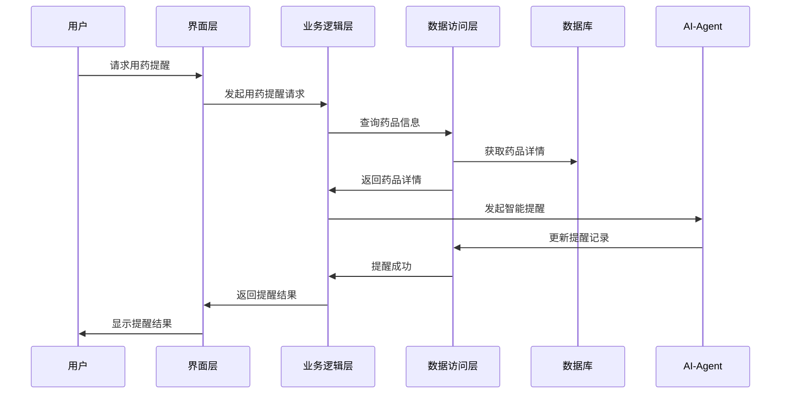

                 


# 智能药盒：AI Agent的用药提醒与管理系统

> 关键词：AI Agent，智能药盒，用药提醒，物联网，健康管理

> 摘要：本文详细探讨了智能药盒的设计与实现，结合AI Agent和物联网技术，构建了一个智能化的用药提醒与管理系统。通过分析系统背景、核心概念、算法原理、系统架构设计和项目实战，本文为读者提供了一个全面的技术视角，展示了如何利用现代技术提升用药管理的效率和便捷性。

---

## 第一部分: 智能药盒的背景与核心概念

### 第1章: 智能药盒的背景与问题背景

#### 1.1 智能药盒的背景介绍

##### 1.1.1 传统用药管理的痛点
传统的用药管理方式存在诸多痛点，例如：
- **遗忘问题**：老年人或慢性病患者容易忘记按时用药。
- **效率低下**：手动记录和提醒耗时且容易出错。
- **数据孤岛**：用药数据分散，难以形成连续的健康档案。

##### 1.1.2 AI技术在医疗健康领域的应用趋势
AI技术的快速发展为医疗健康领域带来了革新，尤其是在用药提醒、疾病预测和个性化治疗方面，AI技术展现出巨大潜力。

##### 1.1.3 智能药盒的定义与目标
智能药盒是一种结合AI和物联网技术的智能设备，旨在通过自动化提醒和数据分析，帮助用户科学管理用药，提升用药依从性。

#### 1.2 问题背景与问题描述

##### 1.2.1 老年人用药管理的难点
老年人记忆力减退，容易漏服或错服药物，这对他们的健康造成严重威胁。

##### 1.2.2 现有用药提醒工具的局限性
现有的用药提醒工具多为简单的时间提醒，缺乏智能化和数据化的管理能力。

##### 1.2.3 智能药盒解决问题的方式
智能药盒通过AI Agent和物联网技术，提供智能化的用药提醒、药品库存管理、健康数据分析等服务。

#### 1.3 问题解决与边界定义

##### 1.3.1 智能药盒的核心功能
- 自动化用药提醒
- 药品库存管理
- 用药数据记录与分析
- 与医疗系统对接

##### 1.3.2 系统的边界与外延
智能药盒作为一个闭环系统，其边界包括用户端、设备端和云端。外延则延伸至医疗数据平台和健康管理生态系统。

##### 1.3.3 核心概念与系统组成要素
智能药盒的核心要素包括：
- 用户：系统的核心用户是需要用药管理的患者。
- 药品：需要管理的药品信息。
- 提醒记录：记录用药提醒的状态和结果。
- AI-Agent：实现智能化提醒和数据分析的核心模块。

### 第2章: 智能药盒的核心概念与联系

#### 2.1 AI Agent的基本原理

##### 2.1.1 AI Agent的定义与核心属性
AI Agent是一种智能体，能够感知环境并采取行动以实现目标。其核心属性包括：
- **自主性**：能够在没有外部干预的情况下运行。
- **反应性**：能够实时感知环境并做出反应。
- **目标导向**：通过实现目标来优化行动。

##### 2.1.2 AI Agent的分类与应用场景
AI Agent可以分为简单反应式Agent和基于模型的反应式Agent。在智能药盒中，AI Agent主要用于实现智能化的用药提醒和数据分析。

##### 2.1.3 AI Agent与智能药盒的结合
通过AI Agent，智能药盒能够根据用户的用药习惯和健康数据，动态调整提醒策略，提供个性化的用药建议。

#### 2.2 物联网技术在智能药盒中的应用

##### 2.2.1 物联网技术的基本原理
物联网技术通过传感器和通信设备，实现设备间的互联互通和数据共享。

##### 2.2.2 物联网在智能药盒中的具体应用
智能药盒中的物联网技术主要用于药品库存监测、环境数据采集（如温湿度）以及设备间的通信。

##### 2.2.3 物联网与AI Agent的协同工作
物联网设备采集的数据通过AI Agent进行分析和处理，AI Agent根据分析结果指导物联网设备执行具体操作。

#### 2.3 核心概念的ER实体关系图

```mermaid
er
    %% ER Diagram for Smart Pill Box System
    entity 用户 {
        key 用户ID
        属性 姓名
        属性 年龄
        属性 联系方式
    }
    entity 药品 {
        key 药品ID
        属性 药名
        属性 剩余数量
        属性 用药时间
    }
    entity 提醒记录 {
        key 提醒ID
        属性 提醒时间
        属性 提醒状态
        外键 用户ID
        外键 药品ID
    }
    entity AI-Agent {
        key AgentID
        属性 状态
        属性 最后活跃时间
    }
    relationship 用户 - 提醒记录
    relationship 药品 - 提醒记录
    relationship 用户 - AI-Agent
```

#### 2.4 核心概念的对比分析

##### 2.4.1 AI Agent与传统任务管理工具的对比
| 特性                | AI Agent                | 传统任务管理工具          |
|---------------------|-------------------------|--------------------------|
| 自主性              | 高                     | 低                       |
| 反应能力            | 强                     | 弱                       |
| 数据处理能力        | 强                     | 有限                     |
| 适用场景            | 复杂任务                | 简单任务                |

##### 2.4.2 物联网技术与传统传感器技术的对比
| 特性                | 物联网技术              | 传统传感器技术            |
|---------------------|-------------------------|--------------------------|
| 数据传输能力        | 强                     | 弱                       |
| 连接性              | 高                     | 低                       |
| 智能化程度          | 高                     | 低                       |

##### 2.4.3 智能药盒与传统药盒的功能对比
| 特性                | 智能药盒                | 传统药盒                |
|---------------------|-------------------------|--------------------------|
| 用药提醒            | 智能提醒                | 简单提醒                |
| 数据记录            | 支持                   | 不支持                  |
| 远程监控            | 支持                   | 不支持                  |

---

## 第3章: 智能药盒的算法原理

### 3.1 AI Agent的核心算法

#### 3.1.1 基于规则的AI Agent实现

##### 3.1.1.1 规则引擎的实现逻辑


##### 3.1.1.2 规则引擎的Python实现示例
```python
class RuleEngine:
    def __init__(self):
        self.rules = []

    def add_rule(self, rule):
        self.rules.append(rule)

    def execute(self, data):
        results = []
        for rule in self.rules:
            if rule['condition'](data):
                results.append(rule['action'](data))
        return results
```

##### 3.1.1.3 规则引擎的数学模型
规则引擎的条件判断可以表示为布尔逻辑：
$$ \text{如果条件} P \text{成立，则执行操作} Q $$

#### 3.1.2 基于机器学习的AI Agent实现

##### 3.1.2.1 机器学习模型的训练逻辑


##### 3.1.2.2 机器学习模型的Python实现示例
```python
import numpy as np
from sklearn import tree

# 训练数据
X = np.array([[2, 1], [3, 1], [4, 2], [5, 2]])
y = np.array([0, 0, 1, 1])

# 训练决策树模型
model = tree.DecisionTreeClassifier()
model.fit(X, y)

# 预测
print(model.predict([[4, 1]]))  # 输出: [0]
```

##### 3.1.2.3 机器学习模型的数学公式
决策树的分类概率可以表示为：
$$ P(y|x) = \prod_{i=1}^{n} p_i(x) $$

---

## 第4章: 智能药盒的系统分析与架构设计

### 4.1 问题场景介绍

#### 4.1.1 项目介绍
智能药盒的目标是通过AI Agent和物联网技术，实现智能化的用药提醒和药品管理。

#### 4.1.2 项目目标
- 提供智能化的用药提醒服务
- 实现药品库存的智能化管理
- 提供健康数据分析服务

### 4.2 系统功能设计

#### 4.2.1 领域模型设计


#### 4.2.2 系统架构设计


#### 4.2.3 系统接口设计
智能药盒的主要接口包括：
- 用户登录与注册接口
- 药品信息录入接口
- 提醒记录查询接口

#### 4.2.4 系统交互流程图


---

## 第5章: 智能药盒的项目实战

### 5.1 环境安装与配置

#### 5.1.1 开发环境
- 操作系统：Windows/MacOS/Linux
- 开发工具：PyCharm/VS Code
- 依赖库：Python 3.8+, numpy, scikit-learn, Flask

#### 5.1.2 服务器环境
- 云服务器（如AWS EC2、阿里云ECS）
- 数据库：MySQL/PostgreSQL
- 人工智能框架：TensorFlow/Scikit-learn

### 5.2 系统核心代码实现

#### 5.2.1 AI-Agent的实现
```python
import time
from datetime import datetime

class AI-Agent:
    def __init__(self):
        self.agent_id = str(time.time())
        self.status = "idle"
        self.last_active_time = datetime.now()

    def remind(self, user_id, medicine_id):
        # 获取药品信息
        medicine_info = self.get_medicine_info(medicine_id)
        # 获取用户信息
        user_info = self.get_user_info(user_id)
        # 发送提醒
        self.send_notification(user_info, medicine_info)
        # 更新状态
        self.status = "active"
        self.last_active_time = datetime.now()

    def get_medicine_info(self, medicine_id):
        # 从数据库获取药品信息
        pass

    def get_user_info(self, user_id):
        # 从数据库获取用户信息
        pass

    def send_notification(self, user_info, medicine_info):
        # 发送提醒通知
        pass
```

#### 5.2.2 用药提醒的实现
```python
from flask import Flask
import sqlite3

app = Flask(__name__)

@app.route('/api/remind', methods=['POST'])
def remind():
    data = request.json
    user_id = data['user_id']
    medicine_id = data['medicine_id']
    
    # 查询药品信息
    conn = sqlite3.connect('medicine.db')
    cursor = conn.cursor()
    cursor.execute("SELECT * FROM medicines WHERE id = ?", (medicine_id,))
    medicine = cursor.fetchone()
    conn.close()
    
    # 查询用户信息
    cursor.execute("SELECT * FROM users WHERE id = ?", (user_id,))
    user = cursor.fetchone()
    conn.close()
    
    # 发送提醒
    send_notification(user['name'], medicine['name'])
    
    return jsonify({'status': 'success'})

def send_notification(user_name, medicine_name):
    # 实现通知逻辑
    pass
```

#### 5.2.3 系统小结
通过以上代码实现，我们可以看到智能药盒的核心功能已经初步实现，但仍需要进一步完善和优化。

---

## 第6章: 智能药盒的最佳实践与小结

### 6.1 最佳实践

#### 6.1.1 系统设计
- 系统设计要模块化，便于扩展和维护。
- 数据安全是重点，确保用户数据的安全性。

#### 6.1.2 代码实现
- 代码要保持简洁和可读性，便于团队协作。
- 测试是关键，要进行单元测试、集成测试和性能测试。

#### 6.1.3 系统优化
- 定期优化算法，提升系统的响应速度和准确性。
- 优化用户界面，提升用户体验。

### 6.2 小结
智能药盒的实现展示了AI技术和物联网技术在医疗健康领域的巨大潜力。通过智能化的用药提醒和数据分析，智能药盒能够显著提升用药管理的效率和便捷性。

### 6.3 注意事项
- 系统上线前，必须进行充分的测试。
- 数据安全是系统设计的重中之重。
- 系统的可扩展性要考虑未来的功能扩展。

### 6.4 拓展阅读
- 《AI在医疗健康领域的应用》
- 《物联网技术与智能设备》
- 《智能系统设计与实现》

---

## 结语

智能药盒作为一个典型的智能健康管理系统，结合了AI Agent和物联网技术，展现了技术与医疗健康的深度融合。通过本文的详细讲解，我们相信智能药盒将在未来的医疗健康管理中发挥越来越重要的作用。

