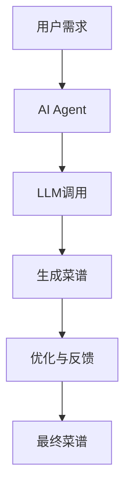
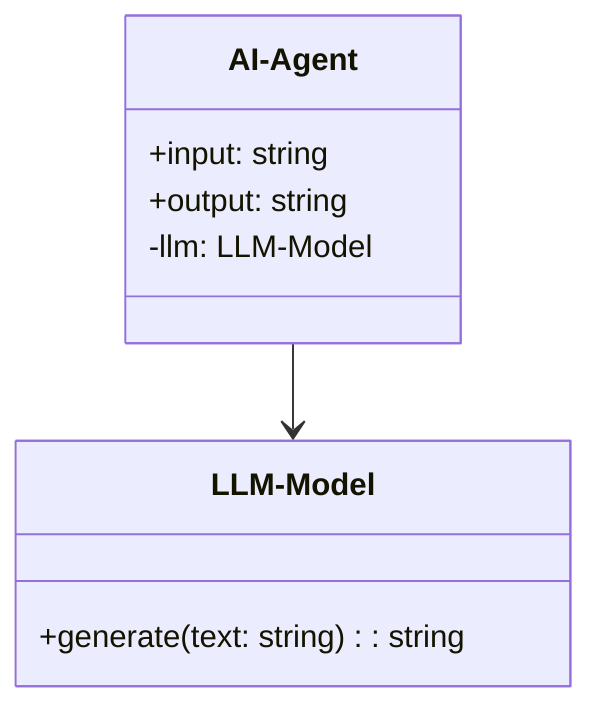
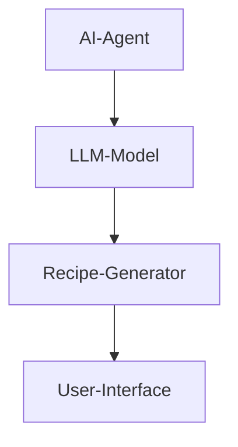
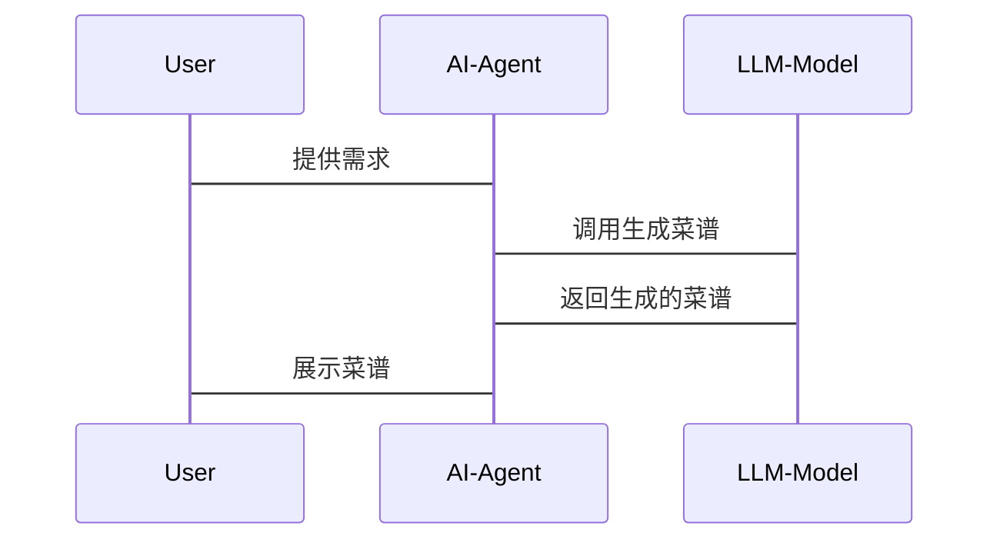

                 


# 智能菜谱生成 AI Agent：LLM 辅助烹饪创新

---

## 关键词：
智能菜谱生成、AI Agent、LLM、烹饪创新、自然语言处理

---

## 摘要：
本文探讨了利用AI Agent和大语言模型（LLM）实现智能菜谱生成的技术与应用。通过分析烹饪创新的背景与挑战，深入介绍了AI Agent和LLM的核心原理、算法流程、系统架构，并结合实际案例展示了如何通过技术手段优化烹饪体验。文章最后总结了智能菜谱生成的未来发展方向与最佳实践。

---

## 第一章: 智能菜谱生成的背景与问题描述

### 1.1 智能菜谱生成的背景

#### 1.1.1 现代烹饪与技术的结合
现代烹饪不仅仅是食材的搭配，更是一种艺术和科学的结合。随着科技的发展，烹饪过程中的创新需求日益增长，但传统菜谱生成工具往往缺乏灵活性和智能化，难以满足多样化的需求。

#### 1.1.2 烹饪创新的挑战与机遇
烹饪创新的核心在于如何将食材、步骤和口味完美结合。然而，传统菜谱生成方法依赖人工经验，效率低下且难以突破创新瓶颈。AI技术的引入为烹饪创新带来了新的机遇。

#### 1.1.3 AI技术在烹饪领域的应用潜力
AI技术可以通过数据分析、模式识别和自然语言处理等手段，帮助厨师和普通用户快速生成创新菜谱。这种技术的应用不仅提高了烹饪效率，还推动了烹饪艺术的普及。

### 1.2 问题背景与描述

#### 1.2.1 现有菜谱生成工具的局限性
传统菜谱生成工具通常依赖固定模板，缺乏灵活性和创新性。用户需求多样化时，这些工具难以提供个性化的解决方案。

#### 1.2.2 用户需求与现有解决方案的差距
用户对菜谱生成的需求包括个性化推荐、创新口味、食材替换等多种功能，但现有工具难以满足这些需求。

#### 1.2.3 智能菜谱生成的必要性与目标
智能菜谱生成的目标是通过AI技术，为用户提供高效、灵活、创新的菜谱生成方案，满足个性化需求。

### 1.3 问题解决与边界

#### 1.3.1 AI Agent在菜谱生成中的作用
AI Agent作为智能菜谱生成的核心，负责接收用户需求、调用LLM模型生成菜谱，并根据用户反馈进行优化。

#### 1.3.2 LLM在菜谱生成中的优势
LLM具有强大的自然语言处理能力，能够理解用户需求并生成高质量的菜谱内容。

#### 1.3.3 智能菜谱生成的边界与外延
智能菜谱生成的边界包括食材选择、步骤生成和口味调整，而外延则涉及烹饪设备的智能控制和食材供应链优化。

---

## 第二章: AI Agent与LLM的核心概念

### 2.1 AI Agent的基本原理

#### 2.1.1 AI Agent的定义与特点
AI Agent是一种智能实体，能够感知环境、执行任务并做出决策。其特点包括自主性、反应性、目标导向和社交能力。

#### 2.1.2 AI Agent的分类与应用场景
AI Agent可分为简单反射型、基于模型的反应型、目标驱动型和实用驱动型。在烹饪领域，AI Agent可用于菜谱生成、食材推荐和烹饪过程优化。

#### 2.1.3 AI Agent与智能菜谱生成的关系
AI Agent作为智能菜谱生成的载体，负责接收用户需求、调用LLM生成菜谱，并根据反馈优化结果。

### 2.2 LLM的基本原理

#### 2.2.1 LLM的定义与特点
大语言模型是一种基于深度学习的自然语言处理模型，具有强大的文本生成和理解能力。

#### 2.2.2 LLM的核心算法与训练机制
LLM通常基于Transformer架构，通过自监督学习从海量数据中学习语言模式。

#### 2.2.3 LLM在自然语言处理中的应用
LLM广泛应用于文本生成、机器翻译、问答系统等领域。

### 2.3 AI Agent与LLM的关系

#### 2.3.1 AI Agent与LLM的协同工作原理
AI Agent负责接收输入、调用LLM生成菜谱，并根据反馈优化结果。

#### 2.3.2 LLM作为AI Agent的核心模块
LLM为AI Agent提供自然语言处理能力，使其能够理解和生成人类语言。

#### 2.3.3 AI Agent与LLM的结合
通过结合AI Agent和LLM，可以实现智能化的菜谱生成过程，满足用户多样化需求。

---

## 第三章: 智能菜谱生成的算法原理

### 3.1 算法概述

#### 3.1.1 基于LLM的菜谱生成流程
菜谱生成流程包括用户需求解析、LLM调用、生成结果优化和反馈收集。

#### 3.1.2 算法流程图


### 3.2 算法实现

#### 3.2.1 基于LLM的菜谱生成代码示例
```python
import requests

def generate_recipe(cuisine_type, dietary_restriction):
    # API调用
    url = "https://api.example.com/recipe"
    params = {
        "cuisine": cuisine_type,
        "dietary_restriction": dietary_restriction
    }
    response = requests.get(url, params=params)
    return response.json()
```

#### 3.2.2 算法原理的数学模型
菜谱生成的过程可以看作是一个概率生成模型，其数学模型可以表示为：
$$ P(\text{菜谱} | \text{输入}) = \prod_{i=1}^{n} P(\text{步骤}_i | \text{步骤}_{i-1}) $$

### 3.3 算法优化

#### 3.3.1 模型训练与优化
通过监督学习和强化学习优化LLM模型，使其生成更符合用户需求的菜谱。

#### 3.3.2 算法的数学公式
模型的损失函数可以表示为：
$$ \text{Loss} = -\sum_{i=1}^{n} \log P(\text{步骤}_i | \text{步骤}_{i-1}) $$

---

## 第四章: 智能菜谱生成系统的分析与架构设计

### 4.1 系统分析

#### 4.1.1 问题场景介绍
用户希望生成个性化菜谱，但现有工具无法满足需求。

#### 4.1.2 系统功能设计
系统需要实现用户需求解析、LLM调用、菜谱生成和反馈优化等功能。

#### 4.1.3 领域模型设计


### 4.2 系统架构设计

#### 4.2.1 系统架构图


#### 4.2.2 系统接口设计
系统需要定义清晰的接口，例如：
- AI-Agent调用LLM的接口
- 用户与系统交互的接口

#### 4.2.3 系统交互流程


---

## 第五章: 项目实战——智能菜谱生成系统实现

### 5.1 环境安装

#### 5.1.1 安装Python和必要的库
需要安装Python 3.8及以上版本，并安装`requests`库。

### 5.2 核心代码实现

#### 5.2.1 AI-Agent实现
```python
class AI-Agent:
    def __init__(self, llm_model):
        self.llm_model = llm_model

    def generate_recipe(self, input_text):
        response = self.llm_model.generate(input_text)
        return response
```

#### 5.2.2 LLM-Model实现
```python
class LLM-Model:
    def generate(self, text):
        # 实际应用中调用API或模型
        return "生成的菜谱"
```

#### 5.2.3 用户接口实现
```python
def main():
    llm = LLM-Model()
    agent = AI-Agent(llm)
    input_text = input("请输入需求：")
    recipe = agent.generate_recipe(input_text)
    print(recipe)

if __name__ == "__main__":
    main()
```

### 5.3 代码解读与分析

#### 5.3.1 AI-Agent类
AI-Agent类负责接收用户输入，调用LLM生成菜谱，并返回结果。

#### 5.3.2 LLM-Model类
LLM-Model类负责具体的菜谱生成逻辑，实际应用中可能需要调用外部API或本地模型。

### 5.4 实际案例分析

#### 5.4.1 案例背景
用户输入：“我想做一道低脂的意大利面。”

#### 5.4.2 系统处理流程
1. 用户输入需求。
2. AI-Agent调用LLM生成菜谱。
3. 系统返回生成的低脂意大利面菜谱。

### 5.5 项目总结

#### 5.5.1 项目小结
通过AI-Agent和LLM的结合，实现了智能化的菜谱生成系统，满足用户个性化需求。

---

## 第六章: 最佳实践与未来展望

### 6.1 小结

#### 6.1.1 核心要点总结
本文介绍了智能菜谱生成的背景、算法原理和系统架构，并通过实际案例展示了技术应用。

### 6.2 注意事项

#### 6.2.1 模型选择与调优
选择合适的LLM模型并进行调优，可以显著提高生成菜谱的质量。

#### 6.2.2 用户反馈与系统优化
及时收集用户反馈，优化系统性能和生成结果。

### 6.3 拓展阅读

#### 6.3.1 相关技术领域
进一步研究AI在烹饪中的其他应用，如食材识别和烹饪过程优化。

---

## 总结

通过本文的介绍，读者可以全面了解智能菜谱生成的技术原理和实现方法。未来，随着AI和LLM技术的不断发展，智能菜谱生成将更加智能化和个性化，为烹饪创新带来更多的可能性。

