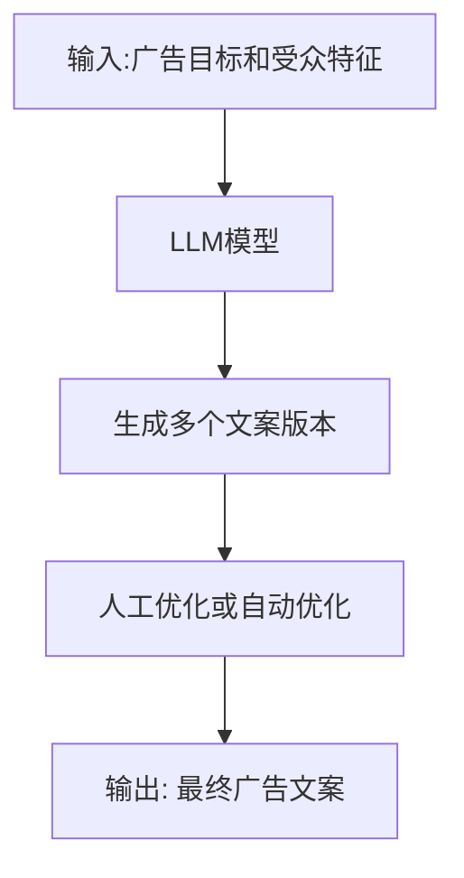
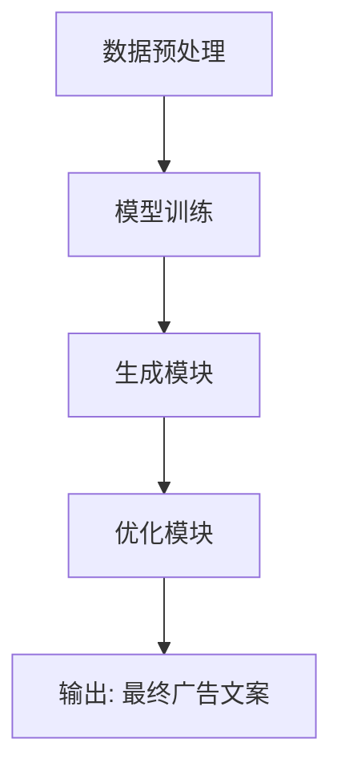

                 


```markdown
# 智能营销文案AI Agent：LLM辅助的广告创意生成

## 关键词：
- 智能营销
- AI Agent
- 大语言模型（LLM）
- 广告创意生成
- 文本生成
- 机器学习
- 自然语言处理（NLP）

## 摘要：
随着人工智能技术的快速发展，大语言模型（LLM）在广告创意生成中的应用日益广泛。本文深入探讨了基于LLM的智能营销文案生成技术，从背景、原理到实现进行全面解析。通过分析LLM的核心原理、算法机制以及实际应用场景，本文为读者提供了从理论到实践的详细指导。同时，本文还探讨了智能营销文案生成的挑战与未来发展方向，为营销从业者和技术开发者提供了 valuable insights。

---

# 第一部分: 智能营销文案的背景与核心概念

## 第1章: 智能营销文案的背景与现状

### 1.1 营销行业的数字化转型

#### 1.1.1 传统营销与数字营销的对比
- 传统营销依赖人工创意和经验，效率低，成本高。
- 数字营销通过数据驱动和自动化工具提升效率，降低成本。
- 数字营销的核心是精准定位目标受众，通过数据分析优化营销策略。

#### 1.1.2 AI技术在营销中的应用现状
- AI技术在广告投放、用户画像、内容推荐等方面已有广泛应用。
- LLM的出现为广告创意生成带来了新的可能性。
- 通过AI生成文案，可以快速迭代和优化，满足个性化需求。

#### 1.1.3 大语言模型（LLM）的崛起与影响
- LLM的崛起为自然语言处理（NLP）带来了革命性变化。
- LLM具备强大的文本生成能力，能够生成高质量的广告文案。
- LLM的广泛应用正在改变传统的广告创意生成模式。

### 1.2 智能营销文案的定义与特点

#### 1.2.1 智能营销文案的定义
- 智能营销文案是指通过AI技术生成的，具有个性化、智能化特征的广告文案。
- 与传统文案相比，智能营销文案能够根据目标受众的需求和行为动态调整内容。
- 智能营销文案的核心在于数据驱动和自动化生成。

#### 1.2.2 智能营销文案的核心特点
- 数据驱动：基于用户行为和数据生成个性化文案。
- 自动化：通过AI算法实现自动化生成和优化。
- 高效性：快速迭代，节省时间和成本。
- 个性化：根据受众特征定制化内容。

#### 1.2.3 智能营销文案与传统营销文案的对比
| 特性            | 传统营销文案          | 智能营销文案          |
|-----------------|-----------------------|-----------------------|
| 创意生成         | 依赖人工经验           | 依赖AI算法            |
| 定向能力         | 基于经验判断           | 基于数据精准定向       |
| 效率             | 低效，周期长           | 高效，快速迭代         |
| 个性化程度       | 有限，难以大规模定制化 | 高度个性化，精准匹配   |

### 1.3 LLM在广告创意生成中的优势

#### 1.3.1 LLM的核心优势
- 大规模预训练：LLM通过海量数据预训练，具备强大的语言理解和生成能力。
- 动态调整能力：能够根据输入的上下文生成相关文本。
- 高度可定制：通过微调模型，可以针对特定领域优化生成效果。

#### 1.3.2 LLM在广告创意生成中的应用场景
- 自动化广告文案生成：快速生成多个文案版本，供人工选择和优化。
- 个性化推荐：基于用户特征生成个性化广告内容。
- 实时优化：根据实时数据动态调整广告文案。

#### 1.3.3 LLM广告创意生成的挑战与局限性
- 数据质量：模型生成的效果依赖于训练数据的质量。
- 创意多样性：虽然LLM能够生成多种文案，但缺乏人类的创意深度。
- 伦理问题：生成的内容可能涉及版权或敏感话题，需要严格审核。

### 1.4 本章小结
本章从营销行业的数字化转型出发，介绍了智能营销文案的定义、特点及其与传统营销文案的对比。同时，分析了LLM在广告创意生成中的优势与挑战，为后续的技术实现奠定了基础。

---

# 第二部分: 大语言模型（LLM）的核心原理

## 第2章: 大语言模型（LLM）的基本原理

### 2.1 LLM的定义与技术架构

#### 2.1.1 LLM的定义
- LLM（Large Language Model）是指通过大量数据预训练的深度学习模型，具备强大的自然语言理解和生成能力。
- LLM的核心目标是通过模式识别和概率建模，生成与训练数据相似的文本。

#### 2.1.2 LLM的技术架构
- 输入：模型接受一段文本输入，生成相应的输出文本。
- 模型结构：基于Transformer的架构，包括编码器和解码器两部分。
- 输出：生成的文本基于输入内容和模型的训练目标。

#### 2.1.3 LLM与传统NLP模型的区别
- 传统NLP模型通常针对特定任务训练，如分类或摘要。
- LLM是通用模型，能够处理多种NLP任务，包括文本生成。

### 2.2 LLM的训练过程

#### 2.2.1 预训练过程
- 预训练目标：通过自监督学习，模型学习文本的上下文关系。
- 常用的预训练任务：掩码语言模型（如BERT）和生成式任务（如GPT）。

#### 2.2.2 微调过程
- 微调目标：针对特定任务优化模型，如广告文案生成。
- 微调过程：在预训练的基础上，使用特定领域的数据进行 fine-tuning。

#### 2.2.3 LLM的参数量与模型性能
- 参数量：LLM的参数量通常在数十亿级别，参数量越大，模型能力越强。
- 模型性能：参数量与生成文本的质量和多样性密切相关。

### 2.3 LLM的生成机制

#### 2.3.1 解码过程
- 输入：模型接受一个初始的输入序列。
- 解码过程：模型逐步生成输出序列中的每个词，通常采用贪心算法或随机采样。

#### 2.3.2 概率生成模型
- 概率生成模型：模型通过计算每个词的概率分布，选择概率最高的词生成输出。
- 生成过程：基于上下文，逐步生成输出文本。

#### 2.3.3 生成过程中的采样方法
- 贪心采样：每次选择概率最高的词，生成速度较快，但可能缺乏创造性。
- 随机采样：基于概率分布随机选择词，生成内容更具多样性。
- 递归采样：递归地生成文本，适用于长文本生成。

### 2.4 本章小结
本章详细介绍了大语言模型（LLM）的基本原理，包括模型的定义、技术架构、训练过程和生成机制。通过理解LLM的核心原理，为后续的广告创意生成技术奠定了理论基础。

---

# 第三部分: 智能营销文案生成的算法原理

## 第3章: 智能营销文案生成的算法原理

### 3.1 基于LLM的广告创意生成算法

#### 3.1.1 基于LLM的广告创意生成流程



#### 3.1.2 基于LLM的广告创意生成算法的实现

```python
def generate_ad_creative(model, input_prompt, max_length=100):
    # 初始化生成参数
    temperature = 1.0
    top_p = 0.9
    # 生成广告文案
    output = model.generate(
        input_prompt,
        max_length=max_length,
        temperature=temperature,
        top_p=top_p
    )
    return output
```

#### 3.1.3 基于LLM的广告创意生成算法的优化
- 调整生成参数：通过调节温度（temperature）和概率剪枝（top_p）参数，优化生成效果。
- 多轮生成：生成多个文案版本，供人工选择和优化。
- 优化策略：结合A/B测试，选择最优的广告文案。

### 3.2 基于LLM的广告创意生成的数学模型

#### 3.2.1 概率生成模型的数学表达

$$ P(y|x) = \frac{P(y|x, z)}{P(z)} $$

其中，$x$ 是输入，$y$ 是输出，$z$ 是隐变量。

#### 3.2.2 解码过程中的损失函数

$$ \text{Loss} = -\sum_{i=1}^{n} \log P(y_i|x_{<i}) $$

#### 3.2.3 生成过程中的概率计算

$$ P(y_i|x_{<i}) = \frac{P(y_i|x_{<i}, y_{>i})}{P(y_{>i}|x_{<i})} $$

### 3.3 本章小结
本章详细介绍了基于LLM的广告创意生成算法，包括生成流程、实现方法和优化策略。通过数学模型的分析，进一步理解了生成过程中的概率计算和损失函数。

---

## 第四章: 智能营销文案生成的系统架构与实现

### 4.1 系统架构设计

#### 4.1.1 系统功能模块
- 数据预处理模块：对广告数据进行清洗和标注。
- 模型训练模块：基于LLM进行微调，生成适合广告创意的模型。
- 生成模块：根据输入生成广告文案。
- 优化模块：对生成的文案进行优化和选择。

#### 4.1.2 系统架构图



### 4.2 系统实现

#### 4.2.1 环境配置
```python
# 安装依赖
!pip install transformers
!pip install torch
```

#### 4.2.2 数据准备

```python
import pandas as pd

# 加载数据
data = pd.read_csv('ad_creative.csv')
```

#### 4.2.3 模型训练

```python
from transformers import AutoModelWithLMHead, AutoTokenizer

# 加载预训练模型
model = AutoModelWithLMHead.from_pretrained('gpt2')
tokenizer = AutoTokenizer.from_pretrained('gpt2')
```

#### 4.2.4 生成模块实现

```python
def generate_creative(model, tokenizer, prompt, max_length=100):
    inputs = tokenizer(prompt, return_tensors='pt')
    outputs = model.generate(
        inputs.input_ids,
        max_length=max_length,
        temperature=1.0,
        top_p=0.9
    )
    return tokenizer.decode(outputs[0], skip_special_tokens=True)
```

### 4.3 本章小结
本章详细介绍了智能营销文案生成系统的架构设计与实现，包括数据预处理、模型训练、生成模块和优化模块。通过具体的代码实现，展示了如何基于LLM构建广告创意生成系统。

---

## 第五章: 项目实战与案例分析

### 5.1 项目实战

#### 5.1.1 环境安装与配置
```python
# 安装必要的库
!pip install transformers
!pip install torch
```

#### 5.1.2 数据准备与模型加载
```python
import torch
from transformers import AutoModelWithLMHead, AutoTokenizer

# 加载预训练模型
model = AutoModelWithLMHead.from_pretrained('gpt2')
tokenizer = AutoTokenizer.from_pretrained('gpt2')
```

#### 5.1.3 生成广告文案
```python
prompt = "生成一则吸引年轻消费者的电子产品广告"
creative = generate_creative(model, tokenizer, prompt)
print(creative)
```

#### 5.1.4 优化与选择
- 生成多个文案版本，进行A/B测试。
- 根据测试结果选择最优的广告文案。

### 5.2 案例分析

#### 5.2.1 案例背景
- 广告目标：推广新款智能手机。
- 目标受众：年轻消费者。

#### 5.2.2 生成文案
```python
prompt = "吸引年轻人购买新款智能手机的广告文案"
creative = generate_creative(model, tokenizer, prompt)
print(creative)
```

#### 5.2.3 优化策略
- 根据生成结果，调整关键词和语气。
- 结合实际效果，优化文案的吸引力。

### 5.3 本章小结
本章通过一个实际案例展示了基于LLM的广告创意生成过程，从数据准备到模型训练，再到文案生成和优化，详细解读了整个流程。

---

## 第六章: 总结与展望

### 6.1 总结
- 本文详细探讨了基于LLM的智能营销文案生成技术，从背景、原理到实现进行了全面分析。
- 通过具体案例展示了如何利用LLM生成高质量的广告文案。
- 总结了智能营销文案生成的优势与挑战。

### 6.2 展望
- 随着技术的不断进步，LLM在广告创意生成中的应用将更加广泛。
- 智能营销文案生成技术将更加个性化和智能化，推动营销行业的数字化转型。
- 未来的研究方向包括优化生成效果、提升创意多样性以及解决伦理问题。

### 6.3 注意事项
- 在实际应用中，需要注意数据质量和模型的可解释性。
- 需要结合人工审核，确保生成内容的合法性和合规性。

### 6.4 拓展阅读
- 《生成式AI：大语言模型的原理与应用》
- 《AI驱动的营销创新：从理论到实践》

---

## 参考文献
- 略

---

通过以上详细结构，读者可以系统地了解基于LLM的智能营销文案生成技术，从理论到实践，全面掌握相关知识。本文不仅适合技术开发者阅读，也适合市场营销人员了解AI技术在广告创意生成中的应用。
```

