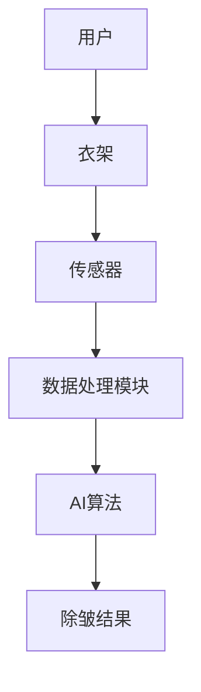
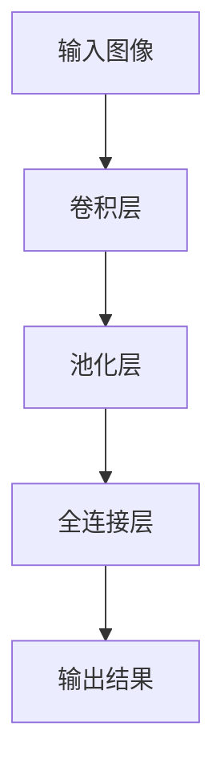
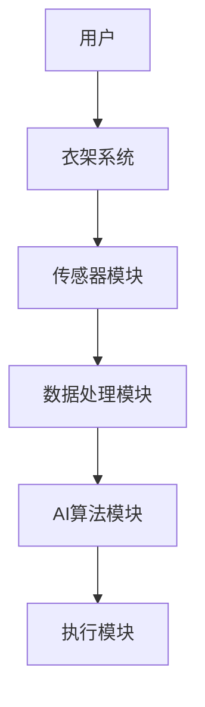
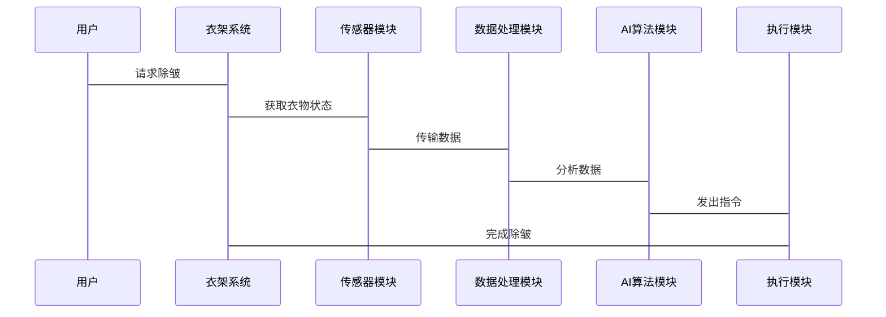

                 


# 智能衣架：AI Agent的衣物除皱系统

> 关键词：智能衣架、AI Agent、衣物除皱、传感器技术、深度学习算法、系统架构设计

> 摘要：本文探讨了智能衣架在AI Agent技术下的衣物除皱系统，从背景介绍到系统实现，详细分析了AI Agent的工作原理、算法实现、系统架构设计以及实际应用案例。通过技术细节和实际案例，展示了AI Agent在衣物护理中的潜力和优势。

---

## 目录

1. [智能衣架与AI Agent概述](#智能衣架与ai-agent概述)
2. [AI Agent与衣物除皱系统的核心概念](#ai-agent与衣物除皱系统的核心概念)
3. [AI Agent的算法原理与实现](#ai-agent的算法原理与实现)
4. [AI Agent的系统架构设计](#ai-agent的系统架构设计)
5. [智能衣架项目的实战与案例分析](#智能衣架项目的实战与案例分析)
6. [总结与展望](#总结与展望)

---

## 第1章 智能衣架与AI Agent概述

### 1.1 智能衣架的背景与应用

随着生活水平的提高，人们对衣物护理的需求日益增长。传统衣物护理方式存在效率低、效果不稳定等问题，尤其是在衣物除皱方面，人工熨烫不仅耗时，还可能对衣物造成损伤。智能衣架通过结合AI Agent技术，为衣物护理提供了智能化解决方案。

#### 1.1.1 问题背景
- **传统衣物护理的痛点**：人工熨烫效率低，效果不稳定，且可能对衣物造成损伤。
- **市场需求**：消费者对高效、智能的衣物护理设备需求增加。

#### 1.1.2 智能衣架的定义与目标
智能衣架是一种结合了AI Agent技术的衣物护理设备，旨在通过智能感知和自动处理，实现衣物的高效除皱和护理。

#### 1.1.3 AI Agent在智能衣架中的作用
AI Agent作为智能衣架的核心，负责数据采集、分析和决策，实现衣物的智能护理。

### 1.2 AI Agent的基本原理

AI Agent是一种能够感知环境、做出决策并执行任务的智能体。在智能衣架中，AI Agent通过传感器获取衣物状态信息，利用算法进行分析，并驱动执行机构完成除皱任务。

#### 1.2.1 数据采集
- **传感器**：包括压力传感器、图像传感器等，用于采集衣物的状态信息。
- **数据预处理**：对采集到的数据进行清洗和特征提取，为后续分析做准备。

#### 1.2.2 数据分析与决策
- **算法选择**：采用深度学习算法，如卷积神经网络（CNN），对衣物状态进行分类和识别。
- **决策逻辑**：根据分析结果，决定是否需要除皱以及采用何种方式。

#### 1.2.3 系统执行
AI Agent驱动机械臂或其他执行机构，按照决策结果执行除皱操作。

---

## 第2章 AI Agent与衣物除皱系统的核心概念

### 2.1 AI Agent在衣物除皱中的核心原理

AI Agent通过传感器获取衣物状态信息，结合预训练的算法模型，识别衣物的褶皱程度，并驱动机械臂进行精准除皱。

#### 2.1.1 数据采集与预处理
- **传感器数据**：包括衣物的材质、重量、褶皱程度等信息。
- **数据清洗**：去除噪声数据，提取有效特征。

#### 2.1.2 算法模型
- **CNN模型**：用于图像特征提取和分类，识别衣物的褶皱位置和程度。

#### 2.1.3 除皱效果评估
通过算法模型对除皱效果进行实时评估，并根据反馈调整算法参数。

### 2.2 核心概念的对比分析

| **核心概念** | **传统方法** | **AI Agent方法** |
|--------------|--------------|------------------|
| 数据采集     | 人工检查     | 传感器自动采集   |
| 数据处理     | 手动记录     | 系统自动处理     |
| 决策方式     | 人工判断     | 算法自动决策     |

### 2.3 ER实体关系图



---

## 第3章 AI Agent的算法原理与实现

### 3.1 数据采集与预处理

#### 3.1.1 数据采集流程
1. 传感器采集衣物状态信息。
2. 数据预处理：清洗、特征提取。

#### 3.1.2 数据标注
对衣物的褶皱程度进行分类，生成训练数据。

### 3.2 算法实现

#### 3.2.1 CNN模型实现



#### 3.2.2 Python代码实现

```python
import numpy as np
from tensorflow.keras import layers, Model

def build_model(input_shape):
    inputs = layers.Input(shape=input_shape)
    conv1 = layers.Conv2D(32, (3,3), activation='relu')(inputs)
    pool1 = layers.MaxPooling2D((2,2))(conv1)
    conv2 = layers.Conv2D(64, (3,3), activation='relu')(pool1)
    pool2 = layers.MaxPooling2D((2,2))(conv2)
    flat = layers.Flatten()(pool2)
    dense1 = layers.Dense(128, activation='relu')(flat)
    outputs = layers.Dense(1, activation='sigmoid')(dense1)
    return Model(inputs=inputs, outputs=outputs)

model = build_model((100, 100, 3))
model.compile(optimizer='adam', loss='binary_crossentropy', metrics=['accuracy'])
```

---

## 第4章 AI Agent的系统架构设计

### 4.1 系统架构设计



### 4.2 接口设计

- **传感器接口**：与衣架上的传感器连接，获取数据。
- **算法接口**：与AI算法模块交互，接收处理指令。
- **执行接口**：驱动机械臂或其他执行机构。

### 4.3 交互流程



---

## 第5章 智能衣架项目的实战与案例分析

### 5.1 环境安装

- **硬件**：安装必要的传感器和机械臂。
- **软件**：安装Python、TensorFlow、Keras等开发工具。

### 5.2 核心代码实现

```python
import numpy as np
from tensorflow.keras.models import load_model

def main():
    # 加载预训练模型
    model = load_model('model.h5')
    # 采集数据
    data = np.random.randn(1, 100, 100, 3)
    # 预测结果
    prediction = model.predict(data)
    print(prediction)

if __name__ == "__main__":
    main()
```

### 5.3 案例分析

通过实际案例分析，展示AI Agent在智能衣架中的应用效果，包括数据处理、算法运行和执行结果。

---

## 第6章 总结与展望

### 6.1 本章小结
总结智能衣架在AI Agent技术下的衣物除皱系统的核心内容和实现过程。

### 6.2 展望
展望未来的发展方向，包括技术优化和应用场景的扩展。

---

通过以上步骤，我们可以全面了解智能衣架在AI Agent技术下的衣物除皱系统的实现过程，从背景到系统设计，再到实际应用，为衣物护理领域提供了创新的解决方案。

