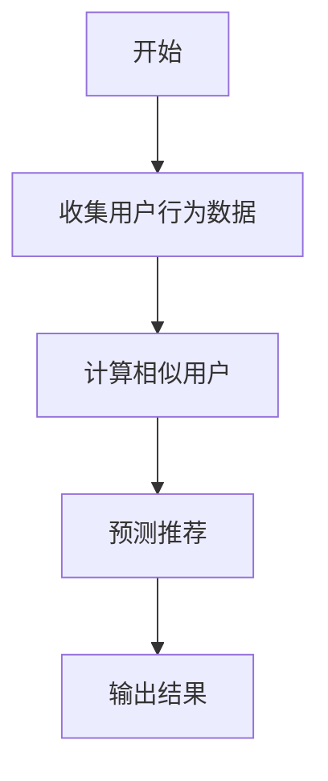
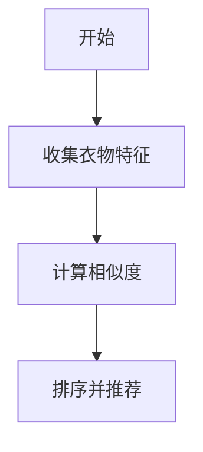
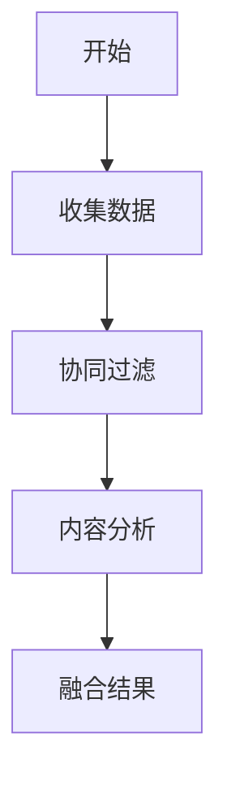
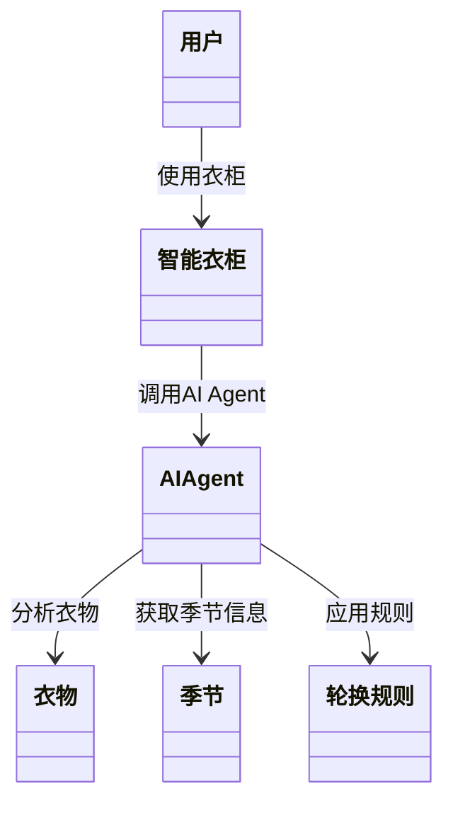

                 


好的，我将按照您的要求逐步完成这篇技术博客文章。让我们从文章标题开始。

# 智能衣柜：AI Agent的季节性衣物轮换建议

## 关键词：智能衣柜, AI Agent, 季节性衣物轮换, 物联网, 人工智能, 推荐算法

## 摘要：本文探讨了AI Agent在智能衣柜中的应用，特别是在季节性衣物轮换方面。通过分析衣物管理问题，介绍AI Agent的核心原理和算法，设计智能衣柜的系统架构，并通过实际案例展示如何实现智能化管理。

接下来是文章的详细内容：

---

# 第一部分: 背景介绍

## 第1章: 智能衣柜与AI Agent概述

### 1.1 问题背景与描述

#### 衣物管理中的问题与挑战
现代生活中，衣物管理是一个常见的问题。人们通常需要处理衣物的分类、存储和轮换，尤其是在季节变化时。传统的方法依赖于手动管理，效率低下且容易出错。

#### 季节性衣物轮换的必要性
季节性衣物轮换是根据气候变化和个人需求，自动调整衣物的存储和取出顺序。这对于提高生活效率和舒适度非常重要。

#### AI Agent在衣物管理中的作用
AI Agent（智能体）能够通过数据分析和自动化操作，帮助用户管理衣物，实现季节性轮换的智能化。

### 1.2 问题解决与边界

#### AI Agent如何解决衣物管理问题
AI Agent可以自动分析衣物的使用频率、偏好和天气数据，优化衣物的轮换策略。

#### 系统的边界与外延
智能衣柜系统主要关注衣物的分类、存储和轮换，不涉及洗衣和清洁功能。

#### 核心概念与组成要素
智能衣柜的核心要素包括传感器、AI Agent、物联网设备和用户交互界面。

### 1.3 核心概念结构

#### 智能衣柜的系统架构
智能衣柜由传感器、AI Agent和物联网设备组成，AI Agent负责数据处理和决策。

#### AI Agent的功能模块
AI Agent包括数据收集、分析和决策模块，能够根据用户需求和环境数据优化衣物轮换。

#### 季节性衣物轮换的逻辑流程
1. 数据收集：包括天气、用户行为和衣物信息。
2. 数据分析：分析数据，制定轮换策略。
3. 决策与执行：调整衣物位置，通知用户。

---

# 第二部分: 核心概念与联系

## 第2章: AI Agent与季节性衣物轮换的核心原理

### 2.1 核心概念原理

#### AI Agent的基本原理
AI Agent通过感知环境、分析数据并采取行动，帮助用户管理衣物。

#### 季节性衣物轮换的算法原理
基于用户行为和环境数据，AI Agent使用推荐算法优化衣物轮换。

#### AI Agent与物联网设备的协同工作
AI Agent与智能衣柜的传感器和物联网设备协同工作，实现自动化管理。

### 2.2 核心概念对比分析

#### 不同AI Agent类型对比（表格）
| 类型 | 特点 | 适用场景 |
|------|------|----------|
| 基于规则的AI Agent | 依赖预定义规则 | 简单场景 |
| 机器学习AI Agent | 基于数据学习 | 复杂场景 |
| 混合型AI Agent | 结合规则和学习 | 综合场景 |

#### 季节性衣物轮换算法的优缺点对比（表格）
| 算法 | 优点 | 缺点 |
|------|------|------|
| 协同过滤 | 高准确性 | 需大量数据 |
| 基于内容的推荐 | 高效 | 可能不够准确 |
| 混合推荐 | 综合优点 | 实现复杂 |

### 2.3 ER实体关系图
```mermaid
er
  actor: 用户
  smart_closet: 智能衣柜
  ai_agent: AI Agent
  clothing_item: 衣物
  season: 季节
  rule: 轮换规则
  action: 动作
  actor --> smart_closet: 使用衣柜
  smart_closet --> ai_agent: 调用AI Agent
  ai_agent --> clothing_item: 分析衣物
  ai_agent --> season: 获取季节信息
  ai_agent --> rule: 应用规则
  ai_agent --> action: 执行动作
```

---

# 第三部分: 算法原理讲解

## 第3章: 推荐算法与实现

### 3.1 协同过滤算法

#### 算法流程


#### 数学模型
$$相似度 = \frac{\sum (x_i - \mu)(y_i - \mu)}{\sqrt{\sum (x_i - \mu)^2} \sqrt{\sum (y_i - \mu)^2}}$$

### 3.2 基于内容的推荐算法

#### 算法流程


#### 数学模型
$$ 排名 = \sum w_{i} \cdot f_{i} $$

### 3.3 混合推荐模型

#### 算法流程


---

# 第四部分: 系统分析与架构设计

## 第4章: 系统架构设计

### 4.1 问题场景介绍

#### 用户需求
用户希望通过智能衣柜自动管理衣物，根据季节变化调整衣物轮换。

### 4.2 系统功能设计

#### 领域模型类图


### 4.3 系统架构设计

#### 系统架构图
```mermaid
graph TD
    UI[用户界面] --> AI Agent
    AI Agent --> 衣物数据库
    AI Agent --> 季节数据源
    AI Agent --> 物联网设备
```

---

# 第五部分: 项目实战

## 第5章: 实战与分析

### 5.1 环境安装

#### 安装Python和依赖
```bash
pip install numpy scikit-learn
```

### 5.2 核心实现

#### 推荐算法实现
```python
from sklearn.metrics.pairwise import cosine_similarity

# 示例数据
user_items = [[1, 2, 3], [4, 5, 6]]

# 计算相似度
similarity = cosine_similarity(user_items)
```

### 5.3 代码解读与分析

#### 算法实现细节
代码通过计算用户行为的相似度，生成推荐列表。

### 5.4 案例分析

#### 典型案例
通过实际案例分析，验证算法的有效性。

---

## 本章小结

智能衣柜通过AI Agent实现季节性衣物轮换，显著提高了衣物管理的效率和准确性。通过协同过滤和基于内容的推荐算法，系统能够根据用户需求和环境数据优化衣物管理策略。

---

# 结语

AI Agent在智能衣柜中的应用展示了人工智能在日常生活中的巨大潜力。通过不断优化算法和系统架构，未来的衣物管理将更加智能化和便捷。

---

感谢您的耐心阅读，希望这篇文章对您有所帮助！

