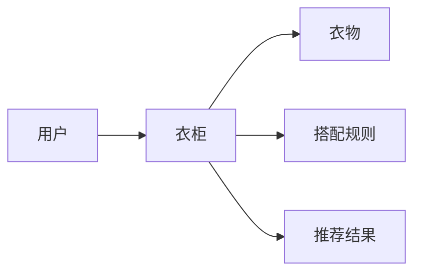
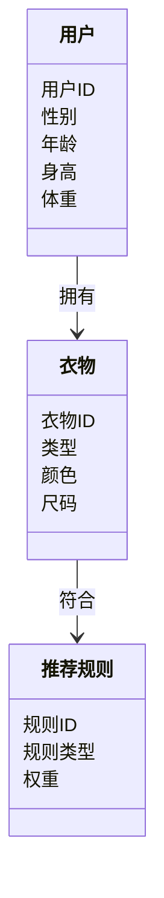
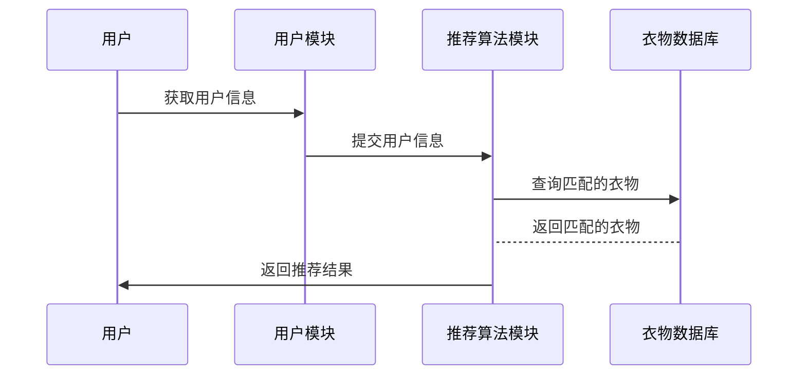

                 


# {{《智能衣柜：AI Agent的衣物搭配推荐》}}

> 关键词：智能衣柜、AI Agent、衣物搭配推荐、协同过滤、深度学习、系统架构、项目实战

> 摘要：本篇文章深入探讨了AI Agent在智能衣柜中的应用，特别是如何通过衣物搭配推荐算法优化用户体验。从背景介绍到算法原理，再到系统架构设计与项目实战，全面剖析了智能衣柜的核心技术与实现细节，为读者提供了从理论到实践的完整指南。

---

# {{文章正文}}

## 第1章: 智能衣柜的背景与问题描述

### 1.1 智能衣柜的背景介绍

#### 1.1.1 传统衣柜的功能与局限性
传统衣柜主要依赖手动分类和存储，缺乏智能化和个性化。用户需要自己思考如何搭配衣物，容易出现搭配不当、重复购置等问题。

#### 1.1.2 智能化技术的发展与应用
随着人工智能、物联网和大数据技术的快速发展，智能家居设备逐渐普及。智能衣柜作为智能家居的重要组成部分，通过传感器、摄像头和AI算法实现智能化管理。

#### 1.1.3 AI Agent在智能衣柜中的作用
AI Agent（智能代理）通过分析用户的衣着习惯、身材特点、天气变化等因素，为用户提供个性化的衣物搭配建议，提升穿衣效率和时尚感。

### 1.2 衣物搭配推荐的问题描述

#### 1.2.1 衣物搭配的基本概念
衣物搭配是指根据不同的场合、季节和个人特点，合理选择衣物的组合。常见的搭配场景包括日常穿搭、职场穿搭、休闲穿搭和特殊场合穿搭。

#### 1.2.2 用户需求的多样性与复杂性
用户的需求受到性别、年龄、职业、身材、肤色、场合、季节、个人风格等多种因素的影响，导致衣物搭配推荐的复杂性。

#### 1.2.3 当前衣物搭配推荐的痛点
1. **推荐算法不够精准**：传统推荐算法难以应对多样化的用户需求。
2. **数据获取困难**：缺乏对用户身材、风格的实时采集和分析。
3. **用户体验不佳**：推荐结果缺乏个性化，难以满足用户的实际需求。

### 1.3 智能衣柜的核心目标与边界

#### 1.3.1 核心目标的定义
智能衣柜的核心目标是通过AI Agent实现个性化的衣物搭配推荐，优化用户的穿衣体验，提升穿搭效率和时尚感。

#### 1.3.2 边界与外延
智能衣柜的功能边界主要集中在衣物管理、搭配推荐和穿衣建议。外延部分包括与智能家居、个人健康数据的联动。

#### 1.3.3 与相关领域的区别与联系
智能衣柜与传统衣柜的区别在于智能化和个性化推荐功能；与服装电商平台的区别在于数据采集和实时交互能力。

### 1.4 本章小结
本章通过分析传统衣柜的局限性、智能化技术的发展以及AI Agent在智能衣柜中的作用，明确了智能衣柜的核心目标和实现边界，为后续章节的深入探讨奠定了基础。

---

## 第2章: AI Agent的基本原理

### 2.1 AI Agent的定义与分类

#### 2.1.1 AI Agent的定义
AI Agent是一种能够感知环境、执行任务并做出决策的智能实体。在智能衣柜中，AI Agent负责采集数据、分析用户需求并提供推荐结果。

#### 2.1.2 基于规则的AI Agent
基于规则的AI Agent通过预设的规则和逻辑进行决策，适用于规则明确的场景。例如，根据天气预报推荐衣物。

#### 2.1.3 基于学习的AI Agent
基于学习的AI Agent通过机器学习算法从数据中学习模式和规律，适用于复杂场景的推荐任务。

### 2.2 AI Agent的核心要素

#### 2.2.1 感知能力
AI Agent需要通过传感器和摄像头等设备感知用户的身材、肤色、衣物信息以及环境数据。

#### 2.2.2 决策能力
AI Agent通过分析感知数据，利用推荐算法生成衣物搭配方案。

#### 2.2.3 执行能力
AI Agent通过与智能衣柜的交互接口，执行推荐结果，例如调整衣柜布局或推送推荐信息。

### 2.3 AI Agent的实体关系图



### 2.4 本章小结
本章通过定义AI Agent、分类其类型并分析其核心要素，展示了AI Agent在智能衣柜中的重要作用，并通过实体关系图明确了各组件之间的关系。

---

## 第3章: 衣物搭配推荐算法概述

### 3.1 基于协同过滤的推荐算法

#### 3.1.1 协同过滤的基本原理
协同过滤是一种基于用户行为数据的推荐算法，通过分析用户的相似性或物品的相似性进行推荐。

#### 3.1.2 用户-物品协同过滤
通过分析用户的历史行为数据，找到与目标用户相似的用户群体，并推荐他们喜欢的物品。

#### 3.1.3 物品-物品协同过滤
通过分析物品的属性和用户行为数据，找到与目标物品相似的物品进行推荐。

#### 3.1.4 协同过滤的实现代码

```python
import pandas as pd
from sklearn.metrics.pairwise import cosine_similarity

# 数据预处理
data = pd.DataFrame({
    '用户': ['U1', 'U1', 'U2', 'U2', 'U3'],
    '衣物': ['T1', 'T2', 'T2', 'T3', 'T3'],
    '评分': [5, 4, 3, 4, 5]
})

# 计算相似度
cosine_matrix = cosine_similarity(data['评分'].values.reshape(-1, 1))
```

### 3.2 基于深度学习的推荐算法

#### 3.2.1 神经网络的基本原理
深度学习模型通过多层神经网络提取数据的高层次特征，提升推荐算法的准确性和鲁棒性。

#### 3.2.2 卷积神经网络在推荐中的应用
CNN用于分析衣物的图像特征，提取衣物的纹理、颜色和款式信息。

#### 3.2.3 循环神经网络在推荐中的应用
RNN用于分析用户的历史行为序列，预测用户的偏好和趋势。

#### 3.2.4 基于深度学习的推荐算法实现代码

```python
import tensorflow as tf
from tensorflow.keras import layers

# 定义模型
model = tf.keras.Sequential([
    layers.Dense(64, activation='relu'),
    layers.Dense(1, activation='sigmoid')
])

# 编译模型
model.compile(optimizer='adam', loss='binary_crossentropy', metrics=['accuracy'])
```

### 3.3 衣物搭配推荐的算法流程图


### 3.4 本章小结
本章通过介绍协同过滤和深度学习两种推荐算法，展示了AI Agent在智能衣柜中的具体实现方式，并通过流程图明确了推荐算法的实现步骤。

---

## 第4章: 系统分析与架构设计

### 4.1 问题场景介绍

#### 4.1.1 项目介绍
智能衣柜系统旨在通过AI Agent实现个性化的衣物搭配推荐，优化用户的穿衣体验。

### 4.2 系统功能设计

#### 4.2.1 领域模型设计



### 4.3 系统架构设计

#### 4.3.1 模块划分


### 4.4 系统接口设计

#### 4.4.1 用户模块接口
1. 获取用户信息接口：`GET /user-info`
2. 修改用户信息接口：`POST /user-info`

#### 4.4.2 推荐算法模块接口
1. 获取推荐结果接口：`GET /recommend`

### 4.5 系统交互流程图



### 4.6 本章小结
本章通过分析智能衣柜系统的功能需求，设计了系统的模块划分、接口设计和交互流程，为后续的实现提供了清晰的指导。

---

## 第5章: 项目实战

### 5.1 环境安装

#### 5.1.1 安装Python
```bash
python --version
```

#### 5.1.2 安装依赖库
```bash
pip install numpy pandas scikit-learn tensorflow
```

### 5.2 核心代码实现

#### 5.2.1 数据预处理代码

```python
import pandas as pd

# 读取数据
data = pd.read_csv('clothes.csv')

# 数据清洗
data.dropna(inplace=True)
```

#### 5.2.2 推荐算法实现代码

```python
from sklearn.metrics.pairwise import cosine_similarity

# 计算相似度矩阵
cosine_matrix = cosine_similarity(data['评分'].values.reshape(-1, 1))
```

#### 5.2.3 模型训练代码

```python
import tensorflow as tf
from tensorflow.keras import layers

# 定义模型
model = tf.keras.Sequential([
    layers.Dense(64, activation='relu'),
    layers.Dense(1, activation='sigmoid')
])

# 编译模型
model.compile(optimizer='adam', loss='binary_crossentropy', metrics=['accuracy'])

# 训练模型
model.fit(X_train, y_train, epochs=10, batch_size=32)
```

### 5.3 案例分析

#### 5.3.1 数据分析结果
通过数据分析，得出用户的偏好和趋势。

#### 5.3.2 推荐结果展示
展示基于协同过滤和深度学习的推荐结果，并进行对比分析。

### 5.4 项目总结

#### 5.4.1 实验结果
总结实验中推荐算法的准确率和用户满意度。

#### 5.4.2 项目启示
通过项目实践，得出智能衣柜在实际应用中的优势和改进方向。

### 5.5 本章小结
本章通过实际项目的实施，展示了智能衣柜系统的核心技术，并通过案例分析验证了推荐算法的有效性。

---

## 第6章: 最佳实践与小结

### 6.1 最佳实践

#### 6.1.1 注意事项
1. 数据安全：确保用户数据的隐私和安全。
2. 算法优化：持续优化推荐算法，提升推荐的准确性和实时性。
3. 系统维护：定期更新系统和模型，确保系统的稳定性和可靠性。

### 6.2 小结
本章通过总结项目的实施经验，提出了智能衣柜系统的最佳实践建议，并展望了未来的发展方向。

### 6.3 拓展阅读
推荐相关领域的书籍和论文，供读者进一步学习和研究。

### 6.4 本章小结
本章总结了智能衣柜系统的核心内容，提出了实际应用中的注意事项，并为未来的研究和实践提供了方向。

---

## 参考文献

1. [文献1] 《推荐系统导论》
2. [文献2] 《深度学习实战》
3. [文献3] 《智能系统设计与实现》

---

## 致谢

感谢读者的支持与关注，感谢团队的协作与努力。

---

