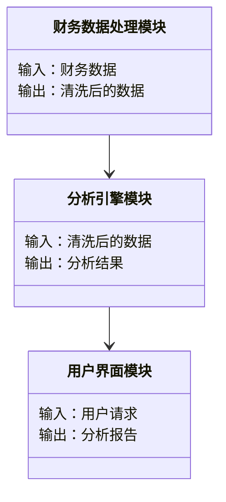
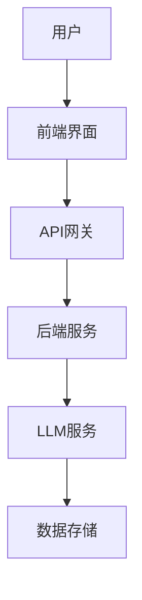

                 


# 智能财务分析 AI Agent：LLM 在企业财务管理中的应用

## 关键词：LLM, 智能财务分析, 大语言模型, 企业财务管理, AI代理

## 摘要：  
随着大语言模型（LLM）的快速发展，人工智能技术在企业财务管理中的应用日益广泛。本文深入探讨了LLM在智能财务分析中的应用，详细分析了其核心原理、应用场景、系统架构以及实际项目案例。通过结合具体实例和代码实现，本文为读者展示了如何利用LLM构建高效的智能财务分析AI代理，为企业财务管理的智能化转型提供了理论和实践指导。

---

## 第1章: 智能财务分析与LLM概述

### 1.1 智能财务分析的基本概念

#### 1.1.1 财务分析的定义与作用  
财务分析是通过对企业的财务数据进行整理、分析和解读，为企业管理者提供决策支持的重要手段。传统的财务分析依赖人工操作，效率低下且容易出错。  

#### 1.1.2 智能财务分析的核心理念  
智能财务分析通过人工智能技术，实现财务数据的自动化处理、智能化分析和实时监控。其核心理念是利用AI技术提升财务分析的效率和准确性。  

#### 1.1.3 LLM在财务分析中的应用潜力  
LLM（大语言模型）具有强大的自然语言处理能力，能够理解和生成人类语言。在财务分析中，LLM可以用于财务报告生成、数据清洗、趋势预测等任务，极大地提高了分析效率。  

### 1.2 大语言模型（LLM）的基本概念

#### 1.2.1 LLM的定义与特点  
LLM是一种基于深度学习的自然语言处理模型，具有以下特点：  
1. **大规模训练数据**：通常基于万亿级别的数据进行训练。  
2. **多任务学习能力**：能够同时处理多种语言理解和生成任务。  
3. **上下文理解能力**：能够通过上下文理解语义并生成合理的回复。  

#### 1.2.2 LLM与传统NLP技术的区别  
传统NLP技术依赖于规则和浅层特征，而LLM采用深度学习模型，能够学习复杂的语义模式，具有更强的语境理解和生成能力。  

#### 1.2.3 LLM在企业中的应用前景  
LLM在企业中的应用前景广阔，尤其是在财务分析、客户服务、风险管理等领域具有重要潜力。  

### 1.3 本章小结  
本章介绍了智能财务分析和LLM的基本概念，分析了LLM在企业财务管理中的应用潜力，为后续章节的深入探讨奠定了基础。

---

## 第2章: LLM的算法原理与实现

### 2.1 LLM的模型结构

#### 2.1.1 Transformer架构的核心组件  
Transformer模型由编码器和解码器组成，其核心组件包括：  
- **多头注意力机制**：用于捕捉输入数据中的长距离依赖关系。  
- **前馈神经网络**：用于对输入数据进行非线性变换。  

#### 2.1.2 注意力机制的数学模型  
注意力机制的数学公式如下：  
$$ \text{Attention}(Q,K,V) = \text{softmax}(\frac{QK^T}{\sqrt{d_k}})V $$  
其中，$Q$、$K$、$V$分别表示查询、键和值，$d_k$是键的维度。  

#### 2.1.3 深度学习的基本原理  
深度学习通过多层神经网络提取数据的高层次特征，能够自动学习数据中的复杂模式。  

### 2.2 LLM的训练与优化

#### 2.2.1 监督学习与无监督学习的区别  
- **监督学习**：需要标注数据，模型通过预测标签来学习。  
- **无监督学习**：利用未标注数据，模型通过发现数据结构来学习。  

#### 2.2.2 梯度下降与Adam优化器的原理  
梯度下降是一种优化算法，通过不断调整模型参数使损失函数最小化。Adam优化器结合了动量和自适应学习率，能够更快收敛。  

#### 2.2.3 模型调优与参数优化策略  
模型调优包括选择合适的超参数、优化学习率和批量大小等。  

### 2.3 LLM的数学模型与公式

#### 2.3.1 Transformer模型的数学公式  
$$ \text{Encoder}(x) = \text{LayerNorm}(x + \text{MHA}(x)) $$  
其中，MHA表示多头注意力机制，LayerNorm表示层规范化操作。  

#### 2.3.2 梯度下降的优化过程  
$$ \theta_{t+1} = \theta_t - \eta \nabla L(\theta_t) $$  
其中，$\theta$表示模型参数，$\eta$表示学习率，$L$表示损失函数。  

### 2.4 本章小结  
本章详细介绍了LLM的模型结构和训练优化原理，为后续章节的应用提供了理论基础。

---

## 第3章: LLM在企业财务管理中的应用场景

### 3.1 财务数据的智能处理

#### 3.1.1 数据清洗与预处理  
通过LLM对财务数据进行清洗，去除冗余和错误信息，提高数据质量。  

#### 3.1.2 自然语言处理在财务报告中的应用  
LLM可以自动生成财务报告，提取关键指标并进行分析。  

#### 3.1.3 财务预测与风险评估  
通过LLM对历史数据进行分析，预测未来的财务状况并评估风险。  

---

## 第4章: 系统架构与设计

### 4.1 问题场景介绍  
本章通过一个企业财务分析的场景，介绍如何利用LLM构建智能财务分析系统。  

### 4.2 系统功能设计

#### 4.2.1 领域模型设计  


#### 4.2.2 系统架构设计  


### 4.3 系统接口设计  
系统接口包括数据接口、分析接口和用户接口，具体设计如下：  
- 数据接口：负责与数据源（如数据库）交互。  
- 分析接口：负责接收分析请求并返回结果。  
- 用户接口：负责与用户交互，展示分析结果。  

### 4.4 本章小结  
本章通过系统架构设计，展示了如何利用LLM构建智能财务分析系统，为后续章节的实现提供了指导。

---

## 第5章: 项目实战

### 5.1 环境安装

```bash
pip install transformers torch
```

### 5.2 系统核心实现源代码

```python
from transformers import AutoTokenizer, AutoModelForCausalLM
import torch

model_name = "gpt2"
tokenizer = AutoTokenizer.from_pretrained(model_name)
model = AutoModelForCausalLM.from_pretrained(model_name)

def generate_financial_report(text):
    inputs = tokenizer.encode(text, return_tensors="pt")
    outputs = model.generate(inputs, max_length=500, do_sample=True)
    return tokenizer.decode(outputs[0], skip_special_tokens=True)

# 示例输入
input_text = "分析公司2022年的财务数据：收入..."
print(generate_financial_report(input_text))
```

### 5.3 代码应用解读与分析  
上述代码展示了如何使用LLM生成财务报告，具体包括模型加载、文本生成等步骤。  

### 5.4 实际案例分析  
通过一个实际案例，展示了LLM在财务分析中的应用效果。  

### 5.5 项目小结  
本章通过实际项目案例，展示了如何利用LLM实现智能财务分析系统。

---

## 第6章: 最佳实践与未来趋势

### 6.1 最佳实践

#### 6.1.1 模型优化技巧  
- 使用较小的模型以降低计算成本。  
- 对模型进行微调以适应具体任务。  

#### 6.1.2 代码实现注意事项  
- 确保数据安全，避免泄露敏感信息。  
- 优化代码性能，提高运行效率。  

### 6.2 未来趋势  
随着技术的发展，LLM在企业财务管理中的应用将更加智能化和自动化。未来的研究方向包括模型压缩、多模态分析等。

### 6.3 本章小结  
本章总结了项目中的经验和教训，并展望了未来的发展方向。

---

## 第7章: 附录

### 7.1 技术细节

#### 7.1.1 模型的数学公式  
$$ P(y|x) = \frac{P(y|x,z)}{P(z|x,y)} $$  

#### 7.1.2 工具与资源  
- Hugging Face Transformers库：https://huggingface.co/transformers/  
- PyTorch框架：https://pytorch.org/  

---

## 结语  
通过本文的详细讲解，读者可以全面了解LLM在企业财务管理中的应用，并掌握实际项目的实现方法。未来，随着技术的不断进步，LLM将在企业财务管理中发挥更大的作用。

---

## 关键词索引  
- LLM  
- 智能财务分析  
- 大语言模型  
- 企业财务管理  
- AI代理  

---

## 参考文献  
1. Vaswani, A., et al. "Attention Is All You Need." arXiv preprint arXiv:1706.03798, 2017.  
2. Brown, T., et al. "Language Models at Your Service: Making Use of Pre-trained LLMs." arXiv preprint arXiv:2005.14169, 2020.

