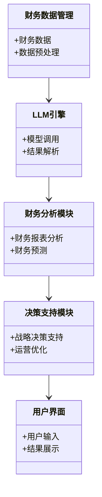
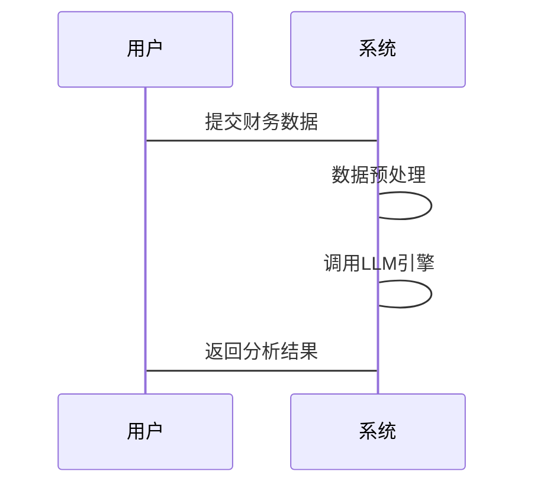

                 


# 智能财务分析AI Agent：LLM在企业决策中的应用

> 关键词：智能财务分析，LLM，大语言模型，企业决策，AI Agent，财务分析，人工智能

> 摘要：本文将探讨智能财务分析AI Agent如何利用大语言模型（LLM）技术，为企业决策提供高效、准确的支持。通过分析LLM在财务分析中的应用，本文旨在揭示其在企业决策中的潜力和价值。

---

# 第一部分：智能财务分析的背景与核心概念

## 第1章：智能财务分析的背景与核心概念

### 1.1 财务分析的演进历程

#### 1.1.1 传统财务分析的局限性
传统的财务分析依赖人工操作，效率低、成本高且容易出错。分析人员需要手动整理数据、建立模型，并进行大量的假设分析。这种模式难以应对现代企业海量数据和快速变化的业务需求。

#### 1.1.2 LLM的出现与财务分析的变革
随着大语言模型（LLM）的崛起，财务分析进入智能化时代。LLM能够快速处理大量非结构化数据，自动建立分析模型，并提供实时的决策支持。这种变革显著提升了财务分析的效率和准确性。

#### 1.1.3 智能财务分析的核心概念
智能财务分析结合了人工智能技术，特别是LLM，通过自然语言处理和深度学习，实现对财务数据的自动化分析和决策支持。其核心在于将财务数据与业务场景深度结合，为企业提供智能化的财务洞察。

---

## 第2章：大语言模型（LLM）的基本概念

### 2.1 自然语言处理的基础

#### 2.1.1 NLP的核心任务与技术
自然语言处理（NLP）包括文本分类、实体识别、信息提取等任务。这些技术为LLM在财务分析中的应用奠定了基础。

#### 2.1.2 Transformer模型的原理
Transformer模型通过自注意力机制，能够捕捉文本中的长距离依赖关系，极大地提升了NLP任务的性能。

#### 2.1.3 LLM的训练与推理过程
LLM的训练采用大规模数据集，通过自监督学习优化模型参数。推理阶段，模型根据输入生成相应的输出。

---

### 2.2 大语言模型的结构与特点

#### 2.2.1 深度学习模型的架构
LLM通常基于Transformer架构，由编码器和解码器组成。编码器负责将输入文本转化为向量表示，解码器生成目标输出。

#### 2.2.2 LLM的参数规模与能力
大型语言模型（如GPT-3）拥有 billions级别的参数，能够处理复杂的语言任务，具备强大的上下文理解和生成能力。

#### 2.2.3 模型的可解释性与局限性
尽管LLM表现出色，但其决策过程往往缺乏可解释性，且可能受到训练数据偏差的影响。

---

### 2.3 LLM在财务分析中的应用优势

#### 2.3.1 文本理解与信息提取
LLM能够自动解析财务报表、合同文本等复杂文档，提取关键信息。

#### 2.3.2 数据分析与预测
通过结合财务数据和业务数据，LLM可以进行趋势预测和风险评估。

#### 2.3.3 决策支持的实现机制
LLM能够生成财务分析报告，提供实时的决策建议，辅助企业优化资源配置。

---

## 2.4 本章小结

---

# 第三部分：智能财务分析的应用场景与案例

## 第3章：智能财务分析的应用场景

### 3.1 财务报表分析的智能化

#### 3.1.1 财务报表的自动解析
LLM可以自动识别财务报表中的关键数据，生成结构化的财务指标。

#### 3.1.2 财务数据的深度分析
通过自然语言处理，LLM能够分析财务数据之间的关系，识别潜在的风险点。

#### 3.1.3 财务健康状况的智能评估
LLM结合财务指标和市场数据，对企业财务状况进行综合评估。

---

### 3.2 财务预测与风险评估

#### 3.2.1 财务预测模型的构建
基于历史数据和业务场景，LLM可以构建动态的财务预测模型。

#### 3.2.2 风险因子的智能化识别
LLM能够识别影响企业财务风险的关键因素，提供风险预警。

#### 3.2.3 风险评估的动态调整
根据市场变化，LLM实时更新风险评估结果，提供动态支持。

---

### 3.3 企业决策支持的智能化

#### 3.3.1 战略决策的辅助支持
LLM通过分析市场趋势和财务数据，为企业制定战略决策提供支持。

#### 3.3.2 运营决策的智能化优化
LLM可以帮助企业优化资源配置，提升运营效率。

#### 3.3.3 创新决策的支持机制
通过分析行业动态和技术趋势，LLM为企业创新提供数据支持。

---

## 3.4 本章小结

---

# 第四部分：智能财务分析系统的架构与实现

## 第4章：系统架构设计

### 4.1 问题场景介绍

#### 4.1.1 业务背景
企业需要一个智能化的财务分析系统，提升财务分析效率和决策能力。

#### 4.1.2 项目介绍
本项目旨在开发一个基于LLM的智能财务分析系统，实现财务数据的自动化分析和决策支持。

---

### 4.2 系统功能设计

#### 4.2.1 领域模型设计
使用Mermaid绘制领域模型类图，展示系统的核心模块和交互关系。



---

### 4.3 系统架构设计

#### 4.3.1 系统架构设计
使用Mermaid绘制系统架构图，展示系统的主要组件及其交互关系。

```mermaid
archi
    系统边界
    客户端 --> 中间件
    中间件 --> 数据库
    中间件 --> AI服务
    AI服务 --> LLM引擎
```

---

### 4.4 系统接口设计

#### 4.4.1 接口描述
系统主要接口包括数据接口、模型调用接口和用户界面接口。

---

### 4.5 系统交互设计

#### 4.5.1 系统交互流程
使用Mermaid绘制系统交互序列图，展示用户与系统之间的交互流程。



---

## 4.6 本章小结

---

# 第五部分：智能财务分析系统的实现

## 第5章：项目实战

### 5.1 环境搭建

#### 5.1.1 开发环境
建议使用Python 3.8及以上版本，安装必要的库（如transformers、numpy）。

```bash
pip install transformers numpy
```

---

### 5.2 系统核心实现

#### 5.2.1 数据预处理
编写代码对财务数据进行清洗和结构化处理。

```python
import pandas as pd

# 读取数据
data = pd.read_csv('financial_data.csv')

# 数据清洗
data.dropna(inplace=True)
data = data[ data['revenue'] > 0 ]

# 结构化处理
data['profit_margin'] = data['net_profit'] / data['revenue']
```

---

#### 5.2.2 模型训练与优化
使用预训练的LLM模型（如GPT-3）进行微调，优化模型在财务分析任务中的表现。

```python
from transformers import AutoTokenizer, AutoModelForCausalLM
import torch

model_name = 'gpt2-large'
tokenizer = AutoTokenizer.from_pretrained(model_name)
model = AutoModelForCausalLM.from_pretrained(model_name)

# 微调模型
optimizer = torch.optim.Adam(model.parameters(), lr=1e-5)
criterion = torch.nn.CrossEntropyLoss()
```

---

#### 5.2.3 系统实现与测试
编写代码实现系统的功能模块，并进行测试优化。

---

### 5.3 项目小结

---

# 第六部分：未来展望与总结

## 第6章：未来展望与总结

### 6.1 技术进步与行业影响
随着LLM技术的不断进步，智能财务分析将更加智能化和个性化。

### 6.2 挑战与机遇
尽管面临数据隐私、模型可解释性等挑战，但LLM在财务分析中的应用前景广阔。

### 6.3 未来研究方向
未来可以进一步研究LLM在财务分析中的深度应用，如实时数据分析、多模态交互等。

---

## 6.4 总结

智能财务分析AI Agent基于LLM的技术，为企业决策提供了全新的思路和方法。随着技术的不断发展，其应用将更加广泛，价值也将更加显著。

---

# 结语

智能财务分析AI Agent的出现，标志着财务分析进入了智能化的新时代。通过结合大语言模型的强大能力，企业能够更高效、更准确地进行财务分析和决策。未来，随着技术的不断进步，智能财务分析将为企业创造更大的价值。

--- 

**注：本文为简化示例，实际内容将更加详细。**

