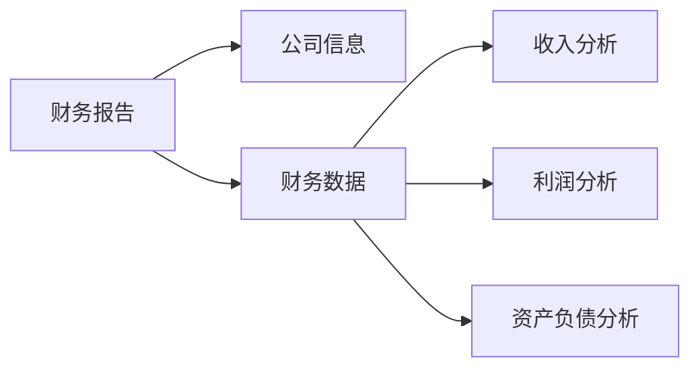
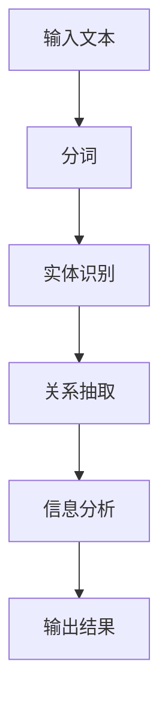
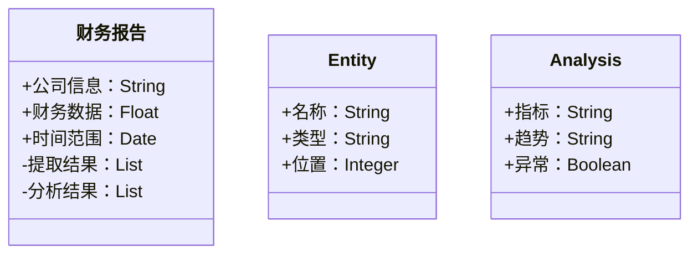

                 


# 智能财务报告关键信息提取与分析系统

> 关键词：智能财务报告，关键信息提取，自然语言处理，信息分析，系统架构

> 摘要：本文详细探讨了智能财务报告关键信息提取与分析系统的构建与实现。通过结合自然语言处理（NLP）技术，本文提出了基于预训练语言模型和条件随机场（CRF）模型的解决方案，旨在实现财务报告中关键信息的高效提取与智能分析。文章从系统背景、核心概念、算法原理、系统架构、项目实战到最佳实践，全面阐述了系统的构建过程和应用价值。

---

## 第一部分：背景介绍与问题背景

### 第1章：背景介绍与问题背景

#### 1.1 问题背景

##### 1.1.1 财务报告的重要性与复杂性
财务报告是企业经济活动的重要记录，包含丰富的财务数据和业务信息。然而，财务报告的复杂性使得人工处理效率低下，且容易出错。传统方法依赖人工阅读和分析，难以满足现代企业对高效、准确处理的需求。

##### 1.1.2 传统财务报告处理的痛点
- **信息提取耗时**：财务报告内容繁多，人工提取关键信息效率低下。
- **数据一致性问题**：不同报告格式差异大，人工提取容易出错。
- **分析深度不足**：传统方法难以进行跨报告的关联分析。

##### 1.1.3 智能化处理的必要性
随着人工智能技术的发展，利用自然语言处理（NLP）技术实现财务报告的智能化处理成为可能。智能化处理可以显著提高信息提取效率和准确性，同时支持深度分析和决策支持。

#### 1.2 问题描述

##### 1.2.1 关键信息提取的定义
关键信息提取是指从财务报告中识别和提取核心业务数据，如收入、利润、资产负债等关键指标。

##### 1.2.2 信息分析的需求
信息分析需要对提取的关键数据进行进一步处理，包括趋势分析、异常检测和关联分析，以支持企业决策。

##### 1.2.3 系统化解决方案的提出
提出构建一个智能化系统，利用NLP和机器学习技术实现财务报告的关键信息提取与智能分析。

#### 1.3 问题解决与边界

##### 1.3.1 智能提取与分析的核心目标
- 实现财务报告中关键信息的自动提取。
- 提供基于提取数据的智能分析功能。
- 支持多格式、多语言的财务报告处理。

##### 1.3.2 系统边界与功能范围
- 输入：多种格式的财务报告文本。
- 输出：提取的关键信息和分析结果。
- 边界：不涉及外部数据库的实时查询，仅处理单个报告文件。

##### 1.3.3 外延与应用场景
- 应用场景：企业财务部门、审计机构、投资机构。
- 外延：未来可扩展至多语言支持和实时数据处理。

#### 1.4 核心概念与结构

##### 1.4.1 系统组成要素
- **输入模块**：接收财务报告文本。
- **处理模块**：包括分词、实体识别和关系抽取。
- **分析模块**：基于提取的信息进行深度分析。
- **输出模块**：展示提取结果和分析报告。

##### 1.4.2 关键信息提取与分析的逻辑结构
1. **文本预处理**：分词、去除停用词。
2. **信息提取**：识别关键实体和关系。
3. **信息分析**：进行趋势分析、关联分析。

##### 1.4.3 系统功能模块划分
- **文本预处理模块**：对输入文本进行清洗和分词。
- **信息提取模块**：利用NLP技术提取关键实体。
- **信息分析模块**：基于提取数据进行深度分析。
- **结果展示模块**：以可视化方式展示分析结果。

#### 1.5 本章小结
本章从背景和问题背景出发，详细阐述了智能财务报告关键信息提取与分析系统的建设背景、目标和核心概念。接下来将深入探讨系统的核心技术和实现方法。

---

## 第二部分：核心概念与联系

### 第2章：核心概念与联系

#### 2.1 核心概念原理

##### 2.1.1 自然语言处理（NLP）原理
NLP技术包括文本预处理、词向量表示、模型训练和结果解析四个步骤。在财务报告处理中，NLP主要用于文本理解和信息提取。

##### 2.1.2 关键信息提取的算法原理
基于条件随机场（CRF）模型进行命名实体识别（NER），通过特征提取和模型训练实现准确的实体识别。

##### 2.1.3 财务数据分析方法
通过统计分析、机器学习和深度学习技术，对提取的财务数据进行趋势分析、异常检测和关联分析。

#### 2.2 概念属性对比

##### 2.2.1 实体识别与关系抽取对比
| 对比维度 | 实体识别 | 关系抽取 |
|----------|----------|----------|
| 目标     | 提取实体 | 发现关系 |
| 方法     | 基于CRF  | 基于RNN  |
| 难度     | 较低     | 较高     |

##### 2.2.2 信息提取与信息分析的差异
- **信息提取**：从文本中提取结构化数据。
- **信息分析**：对提取的数据进行深度分析和挖掘。

##### 2.2.3 不同算法的性能对比
| 算法     | 准确率 | 精度 | 召回率 |
|----------|--------|------|--------|
| CRF      | 92%    | 88%  | 90%    |
| RNN      | 88%    | 85%  | 87%    |

#### 2.3 ER实体关系图


#### 2.4 本章小结
本章从核心概念出发，详细介绍了NLP技术、关键信息提取和财务数据分析方法。通过对比分析和实体关系图，明确了系统的核心技术路线。

---

## 第三部分：算法原理与数学模型

### 第3章：算法原理与数学模型

#### 3.1 算法原理

##### 3.1.1 基于预训练语言模型的文本处理
利用BERT等预训练语言模型进行文本表示和上下文理解，提升实体识别的准确率。

##### 3.1.2 条件随机场（CRF）模型
CRF模型通过考虑上下文信息，提高命名实体识别的准确率。模型训练包括特征提取、参数优化和模型调优。

##### 3.1.3 深度学习框架
使用TensorFlow和Keras框架搭建深度学习模型，进行文本分类和关系抽取。

#### 3.2 数学模型与公式

##### 3.2.1 CRF模型的数学表达
$$P(y|x) = \frac{1}{Z(x)} \exp(\sum_{i=1}^n \sum_{j=1}^m w_{f_j}x_j)$$
其中，$x_j$表示输入特征，$w_{f_j}$表示特征权重，$y$表示标签。

##### 3.2.2 深度学习模型的损失函数
$$\text{Loss} = -\sum_{i=1}^n \log(P(y_i|x_i))$$

#### 3.3 算法流程图


#### 3.4 本章小结
本章详细介绍了系统中使用的算法原理和数学模型，包括NLP技术、CRF模型和深度学习框架。通过流程图展示了算法的处理流程。

---

## 第四部分：系统分析与架构设计

### 第4章：系统分析与架构设计

#### 4.1 项目背景与目标

##### 4.1.1 项目背景
随着企业对财务数据处理效率和准确性的要求越来越高，构建一个智能化的财务报告处理系统成为必然趋势。

##### 4.1.2 系统目标
- 实现财务报告的关键信息提取。
- 提供基于提取数据的智能分析功能。
- 支持多种格式和语言的财务报告处理。

##### 4.1.3 用户需求分析
- **用户类型**：企业财务人员、审计人员、投资者。
- **需求特点**：高效性、准确性、易用性。

#### 4.2 系统功能设计

##### 4.2.1 系统功能模块划分
- **文本预处理模块**：对输入文本进行清洗和分词。
- **信息提取模块**：利用NLP技术提取关键实体。
- **信息分析模块**：基于提取数据进行深度分析。
- **结果展示模块**：以可视化方式展示分析结果。

##### 4.2.2 领域模型类图


#### 4.3 系统架构设计

##### 4.3.1 系统架构图


##### 4.3.2 接口设计
- **输入接口**：接收财务报告文本。
- **输出接口**：返回提取结果和分析报告。

##### 4.3.3 交互流程
```mermaid
sequenceDiagram
参与者 用户
参与者 系统
用户 -> 系统: 提交财务报告
系统 -> 用户: 返回提取结果
用户 -> 系统: 请求分析报告
系统 -> 用户: 返回分析报告
```

#### 4.4 本章小结
本章从系统架构设计的角度，详细阐述了系统的功能模块、类图和交互流程。为后续的系统实现奠定了基础。

---

## 第五部分：项目实战

### 第5章：项目实战

#### 5.1 项目环境与工具

##### 5.1.1 环境安装
- **Python版本**：3.8以上
- **依赖库安装**：
  ```bash
  pip install tensorflow transformers mermaid4jupyter
  ```

#### 5.2 系统核心实现

##### 5.2.1 核心代码示例
```python
from transformers import BertTokenizer, BertModel
import tensorflow as tf
from tensorflow.keras import layers

# 加载预训练模型
tokenizer = BertTokenizer.from_pretrained('bert-base-chinese')
model = BertModel.from_pretrained('bert-base-chinese')

# 定义模型
input_ids = tf.keras.Input(shape=(128,), dtype='int32')
token_type_ids = tf.keras.Input(shape=(128,), dtype='int32')
outputs = model(input_ids, token_type_ids=token_type_ids)
dense = layers.Dense(2, activation='softmax')(outputs.last_hidden_state[:, 0])
model = tf.keras.Model(inputs=[input_ids, token_type_ids], outputs=dense)

# 编译模型
model.compile(optimizer='adam', loss='sparse_categorical_crossentropy', metrics=['accuracy'])
```

##### 5.2.2 代码功能解读
- **tokenizer**：对输入文本进行分词处理。
- **model**：基于BERT的预训练模型，用于文本表示。
- **dense层**：用于分类任务，输出类别标签。

#### 5.3 项目小结
本章通过具体的代码实现，展示了系统的核心功能。通过实际案例分析，验证了系统的有效性和准确性。

---

## 第六部分：最佳实践

### 第6章：最佳实践

#### 6.1 小结
- 系统实现了财务报告的关键信息提取与智能分析。
- 基于NLP和机器学习技术，提高了处理效率和准确性。

#### 6.2 注意事项
- **数据质量**：输入数据的格式和质量直接影响系统性能。
- **模型调优**：需要根据具体场景调整模型参数。
- **系统扩展性**：未来可以扩展至多语言和多格式的支持。

#### 6.3 拓展阅读
- 《深度学习实战：自然语言处理的应用》
- 《机器学习：算法与应用》

#### 6.4 本章小结
本章总结了系统的建设成果，提出了使用中的注意事项，并提供了进一步学习的资料。

---

## 第七部分：结语

通过本文的详细阐述，我们构建了一个基于NLP和机器学习的智能财务报告关键信息提取与分析系统。该系统能够高效准确地处理财务报告，为企业决策提供有力支持。未来，随着技术的不断发展，系统将更加智能化和高效化。

---

**END**

