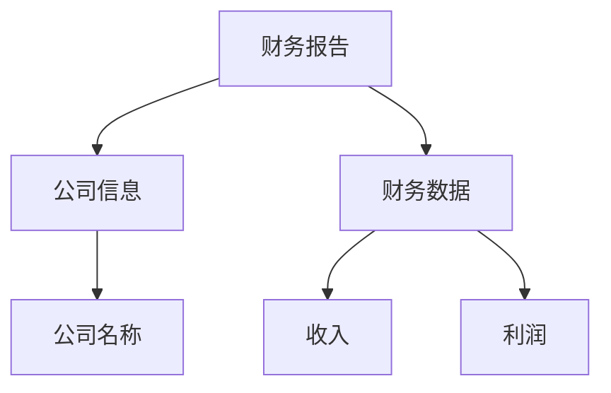
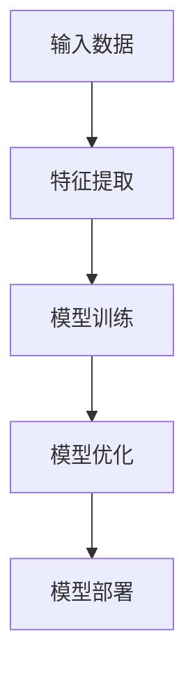
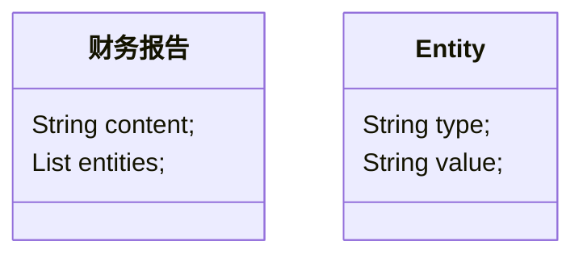
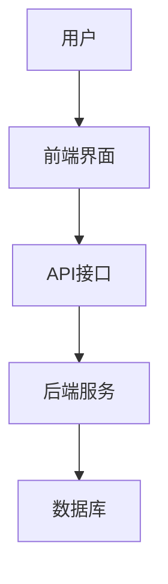
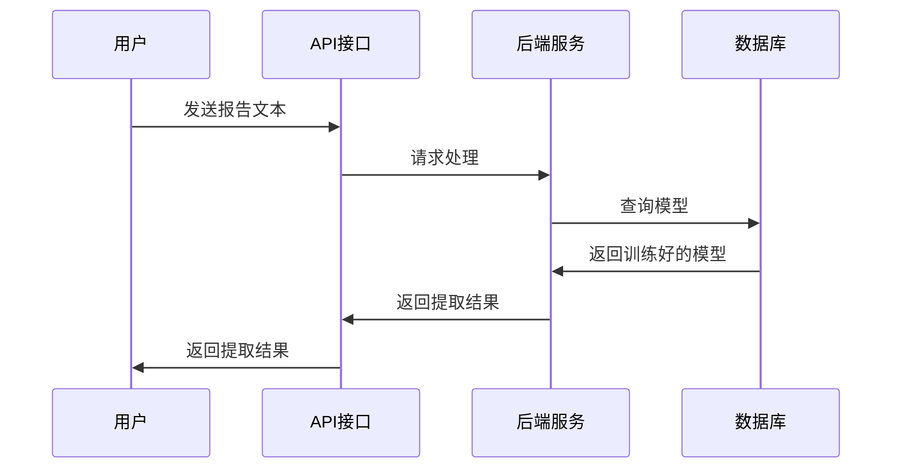

                 


# 智能财务报告关键信息提取工具

## 关键词：
- 财务报告
- 关键信息提取
- 自然语言处理
- 机器学习
- 支持向量机
- 神经网络
- 系统架构

## 摘要：
本文详细探讨了智能财务报告关键信息提取工具的设计与实现。从背景介绍、核心概念、算法原理到系统架构设计和项目实战，文章全面解析了如何利用自然语言处理和机器学习技术高效提取财务报告中的关键信息。通过实际案例分析，展示了工具在企业中的应用价值，并提出了优化建议和未来发展方向。

---

# 第一部分: 智能财务报告关键信息提取工具的背景与价值

# 第1章: 财务报告关键信息提取的背景与需求

## 1.1 问题背景
### 1.1.1 财务报告的重要性
财务报告是企业展示经营状况的重要文件，通常包括资产负债表、利润表和现金流量表等。这些报告不仅反映了企业的财务健康状况，还为投资者、债权人和管理层提供了决策依据。

### 1.1.2 传统财务信息处理的痛点
传统的财务信息处理方式主要依赖人工阅读和记录，效率低且容易出错。财务报告中的数据量大、格式多样，人工提取不仅耗时，还可能遗漏关键信息。

### 1.1.3 智能化信息提取的必要性
随着企业规模的扩大和数据量的增加，人工处理财务信息的效率已无法满足需求。智能化信息提取工具能够快速、准确地从财务报告中提取关键数据，为企业提供实时支持。

## 1.2 问题描述
### 1.2.1 财务报告信息提取的关键点
财务报告中的关键信息包括公司名称、收入、利润、资产负债等。这些信息通常以文本或表格形式呈现，提取时需要考虑多种格式。

### 1.2.2 信息提取的复杂性与挑战
财务报告的语言复杂，可能存在歧义和模糊信息。不同企业的报告格式也可能不同，增加了信息提取的难度。

### 1.2.3 业务场景中的具体需求
企业在财务分析、审计和决策支持中需要快速获取关键信息。因此，信息提取工具需要具备高精度、高效率和灵活性。

## 1.3 问题解决的思路
### 1.3.1 智能化技术的应用
通过自然语言处理（NLP）和机器学习技术，可以实现对财务报告的自动解析。支持向量机（SVM）和神经网络（NN）是常用的算法。

### 1.3.2 多模态数据的融合
财务报告通常包含文本和表格数据，融合处理可以提高提取的准确性和完整性。

### 1.3.3 从单点任务到端到端解决方案的演进
从单一的信息提取任务扩展到端到端的解决方案，能够更好地满足企业的多样化需求。

## 1.4 本章小结
本章介绍了财务报告关键信息提取的背景和需求，分析了传统处理方式的痛点，并提出了智能化信息提取的必要性和解决方案。

---

# 第二部分: 智能财务报告关键信息提取的核心概念与技术

# 第2章: 关键信息提取的核心概念

## 2.1 信息抽取的基本原理
### 2.1.1 文本预处理与特征提取
文本预处理包括分词、去停用词和词干提取。特征提取则关注关键词和句法结构。

### 2.1.2 基于规则的抽取方法
基于规则的方法依赖预定义的模式和规则，适用于规则明确的场景。

### 2.1.3 基于模型的抽取方法
基于模型的方法利用机器学习模型自动学习特征，适用于复杂场景。

## 2.2 信息融合的技术特点
### 2.2.1 多源数据的整合
信息融合技术可以整合文本和表格数据，提高提取的全面性。

### 2.2.2 知识图谱的构建
通过构建知识图谱，可以将分散的信息结构化，便于后续分析。

### 2.2.3 融合算法的优化
优化算法可以提高信息融合的准确性和效率。

## 2.3 智能提取的创新点
### 2.3.1 自然语言处理技术的应用
NLP技术如词嵌入和句意理解能够提高信息提取的准确性。

### 2.3.2 大模型在信息提取中的优势
大模型如BERT和GPT具有强大的上下文理解和生成能力，能够处理复杂语义。

### 2.3.3 竞争性分析与性能优化
通过竞争性分析，优化模型参数和结构，提升性能。

## 2.4 核心概念对比表
| 技术方法 | 优点 | 缺点 | 适用场景 |
|----------|------|------|----------|
| 基于规则 | 简单易懂 | 易维护性差 | 小规模、规则明确的场景 |
| 基于模型 | 高精度 | 需大量数据 | 复杂场景、大规模数据 |

## 2.5 ER实体关系图


---

# 第3章: 支持向量机与神经网络的算法原理

## 3.1 支持向量机的数学模型
### 3.1.1 线性可分情况下的优化问题
$$ \text{最大化} \quad \frac{1}{2} \|w\|^2 $$
$$ \text{约束条件：} \quad y_i(w \cdot x_i + b) \geq 1, \quad i=1,2,\dots,n $$

### 3.1.2 核函数与非线性分类
通过引入核函数，SVM可以处理非线性分类问题。常用核函数包括多项式核和径向基函数（RBF）。

### 3.1.3 支持向量回归
支持向量回归（SVR）用于回归问题，通过最小化损失函数和正则化项来优化模型。

## 3.2 神经网络的算法原理
### 3.2.1 神经网络的基本结构
神经网络由输入层、隐藏层和输出层组成，通过反向传播算法优化权重。

### 3.2.2 深度学习的挑战与优化
深度学习模型需要大量数据和计算资源，可以通过优化算法如Adam和学习率调整来提高性能。

## 3.3 算法流程图


## 3.4 支持向量机代码示例
```python
from sklearn import svm

# 训练模型
clf = svm.SVC(kernel='rbf', gamma=0.5, C=1)
clf.fit(X_train, y_train)

# 预测
y_pred = clf.predict(X_test)
```

## 3.5 神经网络代码示例
```python
import tensorflow as tf
from tensorflow.keras import layers

# 构建模型
model = tf.keras.Sequential()
model.add(layers.Dense(64, activation='relu', input_dim=100))
model.add(layers.Dense(1, activation='sigmoid'))

# 编译模型
model.compile(optimizer='adam', loss='binary_crossentropy', metrics=['accuracy'])

# 训练
model.fit(X_train, y_train, epochs=10, batch_size=32)
```

## 3.6 数学模型与公式
### 3.6.1 支持向量机的优化目标
$$ \text{最大化} \quad \frac{1}{2} \|w\|^2 $$
$$ \text{约束条件：} \quad y_i(w \cdot x_i + b) \geq 1, \quad i=1,2,\dots,n $$

### 3.6.2 神经网络的损失函数
$$ L = -\frac{1}{n} \sum_{i=1}^{n} y_i \log(a_i) + (1 - y_i) \log(1 - a_i) $$
其中，$a_i$是输出层的激活值。

---

# 第四部分: 智能财务报告关键信息提取系统的分析与设计

# 第4章: 系统分析与架构设计

## 4.1 系统功能设计
### 4.1.1 领域模型类图


### 4.1.2 系统架构设计


## 4.2 系统接口设计
### 4.2.1 接口定义
提供RESTful API接口，支持POST请求，接收财务报告文本，返回提取结果。

### 4.2.2 交互序列图


---

# 第五部分: 智能财务报告关键信息提取工具的实战应用

# 第5章: 项目实战

## 5.1 环境安装与配置
### 5.1.1 安装Python和必要的库
安装Python 3.8及以上版本，安装库如`numpy`、`pandas`、`scikit-learn`和`tensorflow`。

## 5.2 系统核心实现
### 5.2.1 预处理模块
编写代码进行文本分词和特征提取。

### 5.2.2 模型训练模块
使用SVM或神经网络模型训练分类器。

## 5.3 案例分析与结果展示
### 5.3.1 实际案例
以某公司财务报告为例，展示提取过程和结果。

### 5.3.2 性能分析
比较不同算法的准确率、召回率和F1分数，优化模型参数。

## 5.4 代码实现
```python
import numpy as np
from sklearn import svm

# 示例数据
X_train = np.array([[1, 0], [0, 1], [1, 1], [0, 0]])
y_train = np.array([0, 0, 1, 1])

# 训练模型
clf = svm.SVC(kernel='linear')
clf.fit(X_train, y_train)

# 预测
X_test = np.array([[1, 1]])
y_pred = clf.predict(X_test)
print(y_pred)
```

---

# 第六部分: 总结与展望

## 6.1 最佳实践 tips
- 数据预处理是关键，确保数据质量。
- 选择合适的算法，根据数据量和场景进行优化。
- 定期更新模型，适应新的数据和业务需求。

## 6.2 小结
本文详细介绍了智能财务报告关键信息提取工具的设计与实现，涵盖了从背景分析到系统架构设计的全过程。

## 6.3 注意事项
- 数据隐私保护，确保财务信息的安全性。
- 模型的可解释性，便于调试和优化。
- 系统的可扩展性，适应未来的业务需求。

## 6.4 拓展阅读
- 《自然语言处理入门》
- 《机器学习实战》
- 《深度学习：方法与应用》

---

# 结语
智能财务报告关键信息提取工具的应用将大大提升企业财务处理的效率和准确性。通过不断优化算法和系统架构，未来将实现更智能化、个性化的财务信息管理。

--- 

**全文完**

