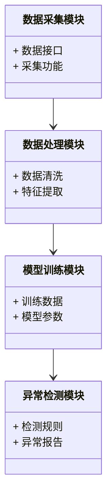

                 


# 智能财务报表比较分析与异常检测

## 关键词：智能财务报表分析，机器学习，深度学习，异常检测，财务数据挖掘，数据可视化

## 摘要：  
随着企业数据的快速增长和复杂性增加，传统的财务报表分析方法逐渐暴露出效率低下、准确性不足等问题。基于人工智能的智能财务报表比较分析与异常检测技术，通过机器学习、深度学习等算法，能够高效地进行数据挖掘、模式识别和异常检测，为企业提供精准的财务分析和决策支持。本文将详细探讨智能财务报表分析的核心概念、算法原理、系统架构设计以及实际项目实现，为企业财务智能化转型提供理论和实践指导。

---

# 第1章：智能财务报表分析的背景与重要性

## 1.1 财务报表分析的传统方法与局限性  
传统的财务报表分析方法依赖于人工审查和经验判断，这种方法虽然可靠，但存在效率低、主观性强、难以处理大规模数据等问题。具体来说，传统方法的局限性包括：  
1. **数据处理效率低**：手动处理大量财务数据耗时耗力，难以应对海量数据的分析需求。  
2. **分析深度有限**：传统方法通常只关注表面的财务指标，难以发现隐藏的异常或潜在风险。  
3. **主观性较强**：分析结果依赖于分析师的经验和判断，容易受到主观因素的影响。  

## 1.2 智能财务报表分析的兴起  
随着人工智能技术的快速发展，基于机器学习和深度学习的智能财务分析方法逐渐成为研究热点。智能财务报表分析的核心优势包括：  
1. **高效性**：利用算法自动处理数据，大幅提高分析效率。  
2. **准确性**：通过模型训练，能够发现数据中的潜在规律和异常。  
3. **可扩展性**：能够处理大规模数据，并支持多种场景下的财务分析需求。  

## 1.3 本书的研究目标与意义  
本书旨在探讨智能财务报表分析的核心技术，包括数据预处理、特征提取、模型训练以及异常检测等关键环节。通过理论分析和实际案例，帮助企业实现财务报表分析的智能化转型，提升财务决策的科学性和准确性。

---

# 第2章：智能财务报表比较分析的核心概念

## 2.1 数据预处理与特征提取  
在智能财务分析中，数据预处理是确保模型准确性的关键步骤。  
- **数据清洗**：去除无效数据、填补缺失值、处理异常值。  
- **特征提取**：从原始数据中提取具有代表性的特征，例如财务比率、趋势分析等。  

| 传统方法 | 智能方法 |  
|----------|----------|  
| 手动计算 | 自动提取 |  
| 主观判断 | 数据驱动 |  
| 低效 | 高效 |  

## 2.2 智能比较分析的关键技术  
智能财务比较分析的核心技术包括：  
1. **机器学习模型**：如线性回归、支持向量机（SVM）、随机森林等。  
2. **深度学习模型**：如神经网络、LSTM（长短期记忆网络）。  

## 2.3 异常检测的核心原理  
异常检测的目标是识别财务数据中的异常值或异常模式。常用方法包括：  
1. **统计方法**：基于均值、方差等统计指标。  
2. **机器学习方法**：如Isolation Forest、Autoencoders等。  

---

# 第3章：智能财务报表分析的算法原理

## 3.1 机器学习模型  
- **线性回归**：用于预测连续型变量，例如预测公司收入。  
- **支持向量机（SVM）**：用于分类和回归问题，适用于小规模数据。  


## 3.2 深度学习模型  
- **神经网络**：通过多层网络结构，自动提取复杂特征。  
- **LSTM**：适用于时间序列数据，能够捕捉长期依赖关系。  


---

# 第4章：智能财务报表分析系统的架构设计

## 4.1 系统功能设计  
- **数据采集模块**：从财务系统中获取数据。  
- **数据处理模块**：进行数据清洗和特征提取。  
- **模型训练模块**：训练机器学习或深度学习模型。  
- **异常检测模块**：识别财务数据中的异常值。  



## 4.2 系统架构设计  
- **分层架构**：分为数据层、业务逻辑层和用户界面层。  
- **微服务架构**：每个功能模块独立运行，便于扩展和维护。  


---

# 第5章：项目实战

## 5.1 环境搭建  
- **工具安装**：安装Python、TensorFlow、Scikit-learn等库。  
- **数据准备**：获取财务数据集，例如收入、支出、利润等。  

## 5.2 核心代码实现  
```python
import pandas as pd
from sklearn.ensemble import RandomForestClassifier
from sklearn.model_selection import train_test_split
from sklearn.metrics import accuracy_score

# 数据加载
data = pd.read_csv('financial_data.csv')

# 数据分割
X = data.drop('label', axis=1)
y = data['label']

X_train, X_test, y_train, y_test = train_test_split(X, y, test_size=0.2)

# 模型训练
model = RandomForestClassifier()
model.fit(X_train, y_train)

# 模型预测
y_pred = model.predict(X_test)

# 模型评估
print("Accuracy:", accuracy_score(y_test, y_pred))
```

---

# 第6章：总结与展望

## 6.1 总结  
智能财务报表分析通过机器学习和深度学习技术，显著提升了财务分析的效率和准确性。本文详细探讨了智能分析的核心概念、算法原理和系统架构，并通过实际案例展示了技术的应用。

## 6.2 展望  
未来，智能财务分析将更加智能化和自动化。随着技术的发展，模型的精度和效率将进一步提升，应用场景也将更加广泛。

---

## 最佳实践 Tips  
- 在实际项目中，建议结合业务需求选择合适的模型。  
- 数据预处理是模型训练的关键步骤，需要仔细处理。  
- 异常检测结果需要结合业务背景进行解释，避免误报和漏报。

--- 

通过本文的分析，读者可以全面了解智能财务报表分析的核心技术，并将其应用到实际工作中，为企业财务管理的智能化转型提供有力支持。

