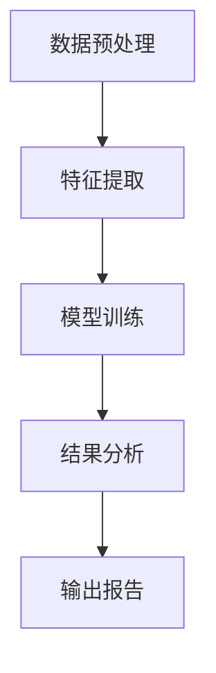
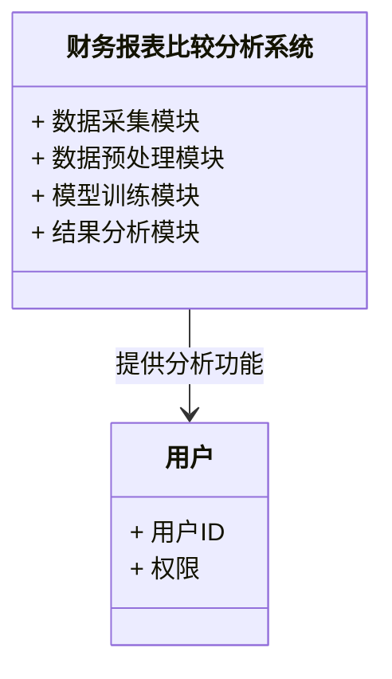

                 


# 智能财务报表比较分析系统

> **关键词**: 智能财务分析，人工智能，财务报表，机器学习，自然语言处理

> **摘要**: 本文详细介绍智能财务报表比较分析系统的构建与应用。通过背景介绍、核心概念、算法原理、系统架构设计和项目实战，全面解析如何利用人工智能技术提升财务分析效率与准确性。文章适合技术与财务背景的读者，帮助理解智能财务系统的实现原理与实际应用。

---

## 第一部分：背景介绍

### 第1章：智能财务报表比较分析系统的背景与问题

#### 1.1 问题背景

现代企业面临的财务数据复杂且多样，传统的人工财务分析效率低下且容易出错。企业需要高效、准确的工具来处理海量数据，支持决策。

#### 1.2 问题描述

财务报表分析涉及大量数据，人工分析耗时且容易出错，难以满足实时性和高效率的需求。此外，数据量大、结构复杂，传统方法难以应对。

#### 1.3 问题解决

引入人工智能技术，利用机器学习和自然语言处理，实现自动化、智能化的财务报表分析，提高效率和准确性。

#### 1.4 边界与外延

系统主要用于财务数据的自动化分析，不涉及企业的其他业务系统。其边界包括数据输入、模型训练和结果输出。

#### 1.5 核心概念

系统通过机器学习模型自动分析财务数据，生成比较分析报告。核心概念包括数据预处理、特征提取、模型训练和结果解释。

---

## 第二部分：核心概念与联系

### 第2章：智能财务报表分析系统的核心原理

#### 2.1 核心概念原理

智能财务分析系统利用机器学习和自然语言处理技术，从财务报表中提取关键信息，进行自动化分析和比较。

#### 2.2 核心概念对比

| 比较维度 | 传统方法 | 智能方法 |
|----------|-----------|----------|
| 效率     | 低        | 高       |
| 准确性   | 易出错     | 高       |
| 可扩展性 | 有限      | 强        |

#### 2.3 ER实体关系图

```mermaid
er
    entity 财务报表 {
        key: 报表ID
        fields: 公司名称, 财务年度, 财务数据
    }
    entity 模型参数 {
        key: 模型ID
        fields: 模型名称, 参数配置, 训练数据
    }
    entity 用户 {
        key: 用户ID
        fields: 用户名称, 权限等级
    }
    relation 财务报表 -- 模型参数: 使用关系
    relation 用户 -- 财务报表: 分析关系
```

---

## 第三部分：算法原理讲解

### 第3章：智能财务分析算法原理

#### 3.1 算法流程



#### 3.2 算法实现

```python
import numpy as np
from sklearn import svm

# 示例数据
X = np.array([[1, 0], [0, 1]])
y = [0, 1]

# 训练模型
model = svm.SVC()
model.fit(X, y)

# 预测
print(model.predict([[0.5, 0.5]]))
```

#### 3.3 数学模型

支持向量机（SVM）用于分类问题：

$$
\text{目标函数: } \min_{\theta, \xi} \frac{1}{2}\|\theta\|^2 + C\sum_{i=1}^n \xi_i
$$

约束条件：

$$
y_i (\theta \cdot x_i + \theta_0) \geq 1 - \xi_i
$$

---

## 第四部分：系统分析与架构设计方案

### 第4章：系统分析与架构设计

#### 4.1 问题场景

企业财务部门需要自动化分析多份财务报表，生成比较分析报告。

#### 4.2 系统功能设计



#### 4.3 系统架构设计


#### 4.4 系统接口设计

RESTful API接口：

```http
POST /api/train-model
{
    "data": [...],
    "params": {...}
}
```

---

## 第五部分：项目实战

### 第5章：项目实战

#### 5.1 环境安装

安装Python和相关库：

```bash
pip install numpy scikit-learn
```

#### 5.2 核心代码实现

```python
import numpy as np
from sklearn.svm import SVC

# 数据预处理
data = np.array([[1, 2], [3, 4], [5, 6]])
labels = [0, 1, 0]

# 训练模型
model = SVC()
model.fit(data, labels)

# 预测
print(model.predict([[2, 3]]))
```

#### 5.3 代码解读

- 数据预处理：清洗和标准化数据。
- 模型训练：使用SVM训练分类模型。
- 结果分析：生成分析报告并输出。

#### 5.4 实际案例分析

分析两份财务报表，生成比较分析报告，识别财务健康状况。

---

## 第六部分：总结与展望

### 第6章：总结与展望

#### 6.1 系统价值

智能财务报表比较分析系统通过自动化和智能化提升财务分析效率和准确性。

#### 6.2 未来展望

未来可以扩展至更多财务分析场景，结合NLP和深度学习技术，提供更全面的分析能力。

#### 6.3 注意事项

- 数据安全：确保财务数据的安全性。
- 模型优化：持续优化模型性能，提高分析准确性。
- 人员培训：对财务人员进行系统使用培训。

#### 6.4 拓展阅读

推荐阅读《机器学习实战》和《深度学习》等书籍，深入了解相关技术。

---

通过以上详细的内容，您可以全面了解智能财务报表比较分析系统的构建与应用。

