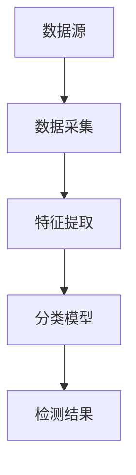
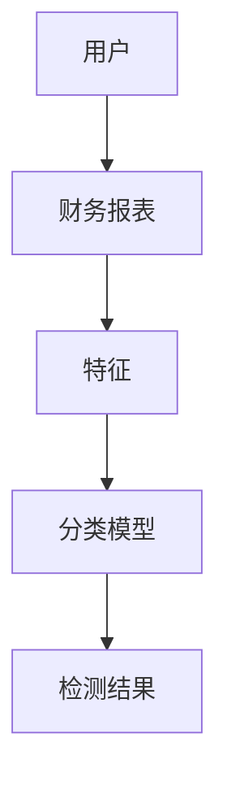
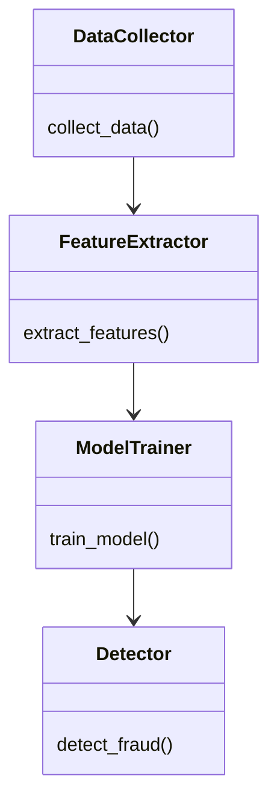
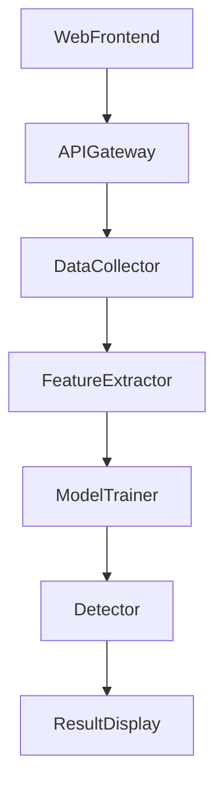

                 


# 智能财务报表舞弊检测系统

> **关键词**：智能财务报表、舞弊检测、人工智能、机器学习、自然语言处理、异常检测

> **摘要**：  
> 本文探讨了智能财务报表舞弊检测系统的构建与实现，结合特征提取、自然语言处理和异常检测等技术，提出了基于机器学习的解决方案。文章从问题背景出发，详细阐述了系统的核心原理、算法实现、系统架构设计以及实际案例分析，为读者提供了从理论到实践的全面指导。

---

## 第1章：智能财务报表舞弊检测系统背景与核心概念

### 1.1 问题背景与问题描述

#### 1.1.1 财务报表舞弊的现状与挑战
在企业财务管理中，财务报表舞弊问题日益严重，常见的舞弊手段包括虚增收入、隐瞒债务、虚减成本等。传统的财务报表审核方法依赖人工审查，效率低下且容易受到主观因素影响，难以及时发现复杂的舞弊行为。

#### 1.1.2 传统财务报表审核的局限性
- **人工审核效率低**：依赖审计人员的经验和主观判断，容易出现疏漏。
- **数据量大**：企业财务数据日益复杂，人工审核难以应对海量数据。
- **舞弊手段多样化**：传统的审计方法难以应对新型的舞弊技术。

#### 1.1.3 智能化检测的必要性与目标
- **必要性**：通过人工智能技术实现自动化、高效的财务报表审核。
- **目标**：建立一套基于机器学习的智能系统，能够自动识别财务报表中的异常数据和潜在舞弊行为。

### 1.2 问题解决思路与边界

#### 1.2.1 智能检测的核心思路
- **数据驱动**：利用企业历史财务数据，提取关键特征。
- **机器学习**：训练分类模型，识别正常与异常数据。
- **实时监控**：对实时财务数据进行分析，及时发现舞弊行为。

#### 1.2.2 系统边界与外延
- **边界**：系统专注于财务报表数据的分析，不涉及其他业务系统。
- **外延**：未来可以扩展至其他类型数据的分析，如审计报告、银行流水等。

#### 1.2.3 核心要素与系统组成
- **核心要素**：财务数据、特征提取、分类模型。
- **系统组成**：数据采集模块、特征提取模块、模型训练模块、检测模块。

### 1.3 系统核心概念与架构

#### 1.3.1 智能财务报表舞弊检测系统的定义
智能财务报表舞弊检测系统是一种基于人工智能技术，通过分析企业财务数据，识别潜在舞弊行为的自动化系统。

#### 1.3.2 系统的核心要素与功能模块
- **数据源**：企业财务报表数据。
- **特征提取**：从财务数据中提取关键特征。
- **分类模型**：基于机器学习算法的分类器。
- **检测模块**：对新数据进行分类，识别舞弊行为。

#### 1.3.3 系统架构初步框架


---

## 第2章：智能财务报表舞弊检测系统的原理与技术

### 2.1 核心技术原理

#### 2.1.1 基于机器学习的特征提取
- **特征提取方法**：统计分析、主成分分析（PCA）、Word2Vec。
- **特征选择**：使用互信息、卡方检验等方法筛选关键特征。

#### 2.1.2 利用自然语言处理（NLP）技术分析文本数据
- **文本预处理**：分词、去停用词、词向量化。
- **NLP模型**：文本相似度计算、情感分析。

#### 2.1.3 异常检测算法的应用
- **异常检测方法**：基于统计的异常检测（如Z-score）、基于机器学习的异常检测（如Isolation Forest）。

### 2.2 核心概念对比分析

#### 2.2.1 传统财务审核与智能检测的对比
| **对比维度** | **传统方法** | **智能检测** |
|--------------|---------------|--------------|
| 效率         | 低            | 高            |
| 精准度       | 易受主观影响  | 高            |
| 数据处理能力 | 有限          | 海量数据支持  |

#### 2.2.2 不同特征提取方法的优劣势对比
| **方法**      | **优势**               | **劣势**               |
|---------------|------------------------|------------------------|
| 统计分析      | 实现简单               | 特征维度有限           |
| 主成分分析    | 降低维度               | 解释性较差             |
| Word2Vec      | 特征表达能力强         | 实现复杂               |

#### 2.2.3 机器学习算法的分类与适用场景
| **算法类型**  | **适用场景**           |
|---------------|------------------------|
| 分类算法（如决策树、随机森林） | 数据量小、特征明确       |
| 聚类算法（如K-means）        | 数据量大、无标签数据     |

### 2.3 ER实体关系图



---

## 第3章：智能财务报表舞弊检测系统的算法实现

### 3.1 算法原理

#### 3.1.1 基于特征提取的分类模型
- **特征提取流程**：
  1. 数据预处理：清洗、标准化。
  2. 特征选择：筛选关键特征。
  3. 特征转换：将特征向量化。

#### 3.1.2 分类模型实现
- **算法选择**：随机森林、XGBoost。
- **模型训练**：使用训练数据训练分类器。
- **模型评估**：通过准确率、召回率、F1分数评估模型性能。

### 3.2 算法实现代码示例

#### 3.2.1 特征提取与分类模型实现
```python
import pandas as pd
from sklearn.ensemble import RandomForestClassifier
from sklearn.metrics import accuracy_score

# 数据加载
data = pd.read_csv('financial_data.csv')

# 特征选择
features = data[['revenue', 'cost', 'net_income', 'cash_flow']]
labels = data['is_fraud']

# 模型训练
model = RandomForestClassifier()
model.fit(features, labels)

# 模型预测
predictions = model.predict(features)
print(f"Accuracy: {accuracy_score(labels, predictions)}")
```

#### 3.2.2 异常检测算法实现
```python
from sklearn.ensemble import IsolationForest

# 数据加载
data = pd.read_csv('financial_data.csv')

# 特征选择
features = data[['revenue', 'cost', 'net_income', 'cash_flow']]

# 模型训练
model = IsolationForest(random_state=42)
model.fit(features)

# 模型预测
outliers = model.predict(features)
print(f"Outliers detected: {sum(outliers == -1)}")
```

---

## 第4章：智能财务报表舞弊检测系统的系统架构设计

### 4.1 问题场景介绍

#### 4.1.1 系统功能模块
- **数据采集模块**：从企业财务系统中采集数据。
- **特征提取模块**：对数据进行预处理和特征提取。
- **模型训练模块**：训练分类模型。
- **检测模块**：对新数据进行分类检测。

#### 4.1.2 系统功能设计


#### 4.1.3 系统架构设计


---

## 第5章：智能财务报表舞弊检测系统的项目实战

### 5.1 项目环境安装

#### 5.1.1 安装Python库
```bash
pip install pandas sklearn mermaid
```

### 5.2 核心代码实现

#### 5.2.1 数据预处理代码
```python
import pandas as pd

data = pd.read_csv('financial_data.csv')
data = data.dropna()
data = (data - data.min()) / (data.max() - data.min())
```

#### 5.2.2 模型训练代码
```python
from sklearn.ensemble import RandomForestClassifier

features = data[['revenue', 'cost', 'net_income', 'cash_flow']]
labels = data['is_fraud']

model = RandomForestClassifier()
model.fit(features, labels)
```

#### 5.2.3 检测代码
```python
predictions = model.predict(features)
print(f"Predictions: {predictions}")
```

### 5.3 实际案例分析

#### 5.3.1 案例背景
某企业财务报表数据异常，可能存在虚增收入的情况。

#### 5.3.2 数据分析与模型检测
- **特征分析**：收入与成本比例异常。
- **模型检测**：模型预测结果为舞弊。

---

## 第6章：总结与注意事项

### 6.1 总结
智能财务报表舞弊检测系统通过机器学习和NLP技术，能够高效、准确地识别财务报表中的舞弊行为，为企业财务管理提供有力支持。

### 6.2 注意事项
- **数据隐私**：确保数据的安全性和隐私性。
- **模型优化**：定期更新模型，提高检测精度。
- **异常处理**：处理模型误判的情况，优化检测流程。

### 6.3 拓展阅读
- 《机器学习实战》
- 《深度学习》
- 《自然语言处理入门》

---

通过本文的详细讲解，读者可以全面了解智能财务报表舞弊检测系统的构建与实现，掌握从理论到实践的全过程。

