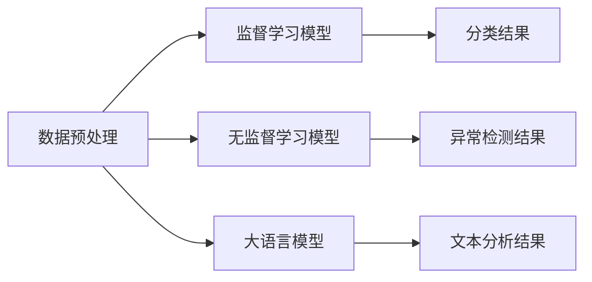
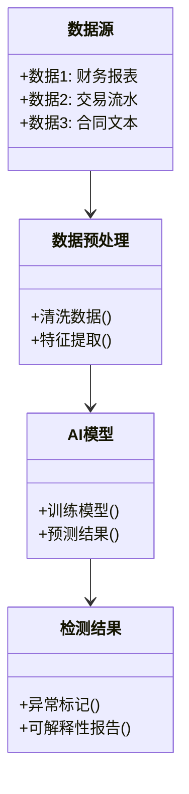
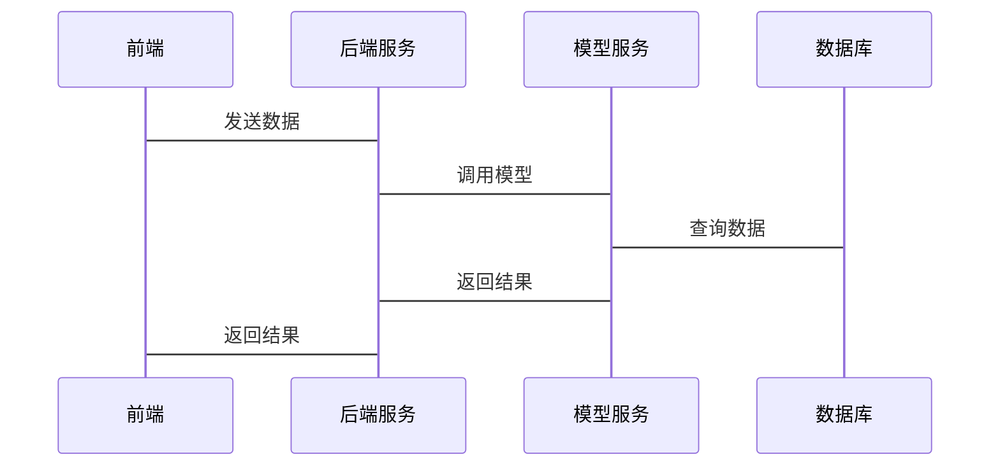

                 


# 智能财务舞弊检测系统

> 关键词：智能财务、舞弊检测、人工智能、大语言模型、财务数据分析、异常检测

> 摘要：本文详细探讨了智能财务舞弊检测系统的设计与实现，结合当前人工智能技术的发展，分析了财务舞弊检测的核心问题，提出了基于大语言模型的解决方案。通过系统架构设计、算法原理分析和实际案例研究，展示了如何利用AI技术提升财务舞弊检测的效率和准确性。文章内容涵盖系统背景、核心概念、算法原理、系统架构设计、项目实战和总结展望，为相关领域的研究和实践提供了有价值的参考。

---

# 第一部分: 智能财务舞弊检测系统的背景与核心概念

## 第1章: 智能财务舞弊检测系统的背景与问题背景

### 1.1 智能财务舞弊检测的背景

#### 1.1.1 财务舞弊的现状与挑战

在企业的日常运营中，财务舞弊行为屡见不鲜，包括虚报收入、虚增资产、隐瞒债务等。传统的财务舞弊检测方法主要依赖人工审查和简单的财务指标分析，存在效率低、覆盖面窄、容易受到人为干扰等问题。随着企业规模的不断扩大和财务数据的复杂化，传统的检测方法已难以应对日益复杂的舞弊手段。

#### 1.1.2 传统财务舞弊检测的局限性

传统的财务舞弊检测方法主要依赖以下几种手段：
1. **人工审查**：需要大量专业人员逐项检查财务数据，效率低下且成本高昂。
2. **财务指标分析**：通过分析财务比率（如ROE、ROA等）来发现异常，但这种方法仅能发现部分明显的舞弊行为，难以应对复杂的舞弊手段。
3. **审计方法**：依赖审计师的经验和判断，容易受到主观因素的影响，且审计范围有限，难以覆盖所有可能的舞弊行为。

#### 1.1.3 AI技术在财务舞弊检测中的应用前景

人工智能技术的快速发展为财务舞弊检测提供了新的可能性。通过机器学习、自然语言处理（NLP）和大语言模型等技术，可以实现对海量财务数据的自动分析和异常检测。AI技术能够从大量的历史数据中提取特征，识别潜在的舞弊模式，并通过实时监控发现新的舞弊行为。

### 1.2 财务舞弊检测的核心问题

#### 1.2.1 财务舞弊的定义与分类

财务舞弊是指企业通过虚构、隐瞒、篡改财务数据或其他手段，误导财务报表使用者，从而达到某种不正当目的的行为。根据舞弊行为的不同，可以将其分为以下几类：
1. **收入舞弊**：如虚增收入、隐瞒收入等。
2. **资产舞弊**：如虚增资产、隐瞒资产损失等。
3. **负债舞弊**：如虚减负债、隐瞒债务等。
4. **费用舞弊**：如虚增费用、隐瞒费用节约等。

#### 1.2.2 财务舞弊检测的关键问题

在实际应用中，财务舞弊检测面临以下关键问题：
1. **数据质量问题**：财务数据可能存在缺失、重复或错误，影响检测的准确性。
2. **模型选择与优化**：不同的舞弊行为可能需要不同的检测模型，如何选择合适的模型并进行优化是一个重要挑战。
3. **可解释性与透明性**：AI模型的决策过程需要足够透明，以便审计人员能够理解并信任检测结果。

#### 1.2.3 智能财务舞弊检测系统的核心概念

智能财务舞弊检测系统的核心概念包括：
1. **数据驱动**：基于海量财务数据，利用AI技术进行分析和预测。
2. **异常检测**：通过识别数据中的异常模式，发现潜在的舞弊行为。
3. **可解释性**：模型需要提供可解释的检测结果，以便审计人员能够理解和验证。

### 1.3 智能财务舞弊检测系统的核心要素

#### 1.3.1 数据来源与特征分析

系统需要整合多种数据来源，包括财务报表数据、交易流水数据、合同文本数据等。通过对这些数据进行清洗、特征提取和转换，生成适合模型输入的特征向量。

#### 1.3.2 AI模型的选择与训练

选择合适的AI模型是系统设计的关键。常见的模型包括：
1. **监督学习模型**：如支持向量机（SVM）、随机森林（Random Forest）和神经网络。
2. **无监督学习模型**：如聚类分析（K-Means）和异常检测（Isolation Forest）。
3. **大语言模型**：如GPT系列模型，用于处理文本数据和发现潜在的舞弊模式。

#### 1.3.3 系统的可解释性与实时性

系统需要具备可解释性，以便审计人员能够理解模型的决策过程。同时，系统需要支持实时监控，能够在财务数据生成后立即进行分析，及时发现潜在的舞弊行为。

### 1.4 本章小结

本章详细介绍了智能财务舞弊检测系统的背景、核心问题和关键概念。通过分析传统方法的局限性和AI技术的优势，提出了基于数据驱动的智能检测系统的设计思路。

---

## 第2章: 智能财务舞弊检测系统的概念与核心原理

### 2.1 系统的核心概念

#### 2.1.1 数据驱动的舞弊检测

数据驱动的舞弊检测是指通过分析海量财务数据，识别异常模式和趋势，发现潜在的舞弊行为。这种方法依赖于高质量的数据和先进的数据分析技术。

#### 2.1.2 基于AI的异常检测

基于AI的异常检测是一种通过机器学习算法识别数据中异常值的方法。常见的算法包括聚类分析、孤立林（Isolation Forest）和基于深度学习的异常检测模型。

#### 2.1.3 财务知识图谱的构建与应用

财务知识图谱是一种将财务知识以图结构形式表示的方法，能够帮助模型更好地理解和分析财务数据。知识图谱的构建可以基于财务报表、行业标准和法律法规等信息。

### 2.2 核心概念的联系与对比

#### 2.2.1 数据特征与模型选择的对比分析

以下是一个对比分析表格：

| 数据特征       | 监督学习模型       | 无监督学习模型       |
|----------------|--------------------|---------------------|
| 数据标注       | 需要               | 不需要              |
| 数据量         | 较大               | 较小                |
| 模型解释性     | 较高               | 较低                |

#### 2.2.2 不同AI模型在财务舞弊检测中的表现

以下是一个Mermaid流程图，展示了不同模型在舞弊检测中的应用：



#### 2.2.3 系统架构的可扩展性与可维护性

系统架构需要具备良好的可扩展性和可维护性，以便在未来业务需求变化时能够方便地进行调整和优化。

### 2.3 系统的核心原理

#### 2.3.1 数据预处理与特征提取

数据预处理是将原始数据转化为适合模型输入的形式，包括数据清洗、特征提取和数据转换等步骤。

#### 2.3.2 模型训练与优化

模型训练需要选择合适的算法，调整超参数，并进行交叉验证以优化模型性能。

#### 2.3.3 结果解释与反馈机制

模型的输出结果需要能够被审计人员理解和解释，并提供反馈机制以便进一步优化模型。

### 2.4 本章小结

本章详细介绍了智能财务舞弊检测系统的核心概念和原理，包括数据驱动、异常检测和知识图谱等关键要素，并通过对比分析和流程图展示了不同模型的应用场景。

---

# 第二部分: 智能财务舞弊检测系统的算法原理

## 第3章: 智能财务舞弊检测系统的算法原理

### 3.1 基于Transformer的模型原理

#### 3.1.1 Transformer模型的结构与特点

Transformer模型由编码器和解码器两个部分组成，每个部分都包含多个层。编码器用于将输入序列编码为一个固定长度的向量，解码器则根据编码器的输出生成目标序列。

#### 3.1.2 在财务舞弊检测中的应用

在财务舞弊检测中，可以利用Transformer模型对财务文本进行分析，识别潜在的异常模式。

#### 3.1.3 模型训练的数学公式与流程图

以下是一个Transformer模型的数学公式示例：

$$
\text{Attention}(Q, K, V) = \text{softmax}\left(\frac{QK^T}{\sqrt{d_k}}\right)V
$$

其中，\(Q\) 是查询向量，\(K\) 是键向量，\(V\) 是值向量，\(d_k\) 是键向量的维度。

以下是一个模型训练的Mermaid流程图：


### 3.2 聚类分析与异常检测算法

#### 3.2.1 K-Means算法的原理与应用

K-Means算法是一种常见的聚类算法，通过将数据划分为K个簇来发现数据中的潜在结构。

#### 3.2.2 Isolation Forest算法

Isolation Forest是一种基于树结构的异常检测算法，通过构建随机树来隔离异常点。

#### 3.2.3 聚类分析与异常检测的对比

以下是一个对比分析表格：

| 算法名称       | 是否需要标注数据 | 优点                     | 缺点                     |
|----------------|------------------|--------------------------|--------------------------|
| K-Means       | 不需要            | 实现简单，计算速度快     | 对异常点敏感             |
| Isolation Forest | 不需要            | 对异常点敏感             | 实现复杂                 |

### 3.3 本章小结

本章详细介绍了几种常见的AI算法在财务舞弊检测中的应用，包括基于Transformer的模型和聚类分析算法，并通过数学公式和流程图展示了算法的工作原理。

---

## 第4章: 智能财务舞弊检测系统的系统分析与架构设计

### 4.1 系统分析

#### 4.1.1 问题场景介绍

在实际应用中，财务舞弊检测系统需要能够处理大量的财务数据，包括交易流水、财务报表和合同文本等。

#### 4.1.2 项目介绍

本项目旨在开发一个基于AI的财务舞弊检测系统，利用大语言模型和机器学习算法对财务数据进行分析，发现潜在的舞弊行为。

### 4.2 系统功能设计

#### 4.2.1 领域模型Mermaid类图

以下是一个领域模型的Mermaid类图：



#### 4.2.2 系统架构设计

以下是一个系统架构的Mermaid架构图：


#### 4.2.3 系统接口设计

系统需要提供以下接口：
1. 数据接口：用于接收财务数据。
2. 模型接口：用于训练和预测。
3. 结果接口：用于返回检测结果。

#### 4.2.4 系统交互Mermaid序列图

以下是一个系统交互的Mermaid序列图：



### 4.3 本章小结

本章详细介绍了智能财务舞弊检测系统的系统分析与架构设计，包括领域模型、系统架构和系统交互等方面的内容。

---

## 第5章: 智能财务舞弊检测系统的项目实战

### 5.1 环境安装

#### 5.1.1 安装Python

安装Python 3.x版本，确保环境满足项目需求。

#### 5.1.2 安装依赖库

安装以下依赖库：

```bash
pip install numpy pandas scikit-learn transformers
```

### 5.2 核心代码实现

#### 5.2.1 数据预处理代码

```python
import pandas as pd
import numpy as np

def data_preprocessing(data):
    # 清洗数据
    data.dropna(inplace=True)
    # 特征提取
    features = data.select_dtypes(include=['int64', 'float64'])
    return features
```

#### 5.2.2 AI模型实现

```python
from sklearn.ensemble import IsolationForest

def train_model(features, n_estimators=100):
    model = IsolationForest(n_estimators=n_estimators, random_state=42)
    model.fit(features)
    return model
```

#### 5.2.3 检测结果分析

```python
import matplotlib.pyplot as plt

def analyze_results(model, features):
    y_pred = model.predict(features)
    plt.scatter(features['收入'], features['支出'], c=y_pred, cmap='viridis')
    plt.xlabel('收入')
    plt.ylabel('支出')
    plt.show()
```

### 5.3 实际案例分析

#### 5.3.1 案例背景

假设某公司存在虚增收入的舞弊行为，我们需要通过系统发现这一异常。

#### 5.3.2 检测过程

1. 数据预处理：清洗数据并提取特征。
2. 模型训练：使用Isolation Forest算法训练模型。
3. 模型预测：对测试数据进行预测，发现异常点。
4. 结果分析：通过可视化工具分析预测结果，识别异常交易。

#### 5.3.3 案例结果

通过分析结果，发现某笔交易的收入和支出存在明显异常，可能是虚增收入的行为。

### 5.4 系统优化

#### 5.4.1 模型优化

通过调整模型参数（如n_estimators）和使用交叉验证方法，优化模型性能。

#### 5.4.2 系统性能优化

通过优化数据预处理流程和使用分布式计算框架（如Spark），提高系统的处理效率。

### 5.5 本章小结

本章通过实际案例展示了智能财务舞弊检测系统的实现过程，包括环境安装、代码实现和案例分析等内容。

---

## 第6章: 总结与展望

### 6.1 总结

智能财务舞弊检测系统通过结合AI技术和财务数据分析，能够有效地发现潜在的舞弊行为。本文详细介绍了系统的背景、核心概念、算法原理和系统架构设计，并通过实际案例展示了系统的实现过程。

### 6.2 展望

未来，随着AI技术的不断发展，智能财务舞弊检测系统将更加智能化和自动化。可以通过引入更先进的算法（如大语言模型）和优化系统架构，进一步提高检测的准确性和效率。

---

# 附录

## 附录A: 常用AI算法对比表

以下是一个常用AI算法的对比表格：

| 算法名称       | 主要特点               | 适用场景               |
|----------------|-----------------------|-----------------------|
| 监督学习       | 数据需要标注           | 分类、回归问题         |
| 无监督学习     | 数据不需要标注         | 聚类、异常检测         |
| 半监督学习     | 数据部分标注           | 分类、聚类             |
| 强化学习       | 基于奖励机制           | 自动化交易、游戏AI     |

## 附录B: Mermaid图示例

### 1. 领域模型类图


### 2. 系统架构图


## 附录C: 参考文献

1. LeCun, Y., Bengio, Y., & Hinton, G. (2015). Deep learning. Nature, 521(7552), 436-444.
2. Goodfellow, I., Bengio, Y., & Courville, A. (2016). Deep learning. MIT Press.
3. He, K., et al. (2015). Delving deep into residual learning: An empirical study. In Proceedings of the IEEE conference on computer vision and pattern recognition (CVPR) (pp. 730-738).

---

# END

