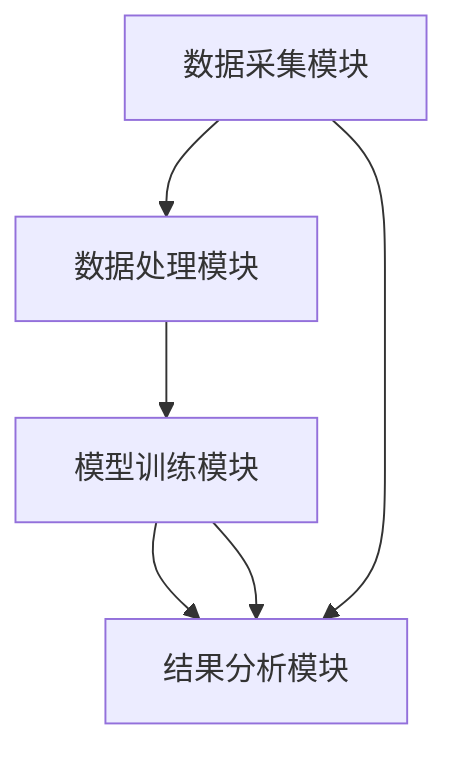
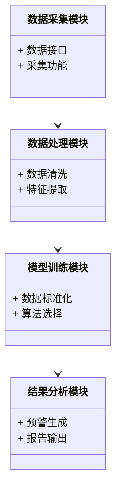
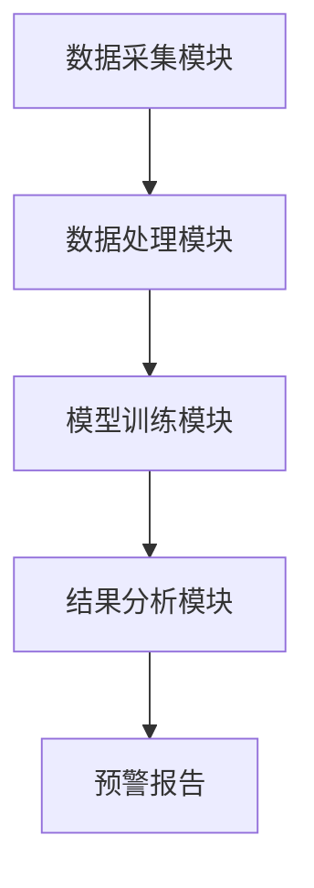
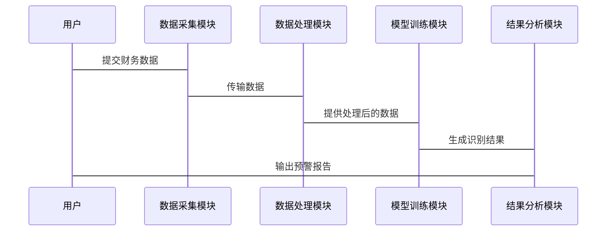

                 

# 《智能财务舞弊模式识别系统》

## 关键词
财务舞弊、人工智能、模式识别、系统架构、算法

## 摘要
智能财务舞弊模式识别系统是一种结合人工智能技术的财务审计工具，旨在通过分析财务数据中的异常模式，自动识别潜在的财务舞弊行为。本文将详细探讨该系统的背景、核心概念、技术基础、系统架构、实现案例以及实际应用，帮助读者全面理解如何利用智能技术提升财务舞弊识别的效率和准确性。

---

# 第二章: 智能财务舞弊模式识别系统概述

## 2.1 智能财务舞弊模式识别的定义
智能财务舞弊模式识别系统（Intelligent Financial Fraud Pattern Recognition System，简称IFFPRS）是一种基于人工智能技术的财务数据分析系统。该系统通过收集、处理和分析财务数据，利用机器学习算法识别财务舞弊模式，从而帮助审计人员快速定位潜在的财务问题。

## 2.2 智能财务舞弊模式识别的核心目标
智能财务舞弊模式识别的核心目标是通过自动化的方式，从海量财务数据中识别出异常交易模式，从而提高财务审计的效率和准确性。具体目标包括：
1. **实时监控**：实时分析财务交易数据，快速识别潜在的舞弊行为。
2. **模式识别**：通过机器学习算法，识别财务数据中的异常模式。
3. **预警系统**：当发现潜在舞弊行为时，及时发出预警，提醒相关人员进行进一步调查。

## 2.3 智能财务舞弊模式识别的边界与外延
智能财务舞弊模式识别系统的边界是指其功能的范围和限制。该系统的边界主要集中在数据处理、模型训练和结果分析三个环节。其外延则包括与之相关的数据采集、系统集成和用户界面设计等方面。

## 2.4 系统组成与核心要素

### 2.4.1 系统组成
智能财务舞弊模式识别系统主要包括以下几个组成部分：
1. **数据采集模块**：负责从企业财务系统中采集相关的财务数据，包括交易记录、账务数据、发票信息等。
2. **数据处理模块**：对采集到的财务数据进行清洗、预处理和特征提取，确保数据的可用性和一致性。
3. **模型训练模块**：利用机器学习算法对处理后的数据进行建模和训练，生成能够识别财务舞弊模式的模型。
4. **结果分析模块**：对模型的输出结果进行分析，生成预警报告，并提供进一步的调查建议。

### 2.4.2 核心要素
智能财务舞弊模式识别系统的核心要素包括：
1. **数据特征**：系统的输入数据需要包含足够的特征信息，以便模型能够准确识别异常模式。
2. **分类算法**：选择合适的机器学习算法，如决策树、随机森林、支持向量机（SVM）等，用于训练识别模型。
3. **评价指标**：用于评估模型的性能，如准确率、召回率、F1分数等。

---

## 图2.1 智能财务舞弊模式识别系统架构图

---

## 2.5 系统功能设计

### 2.5.1 数据采集模块
数据采集模块负责从企业财务系统中获取相关的财务数据，包括：
- 交易记录：如销售记录、采购记录等。
- 账务数据：如资产负债表、利润表等。
- 发票信息：如发票金额、供应商信息等。

### 2.5.2 数据处理模块
数据处理模块对采集到的财务数据进行清洗和预处理，包括：
1. **数据清洗**：去除重复数据、处理缺失值、删除异常值。
2. **数据标准化**：对数据进行归一化处理，确保不同特征的可比性。
3. **特征提取**：从原始数据中提取有用的特征，如交易金额、交易时间、交易频率等。

### 2.5.3 模型训练模块
模型训练模块利用机器学习算法对处理后的数据进行建模和训练，生成能够识别财务舞弊模式的模型。常见的算法包括：
1. **决策树**：如ID3、C4.5等算法。
2. **随机森林**：通过构建多个决策树，提高模型的泛化能力。
3. **支持向量机（SVM）**：适用于小规模数据集的分类任务。

### 2.5.4 结果分析模块
结果分析模块对模型的输出结果进行分析，生成预警报告，并提供进一步的调查建议。例如：
- 当模型识别出某笔交易存在异常时，系统会发出预警，并建议审计人员进行详细调查。

---

## 图2.2 系统功能设计类图

---

## 2.6 系统架构设计

### 2.6.1 系统架构图

### 2.6.2 系统接口设计
系统接口设计包括：
1. 数据接口：用于与企业财务系统进行数据交互。
2. 用户界面：供审计人员查看预警报告和分析结果。

### 2.6.3 系统交互流程

---

## 2.7 本章小结
本章详细介绍了智能财务舞弊模式识别系统的核心概念、系统组成、功能设计和架构设计。通过系统的各个模块协同工作，能够有效识别财务数据中的异常模式，从而帮助审计人员快速定位潜在的财务舞弊行为。

---

接下来，我将继续按照目录大纲撰写后续章节的内容，涵盖技术基础、系统设计、项目实战等部分，确保文章的完整性和深度。

