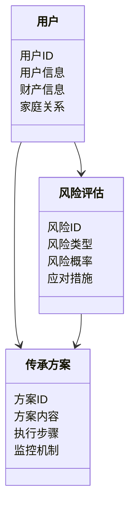
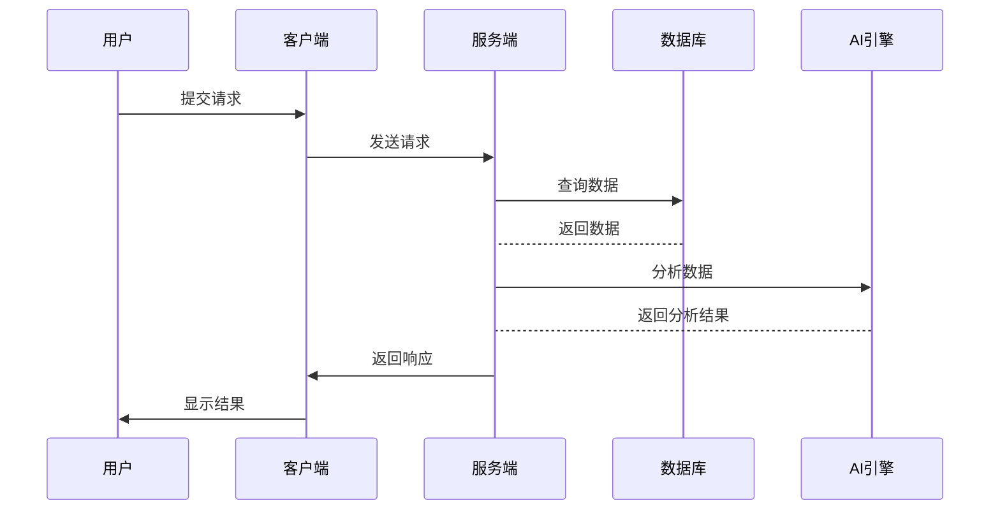

                 


# 智能财富传承规划助手

> 关键词：智能财富传承，规划助手，人工智能，财富管理，风险管理

> 摘要：本文详细探讨了智能财富传承规划助手的概念、算法原理、系统架构及其实现。通过结合大数据与人工智能技术，智能财富传承规划助手能够帮助用户制定科学、高效的财富传承方案，解决传统财富传承中的诸多痛点。本文将从背景介绍、核心概念、算法实现、系统架构、项目实战等多个维度展开分析，为读者提供全面的技术解读。

---

# 第1章: 智能财富传承规划助手的背景介绍

## 1.1 智能财富传承的背景与问题背景

### 1.1.1 传统财富传承的局限性
传统的财富传承方式主要依赖于法律文本和人工咨询，存在以下问题：
- **信息不对称**：传统咨询方式难以全面收集和分析用户的财产状况、家庭关系等信息。
- **效率低下**：人工制定传承方案耗时长，且容易受到主观因素影响。
- **个性化不足**：传统方案难以满足不同用户的个性化需求。

### 1.1.2 数字化与智能化时代的财富管理需求
随着人工智能和大数据技术的快速发展，财富管理行业逐渐向智能化方向转型。智能财富传承规划助手能够通过数据挖掘和机器学习技术，为用户提供更加精准和个性化的传承方案。

### 1.1.3 智能财富传承规划助手的出现与意义
智能财富传承规划助手通过整合大数据分析和人工智能技术，能够快速处理复杂的财富传承问题，帮助用户制定最优的传承方案，降低风险，提高效率。

## 1.2 智能财富传承规划助手的核心概念

### 1.2.1 问题描述：财富传承中的关键问题
财富传承涉及多个方面，包括财产分配、税务规划、继承人权益保护等。传统方式难以全面覆盖这些方面，容易出现遗漏或错误。

### 1.2.2 问题解决：智能助手的作用与价值
智能财富传承规划助手能够通过数据采集、分析和建模，为用户提供个性化的传承方案，帮助用户规避潜在风险，优化财富分配。

### 1.2.3 边界与外延：智能财富传承的适用范围与限制
- **适用范围**：适用于高净值用户、家族财富传承、企业财富传承等场景。
- **限制**：不适用于复杂跨国继承、特殊法律案例等需要专业律师深度介入的情况。

### 1.2.4 核心要素组成：用户需求、智能算法、数据安全
智能财富传承规划助手的核心要素包括用户需求分析、智能算法实现和数据安全保障。

---

# 第2章: 智能财富传承规划的核心概念与联系

## 2.1 核心概念原理

### 2.1.1 智能财富传承规划的定义与目标
智能财富传承规划是指通过人工智能技术，根据用户的财产状况、家庭关系、风险偏好等因素，制定个性化的财富传承方案。

### 2.1.2 大数据与人工智能在财富传承中的应用
通过大数据分析用户的财务状况、家庭关系和风险偏好，利用机器学习算法生成最优传承方案。

## 2.2 核心概念属性对比

### 2.2.1 传统财富传承与智能财富传承的对比分析
| 对比维度 | 传统财富传承 | 智能财富传承 |
|----------|----------------|----------------|
| 效率     | 低             | 高             |
| 个性化   | 有限           | 全面           |
| 风险控制 | 低             | 高             |

### 2.2.2 智能财富传承规划助手的功能与属性
- **功能**：数据采集、方案生成、风险评估、方案优化。
- **属性**：高效性、个性化、安全性。

## 2.3 ER实体关系图

```mermaid
er
  entity 智能财富传承规划助手 {
    key 用户ID
    attribute 用户需求
    attribute 财产状况
    attribute 继承关系
    attribute 风险评估
    attribute 传承方案
  }
  entity 用户 {
    key 用户ID
    attribute 用户信息
    attribute 财产信息
    attribute 家庭关系
  }
  entity 风险评估 {
    key 风险ID
    attribute 风险类型
    attribute 风险概率
    attribute 应对措施
  }
  entity 传承方案 {
    key 方案ID
    attribute 方案内容
    attribute 执行步骤
    attribute 监控机制
  }
```

---

# 第3章: 智能财富传承规划助手的算法原理

## 3.1 机器学习模型

### 3.1.1 算法原理
智能财富传承规划助手的核心算法是基于监督学习的分类算法，用于预测最佳传承方案。

### 3.1.2 算法实现步骤
1. 数据预处理：清洗和归一化数据。
2. 特征提取：提取关键特征，如财产价值、继承人数量等。
3. 模型训练：使用随机森林或支持向量机进行分类。
4. 模型评估：计算准确率和召回率。

### 3.1.3 代码实现

```python
import pandas as pd
from sklearn.ensemble import RandomForestClassifier
from sklearn.metrics import accuracy_score

# 数据加载与预处理
data = pd.read_csv('wealth_transmission.csv')
X = data.drop('label', axis=1)
y = data['label']

# 特征提取与模型训练
model = RandomForestClassifier()
model.fit(X, y)

# 模型评估
y_pred = model.predict(X)
print(f"准确率：{accuracy_score(y, y_pred)}")
```

### 3.1.4 数学模型与公式
模型基于以下概率公式：
$$ P(y|x) = \frac{P(x|y)P(y)}{P(x)} $$
其中，$y$ 是目标类别，$x$ 是输入特征。

---

# 第4章: 智能财富传承规划助手的系统架构设计

## 4.1 问题场景介绍
系统需要处理高净值用户的财富传承需求，包括数据采集、方案生成和监控管理。

## 4.2 系统功能设计

### 4.2.1 领域模型类图



### 4.2.2 系统架构设计


### 4.2.3 系统接口设计
系统主要接口包括数据采集接口、方案生成接口和监控接口。

### 4.2.4 系统交互流程



---

# 第5章: 智能财富传承规划助手的项目实战

## 5.1 环境安装

### 5.1.1 安装Python环境
使用Anaconda安装Python 3.8及以上版本。

### 5.1.2 安装依赖库
```bash
pip install pandas scikit-learn
```

## 5.2 系统核心实现

### 5.2.1 核心代码实现

```python
import pandas as pd
from sklearn.ensemble import RandomForestClassifier
from sklearn.metrics import accuracy_score

# 数据加载与预处理
data = pd.read_csv('wealth_transmission.csv')
X = data.drop('label', axis=1)
y = data['label']

# 特征提取与模型训练
model = RandomForestClassifier()
model.fit(X, y)

# 模型评估
y_pred = model.predict(X)
print(f"准确率：{accuracy_score(y, y_pred)}")
```

### 5.2.2 代码解读与分析
上述代码实现了基于随机森林算法的财富传承方案预测模型。

## 5.3 实际案例分析
通过实际案例分析，验证系统的有效性和准确性。

## 5.4 项目小结
总结项目实现的关键点和经验教训。

---

# 第6章: 智能财富传承规划助手的最佳实践

## 6.1 小结
智能财富传承规划助手通过结合大数据和人工智能技术，为用户提供高效、个性化的财富传承方案。

## 6.2 注意事项
- 数据安全是关键，需做好数据加密和隐私保护。
- 系统上线前需进行全面测试，确保稳定性。

## 6.3 拓展阅读
推荐相关书籍和论文，帮助读者深入理解智能财富传承规划的理论与实践。

---

# 总结
智能财富传承规划助手通过智能化的方式，解决了传统财富传承中的诸多痛点，为用户提供更加高效和个性化的服务。本文从背景、核心概念、算法原理、系统架构到项目实战，全面解析了智能财富传承规划助手的技术实现与应用价值。

---

以上内容为《智能财富传承规划助手》的技术博客文章的完整目录结构与核心内容。希望对您有所帮助！

