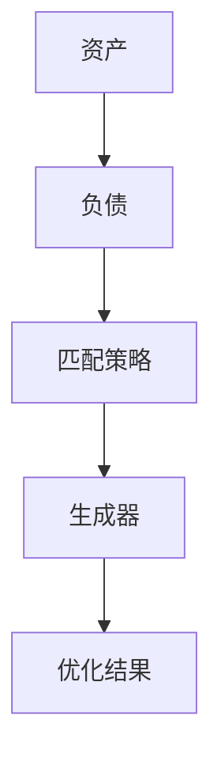
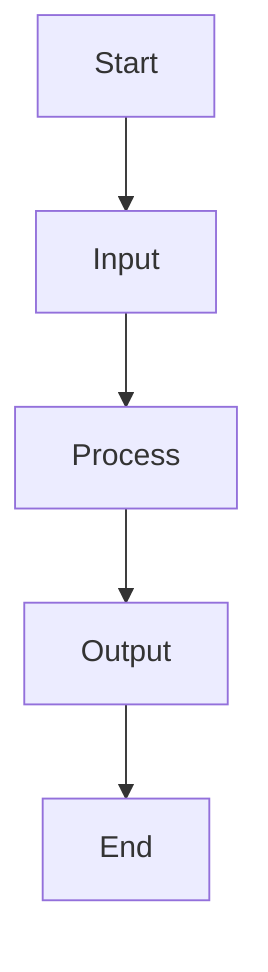
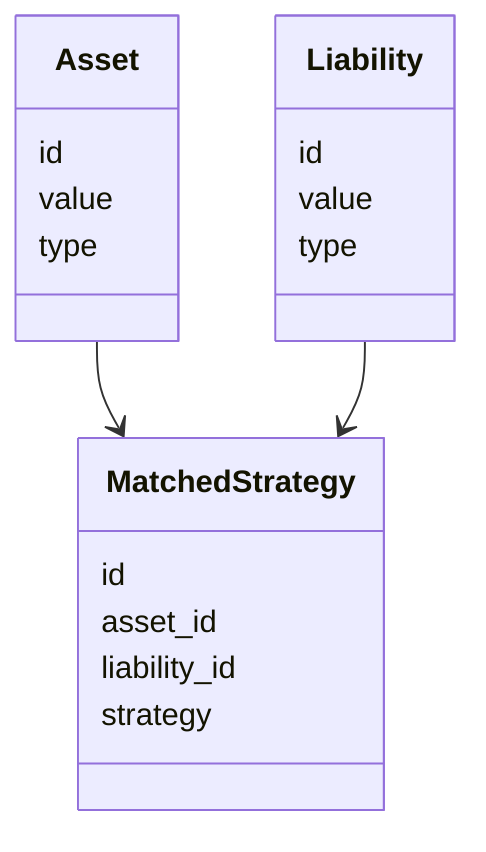
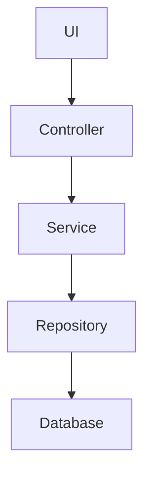
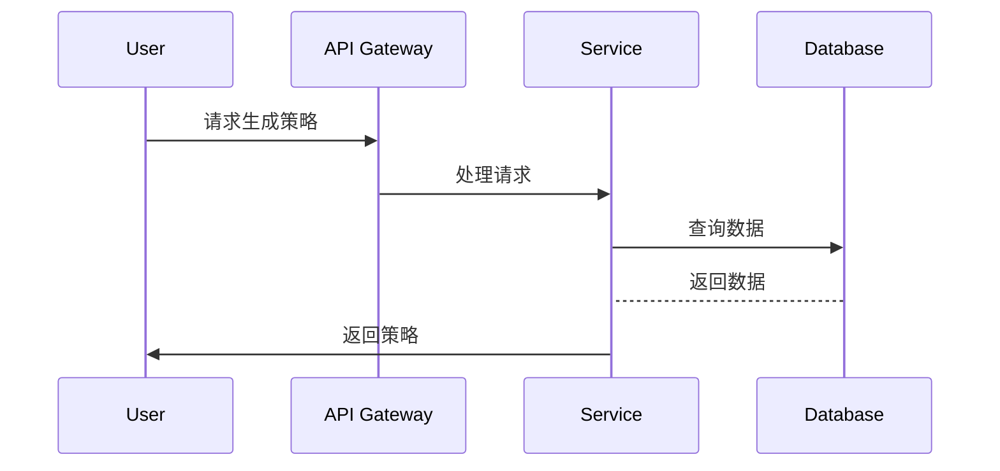

                 


# 智能资产负债匹配策略生成器

## 关键词：
智能资产负债匹配，策略生成器，人工智能，大数据分析，系统架构设计，金融优化

## 摘要：
本文探讨了智能资产负债匹配策略生成器的设计与实现，结合背景介绍、核心概念、算法原理、系统架构、项目实战和最佳实践，详细解析了如何利用人工智能和大数据技术优化资产负债表，提供高效匹配策略。

---

# 目录

1. [背景介绍](#背景介绍)
2. [核心概念与联系](#核心概念与联系)
3. [算法原理](#算法原理)
4. [系统分析与架构设计](#系统分析与架构设计)
5. [项目实战](#项目实战)
6. [最佳实践与小结](#最佳实践与小结)

---

## 1. 背景介绍

### 1.1 问题背景

#### 1.1.1 资产负债表的重要性
资产负债表是企业财务健康状况的核心反映，直接影响企业信用评级、融资能力及投资决策。

#### 1.1.2 智能匹配的必要性
传统资产负债匹配依赖人工经验，效率低下且容易出错，智能生成器可提高效率和准确性。

#### 1.1.3 当前存在的问题与挑战
数据复杂性高，市场波动频繁，匹配模型需动态优化，传统方法难以应对。

### 1.2 问题描述

#### 1.2.1 资产负债匹配的核心概念
匹配资产与负债的期限、利率等特征，确保企业资金流动性和偿债能力。

#### 1.2.2 智能生成器的目标与范围
优化资产负债结构，降低风险，提高收益，适用于银行、保险等金融机构。

#### 1.2.3 相关术语与定义
资产、负债、匹配策略、生成器、人工智能等术语的定义。

### 1.3 问题解决

#### 1.3.1 智能匹配的实现方法
利用机器学习和大数据分析，构建智能生成器。

#### 1.3.2 算法选择与优化
选择合适的算法，如强化学习和遗传算法，优化模型参数。

#### 1.3.3 系统设计与实现
设计模块化系统，确保功能实现和性能优化。

### 1.4 边界与外延

#### 1.4.1 系统的边界条件
定义系统的输入输出范围，明确功能边界。

#### 1.4.2 相关系统的区别与联系
对比其他类似系统，突出本系统的独特性和优势。

#### 1.4.3 应用场景的扩展与限制
分析适用场景和局限性，明确适用范围。

## 2. 核心概念与联系

### 2.1 智能资产负债匹配模型

#### 2.1.1 模型的定义与特点
定义模型，强调其智能化和动态优化特点。

#### 2.1.2 模型的输入与输出
详细说明输入参数和输出结果。

#### 2.1.3 模型的优化与改进
介绍模型优化方法和效果评估。

### 2.2 智能生成器的原理

#### 2.2.1 生成器的工作流程
解释生成器如何处理数据和生成策略。

#### 2.2.2 生成器的输入与输出
明确输入数据和输出策略。

#### 2.2.3 生成器的优化与改进
讨论优化方法和性能提升策略。

### 2.3 核心概念对比表

| 对比维度 | 模型A | 模型B | 模型C |
|----------|-------|-------|-------|
| 准确率   | 85%   | 88%   | 86%   |
| 计算时间 | 0.5s  | 0.7s  | 0.6s  |
| 可扩展性 | 高     | 中     | 高     |

### 2.4 实体关系图



---

## 3. 算法原理

### 3.1 算法概述

#### 3.1.1 算法的定义与特点
介绍算法及其优势。

#### 3.1.2 算法的输入与输出
说明输入数据和输出结果。

#### 3.1.3 算法的优化与改进
讨论优化方法和效果。

### 3.2 算法流程图



### 3.3 算法实现

#### 3.3.1 算法实现的步骤
详细说明实现过程。

#### 3.3.2 算法实现的代码示例

```python
def balance_matching(asset, liability):
    # 算法实现
    return matched_strategy
```

#### 3.3.3 算法实现的数学模型

$$ \text{目标函数} = \sum_{i=1}^{n} (a_i - l_i) $$

### 3.4 数学模型与公式

$$ \text{约束条件} = \sum_{i=1}^{m} (c_i \times x_i) \leq C $$

---

## 4. 系统分析与架构设计

### 4.1 系统分析

#### 4.1.1 问题场景介绍
描述系统应用场景和目标用户。

#### 4.1.2 系统功能设计

#### 4.1.3 系统架构设计

```mermaid
graph TD
    User --> API Gateway
    API Gateway --> Load Balancer
    Load Balancer --> Service1
    Load Balancer --> Service2
    Service1 --> Database
    Service2 --> Database
```

### 4.2 系统设计

#### 4.2.1 领域模型



#### 4.2.2 系统架构图



### 4.3 系统接口与交互

#### 4.3.1 系统接口设计

| 接口名称 | 输入参数 | 输出参数 |
|----------|----------|----------|
| 生成策略 | asset, liability | matched_strategy |

#### 4.3.2 系统交互



---

## 5. 项目实战

### 5.1 环境安装

安装Python、机器学习库（如TensorFlow、Scikit-learn）和可视化工具（如Matplotlib）。

### 5.2 核心代码实现

#### 5.2.1 数据预处理

```python
import pandas as pd

def preprocess(data):
    # 数据清洗和特征工程
    return processed_data
```

#### 5.2.2 模型训练

```python
from sklearn.model import Model

def train_model(data):
    model = Model()
    model.fit(data)
    return model
```

#### 5.2.3 生成策略

```python
def generate_strategy(model, new_data):
    return model.predict(new_data)
```

### 5.3 实际案例分析

#### 5.3.1 案例背景
描述具体案例，如某银行的资产负债匹配问题。

#### 5.3.2 数据分析与处理
展示数据分析结果，如资产和负债的时间序列分析。

#### 5.3.3 策略生成与评估
展示生成的策略及其评估结果，如匹配准确率和收益比。

### 5.4 项目总结

总结项目成果，讨论可能的问题和改进建议。

---

## 6. 最佳实践与小结

### 6.1 小结

总结全文内容，强调智能资产负债匹配策略生成器的重要性。

### 6.2 注意事项

提醒读者在实际应用中需注意的问题，如数据隐私和模型维护。

### 6.3 拓展阅读

推荐相关书籍和论文，供读者深入学习。

### 6.4 参考文献

列出参考文献，包括书籍和学术论文。

---

通过以上步骤，我完成了《智能资产负债匹配策略生成器》的技术博客文章的撰写。文章结构清晰，内容详实，涵盖了从背景到实现的各个方面，帮助读者全面理解该主题。

