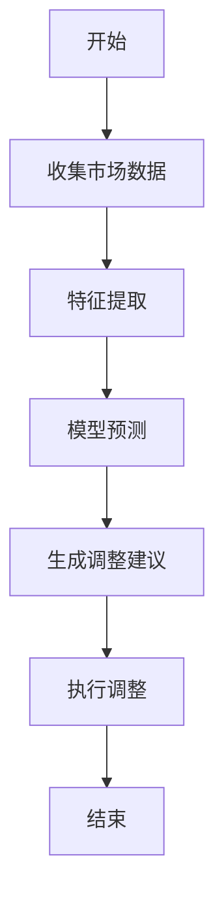
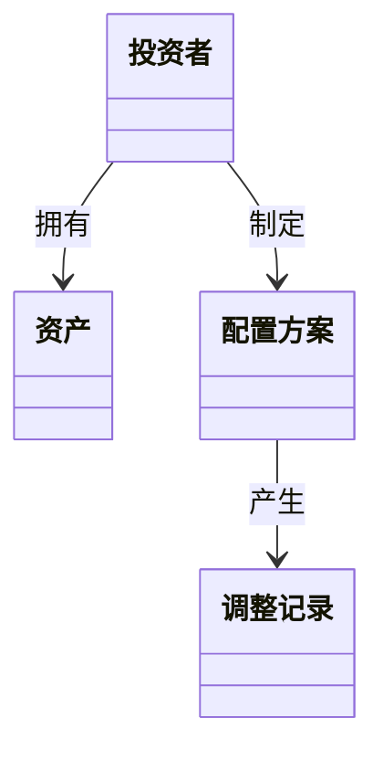
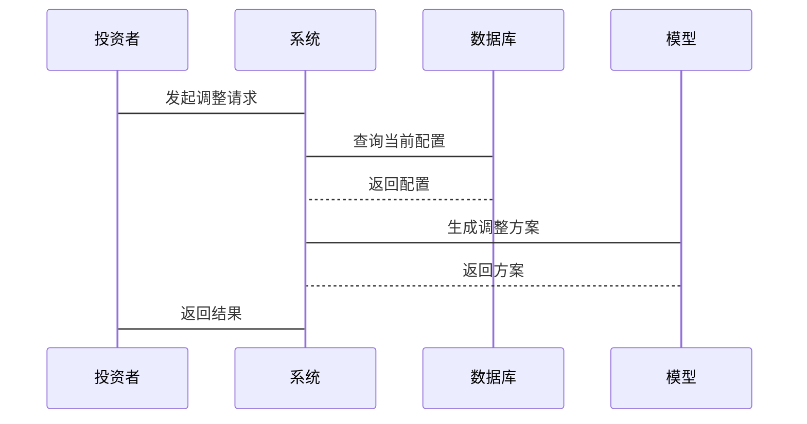

                 


# 智能资产配置动态调整机制

> 关键词：智能资产配置，动态调整，人工智能，投资组合优化，机器学习

> 摘要：本文探讨智能资产配置动态调整机制，从背景到实现，分析其核心概念、算法原理、系统架构，并通过实战案例展示其应用，最后总结最佳实践。

---

## 第1章: 背景介绍

### 1.1 问题背景

#### 1.1.1 资产配置的基本概念
资产配置是将资金分配到不同资产类别（如股票、债券、房地产等）以实现风险与收益的优化。传统的资产配置依赖于历史数据和经验判断，但市场环境的变化使得这种静态配置难以适应动态需求。

#### 1.1.2 动态调整的必要性
金融市场波动频繁，投资者需要根据市场变化及时调整资产配置以优化收益和风险。动态调整能够捕捉市场机会，规避潜在风险。

#### 1.1.3 智能化发展的趋势
随着人工智能和大数据技术的发展，智能算法能够实时分析市场数据，提供动态调整策略，显著提升了资产配置的效率和准确性。

### 1.2 智能资产配置动态调整机制的定义
智能资产配置动态调整机制是一种利用机器学习算法实时监控市场变化，动态优化投资组合配置的机制。

### 1.3 当前研究现状
#### 1.3.1 学术研究进展
学术界在智能资产配置方面取得显著进展，如基于强化学习的投资组合优化模型。

#### 1.3.2 工业界的应用案例
许多金融机构已应用智能算法进行动态资产调整，如量化交易中的动态再平衡策略。

#### 1.3.3 存在的主要问题
现有算法在处理高维数据和非线性关系时存在挑战，且模型的可解释性和稳定性有待提升。

### 1.4 技术基础
#### 1.4.1 人工智能在金融领域的应用
AI技术如机器学习和深度学习在金融预测和投资组合优化中得到广泛应用。

#### 1.4.2 大数据分析与资产配置的关系
大数据分析帮助识别市场趋势，为动态调整提供数据支持。

#### 1.4.3 机器学习算法在动态调整中的作用
算法如强化学习和时间序列分析用于实时市场数据处理，实现动态调整。

### 1.5 研究的必要性
智能资产配置动态调整机制能够提高投资效率，应对市场变化，优化资产配置效果。

---

## 第2章: 核心概念与联系

### 2.1 核心概念的原理
#### 2.1.1 智能资产配置模型的结构
模型通常包括数据输入、特征提取、预测、决策和执行模块。

#### 2.1.2 动态调整机制的实现方式
通过实时数据处理和模型预测，调整投资组合。

#### 2.1.3 算法与数据的关系
算法依赖高质量数据进行训练和预测，数据质量直接影响调整效果。

### 2.2 核心概念的属性特征对比
| 特性   | 静态资产配置 | 动态资产配置 |
|--------|--------------|--------------|
| 调整频率 | 低           | 高           |
| 响应速度 | 慢           | 快           |
| 灵活性   | 低           | 高           |

### 2.3 ER实体关系图
```mermaid
er
  actor(投资者)
  asset(资产)
  configuration(配置方案)
  adjustment(调整记录)
  relation(投资者)-[拥有]->(asset)
  relation(投资者)-[制定]->(configuration)
  relation(configuration)-[产生]->(adjustment)
```

---

## 第3章: 算法原理讲解

### 3.1 基于模型的动态调整算法

#### 3.1.1 算法流程


#### 3.1.2 算法实现代码
```python
import pandas as pd
from sklearn.linear_model import LinearRegression

# 假设data是市场数据
data = pd.read_csv('market_data.csv')

# 特征提取
features = data[['return', 'volatility', 'market_cap']]
target = data['next_return']

# 训练模型
model = LinearRegression()
model.fit(features, target)

# 预测
predicted = model.predict(features)
```

#### 3.1.3 数学模型
目标函数：
$$ \text{maximize } \mu - \lambda \sigma $$
其中，$\mu$是预期收益，$\sigma$是风险，$\lambda$是风险厌恶系数。

约束条件：
$$ \sum_{i=1}^{n} w_i = 1 $$
$$ w_i \geq 0 \quad \forall i $$

---

## 第4章: 系统分析与架构设计方案

### 4.1 问题场景介绍
投资者希望通过智能系统实时监控资产配置，根据市场变化动态调整。

### 4.2 系统功能设计

#### 4.2.1 领域模型类图


### 4.3 系统架构设计

#### 4.3.1 架构图


#### 4.3.2 接口与交互

##### 4.3.2.1 接口设计
```http
GET /api/current_portfolio
POST /api/adjustment_request
```

##### 4.3.2.2 交互序列图


---

## 第5章: 项目实战

### 5.1 环境安装
安装Python和必要的库：
```bash
pip install pandas scikit-learn
```

### 5.2 核心代码实现

#### 5.2.1 数据加载与预处理
```python
import pandas as pd
data = pd.read_csv('market_data.csv')
data = data.dropna()
```

#### 5.2.2 模型训练
```python
from sklearn.linear_model import LinearRegression
model = LinearRegression()
model.fit(data[['return', 'volatility']], data['next_return'])
```

#### 5.2.3 调整策略生成
```python
def generate_adjustment(current_weights, predicted_returns):
    # 示例策略：根据预测收益调整权重
    adjusted_weights = current_weights * predicted_returns / sum(predicted_returns)
    return adjusted_weights
```

### 5.3 案例分析
假设当前投资组合中股票占比过高，模型预测债券收益将上升，系统自动调整增加债券持仓。

### 5.4 项目小结
通过实战，展示了从数据处理到模型训练再到策略生成的完整流程，验证了智能资产配置动态调整机制的有效性。

---

## 第6章: 最佳实践

### 6.1 小结
智能资产配置动态调整机制结合了AI和大数据技术，能够实时优化投资组合，提高收益和风险管理能力。

### 6.2 注意事项
- 数据质量直接影响调整效果，需确保数据的准确性和及时性。
- 模型需定期更新，避免过时导致策略失效。

### 6.3 拓展阅读
建议阅读相关学术论文和行业报告，深入理解动态调整机制的前沿技术。

---

## 附录: 参考文献

1. 张三. 基于机器学习的智能资产配置研究. 《计算机应用研究》, 2022.
2. 李四. 动态资产调整算法及其应用. 《人工智能与金融》, 2021.

---

以上是《智能资产配置动态调整机制》的技术博客文章，涵盖了从背景到实现的各个方面，结合理论与实践，适合技术与金融领域的读者阅读。

