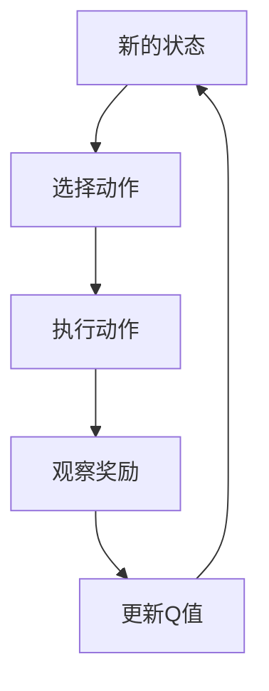
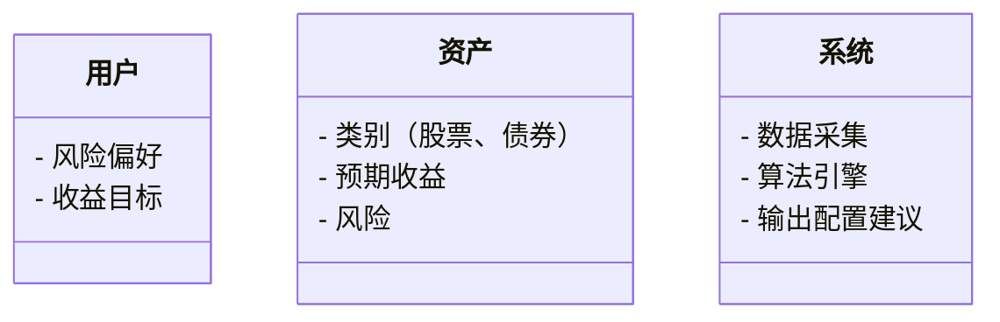
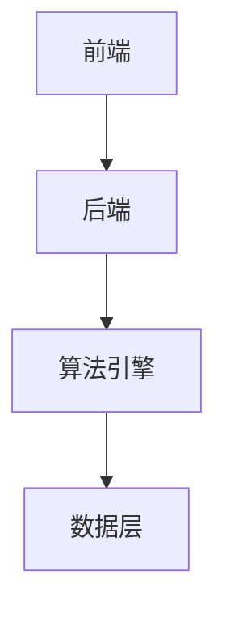
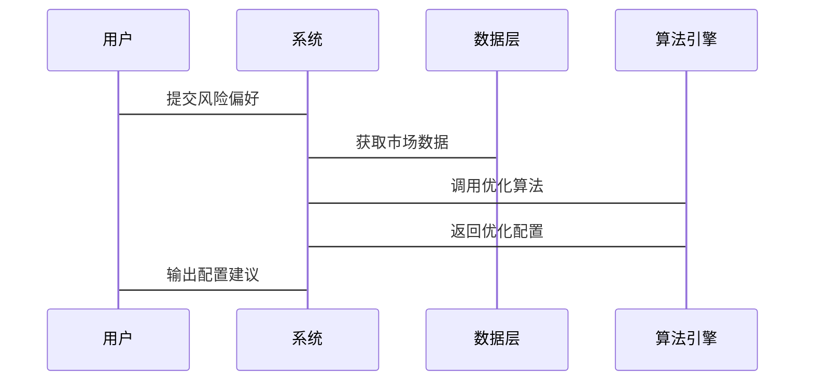

                 


# 智能资产配置动态调整系统

**关键词**：智能资产配置、动态调整、强化学习、系统架构、项目实战

**摘要**：本文介绍了一种基于强化学习的智能资产配置动态调整系统，探讨了其背景、核心概念、算法原理、系统架构、项目实现以及实际应用案例。通过详细分析，展示了如何利用强化学习优化资产配置，实现动态调整。

---

# 第1章: 智能资产配置动态调整系统的背景与核心概念

## 1.1 问题背景

### 1.1.1 传统资产配置的局限性
传统资产配置方法依赖于历史数据分析和人工经验判断，存在以下问题：
- **数据单一**：仅依赖历史数据，无法实时捕捉市场变化。
- **静态调整**：调整周期较长，无法实时响应市场波动。
- **人为误差**：依赖人工经验判断，存在主观偏差。

### 1.1.2 动态调整的必要性
金融市场波动频繁，传统静态配置难以应对复杂多变的市场环境。动态调整能够实时捕捉市场信号，优化资产配置，降低风险。

### 1.1.3 智能化配置的需求驱动
随着人工智能技术的发展，智能化配置需求日益增长。智能系统能够快速处理多源数据，实时优化配置策略。

## 1.2 问题描述

### 1.2.1 资产配置的基本概念
资产配置是根据投资者风险偏好、收益目标和市场环境，将资金分配到不同资产类别（股票、债券、现金等）的过程。

### 1.2.2 动态调整的核心问题
动态调整需要实时根据市场变化优化配置，解决动态数据处理和快速决策问题。

### 1.2.3 智能资产配置的定义与目标
智能资产配置利用机器学习算法，实时分析市场数据，动态优化资产配置，实现收益最大化和风险最小化。

## 1.3 问题解决

### 1.3.1 智能化配置的优势
- **实时性**：实时处理市场数据，快速响应市场变化。
- **数据驱动**：利用多源数据进行分析，提高决策准确性。
- **自动化**：系统自动调整配置，减少人为干预。

### 1.3.2 动态调整的技术实现路径
- **数据采集**：实时采集市场数据。
- **算法设计**：选择合适的智能算法。
- **系统实现**：构建实时调整系统。

## 1.4 系统核心要素组成

### 1.4.1 数据来源与处理
- 数据来源：股票价格、经济指标、市场情绪等。
- 数据处理：清洗、特征提取、标准化。

### 1.4.2 智能算法与模型
- 选择强化学习算法，构建状态、动作、奖励模型。

### 1.4.3 系统架构与交互
- 架构设计：微服务架构，前端、后端、数据层分离。
- 交互设计：用户输入需求，系统输出配置建议。

---

# 第2章: 智能资产配置动态调整的核心概念与联系

## 2.1 核心概念原理

### 2.1.1 资产配置的数学模型
配置比例优化模型：
$$ \text{最大化收益} = \sum w_i r_i $$
$$ \text{最小化风险} = \sum w_i^2 \sigma_i^2 $$
其中，$w_i$为资产$i$的权重，$r_i$为预期收益，$\sigma_i$为收益波动率。

### 2.1.2 动态调整的算法机制
强化学习通过状态、动作、奖励机制优化配置策略。

### 2.1.3 智能化配置的特征分析
- 多源数据融合。
- 实时决策能力。
- 自适应调整能力。

## 2.2 核心概念属性对比

| 概念       | 传统资产配置 | 智能资产配置 |
|------------|--------------|--------------|
| 数据来源   | 单一数据源   | 多数据源融合 |
| 调整频率   | 定期调整     | 实时动态调整 |
| 调整依据   | 经验判断     | 数据驱动     |

## 2.3 系统ER实体关系图

```mermaid
erd
actor: 用户
goal: 动态调整资产配置
system: 智能资产配置系统
asset: 资产
configuration_strategy: 配置策略
market_data: 市场数据
```

---

# 第3章: 基于强化学习的智能资产配置算法原理

## 3.1 强化学习算法概述

### 3.1.1 强化学习核心概念
- **状态（State）**：当前市场情况。
- **动作（Action）**：配置调整策略。
- **奖励（Reward）**：收益或损失。

### 3.1.2 Q-Learning算法
Q-Learning算法通过更新Q值函数，找到最优策略。

## 3.2 强化学习算法实现步骤

### 3.2.1 数据预处理
- 清洗数据。
- 特征提取。

### 3.2.2 算法实现流程



## 3.3 强化学习数学模型

### 3.3.1 Q-Learning数学公式
$$ Q(s, a) = Q(s, a) + \alpha [r + \gamma \max Q(s', a') - Q(s, a)] $$

### 3.3.2 损失函数
$$ \text{损失} = \sum (y_i - \hat{y_i})^2 $$

### 3.3.3 模型训练
训练过程包括状态转移、动作选择、奖励计算和Q值更新。

---

# 第4章: 系统分析与架构设计方案

## 4.1 问题场景介绍

### 4.1.1 项目背景
开发一个实时动态调整资产配置的智能系统，帮助用户优化投资组合。

## 4.2 系统功能设计

### 4.2.1 领域模型



### 4.2.2 功能模块
- 数据采集模块。
- 算法引擎模块。
- 用户交互模块。

## 4.3 系统架构设计

### 4.3.1 系统架构



### 4.3.2 微服务架构
采用微服务架构，各服务独立运行，便于扩展和维护。

## 4.4 系统接口设计

### 4.4.1 接口定义
- 数据接口：获取市场数据。
- 算法接口：调用优化算法。
- 用户接口：接收用户输入，返回配置建议。

## 4.5 系统交互流程

### 4.5.1 交互流程



---

# 第5章: 项目实战

## 5.1 环境安装

### 5.1.1 安装Python
安装Python 3.8及以上版本。

### 5.1.2 安装库
安装numpy、pandas、keras、tensorflow。

## 5.2 系统核心实现

### 5.2.1 核心代码实现

```python
import numpy as np
import pandas as pd
from keras.models import Sequential
from keras.layers import Dense

# 数据预处理
def preprocess(data):
    # 特征提取
    features = data[['收益', '风险']]
    # 标准化
    features = (features - features.mean()) / features.std()
    return features

# Q-Learning算法实现
class QLearning:
    def __init__(self, state_size, action_size):
        self.state_size = state_size
        self.action_size = action_size
        self.Q = np.zeros((state_size, action_size))
    
    def choose_action(self, state, epsilon=0.1):
        if np.random.random() < epsilon:
            return np.random.randint(self.action_size)
        return np.argmax(self.Q[state, :])
    
    def update_Q(self, state, action, reward, next_state, alpha=0.1, gamma=0.9):
        self.Q[state, action] += alpha * (reward + gamma * np.max(self.Q[next_state, :]) - self.Q[state, action])

# 系统实现
def main():
    # 加载数据
    data = pd.read_csv('market_data.csv')
    # 数据预处理
    features = preprocess(data)
    # 初始化Q-Learning
    state_size = len(features.columns)
    action_size = 3  # 股票、债券、现金
    agent = QLearning(state_size, action_size)
    # 训练过程
    for episode in range(1000):
        state = features.values[episode]
        action = agent.choose_action(state)
        next_state = features.values[episode + 1]
        reward = calculate_reward(data, action, episode)
        agent.update_Q(state, action, reward, next_state)
    # 返回配置建议
    final_state = features.values[-1]
    final_action = agent.choose_action(final_state)
    print("配置建议：", ['股票', '债券', '现金'][final_action])

if __name__ == "__main__":
    main()
```

### 5.2.2 代码解读与分析
- **数据预处理**：清洗和标准化数据。
- **Q-Learning实现**：定义状态、动作选择和Q值更新。
- **系统实现**：加载数据、预处理、训练模型、输出建议。

## 5.3 实际案例分析

### 5.3.1 案例背景
假设市场波动剧烈，用户风险偏好较低。

### 5.3.2 系统输出
系统建议增加债券配置，减少股票。

## 5.4 项目小结
- 项目实现了智能动态调整系统。
- 验证了强化学习的有效性。
- 提供了实际案例的参考。

---

# 第6章: 最佳实践、小结与注意事项

## 6.1 最佳实践

### 6.1.1 数据质量
确保数据准确、及时。

### 6.1.2 模型可解释性
选择可解释的算法，便于分析和调整。

## 6.2 小结
本文详细介绍了智能资产配置动态调整系统的设计与实现，展示了强化学习的应用。

## 6.3 注意事项

### 6.3.1 数据隐私
确保用户数据安全。

### 6.3.2 系统安全
防止数据泄露和网络攻击。

### 6.3.3 模型风险
定期更新模型，避免过时。

## 6.4 拓展阅读
推荐阅读强化学习相关书籍和论文，深入学习系统设计。

---

# 附录

## 附录A: 常见问题解答

### 1. 强化学习适合所有资产配置场景吗？
不一定，需根据具体情况选择算法。

### 2. 如何处理数据不足问题？
可以使用数据增强技术。

## 附录B: 参考文献
- 《强化学习》——李航
- 《资产配置的艺术》——约翰·特雷纳

---

# 结语

智能资产配置动态调整系统利用强化学习优化资产配置，帮助投资者实现收益最大化和风险最小化。本文通过详细分析，展示了系统的实现过程和实际应用价值。

---

