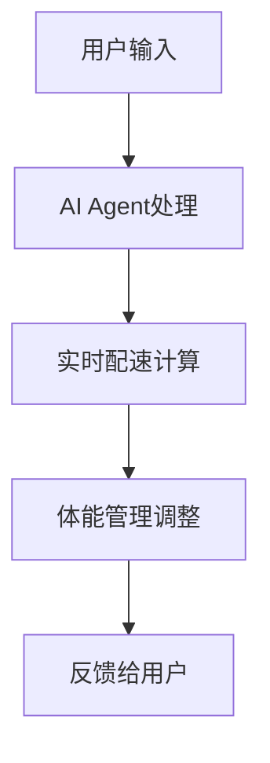
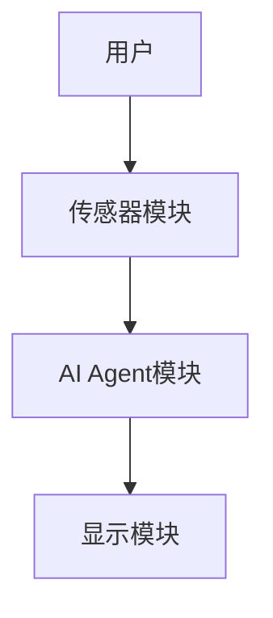

                 


# 智能跑步机：AI Agent的实时配速与体能管理

---

## 关键词

- AI Agent
- 实时配速
- 体能管理
- 跑步机
- 智能运动

---

## 摘要

本文深入探讨了AI Agent在智能跑步机中的应用，特别是其实时配速与体能管理的功能。文章从背景介绍、核心概念、算法原理、系统架构到项目实战，全面分析了AI Agent在智能跑步机中的技术实现与应用价值。通过详细的技术分析和实际案例，展示了AI技术如何优化跑步体验，为运动爱好者提供个性化、高效的运动方案。

---

## 第一部分：背景与核心概念

### 第1章：智能跑步机与AI Agent的背景介绍

#### 1.1 问题背景

传统跑步机虽然提供了基本的运动功能，但缺乏智能化和个性化。用户在使用过程中难以获得实时的运动反馈，且难以根据个人体能和目标进行动态调整。随着人工智能技术的快速发展，AI Agent（智能代理）逐渐被应用于运动设备中，为用户提供更加智能化的服务。

#### 1.2 问题描述

跑步是一项常见的运动方式，但如何实现个性化的跑步训练一直是用户和健身教练的痛点。传统跑步机只能提供固定的运动模式，无法根据用户的实时状态（如心率、步频、体能等）进行动态调整。此外，用户在跑步过程中难以获得实时的运动建议，容易导致运动损伤或训练效果不佳。

#### 1.3 问题解决与边界

AI Agent通过实时采集用户的运动数据（如心率、步频、速度等），结合用户的体能状况和运动目标，动态调整跑步机的配速，从而实现个性化的运动管理。AI Agent的核心价值在于通过智能化的实时调整，帮助用户在运动过程中保持最佳状态，避免过度疲劳或训练不足。

#### 1.4 概念结构与核心要素

智能跑步机的AI Agent系统由以下几个核心要素组成：
- **传感器模块**：实时采集用户的运动数据（如心率、步频、速度等）。
- **AI算法模块**：基于采集的数据，动态调整跑步机的配速。
- **用户反馈模块**：通过屏幕或语音等方式，实时反馈用户的运动状态和建议。

---

## 第二部分：核心概念与联系

### 第2章：AI Agent与实时配速

#### 2.1 核心概念原理

AI Agent是一种能够感知环境并执行任务的智能系统。在智能跑步机中，AI Agent通过实时采集用户的运动数据，结合预设的运动目标和用户体能状况，动态调整跑步机的配速。其实时配速功能通过以下步骤实现：
1. 采集用户的运动数据（如心率、步频、速度）。
2. 分析数据，评估用户的运动状态。
3. 根据评估结果，动态调整跑步机的配速。

#### 2.2 核心概念属性对比

以下是AI Agent和实时配速的核心属性对比：

| 概念       | 属性             |
|------------|------------------|
| AI Agent    | 学习能力、实时性  |
| 实时配速    | 精准性、动态调整  |

---

## 第三部分：算法原理与数学模型

### 第3章：AI Agent的算法实现

#### 3.1 算法流程

AI Agent的实时配速算法流程如下：



#### 3.2 Python核心代码

以下是实现AI Agent实时配速功能的核心代码示例：

```python
class AI-Agent:
    def __init__(self):
        self.user_data = {}
    
    def collect_data(self):
        # 采集用户数据（如心率、步频、速度等）
        pass
    
    def analyze_data(self):
        # 分析数据，评估运动状态
        pass
    
    def adjust_pace(self):
        # 根据评估结果，动态调整配速
        pass
    
    def feedback_user(self):
        # 反馈给用户（如显示在屏幕上或语音提示）
        pass
```

#### 3.3 数学模型

AI Agent的实时配速算法基于以下数学模型：

$$ \text{配速} = \frac{\text{距离}}{\text{时间}} $$

其中，距离和时间由传感器实时采集，AI Agent根据用户的体能状况和运动目标，动态调整配速。

---

## 第四部分：系统分析与架构设计方案

### 第4章：系统架构设计

#### 4.1 问题场景介绍

智能跑步机的AI Agent系统需要解决以下问题：
- 实时采集用户的运动数据。
- 动态调整跑步机的配速。
- 提供个性化的运动建议。

#### 4.2 项目介绍

本项目旨在开发一款智能跑步机，通过AI Agent实现实时配速与体能管理功能。系统架构设计如下：



#### 4.3 系统功能设计

系统功能设计包括以下部分：

- **领域模型**：
  ```mermaid
  classDiagram
  class User {
    + name: String
    + age: Integer
    + target: String
    + heartRate: Integer
    + speed: Float
  }
  class AI-Agent {
    + user: User
    + sensors: Sensors
    + display: Display
    + adjust_pace()
  }
  class Sensors {
    + heartRateSensor()
    + speedSensor()
  }
  class Display {
    + show_pace()
    + show_feedback()
  }
  ```

---

## 第五部分：项目实战

### 第5章：环境安装与核心代码实现

#### 5.1 环境安装

以下是实现AI Agent实时配速功能的环境要求：

- Python 3.8+
- NumPy库
- Matplotlib库
- Mermaid工具

#### 5.2 核心代码实现

以下是实现AI Agent实时配速功能的核心代码示例：

```python
import numpy as np
import matplotlib.pyplot as plt

class AI-Agent:
    def __init__(self):
        self.user_data = {}
    
    def collect_data(self):
        # 采集用户数据（如心率、步频、速度等）
        pass
    
    def analyze_data(self):
        # 分析数据，评估运动状态
        pass
    
    def adjust_pace(self):
        # 根据评估结果，动态调整配速
        pass
    
    def feedback_user(self):
        # 反馈给用户（如显示在屏幕上或语音提示）
        pass
```

#### 5.3 案例分析

以下是AI Agent实时配速功能的实际案例分析：

假设用户A的目标是提高耐力，AI Agent会根据其心率和速度动态调整配速，确保其在目标心率区间内运动。

---

## 第六部分：最佳实践与总结

### 第6章：总结与展望

#### 6.1 总结

本文详细探讨了AI Agent在智能跑步机中的应用，特别是其实时配速与体能管理的功能。通过系统的分析和实际案例，展示了AI技术如何优化跑步体验，为运动爱好者提供个性化的运动方案。

#### 6.2 展望

未来，随着AI技术的不断发展，智能跑步机的功能将更加智能化和个性化。AI Agent将不仅仅局限于实时配速和体能管理，还可能实现更多高级功能，如运动损伤预警、运动计划优化等。

---

## 结语

AI Agent在智能跑步机中的应用为运动爱好者带来了更加智能化、个性化的运动体验。通过实时配速和体能管理功能，用户可以在运动过程中获得实时的反馈和建议，从而达到最佳的运动效果。

