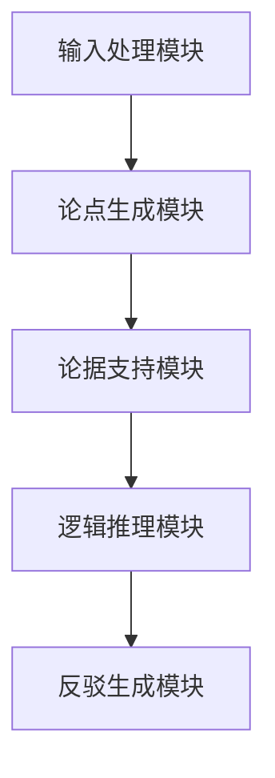
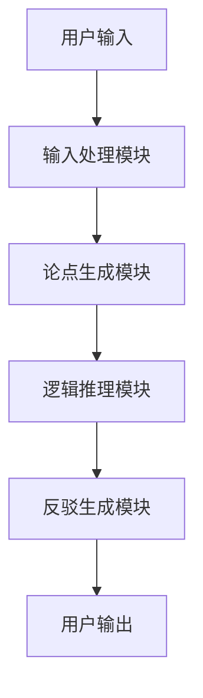

                 


# 智能辩论AI Agent：LLM驱动的论证与反驳系统

**关键词**：智能辩论AI Agent，大语言模型，论证，反驳，逻辑推理，自然语言处理

**摘要**：本文探讨了智能辩论AI Agent的构建与实现，重点分析了其背后的理论基础、算法原理和系统架构。文章从背景介绍出发，详细讲解了论证与反驳的核心概念，探讨了大语言模型在智能辩论中的应用，分析了系统的设计与实现，并通过实际案例展示了如何利用这些技术构建一个高效的智能辩论系统。

---

## 第一部分: 智能辩论AI Agent概述

### 第1章: 智能辩论AI Agent的背景与概念

#### 1.1 问题背景

##### 1.1.1 辩论与论证的基本概念
辩论是一种通过逻辑推理和证据支持来说服他人接受自己观点的交流方式。论证是辩论的核心，它由一系列论点、论据和推理组成，旨在证明某个命题的正确性。一个有效的论证需要逻辑清晰、证据充分，并且能够经受住反驳。

##### 1.1.2 智能辩论的必要性
随着人工智能技术的发展，特别是在自然语言处理（NLP）和大语言模型（LLM）领域的突破，智能辩论AI Agent的需求日益增长。智能辩论系统可以在教育、法律、商业等领域提供实时的辩论支持，帮助用户快速生成论点、反驳对手的观点，并在复杂问题中提供决策支持。

##### 1.1.3 边界与外延
智能辩论AI Agent的边界主要在于其能力的限制。当前的LLM虽然能够生成复杂的文本，但在理解和处理复杂的逻辑推理、实时上下文理解等方面仍有一定的局限性。外延则包括将智能辩论技术应用于更多领域，如自动化法律咨询、智能客服等。

#### 1.2 问题描述

##### 1.2.1 辩论AI的定义
智能辩论AI Agent是一种能够自动生成和反驳论点的智能系统，它利用自然语言处理和逻辑推理技术，模拟人类在辩论中的思考和表达过程。

##### 1.2.2 辩论AI的核心要素
- **论点生成**：根据输入的问题生成多个可能的论点。
- **论据支持**：为每个论点提供相关的证据或数据支持。
- **逻辑推理**：分析论点之间的逻辑关系，确保论证的连贯性和有效性。
- **反驳生成**：根据对手的观点，生成相应的反驳论点。

##### 1.2.3 辩论AI的分类与应用场景
智能辩论AI Agent可以根据应用场景分为教育型、商业型和专业型。教育型用于辅助学生学习辩论技巧；商业型用于企业内部决策支持；专业型则用于法律咨询、政策分析等领域。

---

### 第2章: 智能辩论AI Agent的技术基础

#### 2.1 大语言模型（LLM）概述

##### 2.1.1 LLM的基本概念
大语言模型是一种基于深度学习的自然语言处理模型，能够理解和生成人类语言。其核心是通过大量的文本数据训练，学习语言的结构和语义。

##### 2.1.2 LLM的核心技术
- ** transformer 架构**：利用自注意力机制捕捉文本中的长距离依赖关系。
- **预训练与微调**：通过大规模数据预训练，然后在特定任务上进行微调。
- **生成式模型**：能够生成自然流畅的文本，支持对话、翻译等多种任务。

##### 2.1.3 LLM在辩论中的应用潜力
LLM可以用于论点生成、论据支持和反驳生成。例如，GPT-3能够生成复杂的论点，并提供相关的支持信息，但其逻辑推理能力仍需进一步提升。

#### 2.2 逻辑推理与论证系统

##### 2.2.1 逻辑推理的基本原理
逻辑推理是论证的核心，它包括归纳推理和演绎推理。归纳推理从具体实例中总结一般规律，演绎推理则从一般规律推出具体结论。

##### 2.2.2 论证结构的构建
一个有效的论证通常包括以下部分：
1. **论点**：核心观点。
2. **论据**：支持论点的证据。
3. **推理**：连接论点和论据的逻辑步骤。

##### 2.2.3 逻辑推理在辩论中的应用
在智能辩论系统中，逻辑推理用于分析对手的论点，发现其逻辑漏洞，并生成相应的反驳论点。

---

## 第二部分: 智能辩论AI Agent的核心概念与联系

### 第4章: 论证与反驳的理论基础

#### 4.1 论证的基本概念

##### 4.1.1 论证的定义与结构
论证是由论点、论据和推理组成的结构，旨在证明某个命题的正确性。例如，命题“政策X是有效的”，论点可以是“政策X提高了GDP增长率”，论据可以是统计数据，推理则是基于统计数据支持论点。

##### 4.1.2 论证的逻辑形式
论证的逻辑形式包括归纳论证和演绎论证。归纳论证通过观察部分实例得出一般结论，而演绎论证则通过一般原则推出特定结论。

##### 4.1.3 论证的有效性评估
论证的有效性取决于论点的正确性、论据的可靠性和推理的逻辑性。例如，如果论点错误，或者论据与论点无关，论证将无效。

#### 4.2 反驳的理论框架

##### 4.2.1 反驳的定义与类型
反驳是通过揭示对手论证的漏洞来削弱其论点的过程。常见的反驳类型包括：
- **直接反驳**：直接指出对手论点的错误。
- **间接反驳**：通过证明对手的论据不成立来削弱论点。

##### 4.2.2 反驳的逻辑结构
反驳的逻辑结构包括：
1. **识别对手的论点**：明确对手的核心观点。
2. **分析论点的漏洞**：找出论点中的逻辑错误或不充分之处。
3. **提出反驳论点**：基于分析结果，提出有效的反驳论点。

##### 4.2.3 反驳的有效性评估
有效的反驳需要准确识别对手的论点，并提供充分的论据支持反驳论点。例如，如果对手的论据存在事实错误，可以通过提供正确的数据来反驳。

### 第5章: 智能辩论AI Agent的逻辑框架

#### 5.1 论证与反驳的逻辑关系

##### 5.1.1 论证与反驳的对比分析
- **论证**：从论点到论据的逻辑推导。
- **反驳**：从对手论点到反驳论点的逻辑推导。

##### 5.1.2 论证与反驳的协同关系
在智能辩论中，论证和反驳是相辅相成的。论证用于提出自己的观点，而反驳用于削弱对手的观点。

##### 5.1.3 论证与反驳的动态关系
智能辩论是一个动态的过程，论证和反驳需要不断交替进行，直到达到一个平衡状态。

#### 5.2 智能辩论AI Agent的逻辑框架

##### 5.2.1 系统模块划分
智能辩论AI Agent通常包括以下几个模块：
- **输入处理模块**：接收输入的辩论主题或问题。
- **论点生成模块**：生成多个可能的论点。
- **论据支持模块**：为每个论点提供论据支持。
- **逻辑推理模块**：分析论点之间的逻辑关系。
- **反驳生成模块**：根据对手的论点生成反驳论点。

##### 5.2.2 模块之间的关系
模块之间的关系可以通过Mermaid图表示，如下：



---

## 第三部分: 智能辩论AI Agent的算法原理

### 第6章: 论证生成与优化的算法原理

#### 6.1 论证生成的算法框架

##### 6.1.1 基于LLM的生成式论证
利用GPT-3等大语言模型生成论点和论据。例如，输入“气候变化的影响”，模型可以生成多个论点，如“气候变化导致海平面上升”。

##### 6.1.2 基于规则的论证优化
通过逻辑规则对生成的论点进行优化。例如，确保每个论点都有充分的论据支持，并且逻辑推理合理。

#### 6.2 论证优化的策略

##### 6.2.1 论证的可解释性优化
通过简化语言和增加逻辑标记，提高论证的可解释性。例如，使用“因此”、“首先”等逻辑连接词。

##### 6.2.2 论证的多样性优化
通过多种生成策略，生成多样化的论点和论据，以应对不同的辩论场景。

### 第7章: 反驳生成的算法原理

#### 7.1 反驳生成的挑战

##### 7.1.1 反驳的复杂性
反驳需要准确理解对手的论点，并找到其逻辑漏洞。这需要强大的自然语言理解和逻辑推理能力。

##### 7.1.2 反驳的多样性
在不同场景下，可能需要生成不同类型的反驳论点，如直接反驳和间接反驳。

#### 7.2 反驳生成的实现

##### 7.2.1 基于LLM的生成式反驳
利用GPT-3等大语言模型生成反驳论点。例如，输入“气候变化不影响经济”，模型可以生成“气候变化会导致农作物减产，影响经济”。

##### 7.2.2 基于规则的反驳优化
通过逻辑规则优化生成的反驳论点，确保其逻辑合理且具有说服力。

---

## 第四部分: 智能辩论AI Agent的系统分析与架构设计

### 第8章: 智能辩论AI Agent的系统分析

#### 8.1 问题场景介绍

##### 8.1.1 辩论场景
智能辩论AI Agent可以在多种场景中应用，如教育、法律咨询、商业决策支持等。

##### 8.1.2 用户需求分析
用户需要一个能够实时生成论点、反驳对手观点的智能系统，支持单人练习、多人辩论等多种模式。

#### 8.2 系统功能设计

##### 8.2.1 功能模块划分
- **输入处理模块**：接收用户的输入，解析辩论主题。
- **论点生成模块**：生成多个论点。
- **论据支持模块**：为每个论点提供论据支持。
- **逻辑推理模块**：分析论点之间的逻辑关系。
- **反驳生成模块**：生成反驳论点。

##### 8.2.2 功能流程图


### 第9章: 智能辩论AI Agent的架构设计

#### 9.1 系统架构设计

##### 9.1.1 分层架构
智能辩论AI Agent采用分层架构，包括数据层、逻辑层和应用层。

##### 9.1.2 模块交互设计
模块之间的交互通过接口进行，确保系统的可扩展性和可维护性。

##### 9.1.3 架构图展示


#### 9.2 接口设计

##### 9.2.1 输入接口
- **输入格式**：支持文本输入和语音输入。
- **输入解析**：自动解析输入的主题和问题。

##### 9.2.2 输出接口
- **输出格式**：支持文本输出和语音输出。
- **输出展示**：以结构化的方式展示论点、论据和反驳论点。

#### 9.3 交互设计

##### 9.3.1 用户界面
- **图形界面**：直观展示辩论内容。
- **交互方式**：支持实时输入和输出，用户可以随时调整辩论内容。

##### 9.3.2 交互流程图


---

## 第五部分: 智能辩论AI Agent的项目实战

### 第10章: 项目实战与实现

#### 10.1 环境配置

##### 10.1.1 系统环境
- **操作系统**：Linux/Windows/MacOS
- **编程语言**：Python 3.8+
- **框架与库**：TensorFlow/PyTorch, Hugging Face的Transformers库

##### 10.1.2 依赖安装
```bash
pip install transformers torch
```

#### 10.2 核心代码实现

##### 10.2.1 论点生成模块

```python
from transformers import GPT2LMHeadModel, GPT2Tokenizer

def generate_arguments(topic):
    model = GPT2LMHeadModel.from_pretrained('gpt2-large')
    tokenizer = GPT2Tokenizer.from_pretrained('gpt2-large')
    inputs = tokenizer.encode(f"Write an argument for: {topic}", max_length=512, return_tensors='pt')
    outputs = model.generate(inputs, max_length=100, num_beams=5, temperature=0.7)
    arguments = [tokenizer.decode(output, skip_special_tokens=True) for output in outputs]
    return arguments
```

##### 10.2.2 反驳生成模块

```python
def generate_counterarguments(arguments):
    model = GPT2LMHeadModel.from_pretrained('gpt2-large')
    tokenizer = GPT2Tokenizer.from_pretrained('gpt2-large')
    for arg in arguments:
        inputs = tokenizer.encode(f"Write a counterargument for: {arg}", max_length=512, return_tensors='pt')
        outputs = model.generate(inputs, max_length=100, num_beams=5, temperature=0.7)
        counterarguments = [tokenizer.decode(output, skip_special_tokens=True) for output in outputs]
        print(f"Counterargument for '{arg}': {counterarguments}")
```

#### 10.3 系统测试与优化

##### 10.3.1 系统测试
- **功能测试**：测试论点生成和反驳生成的功能是否正常。
- **性能测试**：测试系统的响应时间和处理能力。

##### 10.3.2 测试结果分析
- **论点生成的准确率**：生成的论点是否与主题相关。
- **反驳生成的有效性**：生成的反驳论点是否能够有效削弱对手的论点。

#### 10.4 项目小结

##### 10.4.1 项目总结
通过本项目，我们成功实现了智能辩论AI Agent的核心功能，包括论点生成和反驳生成。

##### 10.4.2 经验与教训
- **经验**：使用大语言模型可以快速生成高质量的论点和反驳论点。
- **教训**：系统的逻辑推理能力仍需进一步提升，以应对更复杂的辩论场景。

---

## 第六部分: 智能辩论AI Agent的最佳实践

### 第11章: 最佳实践与小结

#### 11.1 最佳实践

##### 11.1.1 系统优化建议
- **模型优化**：使用更先进的模型，如GPT-4，提高生成质量。
- **数据增强**：通过数据增强技术，增加系统的训练数据，提高泛化能力。

##### 11.1.2 交互优化建议
- **用户反馈机制**：引入用户反馈，优化系统生成的内容。
- **多语言支持**：扩展系统支持多种语言，提高应用范围。

#### 11.2 小结

##### 11.2.1 全文总结
本文详细探讨了智能辩论AI Agent的构建与实现，从理论基础到实际应用，全面分析了其核心技术和系统架构。

##### 11.2.2 未来展望
随着人工智能技术的不断发展，智能辩论AI Agent将在更多领域得到应用，为人类提供更高效、更智能的辩论支持。

### 第12章: 注意事项与拓展阅读

#### 12.1 注意事项

##### 12.1.1 系统局限性
当前的智能辩论AI Agent在逻辑推理和实时上下文理解方面仍有一定的局限性，需要进一步优化。

##### 12.1.2 使用建议
在实际应用中，建议结合人工审核，确保生成内容的准确性和合规性。

#### 12.2 拓展阅读

##### 12.2.1 推荐书籍
- 《The Art of Argumentation》
- 《AI in Argumentation and Debate》

##### 12.2.2 推荐论文
- “A Survey on Argumentation in AI”
- “Deep Learning for Argumentation”

---

**结语**：智能辩论AI Agent是一项前沿的技术，它结合了大语言模型和逻辑推理，为人类提供了强大的辩论支持。通过不断的优化和创新，智能辩论AI Agent将为更多领域带来深远的影响。

