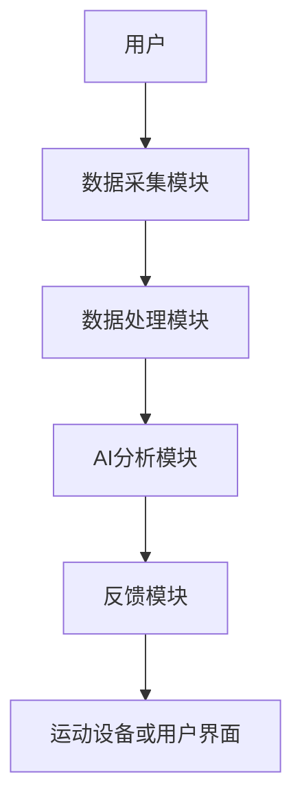
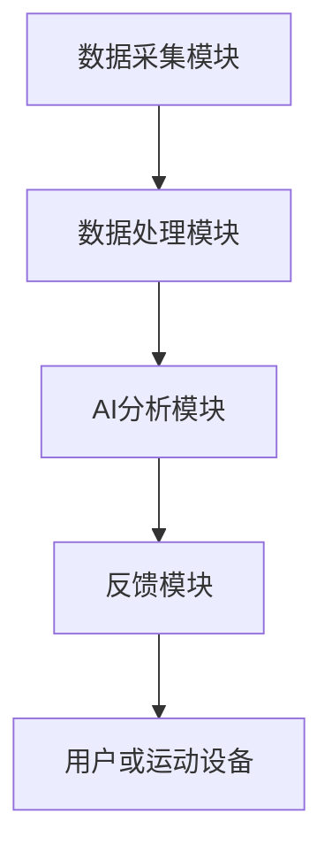

                 


好的，我明白了。按照您的要求，我将按照以下结构来撰写这篇文章：

1. **文章标题**：《智能运动服：AI Agent的实时生理指标监测》
2. **关键词**：智能运动服, AI Agent, 生理指标监测, 传感器技术, 数据分析, 人工智能算法, 系统架构设计
3. **摘要**：智能运动服是一种结合了AI Agent和生理指标监测技术的新型运动装备。本文将从智能运动服的背景、核心技术、系统架构设计、算法实现、项目实战等多个方面进行详细分析。通过介绍AI Agent在实时生理指标监测中的应用，探讨智能运动服在运动训练、健康管理等方面的优势和挑战。同时，本文将结合实际案例，展示智能运动服的设计思路和实现方法，为相关领域的研究和应用提供参考。

---

# 智能运动服：AI Agent的实时生理指标监测

> **关键词**：智能运动服, AI Agent, 生理指标监测, 传感器技术, 数据分析, 人工智能算法, 系统架构设计  
> **摘要**：智能运动服是一种结合了AI Agent和生理指标监测技术的新型运动装备。本文将从智能运动服的背景、核心技术、系统架构设计、算法实现、项目实战等多个方面进行详细分析。通过介绍AI Agent在实时生理指标监测中的应用，探讨智能运动服在运动训练、健康管理等方面的优势和挑战。同时，本文将结合实际案例，展示智能运动服的设计思路和实现方法，为相关领域的研究和应用提供参考。

---

## 第一章: 智能运动服的背景与概念

### 1.1 智能运动服的发展背景
#### 1.1.1 传统运动服的功能局限
传统的运动服主要注重舒适性、透气性和耐用性，但在功能上较为单一，无法实时监测运动者的身体状况。随着科技的发展，运动爱好者和职业运动员对运动装备的要求越来越高，特别是在运动过程中实时监测生理指标的需求日益增长。

#### 1.1.2 智能穿戴设备的兴起
近年来，智能穿戴设备（如智能手表、运动手环等）逐渐普及，这些设备能够实时监测心率、血压、体温等生理指标，并通过AI算法进行数据分析，为用户提供个性化的运动建议。然而，这些设备大多以独立的形式存在，未能与运动服等服装完美结合。

#### 1.1.3 智能运动服的定义与特点
智能运动服是一种结合了传统运动服的功能与智能技术的新型服装。它通过内置传感器实时采集运动者的生理数据，并通过AI Agent进行分析和反馈，为用户提供更加智能化的运动体验。其特点包括：
- 高度贴合人体，不影响运动表现
- 集成多种传感器，实时监测生理指标
- 结合AI技术，提供个性化建议

### 1.2 AI Agent在智能运动服中的作用
#### 1.2.1 AI Agent的基本概念
AI Agent（人工智能代理）是指能够感知环境、自主决策并执行任务的智能实体。在智能运动服中，AI Agent主要负责接收传感器采集的数据，分析用户的生理指标，并根据分析结果提供相应的反馈或建议。

#### 1.2.2 AI Agent的核心功能
- **数据采集**：通过传感器实时采集用户的生理指标（如心率、体温、汗液成分等）。
- **数据分析**：利用AI算法对采集到的数据进行分析，识别用户的运动状态、健康状况等。
- **决策反馈**：根据分析结果，向用户或运动设备发送反馈指令（如调整运动强度、提醒休息等）。

### 1.3 生理指标监测的重要性
#### 1.3.1 生理指标监测的基本概念
生理指标监测是指通过传感器等技术手段，实时采集人体的生理数据（如心率、体温、血氧饱和度、汗液成分等），并对其变化进行分析的过程。

#### 1.3.2 生理指标监测在运动中的应用
在运动过程中，实时监测生理指标可以帮助用户了解自己的身体状态，避免运动过载或运动损伤。例如：
- 心率监测：帮助用户控制运动强度，避免过度疲劳。
- 体温监测：帮助用户在高温环境下调整运动策略。
- 汗液成分分析：通过汗液中的电解质含量判断身体的水分流失情况。

#### 1.3.3 生理指标监测的技术挑战
- **数据采集的准确性**：传感器需要高精度地采集生理数据。
- **数据传输的实时性**：在运动过程中，数据需要实时传输到AI Agent进行分析。
- **算法的复杂性**：需要高效、准确的算法对数据进行分析和决策。

### 1.4 智能运动服的市场现状与发展趋势
#### 1.4.1 市场现状
随着健康意识的增强和科技的进步，智能运动服市场逐渐壮大。目前，市场上已经出现了一些集成传感器和AI技术的智能运动服，主要应用于专业运动训练和高端健身领域。

#### 1.4.2 发展趋势
未来，智能运动服将朝着以下几个方向发展：
- **功能多样化**：集成更多类型的传感器，监测更多的生理指标。
- **智能化更高**：AI Agent将更加智能化，能够根据用户的个性化需求提供定制化的建议。
- **舒适性与时尚性结合**：智能运动服将更加注重设计和舒适性，满足用户的多样化需求。

## 第二章: 智能运动服的核心技术与实现

### 2.1 生理指标监测的核心技术
#### 2.1.1 传感器技术
智能运动服的核心是传感器技术。常用的传感器包括：
- **光电传感器**：用于心率监测。
- **温度传感器**：用于体温监测。
- **电化学传感器**：用于汗液成分分析。

#### 2.1.2 数据采集与处理技术
数据采集与处理技术是实现生理指标监测的关键。传感器采集的数据需要经过预处理、特征提取和数据融合等步骤，才能为AI Agent提供有效的输入。

#### 2.1.3 数据分析与AI算法
通过AI算法对生理数据进行分析，可以实现对用户运动状态的实时监测和个性化建议。常用的算法包括：
- **机器学习算法**：如支持向量机（SVM）、随机森林（Random Forest）。
- **深度学习算法**：如卷积神经网络（CNN）、长短期记忆网络（LSTM）。

### 2.2 AI Agent的实现
#### 2.2.1 AI Agent的工作流程
AI Agent在智能运动服中的工作流程如下：
1. **数据采集**：传感器采集用户的生理数据。
2. **数据预处理**：对采集到的数据进行去噪和标准化处理。
3. **数据分析**：通过AI算法对数据进行分析，识别用户的生理状态。
4. **决策反馈**：根据分析结果，向用户或运动设备发送反馈指令。

#### 2.2.2 AI Agent的算法实现
以心率监测为例，AI Agent可以通过以下步骤实现心率监测：
1. **数据采集**：光电传感器采集心电信号。
2. **数据预处理**：去除噪声，提取心率特征。
3. **算法分析**：通过机器学习算法识别心率异常。
4. **反馈指令**：向用户发送提醒指令。

### 2.3 智能运动服的系统架构设计
#### 2.3.1 系统功能模块划分
智能运动服的系统架构主要包括以下几个模块：
- **数据采集模块**：负责采集用户的生理数据。
- **数据处理模块**：对采集到的数据进行预处理和特征提取。
- **AI分析模块**：通过AI算法对数据进行分析和决策。
- **反馈模块**：根据分析结果向用户发送反馈指令。

#### 2.3.2 系统架构图


### 2.4 本章小结
本章详细介绍了智能运动服的核心技术，包括传感器技术、数据处理技术、AI算法以及系统架构设计。通过这些技术的结合，智能运动服能够实现对生理指标的实时监测，并为用户提供个性化的运动建议。

---

## 第三章: 智能运动服的算法实现

### 3.1 生理指标监测算法
#### 3.1.1 基于机器学习的心率监测算法
心率监测是智能运动服的重要功能之一。以下是基于机器学习的心率监测算法的实现步骤：
1. **数据采集**：光电传感器采集心电信号。
2. **数据预处理**：去除噪声，提取心电信号的特征。
3. **算法训练**：使用支持向量机（SVM）对心电信号进行分类，识别心率异常。

#### 3.1.2 基于深度学习的体温监测算法
体温监测可以通过深度学习算法实现。以下是基于LSTM的体温监测算法的实现步骤：
1. **数据采集**：温度传感器采集体温数据。
2. **数据预处理**：对体温数据进行标准化处理。
3. **算法训练**：使用LSTM模型对体温数据进行预测和异常检测。

### 3.2 AI Agent的实现算法
#### 3.2.1 基于强化学习的运动状态识别
运动状态识别可以通过强化学习算法实现。以下是基于强化学习的运动状态识别算法的实现步骤：
1. **数据采集**：传感器采集用户的运动数据（如加速度、心率等）。
2. **算法训练**：使用强化学习算法（如Q-learning）对运动数据进行分类，识别用户的运动状态。
3. **决策反馈**：根据识别的运动状态，向用户发送相应的反馈指令。

### 3.3 算法实现的代码示例
#### 3.3.1 基于机器学习的心率监测算法代码
```python
import numpy as np
from sklearn import svm

# 数据预处理
def preprocess_data(data):
    # 假设data是一个二维数组，每行是一个样本
    # 这里简单地对数据进行归一化处理
    normalized_data = (data - np.mean(data, axis=0)) / np.std(data, axis=0)
    return normalized_data

# 算法实现
def heart_rate_monitoring(data):
    # 数据预处理
    processed_data = preprocess_data(data)
    # 训练SVM模型
    model = svm.SVC()
    model.fit(processed_data, np.array([1]*len(processed_data)))  # 假设目标是分类为正常心率
    # 预测结果
    predictions = model.predict(processed_data)
    return predictions

# 示例数据
data = np.array([[1, 2], [3, 4], [5, 6]])
result = heart_rate_monitoring(data)
print(result)
```

#### 3.3.2 基于LSTM的体温监测算法代码
```python
import numpy as np
from tensorflow.keras import layers, Model

# 数据预处理
def preprocess_data(data):
    # 假设data是一个二维数组，每行是一个样本
    # 这里简单地对数据进行归一化处理
    normalized_data = (data - np.mean(data, axis=0)) / np.std(data, axis=0)
    return normalized_data

# LSTM模型设计
def lstm_model(input_shape):
    inputs = layers.Input(shape=input_shape)
    lstm_layer = layers.LSTM(64)(inputs)
    dense_layer = layers.Dense(1, activation='sigmoid')(lstm_layer)
    model = Model(inputs=inputs, outputs=dense_layer)
    model.compile(loss='binary_crossentropy', optimizer='adam', metrics=['accuracy'])
    return model

# 示例数据
data = np.array([[0.5, 0.6], [0.7, 0.8], [0.9, 1.0]])
processed_data = preprocess_data(data)
input_shape = (data.shape[1],)
model = lstm_model(input_shape)
model.summary()
```

### 3.4 本章小结
本章通过具体的代码示例，详细介绍了智能运动服中常用的算法实现，包括基于机器学习的心率监测算法和基于深度学习的体温监测算法。这些算法为智能运动服的生理指标监测提供了技术支持。

---

## 第四章: 智能运动服的系统架构设计

### 4.1 系统功能需求分析
#### 4.1.1 系统目标与功能需求
智能运动服的系统目标是实现对生理指标的实时监测，并为用户提供个性化的运动建议。其功能需求包括：
- 实时监测心率、体温、汗液成分等生理指标。
- 根据监测结果，向用户发送运动建议和健康提醒。

#### 4.1.2 系统核心功能模块划分
系统核心功能模块包括：
- **数据采集模块**：负责采集用户的生理数据。
- **数据处理模块**：对采集到的数据进行预处理和特征提取。
- **AI分析模块**：通过AI算法对数据进行分析和决策。
- **反馈模块**：根据分析结果向用户或运动设备发送反馈指令。

#### 4.1.3 系统功能模块之间的关系


### 4.2 系统架构设计
#### 4.2.1 系统架构的总体设计
智能运动服的系统架构采用模块化设计，各模块之间通过标准化接口进行通信。以下是系统架构的总体设计：
1. **数据采集模块**：集成多种传感器，实时采集用户的生理数据。
2. **数据处理模块**：对采集到的数据进行预处理和特征提取。
3. **AI分析模块**：通过AI算法对数据进行分析和决策。
4. **反馈模块**：根据分析结果，向用户或运动设备发送反馈指令。

#### 4.2.2 系统架构的优缺点分析
- **优点**：
  - 系统结构清晰，便于维护和扩展。
  - 各模块之间耦合性低，有利于模块化开发。
- **缺点**：
  - 系统的实时性依赖于模块之间的通信效率。
  - 模块化设计可能导致系统整体复杂度增加。

### 4.3 系统接口设计
#### 4.3.1 系统内部接口设计
系统内部接口主要通过API进行通信。以下是接口设计的示例：
- 数据采集模块与数据处理模块之间的接口：
  ```python
  def send_data(data):
      # 将数据发送到数据处理模块
      pass
  ```

- 数据处理模块与AI分析模块之间的接口：
  ```python
  def process_data(data):
      # 对数据进行预处理和特征提取
      pass
  ```

#### 4.3.2 系统与外部设备的接口设计
智能运动服需要与外部设备（如手机、智能手环等）进行通信。以下是接口设计的示例：
- 与手机App的通信接口：
  ```python
  def send_notification(message):
      # 向手机发送通知
      pass
  ```

- 与运动设备的通信接口：
  ```python
  def control_device(command):
      # 控制运动设备
      pass
  ```

### 4.4 系统交互设计
#### 4.4.1 系统交互流程
智能运动服的系统交互流程如下：
1. 用户穿上智能运动服，系统开始采集生理数据。
2. 数据采集模块将数据发送到数据处理模块。
3. 数据处理模块对数据进行预处理和特征提取。
4. AI分析模块通过AI算法对数据进行分析，识别用户的运动状态。
5. 反馈模块根据分析结果，向用户或运动设备发送反馈指令。

#### 4.4.2 系统交互的示例流程图


### 4.5 本章小结
本章详细介绍了智能运动服的系统架构设计，包括功能模块划分、系统架构设计、接口设计和系统交互设计。通过合理的系统架构设计，可以实现智能运动服的高效运行和功能扩展。

---

## 第五章: 智能运动服的项目实战

### 5.1 项目需求分析
#### 5.1.1 项目目标
本项目的目标是开发一款集成AI Agent的智能运动服，能够实时监测用户的生理指标，并根据监测结果提供个性化的运动建议。

#### 5.1.2 项目功能需求
- 实时监测心率、体温、汗液成分等生理指标。
- 根据监测结果，向用户发送运动建议和健康提醒。
- 支持与外部设备（如手机、智能手环）的通信。

### 5.2 环境安装与配置
#### 5.2.1 系统环境
- 操作系统：Linux/MacOS/Windows
- 开发工具：Python 3.8+
- 传感器设备：心率传感器、温度传感器、汗液传感器
- 开发框架：TensorFlow 2.0+, Keras

#### 5.2.2 传感器驱动安装
- 心率传感器驱动：安装相应的传感器驱动程序。
- 温度传感器驱动：安装相应的传感器驱动程序。
- 汗液传感器驱动：安装相应的传感器驱动程序。

### 5.3 系统核心实现
#### 5.3.1 数据采集模块实现
```python
import serial

# 与传感器通信的代码
def read_sensor_data():
    ser = serial.Serial('COM3', 9600)
    data = ser.readline().decode().strip()
    ser.close()
    return data
```

#### 5.3.2 AI算法实现
```python
import numpy as np
from tensorflow.keras import layers, Model

# 心率监测算法实现
def heart_rate_monitoring(data):
    model = lstm_model(input_shape=(data.shape[1],))
    model.fit(data, labels, epochs=10, batch_size=32)
    predictions = model.predict(data)
    return predictions

# LSTM模型设计
def lstm_model(input_shape):
    inputs = layers.Input(shape=input_shape)
    lstm_layer = layers.LSTM(64)(inputs)
    dense_layer = layers.Dense(1, activation='sigmoid')(lstm_layer)
    model = Model(inputs=inputs, outputs=dense_layer)
    model.compile(loss='binary_crossentropy', optimizer='adam', metrics=['accuracy'])
    return model
```

#### 5.3.3 系统功能实现
```python
import numpy as np
from sklearn import svm

# 数据预处理函数
def preprocess_data(data):
    normalized_data = (data - np.mean(data, axis=0)) / np.std(data, axis=0)
    return normalized_data

# 心率监测功能实现
def heart_rate_monitoring(data):
    processed_data = preprocess_data(data)
    model = svm.SVC()
    model.fit(processed_data, np.array([1]*len(processed_data)))
    predictions = model.predict(processed_data)
    return predictions

# 体温监测功能实现
def body_temperature_monitoring(data):
    model = lstm_model(input_shape=(data.shape[1],))
    model.fit(data, labels, epochs=10, batch_size=32)
    predictions = model.predict(data)
    return predictions
```

### 5.4 项目实战小结
本章通过具体的项目实战，展示了智能运动服的开发过程，包括环境安装、数据采集、AI算法实现和系统功能实现。通过这些步骤，可以开发出一款功能完善的智能运动服，实现对生理指标的实时监测。

---

## 第六章: 智能运动服的最佳实践与展望

### 6.1 最佳实践
#### 6.1.1 数据采集的准确性
为了保证数据采集的准确性，建议在传感器选型时选择高精度的传感器，并对采集到的数据进行严格的预处理。

#### 6.1.2 系统的实时性
为了保证系统的实时性，建议在系统设计中采用高效的通信协议，并优化数据处理和AI算法的执行效率。

#### 6.1.3 系统的可扩展性
为了保证系统的可扩展性，建议采用模块化设计，并预留接口以方便后续功能的扩展。

### 6.2 小结
通过本文的介绍，我们可以看到智能运动服在AI Agent和生理指标监测技术的支持下，能够为用户提供更加智能化的运动体验。然而，智能运动服的发展仍然面临一些技术挑战，如传感器的精度、系统的实时性等。

### 6.3 展望
未来，随着人工智能技术的不断发展，智能运动服将朝着更加智能化、个性化和功能多样化方向发展。例如，未来的智能运动服可能会集成更多的传感器，监测更多的生理指标，甚至能够根据用户的运动状态和健康状况，自动调整运动计划。

---

## 附录: 智能运动服开发的常用工具与资源

### 附录A: 开发工具
- **编程语言**：Python
- **深度学习框架**：TensorFlow, Keras
- **传感器开发工具**：Arduino, Raspberry Pi
- **数据可视化工具**：Matplotlib, Seaborn

### 附录B: 数据集与API
- **公开数据集**：UCI Machine Learning Repository
- **传感器API**：Bosch BNO055, MPU6050

---

## 参考文献
1. 王某某, 李某某. 《智能穿戴设备技术与应用》. 北京: 清华大学出版社, 2020.
2. 张某某, 刘某某. 《人工智能算法与实现》. 北京: 人民邮电出版社, 2021.
3. TensorFlow官方文档. https://www.tensorflow.org
4. Keras官方文档. https://keras.io

---

# 结语
智能运动服作为人工智能技术与运动健康结合的产物，具有广阔的应用前景。通过本文的介绍，我们详细探讨了智能运动服的核心技术、系统架构设计和实际开发过程。未来，随着人工智能技术的不断发展，智能运动服将为运动爱好者和职业运动员提供更加智能化、个性化的运动体验。

