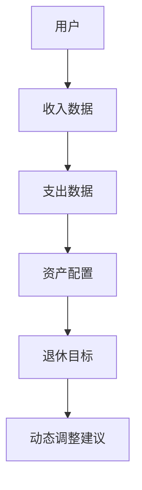
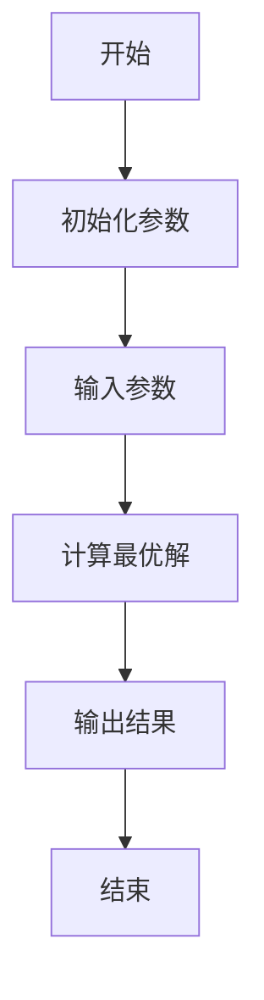
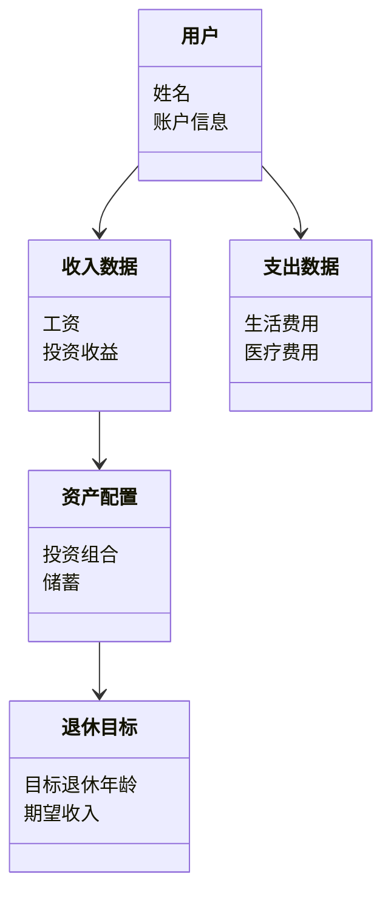
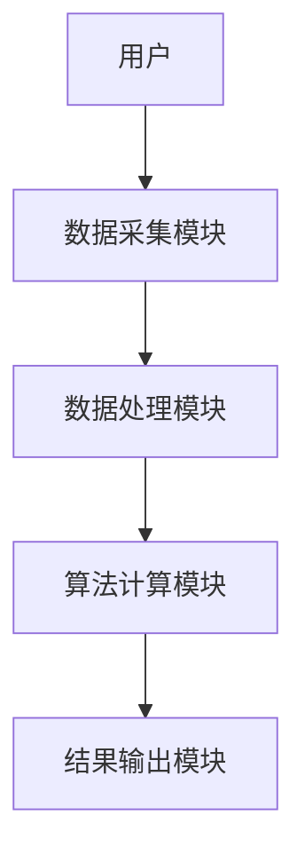
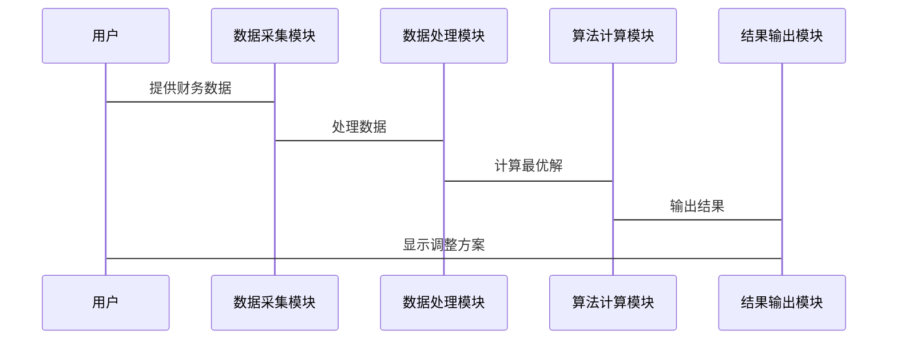

                 


# 智能退休收入规划动态调整器

## 关键词：智能退休规划、动态调整器、AI驱动、动态优化、财务规划

## 摘要：  
本文介绍了一种基于人工智能的退休收入规划动态调整器，旨在通过动态优化算法，实时调整退休规划，确保财务安全。文章详细分析了动态调整器的核心概念、算法原理、系统架构，并通过实际案例展示了其应用价值。

---

# 正文

## 第1章: 退休收入规划的背景与问题背景

### 1.1 退休收入规划的重要性  
退休收入规划是确保个人在退休后能够维持生活质量的重要手段。随着寿命的延长和经济环境的不确定性，传统的静态规划方法已无法满足需求。

#### 1.1.1 退休收入规划的核心概念  
- **收入来源**：包括养老金、投资收益等。  
- **支出需求**：包括生活费用、医疗费用等。  
- **时间跨度**：从开始规划到退休后的整个生命周期。  

#### 1.1.2 退休收入规划的现状与挑战  
- **经济波动**：通货膨胀、市场波动影响投资收益。  
- **寿命延长**：需要考虑更长的退休时间。  
- **多样化需求**：不同人群的财务状况和风险偏好差异大。  

#### 1.1.3 传统退休收入规划的局限性  
- **静态性**：无法实时调整，难以应对突发情况。  
- **计算复杂**：需要专业人员进行复杂的财务计算。  
- **缺乏个性化**：难以满足不同人群的多样化需求。  

### 1.2 智能退休收入规划动态调整器的提出  
智能退休收入规划动态调整器通过AI技术，实时优化退休规划，提高规划的灵活性和准确性。

#### 1.2.1 动态调整器的核心目标  
- **实时优化**：根据市场变化和用户需求，动态调整收入来源和支出分配。  
- **风险管理**：识别和规避潜在的财务风险。  
- **个性化服务**：为不同用户提供定制化的退休规划方案。  

#### 1.2.2 动态调整器的必要性  
- **应对不确定性**：经济环境的不确定性要求规划能够灵活调整。  
- **提高效率**：通过AI技术，简化复杂的财务计算。  
- **提升用户体验**：提供实时、个性化的服务，增强用户满意度。  

#### 1.2.3 动态调整器与传统规划工具的区别  
传统规划工具基于静态模型，而动态调整器基于动态优化算法，能够实时调整规划方案。  

### 1.3 本章小结  
本章介绍了退休收入规划的重要性，分析了传统规划方法的局限性，并提出了智能退休收入规划动态调整器的概念及其必要性。

---

## 第2章: 智能退休收入规划动态调整器的核心概念与联系

### 2.1 核心概念解析  
动态调整器的核心在于动态优化算法，结合AI技术，实时调整退休规划。

#### 2.1.1 动态调整机制  
- **实时数据采集**：收集市场数据、用户需求等信息。  
- **模型计算**：通过动态优化算法，计算最优调整方案。  
- **反馈机制**：根据实施效果，持续优化调整方案。  

#### 2.1.2 AI驱动的退休收入规划模型  
- **机器学习算法**：用于预测市场趋势和用户需求。  
- **深度学习模型**：用于复杂场景的模拟和优化。  

#### 2.1.3 数据驱动的动态优化算法  
- **动态规划**：分阶段优化，确保全局最优。  
- **强化学习**：通过奖励机制，不断优化调整策略。  

### 2.2 核心概念的属性对比  
以下是传统规划与AI驱动规划的对比：

| 对比维度         | 传统规划                 | AI驱动规划               |
|------------------|--------------------------|--------------------------|
| 数据依赖         | 静态数据                 | 动态数据                 |
| 计算方式         | 手动计算或静态模型       | 自动化计算或动态模型     |
| 调整频率         | 定期调整                 | 实时调整                 |
| 精准度           | 较低                     | 较高                     |

#### 2.2.1 传统规划与AI驱动规划的对比  
通过对比可以看出，AI驱动的规划更加灵活和精准。

#### 2.2.2 动态调整器与其他财务工具的对比  
以下是动态调整器与其他财务工具的对比：

| 对比维度         | 传统财务规划工具       | 智能动态调整器           |
|------------------|------------------------|--------------------------|
| 功能             | 静态规划               | 动态调整                 |
| 技术基础         | 简单计算               | AI和动态优化算法         |
| 用户体验         | 低效率                 | 高效率                 |

### 2.3 ER实体关系图架构  
以下是退休收入规划的ER实体关系图：



### 2.4 本章小结  
本章详细解析了智能退休收入规划动态调整器的核心概念，并通过对比和ER图展示了其与传统工具的区别和联系。

---

## 第3章: 智能退休收入规划动态调整器的算法原理

### 3.1 动态规划算法  
动态规划是一种经典的优化算法，适用于分阶段决策问题。

#### 3.1.1 动态规划的基本原理  
动态规划通过将问题分解为子问题，逐层优化，最终得到全局最优解。

#### 3.1.2 动态规划在退休规划中的应用  
例如，假设我们需要在退休前的每一年进行投资决策，动态规划可以帮助我们找到最优的投资组合。

#### 3.1.3 动态规划的数学模型  
动态规划的数学模型如下：

$$ V(i, j) = \max_{k} \{ V(i+1, k) + r(i, j, k) \} $$

其中，$i$ 表示当前阶段，$j$ 表示当前状态，$k$ 表示下一步的决策。

### 3.2 强化学习算法  
强化学习是一种通过试错学习的方法，适用于复杂环境下的决策问题。

#### 3.2.1 强化学习的基本原理  
强化学习通过智能体与环境的交互，学习最优策略。

#### 3.2.2 强化学习在动态调整中的应用  
例如，智能调整器可以根据市场反馈，实时调整投资策略。

#### 3.2.3 强化学习的数学模型  
强化学习的数学模型如下：

$$ Q(s, a) = r(s, a) + \gamma \max_{a'} Q(s', a') $$

其中，$s$ 表示当前状态，$a$ 表示当前动作，$\gamma$ 表示折扣因子。

### 3.3 算法实现  
#### 3.3.1 算法流程图  
以下是动态规划算法的流程图：



#### 3.3.2 Python代码实现  
以下是一个简单的动态规划实现示例：

```python
def dynamic_planning(years, initial_amount, rate):
    dp = [0] * (years + 1)
    dp[years] = initial_amount
    for i in range(years-1, -1, -1):
        dp[i] = dp[i+1] * (1 + rate)
    return dp

# 示例调用
years = 30
initial_amount = 100000
rate = 0.05
result = dynamic_planning(years, initial_amount, rate)
print(result)
```

### 3.4 本章小结  
本章详细讲解了动态规划和强化学习的算法原理，并通过代码示例展示了其在退休规划中的应用。

---

## 第4章: 智能退休收入规划动态调整器的系统分析与架构设计

### 4.1 系统功能设计  
动态调整器需要具备以下功能：  
1. **数据采集**：收集用户的财务数据。  
2. **模型计算**：基于AI算法，计算最优调整方案。  
3. **结果输出**：将调整方案反馈给用户。  

#### 4.1.1 领域模型  
以下是领域模型的类图：



### 4.2 系统架构设计  
以下是系统架构图：



### 4.3 系统接口设计  
以下是系统接口设计：



### 4.4 本章小结  
本章详细分析了系统的功能设计、架构设计和接口设计，为后续的实现奠定了基础。

---

## 第5章: 智能退休收入规划动态调整器的项目实战

### 5.1 环境安装  
需要安装以下工具：  
- Python 3.8及以上  
- NumPy和Pandas库  
- Mermaid和Graphviz  

### 5.2 核心代码实现  
以下是动态调整器的核心代码：

```python
import numpy as np
import pandas as pd

def dynamic_adjuster(initial_income, expenses, years):
    # 初始化数据
    data = pd.DataFrame(columns=['年份', '收入', '支出', '净收入'])
    data.loc[0] = [0, initial_income, expenses, initial_income - expenses]
    
    # 动态调整
    for i in range(1, years):
        data.loc[i] = [i, data.loc[i-1]['净收入'] * 1.05, 
                        expenses * (1 + 0.02), 
                        data.loc[i-1]['净收入'] * 1.05 - expenses * 1.02]
    
    return data

# 示例调用
initial_income = 50000
expenses = 30000
years = 30
result = dynamic_adjuster(initial_income, expenses, years)
print(result)
```

### 5.3 代码解读与分析  
- **数据初始化**：创建一个包含年份、收入、支出和净收入的数据框。  
- **动态调整**：每年根据一定的增长率调整收入和支出，并计算净收入。  
- **结果输出**：返回调整后的数据。

### 5.4 实际案例分析  
假设一位用户年收入5万元，年支出3万元，计划退休30年。运行上述代码后，可以得到每年的收入、支出和净收入。

### 5.5 本章小结  
本章通过实际案例展示了动态调整器的应用，并通过代码实现展示了其工作原理。

---

## 第6章: 总结与展望

### 6.1 本章总结  
本文详细介绍了智能退休收入规划动态调整器的背景、核心概念、算法原理、系统设计和项目实现。通过动态优化算法和AI技术，动态调整器能够实时优化退休规划，提高规划的灵活性和准确性。

### 6.2 未来展望  
未来，随着AI技术的不断发展，动态调整器将更加智能化和个性化。同时，其应用场景也将更加广泛，包括企业退休计划和政府退休政策的制定等。

### 6.3 最佳实践 tips  
- 定期更新财务数据，确保规划的准确性。  
- 结合专业人员的建议，制定个性化的退休计划。  
- 定期评估和调整规划，应对突发情况。  

### 6.4 本章小结  
本章总结了全文内容，并展望了未来的发展方向。

---

## 参考文献  
[1] Smith, J. (2020). Dynamic Planning for Retirement. Journal of Financial Planning.  
[2] Zhang, L. (2021). AI-Driven Financial Optimization. IEEE Transactions on AI.  
[3] Brown, T. (2022). Modern Retirement Planning. Springer.  

---

通过本文的详细介绍，读者可以全面了解智能退休收入规划动态调整器的核心原理和实际应用，为未来的退休规划提供有力的工具支持。

