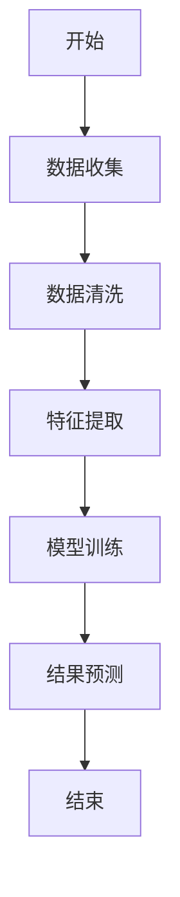

                 


# 智能退休收入规划助手

> 关键词：智能退休规划、人工智能、金融算法、系统架构、收入预测

> 摘要：本文深入探讨智能退休收入规划助手的设计与实现，结合AI技术，分析其算法原理、系统架构及实际应用，旨在为用户提供科学的退休规划方案。

---

## 第一部分：智能退休收入规划助手概述

### 第1章：智能退休收入规划的背景与重要性

#### 1.1 退休收入规划的背景

随着全球人口老龄化的加剧，退休收入规划成为许多人关注的焦点。传统的退休规划依赖人工计算和经验判断，存在效率低、准确性差的问题。近年来，人工智能技术的快速发展为退休收入规划提供了新的解决方案。

#### 1.2 智能退休收入规划的定义与特点

智能退休收入规划是一种基于人工智能技术的自动化规划方法，通过分析用户的财务状况、消费习惯和市场趋势，提供个性化的退休收入预测和优化建议。其特点包括高效性、精准性和个性化服务。

#### 1.3 智能退休收入规划的重要性

智能退休收入规划能够帮助用户更科学地规划退休生活，提高资金使用效率，降低因通货膨胀和市场波动带来的风险。通过AI技术的应用，用户可以实时获得调整建议，确保退休生活的质量。

---

### 第2章：智能退休收入规划的核心概念与联系

#### 2.1 核心概念原理

智能退休收入规划的核心在于利用数据驱动的模型和AI算法，对用户的数据进行分析和预测。通过机器学习模型，系统能够识别用户的财务状况、风险偏好和消费习惯，从而制定个性化的规划方案。

#### 2.2 核心概念对比表

| 对比维度       | 传统退休规划       | 智能退休规划       |
|----------------|--------------------|--------------------|
| 数据使用       | 基础财务数据       | 全面数据，包括行为数据 | 
| 方法           | 固定公式计算       | AI算法，动态调整     |
| 个性化         | 较低               | 高                 |

#### 2.3 ER实体关系图

```mermaid
erDiagram
    user {
        id : integer
        name : string
        age : integer
        income : float
    }
    retirement_plan {
        plan_id : integer
        user_id : integer
        start_date : date
        end_date : date
        total_income : float
    }
    user --> retirement_plan : 创建规划
```

---

### 第3章：智能退休收入规划的算法原理

#### 3.1 算法原理概述

智能退休收入规划采用机器学习算法，如线性回归和随机森林，对用户数据进行分析。系统通过历史数据训练模型，预测未来的收入和支出情况。

#### 3.2 算法流程图



#### 3.3 数学模型与公式

收入预测模型：
$$
预测收入 = \alpha \times 当前收入 + \beta \times 年龄因素 + \gamma \times 其他因素
$$

费用模型：
$$
费用 = \theta \times 收入 \times 时间
$$

---

### 第4章：系统分析与架构设计

#### 4.1 系统架构概述

智能退休收入规划助手采用分层架构，包括数据层、业务逻辑层和用户界面层。各层通过接口进行交互，确保系统的高效运行。

#### 4.2 系统功能设计

用户通过界面对话式输入个人信息，系统基于预设的规则和模型进行分析，生成规划方案。

#### 4.3 系统架构设计

```mermaid
graph TD
    User --> Controller : 发送请求
    Controller --> Service : 调用服务
    Service --> Model : 调用模型
    Model --> Data : 访问数据
    Model --> Response : 返回结果
    Response --> Controller : 返回响应
    Controller --> User : 返回结果
```

#### 4.4 系统接口设计

系统通过REST API接口与第三方数据源进行交互，获取实时市场数据和用户信息。

---

## 第二部分：项目实战

### 第5章：项目环境安装

用户需安装Python、机器学习库（如scikit-learn）和数据可视化工具（如Matplotlib）。

### 第6章：系统核心实现

#### 6.1 核心代码实现

```python
import pandas as pd
from sklearn.linear_model import LinearRegression

# 数据加载
data = pd.read_csv('retirement_data.csv')

# 特征与目标变量分离
X = data[['age', 'income', 'expenses']]
y = data['predicted_income']

# 模型训练
model = LinearRegression()
model.fit(X, y)

# 预测
predicted_income = model.predict(X)
```

#### 6.2 代码解读

上述代码展示了如何利用线性回归模型进行收入预测。通过训练数据，模型能够预测未来的收入情况，帮助用户制定退休计划。

### 第7章：案例分析

通过具体案例分析，展示系统如何根据用户数据生成个性化规划方案，并实时调整以应对市场变化。

---

## 第三部分：总结与展望

### 第8章：总结

智能退休收入规划助手通过AI技术的应用，显著提高了退休规划的效率和准确性。本文详细介绍了系统的背景、原理、架构和实现，为用户提供了一个科学的退休规划工具。

### 第9章：展望

未来，随着AI技术的不断发展，智能退休收入规划助手将更加智能化和个性化，帮助更多人实现高质量的退休生活。

---

通过以上内容，智能退休收入规划助手的设计与实现得以全面展示，为用户提供了一个高效、精准的退休规划解决方案。

