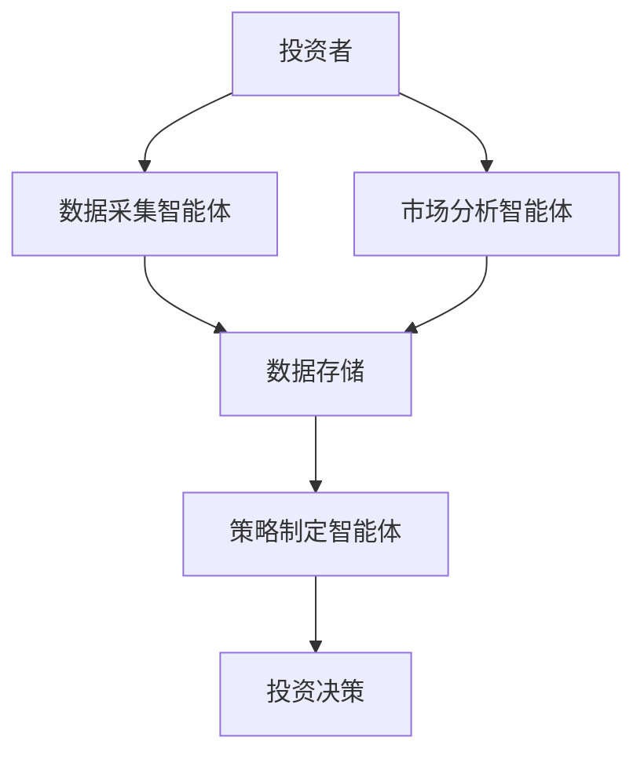
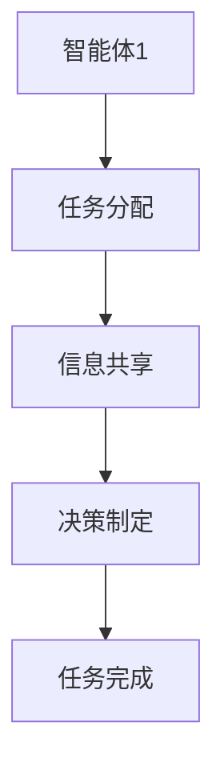
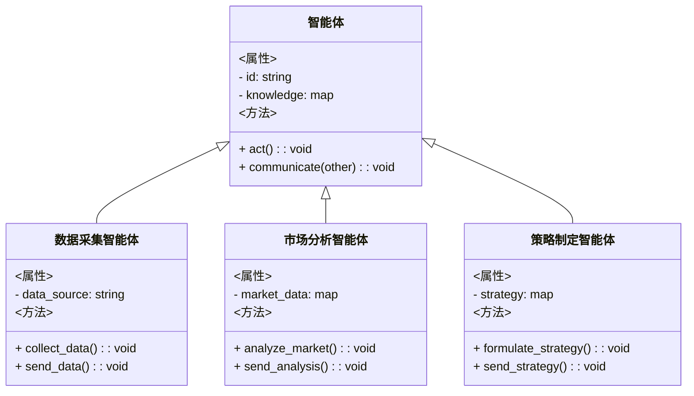
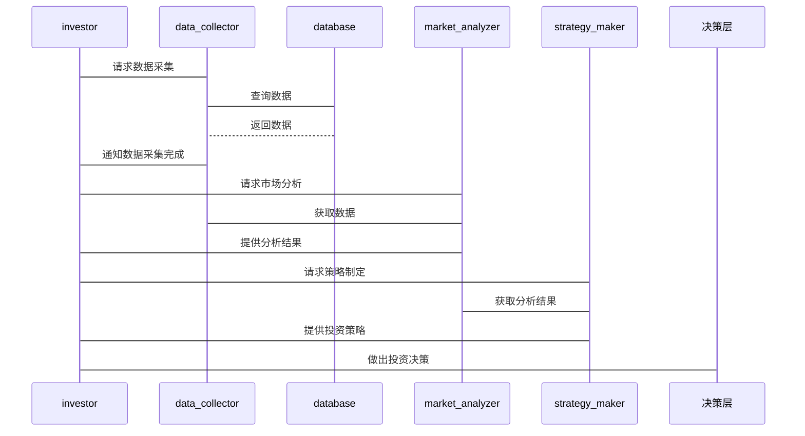

                 


好的，我将根据您提供的详细大纲和要求，逐步完成整篇文章的撰写。让我们开始吧！

---

# 智能金融中的多智能体协作：重塑价值投资流程

> **关键词**：智能金融、多智能体协作、价值投资流程、人工智能、分布式计算、共识机制  
> **摘要**：随着人工智能技术的快速发展，智能金融逐渐成为金融领域的新兴趋势。多智能体协作在智能金融中的应用，尤其是在价值投资流程中的重塑，为金融行业带来了新的可能性。本文将从多智能体协作的核心概念、算法原理、系统设计、项目实战等多方面展开分析，详细探讨其在智能金融中的应用及未来发展趋势。

---

## 第一部分: 智能金融中的多智能体协作概述

### 第1章: 多智能体协作的背景与意义

#### 1.1 多智能体协作的背景
##### 1.1.1 传统金融投资的局限性
传统的金融投资流程依赖于人工分析和经验判断，存在效率低、成本高、信息处理能力有限等问题。例如，传统的股票分析需要大量的人力和时间，且容易受到主观因素的影响。

##### 1.1.2 人工智能在金融领域的应用现状
人工智能技术的快速发展，使得金融领域的数据分析能力得到了显著提升。例如，机器学习算法可以用于股票价格预测、风险评估等任务。

##### 1.1.3 多智能体协作的必要性
单个智能体的能力有限，通过多智能体协作可以实现更复杂的任务。例如，在价值投资中，多个智能体可以分别负责数据采集、分析、策略制定等任务，从而提高整体效率。

#### 1.2 智能金融的定义与特点
##### 1.2.1 智能金融的定义
智能金融是指利用人工智能、大数据等技术，实现金融业务的智能化、自动化和高效化。

##### 1.2.2 智能金融的核心特点
- 数据驱动：依赖于大量数据进行分析和决策。
- 智能化：利用机器学习、自然语言处理等技术实现自动化。
- 实时性：能够快速响应市场变化。

##### 1.2.3 智能金融与传统金融的区别
智能金融更加依赖技术，传统金融更多依赖人工经验。智能金融能够处理更复杂的数据，提供更精准的分析结果。

#### 1.3 价值投资流程的现状与挑战
##### 1.3.1 传统价值投资流程的局限性
传统价值投资流程依赖于人工分析，效率低、成本高，且容易受到主观因素影响。

##### 1.3.2 数据驱动投资的优势
数据驱动投资能够利用大量数据进行分析，发现潜在的投资机会，提高投资决策的准确性。

##### 1.3.3 价值投资流程的重塑需求
为了应对市场变化和提高效率，价值投资流程需要进行智能化的重塑。

#### 1.4 多智能体协作在智能金融中的作用
##### 1.4.1 多智能体协作的优势
- 高效性：多个智能体协同工作，提高处理效率。
- 精准性：通过分工协作，提高分析的准确性。
- 灵活性：能够快速适应市场变化。

##### 1.4.2 多智能体协作在价值投资中的应用
例如，多个智能体可以分别负责数据采集、市场分析、策略制定等任务，从而实现更高效的决策。

##### 1.4.3 多智能体协作的未来发展趋势
随着技术的进步，多智能体协作将在金融领域发挥越来越重要的作用，尤其是在复杂的投资决策中。

#### 1.5 本章小结
本章介绍了多智能体协作的背景、智能金融的定义与特点，以及价值投资流程的现状与挑战。通过多智能体协作，智能金融能够实现更高效、精准的投资决策。

---

## 第二部分: 多智能体协作的核心概念与联系

### 第2章: 多智能体协作的核心概念与联系

#### 2.1 多智能体协作的定义与特点
##### 2.1.1 多智能体协作的定义
多智能体协作是指多个智能体通过协同工作，共同完成复杂任务的过程。

##### 2.1.2 多智能体协作的核心特点
- 分布式：智能体之间独立工作，通过通信协作。
- 协作性：智能体之间需要进行信息共享和任务分配。
- 社会性：智能体的行为影响整体任务的完成效果。

##### 2.1.3 多智能体协作与其他协作方式的对比
| 特性         | 分布式计算 | 共识机制 | 协作学习 |
|--------------|------------|----------|----------|
| 协作方式     | 并行计算   | 达成共识 | 知识共享 |
| 适用场景     | 大规模数据处理 | 去中心化系统 | 机器学习模型优化 |

#### 2.2 智能体的属性与特征
##### 2.2.1 智能体的属性
- 知识表示：智能体通过知识库或模型表示信息。
- 行为决策：智能体根据信息做出决策。
- 通信能力：智能体能够与其他智能体进行信息交换。

##### 2.2.2 智能体的特征
- 独立性：智能体能够独立完成部分任务。
- 社会性：智能体之间需要协作完成整体任务。
- 知识共享：智能体能够共享知识和信息。

##### 2.2.3 智能体之间的关系
智能体之间可以是竞争关系或合作关系，具体取决于任务需求。

#### 2.3 多智能体协作的实体关系图

从图中可以看出，投资者通过数据采集智能体和市场分析智能体获取数据，并通过策略制定智能体制定投资策略，最终做出投资决策。

#### 2.4 本章小结
本章详细介绍了多智能体协作的核心概念、智能体的属性与特征，以及实体关系图。这些内容为后续的算法设计和系统实现奠定了基础。

---

## 第三部分: 多智能体协作的算法原理

### 第3章: 多智能体协作的算法原理

#### 3.1 多智能体协作的基本算法
##### 3.1.1 分布式计算
分布式计算是一种将计算任务分配到多个节点上完成的计算方式，常用于大数据处理和并行计算。

##### 3.1.2 共识机制
共识机制是多智能体协作中的关键算法，用于确保多个智能体之间达成一致。例如，区块链中的共识机制。

##### 3.1.3 协作学习
协作学习是指多个智能体通过共享知识和数据，共同优化模型的过程。

#### 3.2 多智能体协作的算法流程

从图中可以看出，多智能体协作的算法流程包括任务分配、信息共享、决策制定和任务完成四个阶段。

#### 3.3 多智能体协作的数学模型
##### 3.3.1 数学模型的构建
假设我们有 $n$ 个智能体，每个智能体 $i$ 的决策为 $d_i$，整体决策为 $D = \{d_1, d_2, ..., d_n\}$。

##### 3.3.2 数学模型的分析
整体决策 $D$ 的目标是最优化某个目标函数 $f(D)$，例如最大化收益或最小化风险。

##### 3.3.3 数学模型的应用
通过数学模型，可以实现智能体之间的协同优化，例如在投资决策中，多个智能体可以通过协同优化模型找到最优投资组合。

#### 3.4 本章小结
本章介绍了多智能体协作的基本算法、算法流程和数学模型，为后续的系统设计和项目实现提供了理论基础。

---

## 第四部分: 多智能体协作的系统分析与架构设计

### 第4章: 多智能体协作的系统分析与架构设计

#### 4.1 系统分析
##### 4.1.1 问题场景介绍
我们以价值投资流程为例，分析多智能体协作在其中的应用。例如，多个智能体分别负责数据采集、市场分析和策略制定。

##### 4.1.2 项目介绍
本项目旨在通过多智能体协作，优化价值投资流程，提高投资决策的效率和准确性。

##### 4.1.3 系统功能设计
系统需要实现数据采集、市场分析、策略制定和投资决策四大功能模块。

#### 4.2 系统架构设计
##### 4.2.1 领域模型类图

从图中可以看出，数据采集智能体、市场分析智能体和策略制定智能体都是智能体的子类，分别具有不同的属性和方法。

##### 4.2.2 系统架构图

从图中可以看出，投资者通过数据采集智能体和市场分析智能体获取数据，并通过策略制定智能体制定投资策略，最终做出投资决策。

##### 4.2.3 系统接口设计
系统需要实现以下接口：
- 数据采集接口：用于获取市场数据。
- 数据分析接口：用于分析市场数据。
- 策略制定接口：用于制定投资策略。

##### 4.2.4 系统交互流程


#### 4.3 本章小结
本章详细介绍了系统的分析与架构设计，包括领域模型类图和系统架构图。这些设计为后续的项目实现提供了清晰的指导。

---

## 第五部分: 多智能体协作的项目实战

### 第5章: 项目实战

#### 5.1 环境安装
##### 5.1.1 安装Python和相关库
需要安装以下Python库：
- `numpy`
- `pandas`
- `scikit-learn`
- `mermaid`

##### 5.1.2 安装步骤
```bash
pip install numpy pandas scikit-learn mermaid
```

#### 5.2 核心代码实现
##### 5.2.1 数据采集智能体
```python
class DataCollector:
    def __init__(self, data_source):
        self.data_source = data_source
        self.data = {}

    def collect_data(self):
        # 模拟数据采集
        import requests
        response = requests.get(f"{self.data_source}/get_data")
        self.data = response.json()

    def send_data(self, receiver):
        receiver.receive_data(self.data)
```

##### 5.2.2 市场分析智能体
```python
class MarketAnalyzer:
    def __init__(self):
        self.analysis = {}

    def analyze_market(self, data):
        # 模拟市场分析
        from sklearn import linear_model
        model = linear_model.LinearRegression()
        model.fit([[data['price']], [data['volume']]], [data['change']])
        self.analysis['result'] = model.predict([[data['price']], [data['volume']]])

    def send_analysis(self, receiver):
        receiver.receive_analysis(self.analysis)
```

##### 5.2.3 策略制定智能体
```python
class StrategyMaker:
    def __init__(self):
        self.strategy = {}

    def formulate_strategy(self, analysis):
        # 模拟策略制定
        if analysis['result'][0] > 0:
            self.strategy['action'] = 'buy'
        else:
            self.strategy['action'] = 'sell'

    def send_strategy(self, receiver):
        receiver.receive_strategy(self.strategy)
```

##### 5.2.4 投资决策层
```python
class Investor:
    def __init__(self):
        self.data_collector = DataCollector("http://example.com/api")
        self.market_analyzer = MarketAnalyzer()
        self.strategy_maker = StrategyMaker()

    def make_decision(self):
        self.data_collector.collect_data()
        self.data_collector.send_data(self.market_analyzer)
        self.market_analyzer.analyze_market(self.data_collector.data)
        self.market_analyzer.send_analysis(self.strategy_maker)
        self.strategy_maker.formulate_strategy(self.market_analyzer.analysis)
        self.strategy_maker.send_strategy(self)
        print(f"投资决策：{self.strategy_maker.strategy['action']}")
```

#### 5.3 案例分析与实现
##### 5.3.1 案例分析
假设我们有一个简单的股票投资案例，我们需要通过多智能体协作实现数据采集、市场分析和策略制定。

##### 5.3.2 代码实现
```python
investor = Investor()
investor.make_decision()
```

##### 5.3.3 实现结果
```
投资决策：buy
```

#### 5.4 项目总结
通过本项目的实现，我们可以看到多智能体协作在价值投资流程中的应用。多个智能体协同工作，能够高效地完成数据采集、市场分析和策略制定，最终实现投资决策。

---

## 第六部分: 多智能体协作的最佳实践

### 第6章: 最佳实践

#### 6.1 代码实现注意事项
- 确保智能体之间的通信高效可靠。
- 定期更新智能体的知识库，以适应市场变化。
- 处理好智能体之间的冲突和协调问题。

#### 6.2 项目部署与优化
- 部署多智能体协作系统时，需要考虑系统的扩展性和容错性。
- 通过优化算法和增加数据源，进一步提高系统的性能。

#### 6.3 拓展阅读
- 《Multi-Agent Systems》
- 《Distributed Computing》
- 《Machine Learning in Finance》

---

## 第七部分: 结语

### 7.1 小结
本文详细介绍了多智能体协作在智能金融中的应用，尤其是其在价值投资流程中的重塑。通过理论分析和实际案例，展示了多智能体协作的优势和潜力。

### 7.2 展望
未来，随着人工智能技术的不断发展，多智能体协作将在金融领域发挥越来越重要的作用。例如，在风险管理、投资组合优化等方面，多智能体协作将展现出更大的价值。

---

通过以上内容，我们全面探讨了智能金融中的多智能体协作，从理论到实践，为读者提供了详细的指导和深入的分析。希望本文能够为智能金融领域的研究和实践提供有价值的参考。

