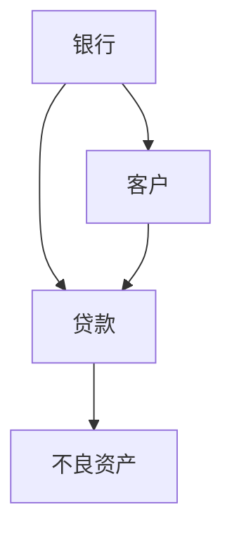
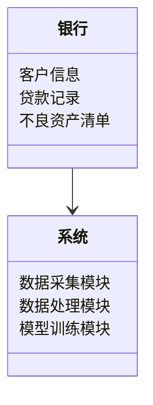
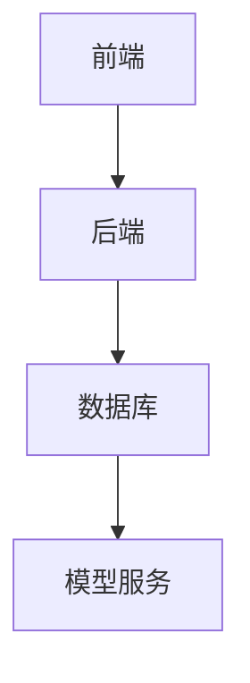
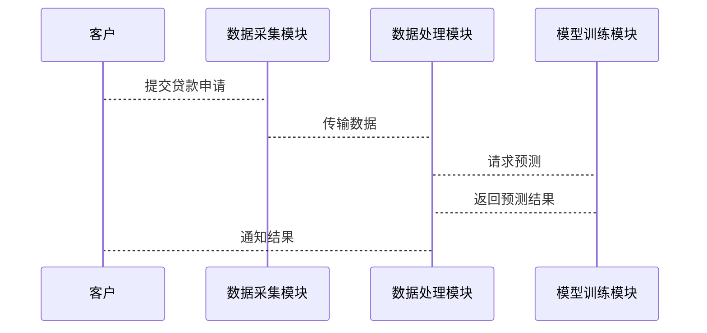

                 


# 智能银行不良资产管理优化系统

## 关键词：智能银行、不良资产管理、优化系统、机器学习、风险管理

## 摘要：本文详细探讨了智能银行不良资产管理优化系统的设计与实现，从背景、核心概念、算法原理、系统架构到项目实战，全面分析了如何利用人工智能和大数据技术优化银行不良资产管理流程，提升风险控制能力和运营效率。

---

# 第一部分: 智能银行不良资产管理优化系统概述

## 第1章: 智能银行不良资产管理的背景与意义

### 1.1 不良资产管理的背景介绍

#### 1.1.1 银行不良资产的定义与分类
不良资产是指银行发放的贷款或投资中未能按期收回本息的资产。根据五级分类法，不良资产包括：
- **次级类**：借款人还款能力明显增强，可能存在问题。
- **可疑类**：存在重大问题，还款可能性较低。
- **损失类**：基本无法收回，或仅能收回极少部分。

#### 1.1.2 不良资产管理的重要性
不良资产管理直接关系到银行的资产质量和盈利能力。通过科学的管理手段，可以有效降低风险，提升资产流动性。

#### 1.1.3 智能化管理的必要性
传统不良资产管理依赖人工经验，效率低且易受主观因素影响。智能化管理能够快速处理海量数据，提高精准度和效率。

---

## 第2章: 不良资产管理优化系统的核心概念

### 2.1 不良资产管理优化系统的定义

#### 2.1.1 系统的目标
通过智能算法，实现不良资产的自动识别、分类、预警和处置，降低管理成本，提高效率。

#### 2.1.2 系统的组成要素
- 数据采集模块
- 数据处理模块
- 模型训练模块
- 结果输出模块

#### 2.1.3 系统的边界与外延
系统仅处理不良资产数据，不涉及银行其他业务系统的数据。

### 2.2 核心概念与联系

#### 2.2.1 实体关系图（ER图）


---

# 第二部分: 不良资产管理优化系统的算法原理

## 第3章: 不良资产管理优化系统的算法原理

### 3.1 数据预处理

#### 3.1.1 数据清洗
去除重复数据、处理缺失值、修正异常值。

#### 3.1.2 数据标准化
使用归一化方法，将不同量纲的数据统一到相同范围内。

#### 3.1.3 数据特征提取
提取关键特征，如贷款金额、还款周期、借款人信用评分等。

### 3.2 模型训练

#### 3.2.1 逻辑回归模型
逻辑回归是一种常用的分类算法，适用于二分类问题。
$$ P(y=1|x) = \frac{e^{\beta_0 + \beta_1x}}{1 + e^{\beta_0 + \beta_1x}} $$

#### 3.2.2 支持向量机（SVM）
SVM适用于高维数据的分类，通过构建超平面实现。
$$ \text{目标函数} = \min \frac{1}{2}\|w\|^2 + C \sum_{i=1}^{n} \xi_i $$
$$ \text{约束条件} = y_i(w \cdot x_i + b) \geq 1 - \xi_i $$
$$ \xi_i \geq 0 $$

#### 3.2.3 随机森林
随机森林通过集成多个决策树，提高模型的准确性和稳定性。

### 3.3 模型评估与优化

#### 3.3.1 评估指标
- 准确率（Accuracy）
- 召回率（Recall）
- F1分数（F1 Score）

#### 3.3.2 超参数优化
使用网格搜索或随机搜索，找到最优参数组合。

---

# 第三部分: 不良资产管理优化系统的系统架构设计

## 第4章: 不良资产管理优化系统的系统架构设计

### 4.1 系统功能设计

#### 4.1.1 领域模型


### 4.2 系统架构设计

#### 4.2.1 分层架构


### 4.3 系统接口设计

#### 4.3.1 API接口定义
- 数据采集接口：`GET /api/data`
- 模型预测接口：`POST /api/predict`

#### 4.3.2 接口交互流程


---

# 第四部分: 不良资产管理优化系统的项目实战

## 第5章: 不良资产管理优化系统的项目实战

### 5.1 环境安装与配置

#### 5.1.1 开发环境搭建
- 安装Python 3.8+
- 安装Jupyter Notebook
- 安装必要的库：`scikit-learn`, `pandas`, `numpy`

#### 5.1.2 依赖管理
使用`requirements.txt`管理依赖：
```text
scikit-learn==1.0.2
pandas==1.3.5
numpy==1.21.2
```

### 5.2 系统核心实现

#### 5.2.1 数据采集模块
```python
import pandas as pd

# 读取数据
data = pd.read_csv('loans.csv')
```

#### 5.2.2 数据处理模块
```python
from sklearn.preprocessing import StandardScaler

# 标准化处理
scaler = StandardScaler()
data_scaled = scaler.fit_transform(data[['loan_amount', 'credit_score']])
```

#### 5.2.3 模型训练模块
```python
from sklearn.linear_model import LogisticRegression

# 训练模型
model = LogisticRegression()
model.fit(data_scaled, data['label'])
```

#### 5.2.4 结果输出模块
```python
# 预测结果
predicted = model.predict(data_scaled)
print(predicted)
```

### 5.3 项目实战案例分析

#### 5.3.1 数据分析与特征工程
- 数据清洗：去除缺失值和异常值。
- 特征选择：选择与不良资产相关的特征。

#### 5.3.2 模型评估与优化
- 使用混淆矩阵和ROC曲线评估模型性能。
- 调整模型参数，优化准确率和召回率。

### 5.4 项目小结

---

# 第五部分: 总结与展望

## 第6章: 总结与展望

### 6.1 项目总结
本文详细介绍了智能银行不良资产管理优化系统的开发过程，从数据采集、处理到模型训练，再到系统架构设计，最终实现了一个高效的不良资产管理系统。

### 6.2 未来展望
未来，随着人工智能技术的进步，不良资产管理将更加智能化和自动化。可以进一步研究深度学习模型，如神经网络，以提升预测精度。

---

## 最佳实践 Tips

1. 在数据预处理阶段，建议使用自动化工具（如`pandas`和`numpy`）来提高效率。
2. 模型选择时，建议进行多次实验，比较不同算法的性能。
3. 系统部署时，注意性能优化，确保在高并发场景下的稳定运行。

---

## 小结

智能银行不良资产管理优化系统通过结合人工智能和大数据技术，显著提升了银行的资产管理效率和风险控制能力。本文通过详细的技术分析和实战案例，为读者提供了一个完整的实现方案。

---

## 注意事项

- 数据隐私保护：在处理客户数据时，必须遵守相关法律法规，确保数据安全。
- 模型解释性：选择可解释性较强的模型，便于业务人员理解和使用。

---

## 拓展阅读

1. 《机器学习实战》：深入浅出地讲解了机器学习的基本概念和算法实现。
2. 《Python数据分析 cookbook》：提供了丰富的数据处理和分析技巧。

--- 

以上是《智能银行不良资产管理优化系统》的技术博客文章的完整内容。

