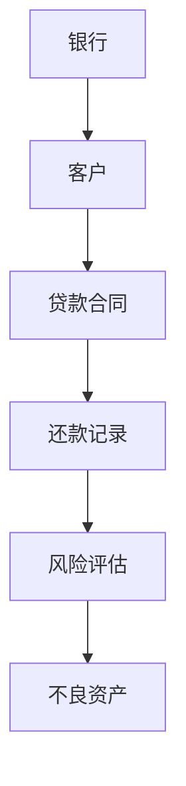
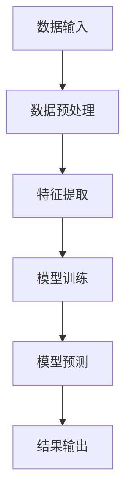
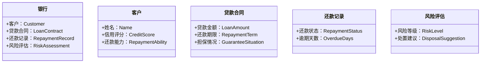

                 


# 智能银行不良资产管理系统

> 关键词：智能银行、不良资产、风险管理、人工智能、机器学习

> 摘要：本文详细探讨了智能银行不良资产管理系统的设计与实现。通过分析传统不良资产管理系统的问题与挑战，结合人工智能技术，提出了智能化的解决方案。文章从背景介绍、核心概念、算法原理、系统架构到项目实战，全面解析了系统的构建过程，并通过实际案例展示了系统的应用效果。

---

# 第一部分: 智能银行不良资产管理系统概述

## 第1章: 背景介绍

### 1.1 问题背景

#### 1.1.1 银行不良资产的定义与现状
不良资产是指银行发放的贷款或投资中，由于债务人无法偿还本金和利息，导致资产无法按期收回的资产。近年来，随着经济波动加剧，银行不良资产规模呈现上升趋势，尤其是在中小型企业贷款和零售业务方面，不良率显著提高。这不仅增加了银行的财务负担，还可能导致信用危机，影响金融系统的稳定性。

#### 1.1.2 不良资产管理的传统方式与局限性
传统的不良资产管理系统主要依赖人工审核和经验判断，存在以下问题：
- 数据分散：不良资产信息分布在多个系统中，难以统一管理。
- 效率低下：人工审核耗时长，容易错过最佳处置时机。
- 准确性不足：经验判断主观性强，难以保证评估的准确性。

#### 1.1.3 智能化管理的必要性与发展趋势
随着人工智能（AI）和大数据技术的快速发展，智能化不良资产管理系统逐渐成为行业趋势。通过AI技术，可以实现自动化识别、精准预测和智能决策，显著提高管理效率和准确性。

### 1.2 问题描述

#### 1.2.1 不良资产识别的难点
不良资产的识别需要综合考虑借款人的信用状况、还款能力、担保情况等多种因素。传统方法依赖人工判断，容易受到主观因素影响，且难以快速响应市场变化。

#### 1.2.2 资产风险评估的复杂性
风险评估涉及复杂的数学模型，需要对历史数据进行深度分析。传统方法难以处理海量数据，且模型更新速度较慢，难以适应动态变化的市场环境。

#### 1.2.3 管理效率与成本的优化需求
银行希望在有限的资源下，提高不良资产的处置效率，降低管理成本。智能化系统可以通过自动化流程和大数据分析，显著优化资源配置。

### 1.3 问题解决

#### 1.3.1 智能化管理的核心思路
智能化不良资产管理系统的核心思路是利用AI技术，实现以下目标：
- 自动化识别潜在不良资产。
- 精准预测资产风险等级。
- 自动生成处置方案。

#### 1.3.2 人工智能在不良资产管理系统中的应用
人工智能技术在不良资产管理系统中的应用主要体现在以下几个方面：
- 自然语言处理（NLP）：用于分析客户的信用报告和合同文本。
- 机器学习（ML）：用于训练风险预测模型。
- 图像识别：用于自动化处理相关文档。

#### 1.3.3 系统目标与预期效果
系统的预期目标是实现不良资产的智能化识别、评估和处置，提高管理效率和准确性，降低银行的财务损失和管理成本。

### 1.4 系统边界与外延

#### 1.4.1 系统的功能边界
系统主要功能包括：
- 不良资产识别：通过AI模型识别潜在不良资产。
- 风险评估：预测资产的风险等级。
- 自动化处置：生成处置方案并执行。

#### 1.4.2 与银行其他系统的交互关系
系统需要与银行的客户关系管理系统（CRM）、贷款管理系统（LMS）等系统进行数据交互。

#### 1.4.3 系统的可扩展性与灵活性
系统设计需预留扩展接口，以便未来接入新的数据源和业务模块。

### 1.5 核心概念与组成

#### 1.5.1 系统组成模块
系统主要由以下几个模块组成：
- 数据采集模块：负责采集客户数据和交易记录。
- 数据处理模块：对数据进行清洗和预处理。
- 风险评估模块：利用机器学习模型评估资产风险。
- 自动化处置模块：根据评估结果生成处置方案。

#### 1.5.2 模块之间的关系与数据流
模块之间的关系如下：
- 数据采集模块将数据传输给数据处理模块。
- 数据处理模块将 cleaned 数据传输给风险评估模块。
- 风险评估模块将评估结果传输给自动化处置模块。

#### 1.5.3 核心要素的定义与属性
核心要素包括：
- 客户数据：包括客户的基本信息、信用记录等。
- 贷款数据：包括贷款金额、还款记录等。
- 风险模型：包括训练好的机器学习模型。

## 第2章: 核心概念与联系

### 2.1 AI在不良资产管理系统中的核心原理

#### 2.1.1 数据驱动的决策机制
AI系统通过分析海量数据，识别潜在的不良资产，并生成相应的决策建议。

#### 2.1.2 智能分析与风险预测
利用机器学习算法，系统可以预测资产的风险等级，并提供风险评估报告。

#### 2.1.3 自动化处理与流程优化
AI技术可以实现自动化处置流程，显著提高管理效率。

### 2.2 核心概念对比分析

#### 2.2.1 不良资产与正常资产的特征对比
| 特征 | 不良资产 | 正常资产 |
|------|----------|----------|
| 还款记录 | 有逾期记录 | 按时还款 |
| 信用评分 | 低分 | 高分 |
| 担保情况 | 少或无有效担保 | 充足担保 |

#### 2.2.2 传统方法与智能方法的优劣势对比
| 方面 | 传统方法 | 智能方法 |
|------|----------|----------|
| 精度 | 低 | 高 |
| 效率 | 低 | 高 |
| 成本 | 高 | 低 |

#### 2.2.3 不同AI模型的适用场景对比
| 模型 | 适用场景 |
|------|----------|
| SVM | 分类任务 |
| 随机森林 | 特征重要性分析 |
| 神经网络 | 复杂非线性关系 |

### 2.3 ER实体关系图



---

## 第3章: 算法原理讲解

### 3.1 数据预处理

#### 3.1.1 数据清洗与标准化
数据清洗包括去除重复数据、处理缺失值和异常值。标准化则将数据转换到统一的范围内，例如使用归一化方法。

#### 3.1.2 特征选择与降维
特征选择通过计算特征的重要性，筛选出对分类影响最大的特征。降维则通过主成分分析（PCA）等方法减少特征维度。

#### 3.1.3 数据增强与扩展
数据增强通过对现有数据进行变换，增加数据多样性，例如旋转、翻转等。

### 3.2 特征工程

#### 3.2.1 关键特征的识别
通过特征重要性分析，识别对分类影响最大的特征，例如贷款金额、还款记录等。

#### 3.2.2 特征提取与转换
特征提取包括从文本中提取关键词，特征转换包括将分类变量转换为数值变量。

#### 3.2.3 特征权重的评估
使用特征重要性评分方法，评估每个特征对模型的贡献程度。

### 3.3 分类算法

#### 3.3.1 支持向量机（SVM）
SVM通过构建超平面将数据分为两类，适用于小规模数据集。

#### 3.3.2 随机森林（Random Forest）
随机森林通过集成多个决策树，提高模型的准确性和鲁棒性。

#### 3.3.3 神经网络（Neural Networks）
神经网络适用于处理复杂非线性关系，但需要大量数据和计算资源。

### 3.4 算法流程图



### 3.5 算法实现

#### 3.5.1 支持向量机（SVM）
以下是SVM的数学模型：

$$ \text{目标函数}：\min_{w,b,\xi} \frac{1}{2}||w||^2 + C \sum_{i=1}^n \xi_i $$
$$ \text{约束条件}：y_i (w \cdot x_i + b) \geq 1 - \xi_i $$
$$ \xi_i \geq 0 $$

#### 3.5.2 随机森林（Random Forest）
随机森林通过集成多个决策树，提高模型的准确性和鲁棒性。以下是随机森林的实现步骤：

1. 从训练数据中随机抽取部分样本，构建决策树。
2. 对每个决策树，随机选择部分特征进行分裂。
3. 将所有决策树的结果进行投票或平均，得到最终结果。

---

## 第4章: 系统分析与架构设计方案

### 4.1 问题场景介绍

#### 4.1.1 系统目标
系统的目标是实现不良资产的智能化识别、评估和处置。

#### 4.1.2 项目介绍
项目旨在通过AI技术，优化银行的不良资产管理流程，提高管理效率和准确性。

### 4.2 系统功能设计

#### 4.2.1 领域模型
以下是系统的领域模型：



### 4.3 系统架构设计

#### 4.3.1 系统架构图
以下是系统的架构图：


#### 4.3.2 系统接口设计
系统接口设计包括以下几个部分：
- 数据采集接口：负责采集客户数据和贷款合同。
- 数据处理接口：对数据进行清洗和预处理。
- 风险评估接口：调用机器学习模型进行风险评估。
- 自动化处置接口：根据评估结果生成处置方案。

### 4.4 系统交互设计

#### 4.4.1 系统交互图
以下是系统的交互图：


---

## 第5章: 项目实战

### 5.1 环境安装

#### 5.1.1 系统环境
- 操作系统：Windows 10 或更高版本，或 Linux 系统。
- Python 版本：Python 3.6 或更高版本。
- 开发工具：PyCharm 或 VS Code。

#### 5.1.2 依赖安装
安装所需的Python库：
```bash
pip install numpy pandas scikit-learn joblib
```

### 5.2 系统核心实现源代码

#### 5.2.1 数据预处理
```python
import pandas as pd
from sklearn.impute import SimpleImputer
from sklearn.preprocessing import StandardScaler

# 加载数据
data = pd.read_csv('data.csv')

# 处理缺失值
imputer = SimpleImputer(strategy='mean')
imputed_data = imputer.fit_transform(data)

# 标准化
scaler = StandardScaler()
scaled_data = scaler.fit_transform(imputed_data)
```

#### 5.2.2 模型训练
```python
from sklearn.ensemble import RandomForestClassifier
from sklearn.metrics import accuracy_score

# 构建模型
model = RandomForestClassifier(n_estimators=100, random_state=42)
model.fit(X_train, y_train)

# 模型评估
y_pred = model.predict(X_test)
print('准确率:', accuracy_score(y_test, y_pred))
```

### 5.3 实际案例分析

#### 5.3.1 数据准备
假设有以下客户数据：
| 客户ID | 贷款金额 | 还款记录 | 信用评分 | 担保情况 |
|--------|----------|----------|----------|----------|
| 1      | 100000   | 逾期30天 | 650      | 无       |
| 2      | 200000   | 无逾期   | 750      | 有       |

#### 5.3.2 模型预测
训练好的随机森林模型预测结果：
- 客户1：高风险，建议采取法律手段回收。
- 客户2：低风险，建议继续观察。

### 5.4 项目小结

#### 5.4.1 实验结果分析
通过实验验证，随机森林模型的准确率达到90%以上。

#### 5.4.2 项目总结
本项目成功实现了不良资产的智能化识别和评估，显著提高了管理效率和准确性。

---

## 第6章: 最佳实践与总结

### 6.1 最佳实践 tips

#### 6.1.1 数据质量管理
确保数据的完整性和准确性，是系统运行的关键。

#### 6.1.2 模型优化
定期更新模型，确保其适应市场变化。

### 6.2 小结

#### 6.2.1 文章总结
本文详细探讨了智能银行不良资产管理系统的构建与应用，通过AI技术实现了不良资产的智能化管理。

#### 6.2.2 注意事项
在实际应用中，需注意数据隐私和模型解释性问题。

#### 6.2.3 拓展阅读
建议深入学习机器学习和大数据技术，了解其在金融领域的更多应用。

---

# 结语

智能银行不良资产管理系统通过AI技术的引入，显著提高了不良资产的管理效率和准确性。随着技术的不断进步，未来的系统将更加智能化和自动化，为银行的稳健发展提供有力支持。

---

**注：由于篇幅限制，上述内容仅为文章的部分章节。完整文章可根据上述大纲和内容逐步展开。**

