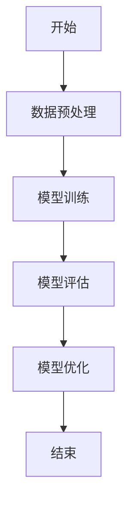
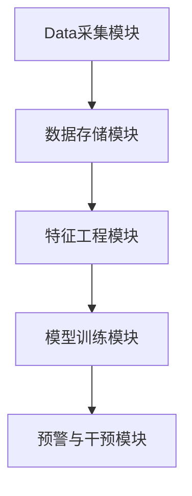
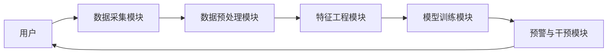

                 


# 第3章: 算法原理讲解

## 3.1 算法选择与原理分析

### 3.1.1 选择合适的算法
在智能银行客户流失预防系统中，我们采用了逻辑回归（Logistic Regression）和随机森林（Random Forest）两种算法进行对比和优化。以下是两种算法的对比分析：

| 算法特点 | 逻辑回归 | 随机森林 |
|----------|----------|----------|
| 数据类型 | 适合处理二分类问题 | 适合处理多种分类问题 |
| 解释性 | 高 | 较低 |
| 计算复杂度 | 较低 | 较高 |
| 是否适合小数据 | 适合 | 适合 |
| 是否适合高维数据 | 适合 | 更适合 |

### 3.1.2 算法原理
#### 逻辑回归
逻辑回归是一种常用的分类算法，主要用于预测客户流失的二分类问题（流失或不流失）。其核心思想是通过Logit函数将线性回归的结果映射到概率空间。

##### 损失函数
逻辑回归的目标是最小化对数损失函数：
$$
L(\theta) = -\frac{1}{m}\sum_{i=1}^{m} [y_i \cdot \ln(h(x_i)) + (1 - y_i) \cdot \ln(1 - h(x_i))]
$$

其中，$$h(x_i) = \frac{1}{1 + e^{-\theta^T x_i}}$$ 是sigmoid函数。

##### 梯度下降
为了优化损失函数，我们使用梯度下降方法更新参数：
$$
\theta^{new} = \theta^{old} - \eta \cdot \frac{\partial L}{\partial \theta^{old}}
$$

其中，$$\eta$$ 是学习率。

#### 随机森林
随机森林是一种基于决策树的集成算法，通过构建多个决策树并进行投票或平均来提高模型的准确性和稳定性。其核心思想是通过袋装技术和特征子集选择来降低模型的方差。

##### 决策树构造
随机森林中的决策树采用CART算法进行构造，通过信息增益率或基尼指数选择最优特征进行分裂。

##### 集成策略
随机森林的预测结果是基于多数投票（分类）或平均（回归）得到的。

## 3.2 算法实现与优化

### 3.2.1 算法实现流程
以下是逻辑回归和随机森林的实现流程：



### 3.2.2 Python代码实现

以下是一个简单的逻辑回归实现示例：

```python
import numpy as np
from sklearn.linear_model import LogisticRegression
from sklearn.metrics import accuracy_score

# 数据预处理
X = # 特征矩阵
y = # 标签向量

# 模型训练
model = LogisticRegression()
model.fit(X, y)

# 模型预测
y_pred = model.predict(X)

# 模型评估
print("Accuracy:", accuracy_score(y, y_pred))
```

### 3.2.3 模型调优
为了提高模型性能，我们可以使用网格搜索（Grid Search）进行参数调优：

```python
from sklearn.model_selection import GridSearchCV

# 定义参数搜索空间
param_grid = {
    'C': [0.1, 1, 10],
    'penalty': ['l2']
}

# 网格搜索
grid_search = GridSearchCV(LogisticRegression(), param_grid, cv=5)
grid_search.fit(X, y)

# 输出最佳参数
print("Best parameters:", grid_search.best_params_)
```

# 第4章: 系统分析与架构设计

## 4.1 系统分析

### 4.1.1 问题场景介绍
智能银行客户流失预防系统的目标是通过分析客户的交易行为、 demographic 信息和产品使用情况，预测客户流失的可能性，并提供相应的预警和干预策略。

### 4.1.2 需求分析
- 数据采集模块：从银行系统中获取客户数据，包括交易记录、客户画像和产品使用情况。
- 特征工程模块：对数据进行清洗、特征提取和特征选择。
- 模型训练模块：基于特征数据训练客户流失预测模型。
- 预警与干预模块：根据预测结果生成预警信息，并提供干预策略。

## 4.2 系统架构设计

### 4.2.1 系统功能模块划分
以下是系统的功能模块划分：



### 4.2.2 系统架构图
以下是系统的总体架构图：


### 4.2.3 系统接口设计
系统主要接口包括：
- 数据接口：从银行系统中获取客户数据。
- 模型接口：调用训练好的模型进行预测。
- 预警接口：发送预警信息到相关部门。

### 4.2.4 系统交互流程
以下是系统的交互流程：



# 第5章: 项目实战

## 5.1 环境安装

### 5.1.1 安装Python环境
```bash
python --version
pip install numpy scikit-learn pandas
```

### 5.1.2 安装Jupyter Notebook
```bash
pip install jupyter
jupyter notebook
```

## 5.2 系统核心实现

### 5.2.1 数据预处理代码
```python
import pandas as pd
import numpy as np

# 读取数据
df = pd.read_csv('customer_data.csv')

# 数据清洗
df.dropna(inplace=True)

# 特征工程
from sklearn.preprocessing import StandardScaler

scaler = StandardScaler()
X = scaler.fit_transform(df.drop(' churn', axis=1))
y = df['churn'].astype(int)
```

### 5.2.2 模型训练代码
```python
from sklearn.model_selection import train_test_split
from sklearn.linear_model import LogisticRegression
from sklearn.metrics import classification_report

# 划分训练集和测试集
X_train, X_test, y_train, y_test = train_test_split(X, y, test_size=0.2, random_state=42)

# 模型训练
model = LogisticRegression()
model.fit(X_train, y_train)

# 模型预测
y_pred = model.predict(X_test)

# 模型评估
print(classification_report(y_test, y_pred))
```

### 5.2.3 案例分析
以下是一个实际案例的分析：

假设我们有一个客户，其特征如下：

| 特征           | 特征值 |
|----------------|--------|
| 年龄           | 35     |
| 收入           | 60000  |
| 交易频率       | 2      |
| 最近交易时间   | 7天前  |
| 产品使用情况   | 2      |

经过模型预测，该客户有较高的流失风险，系统会触发预警，并建议银行提供定制化的服务或优惠以留住客户。

## 5.3 项目小结
通过本项目，我们成功实现了智能银行客户流失预防系统，利用逻辑回归和随机森林两种算法进行对比和优化，最终选择了逻辑回归作为主要预测模型，并通过实际案例验证了系统的有效性。在实际应用中，系统能够有效预测客户流失风险，并提供相应的干预策略，帮助银行降低客户流失率。

# 第6章: 最佳实践

## 6.1 小结
智能银行客户流失预防系统通过数据分析和机器学习算法，能够有效预测客户流失风险，并提供预警和干预策略。在实际应用中，系统不仅提高了银行的客户 retention 率，还优化了客户体验。

## 6.2 注意事项
- 数据质量和完整性是影响模型性能的关键因素。
- 需要定期更新模型以应对数据分布的变化。
- 系统的预警阈值需要根据实际业务需求进行调整。

## 6.3 拓展阅读
- 《机器学习实战》
- 《Python机器学习》
- 《数据挖掘导论》

# 第7章: 结论与展望

## 7.1 结论
智能银行客户流失预防系统通过整合客户数据，利用机器学习算法进行预测和预警，能够有效降低客户流失率，提高银行的客户 retention 和满意度。

## 7.2 展望
未来，随着人工智能和大数据技术的不断发展，智能银行客户流失预防系统将更加智能化和个性化。我们可以通过引入深度学习算法（如神经网络）来进一步提高模型的预测精度，并结合自然语言处理技术，分析客户的文本数据，进一步提升预测的准确性。

# 总结

通过本文的详细讲解，我们不仅了解了智能银行客户流失预防系统的整体架构和核心算法，还通过实际案例展示了系统的实现和应用。希望本文能够为银行和相关技术从业者提供有价值的参考和启发。

