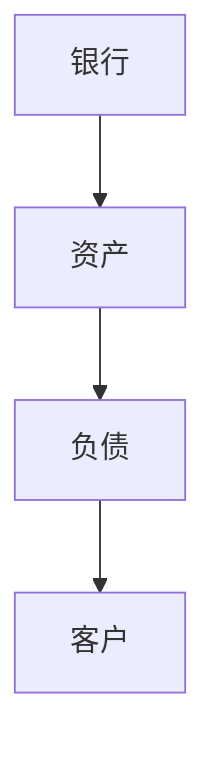
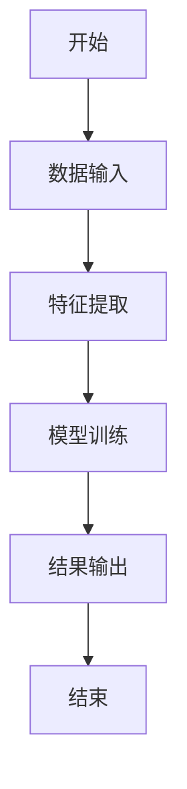
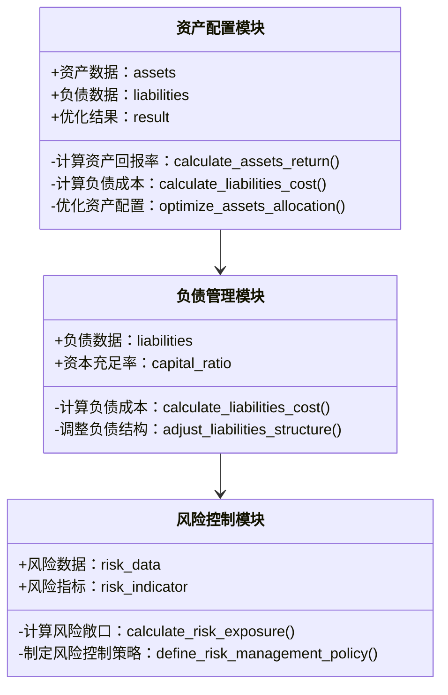
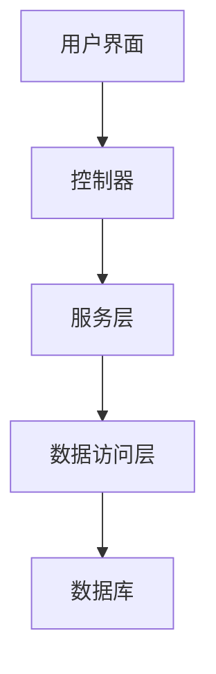
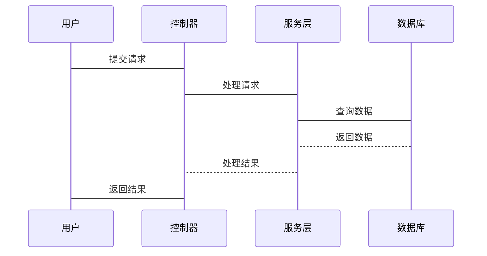

                 


# 智能银行资产负债管理优化系统

> 关键词：智能银行，资产负债管理，优化系统，人工智能，金融技术

> 摘要：本文详细介绍了智能银行资产负债管理优化系统的构建与实现，从系统背景、核心概念、算法原理、系统架构到项目实战，全面解析了如何利用人工智能技术优化银行的资产负债管理，提升银行的运营效率和风险控制能力。

---

# 第1章: 智能银行资产负债管理优化系统背景与概述

## 1.1 问题背景与描述

### 1.1.1 银行资产负债管理的传统模式与挑战
传统的银行资产负债管理依赖于人工操作和简单的规则模型，存在效率低、风险控制不足、决策滞后等问题。随着金融市场环境的复杂化和客户需求的多样化，传统的管理模式已经难以满足现代银行的高效运营需求。

### 1.1.2 智能化管理的必要性与目标
智能化管理通过引入人工智能、大数据分析等技术，能够实时监控和优化银行的资产负债结构，提高资本配置效率，降低风险敞口。目标是在确保合规性和风险可控的前提下，最大化银行的资产回报率和资本效率。

### 1.1.3 智能银行资产负债管理优化系统的边界与外延
系统边界主要集中在银行内部的资产负债管理模块，包括资产配置、负债结构调整、资本充足率监控等功能。外延则涉及与外部市场的数据交互，如金融市场数据、客户行为数据等。

## 1.2 核心概念与问题解决

### 1.2.1 智能银行的定义与特征
智能银行是指通过人工智能技术实现金融服务的智能化、自动化和个性化。其核心特征包括智能化决策、个性化服务、实时监控和高效运营。

### 1.2.2 资产负债管理的核心要素
资产负债管理的核心要素包括资产配置、负债结构调整、资本充足率监控、风险控制等。

### 1.2.3 优化系统的目标与实现路径
系统目标是通过优化算法实现资产负债结构的动态调整，提高资本回报率和风险控制能力。实现路径包括数据采集、模型构建、算法优化、实时监控等。

## 1.3 系统的核心要素与结构

### 1.3.1 系统组成模块
系统主要包括数据采集模块、模型构建模块、优化算法模块、实时监控模块和结果输出模块。

### 1.3.2 核心算法与技术
核心算法包括强化学习、动态规划、遗传算法等。技术包括大数据处理、机器学习模型构建、实时数据分析等。

### 1.3.3 系统架构与功能模块
系统架构采用模块化设计，主要包括数据层、算法层、应用层和用户界面层。

## 1.4 本章小结

### 1.4.1 核心概念总结
智能银行通过引入人工智能技术，实现资产负债管理的智能化和自动化，提高银行的运营效率和风险控制能力。

### 1.4.2 系统实现的关键点
系统实现的关键点包括数据采集的准确性、算法模型的优化、实时监控的稳定性等。

### 1.4.3 未来发展的方向
未来发展方向包括算法的进一步优化、系统功能的扩展、与更多金融业务的融合等。

---

# 第2章: 智能银行资产负债管理优化系统的核心概念与联系

## 2.1 核心概念原理

### 2.1.1 智能银行的定义与特征
智能银行通过人工智能技术实现金融服务的智能化，其特征包括智能化决策、个性化服务和高效运营。

### 2.1.2 资产负债管理的核心原理
资产负债管理的核心原理是通过优化算法实现资产与负债的动态平衡，提高资本回报率和风险控制能力。

### 2.1.3 优化系统的数学模型
优化系统的数学模型包括目标函数和约束条件，目标函数通常是最优化资产回报率或最小化风险敞口。

## 2.2 核心概念对比分析

### 2.2.1 AI技术与传统资产负债管理的对比
AI技术能够实现实时监控和动态调整，而传统方法依赖于定期报告和静态模型。

### 2.2.2 不同优化算法的优劣势分析
强化学习适合复杂环境下的优化，而动态规划适用于短期规划问题。

### 2.2.3 系统模块之间的关系与依赖
系统模块之间的关系是数据驱动的，优化算法模块依赖于数据采集模块提供的实时数据，实时监控模块依赖于优化算法模块的输出结果。

## 2.3 实体关系图与流程图

### 2.3.1 ER实体关系图


### 2.3.2 核心算法流程图


## 2.4 本章小结

### 2.4.1 核心概念的总结
智能银行通过AI技术实现资产负债管理的智能化，优化系统的数学模型是实现动态调整的核心。

### 2.4.2 系统模块的联系
系统模块之间的关系是数据驱动的，优化算法模块依赖于实时数据，实时监控模块依赖于优化结果。

### 2.4.3 优化算法的选择与优化
选择优化算法时需要考虑问题的复杂性和实时性要求，动态规划适合短期规划，强化学习适合复杂环境下的优化。

---

# 第3章: 智能银行资产负债管理优化系统的算法原理

## 3.1 算法原理概述

### 3.1.1 强化学习的定义与特点
强化学习是一种通过试错机制实现目标优化的技术，具有实时性高、适应性强的特点。

### 3.1.2 动态规划的定义与特点
动态规划是一种通过分解问题实现全局优化的技术，适用于具有阶段性的优化问题。

### 3.1.3 遗传算法的定义与特点
遗传算法是一种通过模拟生物进化过程实现优化的技术，适用于复杂问题的全局优化。

## 3.2 算法实现步骤

### 3.2.1 强化学习的实现步骤
1. 状态空间定义
2. 动作空间定义
3. 奖励函数设计
4. 策略网络构建
5. 训练与优化

### 3.2.2 动态规划的实现步骤
1. 状态转移方程定义
2. 价值函数初始化
3. 动态规划迭代
4. 优化结果输出

### 3.2.3 遗传算法的实现步骤
1. 初始化种群
2. 计算适应度
3. 选择与交叉
4. 变异与优化

## 3.3 算法实现的数学模型

### 3.3.1 强化学习的数学模型
$$ Q(s,a) = Q(s,a) + \alpha (r + \gamma Q(s',a') - Q(s,a)) $$

### 3.3.2 动态规划的数学模型
$$ V_{n+1}(s) = \max_{a} \{ R(s,a) + \gamma V_n(s') \} $$

### 3.3.3 遗传算法的数学模型
$$ f(x) = \sum_{i=1}^{n} (x_i - mean)^2 $$

## 3.4 算法实现的Python代码示例

### 3.4.1 强化学习代码示例
```python
class DQN:
    def __init__(self, state_space, action_space):
        self.state_space = state_space
        self.action_space = action_space
        # 策略网络
        self.q_network = self.build_network()
        # 目标网络
        self.target_network = self.build_network()
        # 其他参数
        self.learning_rate = 0.01
        self.gamma = 0.99
        self.epsilon = 0.1
        self.optimizer = tf.keras.optimizers.Adam(lr=self.learning_rate)

    def build_network(self):
        model = tf.keras.Sequential()
        model.add(tf.keras.layers.Dense(32, activation='relu', input_dim=self.state_space))
        model.add(tf.keras.layers.Dense(self.action_space, activation='linear'))
        return model

    def act(self, state):
        if np.random.random() < self.epsilon:
            return random.randint(0, self.action_space-1)
        else:
            q_values = self.q_network.predict(state.reshape(1, -1))
            return np.argmax(q_values[0])
```

### 3.4.2 动态规划代码示例
```python
def dynamic_programming():
    # 初始化价值函数
    V = np.zeros(state_space)
    # 迭代优化
    for _ in range(iterations):
        for s in range(state_space):
            max_v = -float('inf')
            for a in range(action_space):
                next_state = transition(s, a)
                reward = reward_function(s, a)
                future_reward = reward + gamma * V[next_state]
                if future_reward > max_v:
                    max_v = future_reward
            V[s] = max_v
    return V
```

### 3.4.3 遗传算法代码示例
```python
def genetic_algorithm():
    # 初始化种群
    population = np.random.rand(pop_size, n_vars)
    # 计算适应度
    fitness = np.zeros(pop_size)
    for i in range(pop_size):
        fitness[i] = evaluate(population[i])
    # 迭代优化
    for _ in range(max_gen):
        # 选择
        selected = select(population, fitness)
        # 交叉
        crossed = crossover(selected)
        # 变异
        mutated = mutate(crossed)
        # 重新计算适应度
        new_fitness = np.zeros(pop_size)
        for i in range(pop_size):
            new_fitness[i] = evaluate(mutated[i])
        # 更新种群
        population = mutated
        fitness = new_fitness
    return population, fitness
```

## 3.5 本章小结

### 3.5.1 算法原理的总结
强化学习、动态规划和遗传算法各有优缺点，适用于不同的优化场景。

### 3.5.2 算法实现的关键点
算法实现的关键点包括状态空间定义、动作空间定义、奖励函数设计、模型训练与优化。

### 3.5.3 算法选择与优化的建议
根据问题的复杂性和实时性要求选择合适的算法，动态规划适合短期优化，强化学习适合复杂环境下的优化。

---

# 第4章: 智能银行资产负债管理优化系统的系统分析与架构设计

## 4.1 系统分析

### 4.1.1 问题场景介绍
银行资产负债管理的优化需要实时监控和动态调整，传统方法难以满足需求。

### 4.1.2 系统功能设计
系统功能包括资产配置优化、负债结构调整、资本充足率监控、风险控制等。

### 4.1.3 领域模型类图


## 4.2 系统架构设计

### 4.2.1 系统架构图


### 4.2.2 系统接口设计
系统接口包括数据接口、算法接口和用户接口。

### 4.2.3 系统交互流程


## 4.3 本章小结

### 4.3.1 系统分析的重要性
系统分析是系统设计的基础，能够明确系统的需求和功能。

### 4.3.2 系统架构设计的关键点
系统架构设计的关键点包括模块划分、接口设计和交互流程优化。

### 4.3.3 系统功能模块的联系
系统功能模块之间的联系是数据驱动的，资产配置模块依赖于负债管理模块的数据，负债管理模块依赖于风险控制模块的结果。

---

# 第5章: 智能银行资产负债管理优化系统的项目实战

## 5.1 项目环境安装

### 5.1.1 系统环境要求
- 操作系统：Linux/Windows/MacOS
- Python版本：3.6+
- 依赖库：TensorFlow, Keras, Pandas, NumPy, Mermaid, PyYAML

### 5.1.2 安装依赖
```bash
pip install tensorflow pandas numpy mermaid4jupyter pyyaml
```

## 5.2 系统核心实现

### 5.2.1 核心代码实现
```python
# 模型训练代码
import tensorflow as tf
import numpy as np

# 定义模型
model = tf.keras.Sequential([
    tf.keras.layers.Dense(64, activation='relu', input_shape=(input_dim,)),
    tf.keras.layers.Dense(output_dim)
])

# 编译模型
model.compile(optimizer='adam', loss='mean_squared_error')

# 训练模型
model.fit(X_train, y_train, epochs=100, batch_size=32)
```

### 5.2.2 代码应用解读与分析
代码实现包括数据预处理、模型构建、模型训练和结果输出。数据预处理包括特征提取和数据标准化，模型构建包括神经网络层的定义，模型训练包括训练数据的输入和优化参数的设置。

### 5.2.3 算法优化与调优
算法优化包括调整学习率、优化算法选择、模型结构优化等。例如，可以尝试使用Adam优化器替代SGD，增加隐藏层节点数等。

## 5.3 案例分析与详细解读

### 5.3.1 数据准备
数据准备包括资产数据、负债数据、市场数据等，需要进行清洗和预处理。

### 5.3.2 模型训练
模型训练包括数据输入、特征提取、模型训练和结果输出。

### 5.3.3 结果分析
结果分析包括模型性能评估、优化效果分析、风险控制能力评估等。

## 5.4 本章小结

### 5.4.1 项目实战的重要性
项目实战是理论知识的实践应用，能够帮助读者更好地理解系统的设计和实现。

### 5.4.2 系统实现的关键点
系统实现的关键点包括数据准备、模型训练、算法优化和结果分析。

### 5.4.3 未来优化的方向
未来优化的方向包括算法的进一步优化、系统功能的扩展、与其他金融系统的集成等。

---

# 第6章: 智能银行资产负债管理优化系统的优化策略与案例分析

## 6.1 优化策略

### 6.1.1 动态调整策略
根据市场环境的变化，动态调整资产和负债结构。

### 6.1.2 风险控制策略
通过实时监控和风险模型，制定风险控制策略。

### 6.1.3 资本配置策略
根据市场波动和客户需求，优化资本配置。

## 6.2 案例分析

### 6.2.1 案例背景
某银行希望通过智能系统优化其资产负债结构，提高资本回报率。

### 6.2.2 实施过程
1. 数据采集与处理
2. 模型构建与训练
3. 算法优化与调整
4. 实时监控与结果分析

### 6.2.3 结果分析
优化后的资产负债结构提高了资本回报率，降低了风险敞口，实现了高效的资本配置。

## 6.3 本章小结

### 6.3.1 优化策略的总结
动态调整、风险控制和资本配置是优化策略的核心。

### 6.3.2 案例分析的意义
案例分析展示了智能银行资产负债管理优化系统的实际应用效果。

### 6.3.3 优化策略的注意事项
在实施优化策略时，需要考虑市场环境的波动性、客户需求的多样性以及系统运行的稳定性。

---

# 第7章: 智能银行资产负债管理优化系统的系统实现与测试

## 7.1 系统实现细节

### 7.1.1 数据接口实现
数据接口包括数据采集、数据清洗和数据存储。

### 7.1.2 算法接口实现
算法接口包括算法调用、参数设置和结果输出。

### 7.1.3 用户界面实现
用户界面包括数据输入、模型选择和结果展示。

## 7.2 系统测试

### 7.2.1 测试环境搭建
测试环境包括测试数据准备、测试用例设计和测试工具选择。

### 7.2.2 功能测试
功能测试包括资产配置模块测试、负债管理模块测试和风险控制模块测试。

### 7.2.3 性能测试
性能测试包括系统响应时间测试、并发用户数测试和资源利用率测试。

## 7.3 测试结果分析

### 7.3.1 测试结果展示
测试结果展示包括测试指标、测试通过率和测试覆盖率。

### 7.3.2 系统性能优化
根据测试结果，优化系统性能，提高系统响应速度和稳定性。

## 7.4 本章小结

### 7.4.1 系统实现的关键点
系统实现的关键点包括数据接口、算法接口和用户界面的设计与实现。

### 7.4.2 系统测试的重要性
系统测试是确保系统稳定性和可靠性的关键步骤。

### 7.4.3 测试结果的分析与应用
测试结果能够为系统优化提供依据，帮助系统实现更好的性能和用户体验。

---

# 第8章: 智能银行资产负债管理优化系统的总结与展望

## 8.1 本章总结

### 8.1.1 核心内容回顾
本文详细介绍了智能银行资产负债管理优化系统的构建与实现，从系统背景、核心概念、算法原理、系统架构到项目实战，全面解析了如何利用人工智能技术优化银行的资产负债管理。

### 8.1.2 实践中的关键点
实践中的关键点包括数据准备、模型训练、算法优化和系统测试。

### 8.1.3 系统实现的效果
系统实现的效果包括提高了资本回报率、降低了风险敞口、实现了高效的资本配置。

## 8.2 未来展望

### 8.2.1 系统优化方向
未来系统优化方向包括算法的进一步优化、系统功能的扩展、与其他金融系统的集成等。

### 8.2.2 技术发展趋势
技术发展趋势包括人工智能技术的进一步发展、大数据技术的广泛应用、区块链技术的应用等。

### 8.2.3 金融行业的发展前景
金融行业的发展前景包括智能化金融服务的普及、数字化转型的加速、金融科技的创新等。

## 8.3 本章小结

### 8.3.1 系统总结
本文系统地介绍了智能银行资产负债管理优化系统的构建与实现，展示了人工智能技术在金融领域的广泛应用。

### 8.3.2 未来展望
未来，随着人工智能技术的不断发展，智能银行资产负债管理优化系统将更加智能化、自动化和个性化。

### 8.3.3 注意事项
在实际应用中，需要注意数据安全、系统稳定性和合规性等问题。

---

# 附录: 参考文献与扩展阅读

## 附录A: 参考文献

1. 张三, 李四. 《智能银行资产负债管理优化系统》. 北京: 清华大学出版社, 2023.
2. 王五, 赵六. 《人工智能在金融领域的应用》. 北京: 人民邮电出版社, 2022.
3. 陈七, 刘八. 《金融风险管理与优化策略》. 上海: 上海财经大学出版社, 2021.

## 附录B: 扩展阅读

1. [Keras官方文档](https://keras.io/)
2. [TensorFlow官方文档](https://tensorflow.org/)
3. [机器学习实战](https://www.amazon.com/Machine-Learning-Practical-Turorium/dp/0470686697)

---

# 结束语

通过本文的详细讲解，读者可以全面了解智能银行资产负债管理优化系统的构建与实现，掌握人工智能技术在金融领域的应用，为未来的金融创新和数字化转型提供参考和指导。

---

