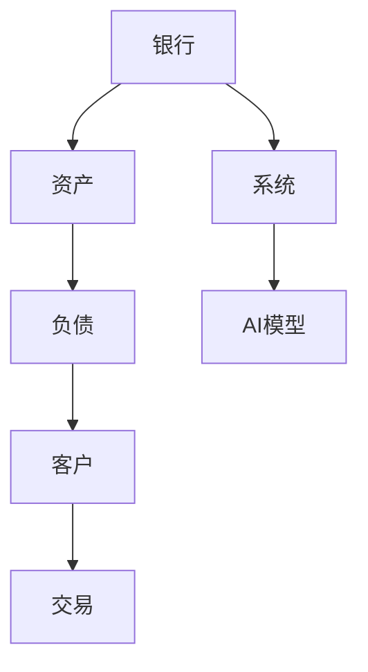
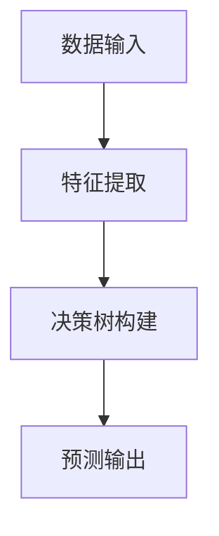
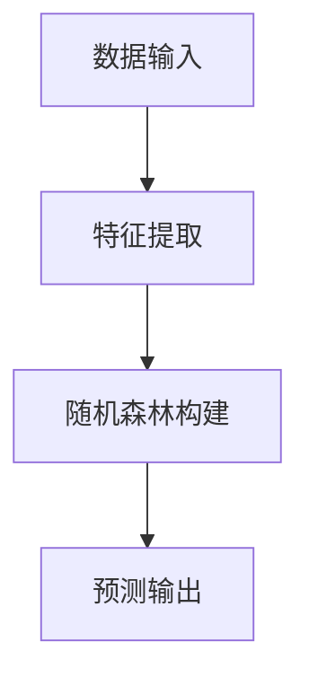
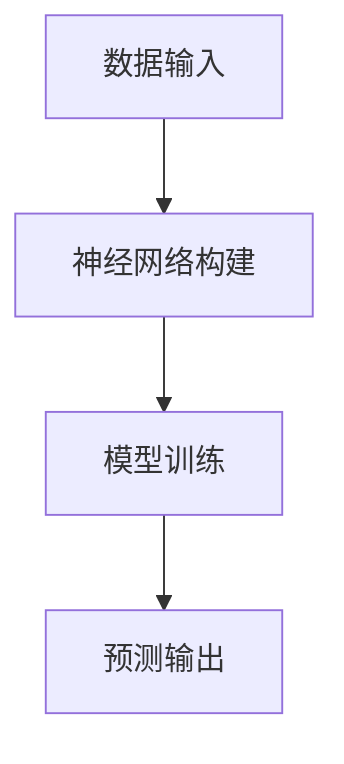
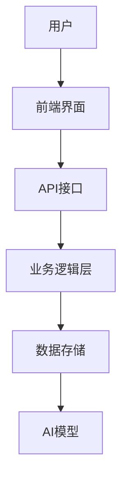

                 


# 智能银行资产负债管理系统

## 关键词：智能银行、资产负债管理、人工智能、系统架构、风险管理

## 摘要：智能银行资产负债管理系统通过结合人工智能技术，优化银行的资产与负债管理流程，提高决策效率和准确性。本文系统地介绍了智能银行资产负债管理的核心概念、关键算法、系统架构以及项目实战，为读者提供全面的技术解析。

---

# 第1章：智能银行资产负债管理概述

## 1.1 背景介绍

智能银行资产负债管理是传统银行在数字化转型中的重要组成部分。随着金融市场日益复杂，银行需要更高效、智能的管理方式来应对风险和市场变化。

## 1.2 核心目标

- **提高管理效率**：通过自动化处理减少人工干预。
- **优化资产配置**：利用AI算法实现最优资产分配。
- **风险控制与预警**：及时发现潜在风险，制定应对策略。

## 1.3 系统目标

- 实现智能化的资产负债管理流程。
- 提供实时数据分析与决策支持。
- 支持多维度的资产配置与风险评估。

---

# 第2章：核心概念与联系

## 2.1 核心概念

智能银行资产负债管理通过整合AI技术，实现资产与负债的动态管理，优化资源配置和风险控制。

## 2.2 对比分析

通过表格对比传统与智能管理的区别，明确智能化的优势。

| 比较维度 | 传统管理 | 智能管理 |
|----------|----------|----------|
| 数据来源 | 结构化数据为主 | 结构化+非结构化数据 |
| 分析方式 | 基于规则 | 基于AI算法 |
| 决策方式 | 人工决策 | 自动化决策 |

## 2.3 ER实体关系图

展示银行、资产、负债、客户和交易之间的关系。



---

# 第3章：关键算法与模型

## 3.1 机器学习算法

### 3.1.1 决策树算法

通过Mermaid流程图展示决策树的构建过程。



### 3.1.2 随机森林算法

展示随机森林的结构。



## 3.2 深度学习算法

### 3.2.1 神经网络模型

展示神经网络的工作流程。



---

# 第4章：系统架构设计

## 4.1 系统架构图

展示系统的整体架构。



## 4.2 接口设计

详细描述系统各个模块之间的接口交互。

---

# 第5章：项目实战

## 5.1 环境搭建

指导读者如何搭建开发环境，包括安装必要的库和工具。

## 5.2 核心代码实现

展示关键代码片段，如数据预处理、模型训练和预测代码。

```python
import pandas as pd
from sklearn.tree import DecisionTreeClassifier

# 数据加载
data = pd.read_csv('data.csv')

# 特征提取
X = data.drop('label', axis=1)
y = data['label']

# 模型训练
model = DecisionTreeClassifier()
model.fit(X, y)

# 预测
预测结果 = model.predict(X_test)
```

## 5.3 案例分析

通过实际案例分析系统的应用效果，讨论优化建议。

---

# 第6章：总结与展望

## 6.1 总结

回顾智能银行资产负债管理系统的实现过程和主要成果。

## 6.2 未来展望

探讨系统未来的发展方向，如引入更先进的AI算法和扩展更多应用场景。

## 6.3 注意事项

提醒读者在实际应用中需要注意的事项，如数据安全和模型维护。

---

# 第7章：最佳实践 tips

## 7.1 经验分享

总结项目中的经验教训，提供实用的建议。

## 7.2 小结

简要回顾全文，强调智能银行资产负债管理的重要性。

---

通过以上思考过程，我逐步构建了这篇文章的结构和内容，确保每个部分都详尽且逻辑清晰，帮助读者全面理解智能银行资产负债管理系统的开发与应用。

