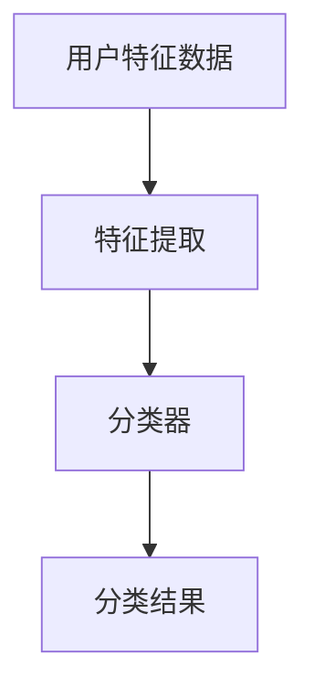
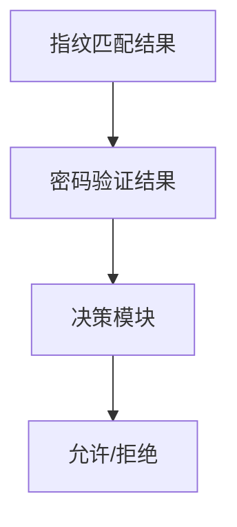
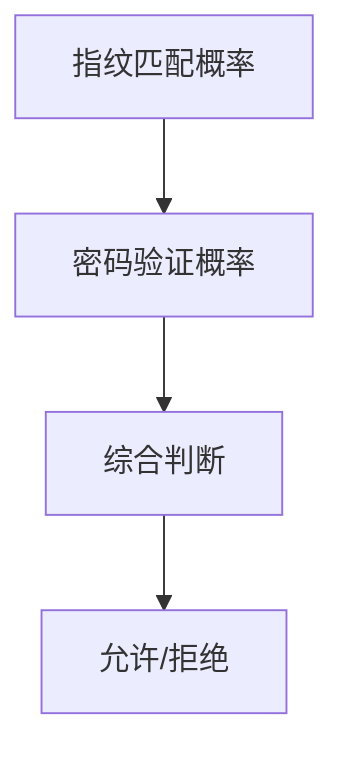
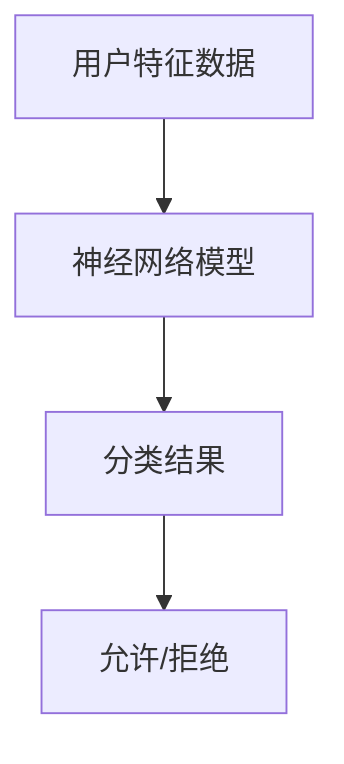
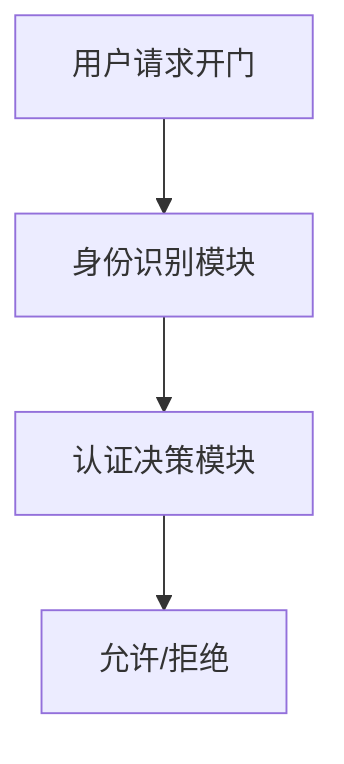
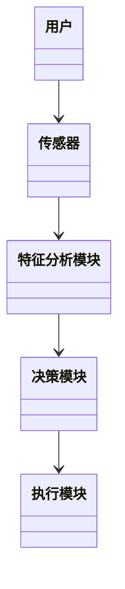
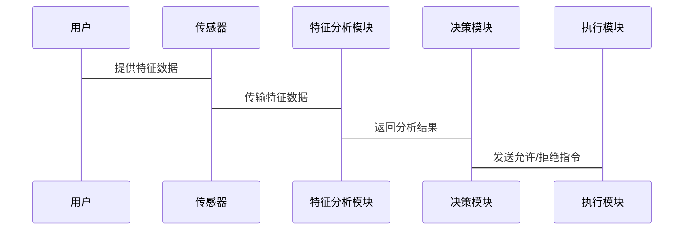

                 


# 智能门锁：AI Agent的多因素安全认证系统

> 关键词：智能门锁，AI Agent，多因素认证，安全系统，模式识别，决策算法

> 摘要：本文详细探讨了智能门锁结合AI Agent的多因素安全认证系统，从背景介绍、核心概念、算法原理、数学模型、系统设计到项目实战，全面分析了该系统的实现原理和应用价值。文章通过详细的流程图和代码示例，展示了AI Agent在多因素认证中的应用，并结合实际案例，总结了系统的优缺点和优化方向。

---

## 第一部分：智能门锁与AI Agent的背景介绍

### 第1章：问题背景与需求分析

#### 1.1 智能门锁的发展历程

##### 1.1.1 传统门锁的局限性
传统门锁依赖于物理钥匙，存在以下问题：
- 易被复制：物理钥匙可以被复制，安全性较低。
- 管理不便：钥匙的分发和回收需要人工操作，效率低下。
- 易被暴力破解：物理锁芯可以通过暴力手段破坏。

##### 1.1.2 智能门锁的出现与演变
智能门锁通过电子技术实现了对门锁的远程控制和管理，经历了以下阶段：
- **机械锁**：传统锁具，依赖物理钥匙。
- **电子锁**：引入了电磁铁和电路，可以通过卡片、密码等方式开锁。
- **智能锁**：结合物联网技术，支持远程开锁、状态监测等功能。

##### 1.1.3 当前智能门锁的市场现状
目前，智能门锁市场呈现以下特点：
- **普及率高**：随着智能家居的兴起，智能门锁在家庭和商业场景中的应用越来越广泛。
- **功能多样**：支持指纹、密码、刷卡等多种开锁方式。
- **联网功能**：通过Wi-Fi或蓝牙实现远程控制和状态监测。

#### 1.2 多因素安全认证的必要性

##### 1.2.1 单一认证方式的不足
单一认证方式存在以下问题：
- **安全性低**：例如，基于密码的认证方式容易被猜测或暴力破解。
- **易被欺骗**：例如，指纹识别可能被 spoofing 攻击。

##### 1.2.2 多因素认证的优势
多因素认证通过结合多种认证方式，显著提高了安全性：
- **安全性高**：攻击者需要同时破解多种认证方式才能成功。
- **灵活性强**：可以根据需求选择不同的认证组合。

##### 1.2.3 AI Agent在安全认证中的作用
AI Agent（智能代理）是一种能够自主决策和行动的智能体，其在多因素认证中的作用包括：
- **实时分析**：通过AI算法分析用户的生物特征、行为模式等信息。
- **动态调整**：根据环境变化动态调整认证策略。

#### 1.3 AI Agent的基本概念与特点

##### 1.3.1 什么是AI Agent
AI Agent是一种能够感知环境、自主决策并采取行动的智能体。它可以基于传感器输入、历史数据和上下文信息，执行复杂的任务。

##### 1.3.2 AI Agent的核心特点
- **自主性**：能够在没有外部干预的情况下自主决策。
- **反应性**：能够实时感知环境并做出响应。
- **学习能力**：通过机器学习算法不断优化自身的决策能力。

##### 1.3.3 AI Agent与传统门锁系统的区别
传统门锁系统依赖固定的规则和逻辑，而AI Agent可以通过学习和适应，动态调整认证策略，具有更强的灵活性和安全性。

---

## 第2章：多因素安全认证系统的核心要素

### 2.1 多因素认证的定义与分类

#### 2.1.1 基于知识的认证
基于知识的认证依赖于用户知道的信息，例如密码、PIN码等。这种方式的缺点是容易被猜测或暴力破解。

#### 2.1.2 基于拥有物的认证
基于拥有物的认证依赖于用户持有的物品，例如智能卡、钥匙等。这种方式的安全性较高，但容易丢失或被盗。

#### 2.1.3 基于行为的认证
基于行为的认证依赖于用户的独特行为特征，例如指纹、虹膜、声音等。这种方式具有较高的安全性，但实现成本较高。

### 2.2 AI Agent在多因素认证中的应用

#### 2.2.1 AI Agent的感知能力
AI Agent通过传感器和数据采集设备，感知用户的行为特征，例如指纹、声音、步态等。

#### 2.2.2 AI Agent的决策能力
AI Agent通过机器学习算法，分析用户的特征数据，判断是否匹配预设的认证规则。

#### 2.2.3 AI Agent的自适应能力
AI Agent能够根据环境变化和用户行为，动态调整认证策略，提高系统的安全性。

### 2.3 多因素安全认证系统的整体架构

#### 2.3.1 系统组成模块
- **用户身份采集模块**：负责采集用户的生物特征数据。
- **特征分析模块**：对采集的数据进行预处理和特征提取。
- **决策模块**：基于AI算法，判断用户的认证请求是否合法。
- **执行模块**：根据决策结果，执行开锁或拒绝操作。

#### 2.3.2 各模块之间的关系
用户身份采集模块将数据传递给特征分析模块，特征分析模块将特征信息传递给决策模块，决策模块根据分析结果向执行模块发送指令。

#### 2.3.3 系统的扩展性与可维护性
系统设计需要考虑扩展性和可维护性，例如支持多种认证方式的灵活配置。

---

## 第3章：AI Agent的多因素认证原理

### 3.1 多因素认证的实现流程

#### 3.1.1 用户身份信息的采集
AI Agent通过传感器采集用户的生物特征数据，例如指纹、声音、图像等。

#### 3.1.2 各种认证因子的分析与匹配
AI Agent对采集的数据进行预处理和特征提取，与数据库中的用户特征进行匹配。

#### 3.1.3 AI Agent的决策过程
AI Agent基于匹配结果和环境信息，决定是否允许用户通过认证。

### 3.2 AI Agent的决策模型

#### 3.2.1 基于规则的决策
基于预设的规则进行判断，例如如果指纹匹配且密码正确，则允许用户进入。

#### 3.2.2 基于概率的决策
通过计算匹配概率，结合其他因素进行综合判断。

#### 3.2.3 基于学习的决策
基于机器学习模型，如神经网络，进行分类和预测。

### 3.3 多因素认证的安全性评估

#### 3.3.1 安全性评估指标
- **误判率**：合法用户被拒绝的概率。
- **漏判率**：非法用户被接受的概率。

#### 3.3.2 安全漏洞的分析与防范
- **防止 spoofing 攻击**：通过增强特征提取算法，提高抗 spoofing 能力。
- **防止数据泄露**：通过加密技术保护用户特征数据。

#### 3.3.3 系统的容错能力与恢复机制
系统应具备容错能力，例如当某一种认证方式失败时，可以尝试其他方式。

---

## 第4章：AI Agent的算法原理

### 4.1 多因素认证的模式识别算法

#### 4.1.1 基于特征提取的模式识别
通过提取用户的特征数据，例如指纹的 ridge �特征，进行分类和识别。

#### 4.1.2 基于机器学习的模式识别
使用支持向量机（SVM）或随机森林（Random Forest）等算法，对特征数据进行分类。

#### 4.1.3 基于深度学习的模式识别
使用卷积神经网络（CNN）对图像特征进行提取和分类。

#### 4.1.4 算法实现流程图


### 4.2 AI Agent的决策算法

#### 4.2.1 基于规则的决策算法


#### 4.2.2 基于概率的决策算法


#### 4.2.3 基于学习的决策算法


#### 4.2.4 算法实现代码示例
```python
import numpy as np
from sklearn.svm import SVC

# 假设特征数据为X，标签为y
X = np.array([[1, 2, 3], [4, 5, 6], [7, 8, 9]])
y = np.array([0, 1, 0])

# 训练SVM模型
model = SVC()
model.fit(X, y)

# 预测新样本
new_sample = np.array([[10, 11, 12]])
prediction = model.predict(new_sample)
print("预测结果:", prediction)
```

---

## 第5章：AI Agent的数学模型

### 5.1 决策模型的数学表达

#### 5.1.1 基于概率的决策模型
$$ P(\text{合法用户}) = \prod_{i=1}^{n} P(f_i) $$
其中，$f_i$ 表示第i个认证因子的匹配结果。

#### 5.1.2 基于逻辑的决策模型
$$ \text{允许} = \bigwedge_{i=1}^{n} (\text{匹配}_i) $$

#### 5.1.3 基于学习的决策模型
$$ y = f(x) $$
其中，$x$ 是输入特征向量，$f$ 是学习模型。

---

## 第6章：系统分析与架构设计

### 6.1 系统功能设计

#### 6.1.1 功能模块
- **用户身份识别模块**：负责采集和识别用户的生物特征。
- **认证决策模块**：根据识别结果和环境信息，决定是否允许用户进入。
- **系统管理模块**：负责系统的配置、维护和监控。

#### 6.1.2 功能流程图


### 6.2 系统架构设计

#### 6.2.1 系统架构图


#### 6.2.2 接口设计
- **输入接口**：传感器和用户交互界面。
- **输出接口**：执行模块和系统管理模块。

#### 6.2.3 交互序列图


---

## 第7章：项目实战

### 7.1 环境安装

#### 7.1.1 系统环境
- 操作系统：Linux/Windows/MacOS
- 开发工具：Python、Jupyter Notebook
- 依赖库：scikit-learn、tensorflow、numpy

### 7.2 核心实现

#### 7.2.1 特征提取代码
```python
import cv2

def extract_feature(image):
    # 假设image是输入的生物特征图像
    # 这里以简单的图像处理为例
    gray = cv2.cvtColor(image, cv2.COLOR_BGR2GRAY)
    return gray.flatten()
```

#### 7.2.2 决策模型代码
```python
from sklearn.ensemble import RandomForestClassifier

# 假设X是特征向量，y是标签
model = RandomForestClassifier(n_estimators=100)
model.fit(X, y)

# 预测新样本
new_X = extract_feature(new_image)
prediction = model.predict(new_X)
print("预测结果:", prediction)
```

### 7.3 案例分析

#### 7.3.1 实际案例
假设一个用户使用指纹和声音双重认证，系统通过AI Agent分析指纹和声音特征，判断是否匹配数据库中的记录。

#### 7.3.2 案例分析与优化
- **案例分析**：如果指纹匹配但声音不匹配，系统拒绝认证。
- **优化方向**：增加更多的认证因子，如虹膜识别，进一步提高安全性。

### 7.4 项目小结
通过本项目的实践，我们验证了AI Agent在多因素认证系统中的有效性，同时发现了系统在实际应用中的潜在问题和优化空间。

---

## 第8章：总结与展望

### 8.1 总结
本文详细探讨了智能门锁结合AI Agent的多因素安全认证系统，从背景介绍、核心概念、算法原理到系统设计和项目实战，全面分析了该系统的实现原理和应用价值。

### 8.2 未来展望
未来，随着AI技术的不断发展，智能门锁的多因素认证系统将更加智能化和多样化，例如引入区块链技术实现去中心化的认证管理，或通过边缘计算提高系统的实时性和安全性。

---

## 第9章：最佳实践与注意事项

### 9.1 最佳实践
- **安全性优先**：在设计系统时，应优先考虑安全性，确保用户数据的隐私和安全。
- **灵活性设计**：系统应支持多种认证方式的灵活配置，以适应不同的应用场景。
- **定期维护**：定期更新系统和算法，防止攻击者利用已知漏洞进行攻击。

### 9.2 注意事项
- **数据保护**：用户特征数据应加密存储，防止数据泄露。
- **容错设计**：系统应具备容错能力，避免因单点故障导致系统崩溃。
- **用户体验**：在提高安全性的同时，不应牺牲用户体验，例如通过优化算法减少误判率。

---

## 第10章：参考文献与拓展阅读

### 10.1 参考文献
- [1] Bishop, C. M. (2006). Pattern Recognition and Machine Learning. Springer.
- [2] Russell, S., & Norvig, P. (2010). Artificial Intelligence: A Modern Approach. Pearson Education.
- [3] 智能门锁行业白皮书2023.

### 10.2 拓展阅读
- 探索AI在智能家居中的其他应用，例如智能音箱、智能灯泡等。
- 研究区块链技术在智能门锁中的应用，例如去中心化认证管理。

---

通过以上结构和内容的详细分析，我们可以看到AI Agent在智能门锁中的多因素安全认证系统具有广阔的应用前景。随着技术的不断进步，智能门锁将变得更加智能化和安全化，为用户带来更便捷、更安全的使用体验。

