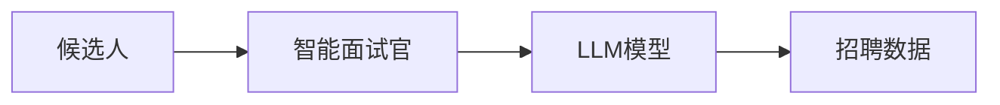
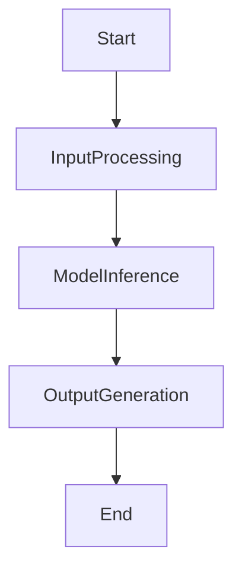
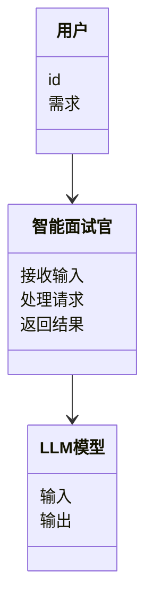

                 


# 智能面试官 AI Agent：LLM 辅助招聘流程

> 关键词：AI Agent, LLM, 智能面试官, 招聘流程, 智能招聘系统

> 摘要：本文详细探讨了如何利用大语言模型（LLM）辅助招聘流程，从技术原理到实现案例，全面分析了智能面试官 AI Agent 在招聘中的应用。通过系统的背景介绍、算法原理、架构设计、项目实战和总结展望，为读者提供了一套完整的解决方案。

---

## 第一部分：智能面试官 AI Agent 的背景与概念

### 第1章：智能面试官 AI Agent 的背景介绍

#### 1.1 问题背景与挑战

**1.1.1 招聘流程中的痛点**

- **低效性**：传统招聘流程繁琐，人工筛选简历耗时耗力，且容易出现主观误差。
- **精准度不足**：企业难以快速找到符合岗位需求的候选人，导致招聘效率低下。
- **一致性问题**：不同面试官的风格和标准不一，影响面试结果的公平性。
- **成本高昂**：高端人才招聘通常需要投入大量时间和资源。

**1.1.2 传统招聘方式的局限性**

- 依赖人工筛选简历，效率低下。
- 面试官主观性较强，可能导致候选人流失。
- 缺乏统一的标准，难以保证面试质量。

**1.1.3 AI技术在招聘中的潜力**

- 自动化筛选简历，提高效率。
- 提供标准化的面试流程，降低主观误差。
- 24/7可用性，随时响应候选人需求。

#### 1.2 问题描述与目标

**1.2.1 智能面试官的核心目标**

- 提供高效、准确、一致的面试流程。
- 减少人工干预，降低招聘成本。
- 增强候选人体验，提高招聘效率。

**1.2.2 LLM在招聘流程中的应用范围**

- 简历筛选：通过自然语言处理技术快速识别关键信息。
- 面试安排：自动安排面试时间和地点。
- 面试问题生成：根据岗位需求生成相关问题。
- 面试结果分析：基于模型评估候选人表现。

**1.2.3 智能面试官的边界与外延**

- 边界：专注于面试阶段，不涉及招聘广告发布和offer发放。
- 外延：可扩展至候选人入职后的培训和评估。

#### 1.3 核心概念与联系

**1.3.1 AI Agent 的定义与属性**

- **定义**：AI Agent是一种智能体，能够感知环境并采取行动以实现目标。
- **属性**：
  - 自主性：无需人工干预。
  - 反应性：能实时响应输入。
  - 学习能力：通过数据优化性能。

**1.3.2 LLM 的核心原理**

- **定义**：LLM是基于大量数据训练的模型，能够生成与上下文相关的文本。
- **属性**：
  - 大规模训练：利用海量数据进行预训练。
  - 多任务处理：支持多种语言理解和生成。

**1.3.3 智能面试官的实体关系图**



---

### 第2章：LLM 的核心原理与算法

#### 2.1 LLM 的核心原理

**2.1.1 大语言模型的训练过程**

- **预训练**：利用无监督学习在大规模通用数据上进行预训练。
- **微调**：针对特定任务（如招聘）进行有监督微调。

**2.1.2 模型输入与输出的处理机制**

- **输入处理**：将招聘问题或简历文本转化为模型可处理的向量。
- **输出生成**：基于概率生成模型生成自然语言回复。

**2.1.3 概率生成的数学模型**

- **条件概率**：模型通过计算$P(y|x)$生成最可能的输出$y$。
- **损失函数**：交叉熵损失函数用于衡量模型预测与真实值的差异。

#### 2.2 算法流程图



#### 2.3 数学模型与公式

- **概率计算公式**：$P(y|x) = \frac{P(x,y)}{P(x)}$
- **损失函数**：$L = -\sum_{i=1}^{n} \log P(y_i|x_i)$

---

### 第3章：系统分析与架构设计

#### 3.1 问题场景分析

**3.1.1 招聘流程中的关键环节**

- 简历筛选：从大量候选人中筛选出符合岗位需求的简历。
- 面试安排：根据候选人时间和面试官日程安排面试。
- 面试问题生成：基于岗位需求生成相关问题。
- 结果分析：评估候选人表现并给出建议。

**3.1.2 智能面试官的应用场景**

- 初步筛选：通过模型对简历进行自动评分。
- 面试模拟：候选人在线回答问题，模型实时评估。
- 结果汇总：生成面试报告供HR参考。

#### 3.2 系统功能设计

**3.2.1 领域模型设计**



**3.2.2 系统架构设计**

```mermaid
graph TD
    User --> API Gateway
    API Gateway --> LLM Service
    LLM Service --> Database
    Database --> Result
```

#### 3.3 系统接口设计

- **输入接口**：接收候选人简历和招聘需求。
- **输出接口**：返回面试评分和建议。

---

### 第4章：项目实战

#### 4.1 环境安装与配置

**4.1.1 安装 Python 环境**

```bash
python --version
pip install --upgrade pip
```

**4.1.2 安装必要的库**

```bash
pip install transformers
pip install numpy
pip install pandas
```

#### 4.2 系统核心实现

**4.2.1 数据采集模块**

```python
import pandas as pd

def load_data(file_path):
    data = pd.read_csv(file_path)
    return data
```

**4.2.2 模型调用模块**

```python
from transformers import pipeline

model = pipeline("text-generation", model="gpt2")
```

**4.2.3 结果分析模块**

```python
def analyze_result(result):
    print(f"生成的文本：{result}")
```

---

### 第5章：总结与展望

**5.1 当前研究的不足**

- 数据隐私问题：如何保护候选人和企业的数据安全。
- 模型局限性：LLM可能生成不准确或偏见的回答。

**5.2 未来发展方向**

- **多模态模型**：结合视觉和语言信息，提高准确性。
- **个性化定制**：根据企业需求定制模型。
- **实时反馈**：在面试过程中实时提供反馈和建议。

---

通过以上内容，我们详细探讨了如何利用LLM辅助招聘流程，从背景介绍到项目实战，为读者提供了一套完整的解决方案。未来，随着技术的不断发展，智能面试官 AI Agent 将在招聘领域发挥更大的作用。

