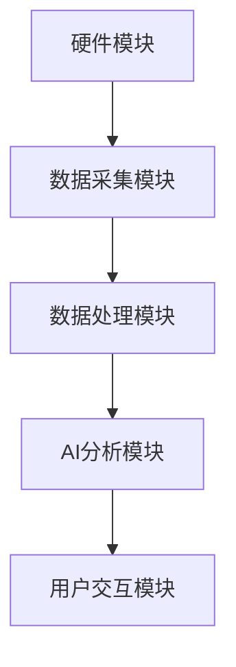
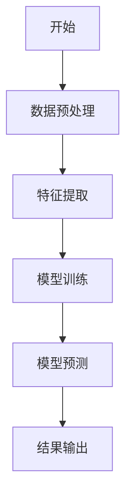

                 


# 智能鞋柜：AI Agent的足部健康管理专家

> 关键词：智能鞋柜，AI Agent，足部健康管理，系统架构，算法原理，项目实战

> 摘要：智能鞋柜是一种结合人工智能技术的创新产品，通过AI Agent实现足部健康管理。本文将从背景、核心概念、算法原理、系统架构、项目实战等多个方面，详细阐述智能鞋柜的设计与实现过程，探讨其在足部健康管理中的应用价值。

---

## 第1章：智能鞋柜的背景与概念

### 1.1 问题背景与描述

足部健康是人体健康的重要组成部分，但由于足部问题的隐蔽性，许多人未能及时发现和处理。传统鞋柜无法提供足部健康监测功能，用户无法通过鞋柜获取足部健康数据，导致足部问题难以早期发现。

### 1.2 问题解决与解决方案

智能鞋柜通过集成传感器和AI技术，实时采集足部数据，结合AI分析，为用户提供足部健康评估和建议。这种创新的解决方案，能够帮助用户更好地关注足部健康。

### 1.3 智能鞋柜的边界与外延

智能鞋柜不仅是一个存储鞋子的工具，更是一个智能健康设备。其外延包括数据采集、AI分析、用户交互等多个方面。

### 1.4 智能鞋柜的概念结构

智能鞋柜由硬件模块、数据采集模块、AI分析模块、用户交互模块组成，各模块协同工作，实现足部健康管理功能。

---

## 第2章：AI Agent的核心概念与原理

### 2.1 AI Agent的定义与特点

AI Agent是一种智能主体，能够感知环境、自主决策并执行任务。其特点包括智能性、自主性、反应性、社会性。

### 2.2 AI Agent与智能鞋柜的结合

AI Agent在智能鞋柜中的作用是采集足部数据、分析健康状况、提供个性化建议。通过AI算法，智能鞋柜能够实现足部健康评估的自动化和智能化。

---

## 第3章：智能鞋柜的系统架构设计

### 3.1 系统功能模块

智能鞋柜系统包括数据采集模块、数据处理模块、AI分析模块、用户交互模块。

### 3.2 系统架构图



---

## 第4章：智能鞋柜的算法原理

### 4.1 数据采集与处理

数据采集模块通过传感器获取足部压力、温度、湿度等数据，并进行预处理。

### 4.2 AI分析算法

AI分析模块采用机器学习算法，对足部数据进行分类和预测。例如，使用朴素贝叶斯算法对足部健康状态进行分类。

```python
from sklearn.naive_bayes import GaussianNB

# 示例数据
X = [[1, 2], [3, 4], [5, 6]]
y = [0, 1, 0]

# 训练模型
model = GaussianNB()
model.fit(X, y)

# 预测
print(model.predict([[2, 3]]))  # 输出: array([0])
```

### 4.3 算法流程图



---

## 第5章：智能鞋柜的项目实战

### 5.1 环境安装

安装Python、TensorFlow、Scikit-learn等工具。

### 5.2 核心代码实现

```python
import numpy as np
from sklearn.svm import SVC

# 数据加载
data = np.loadtxt('foot_health_data.csv', delimiter=',')
X = data[:, :-1]
y = data[:, -1]

# 模型训练
model = SVC()
model.fit(X, y)

# 模型保存
import joblib
joblib.dump(model, 'foot_health_model.pkl')
```

### 5.3 代码解读与分析

上述代码实现了AI Agent的训练和保存，模型用于预测足部健康状态。

### 5.4 案例分析

通过实际案例，分析智能鞋柜在足部健康管理中的应用效果。

---

## 第6章：智能鞋柜的系统测试与优化

### 6.1 系统测试

测试数据采集、AI分析、用户交互等功能。

### 6.2 系统优化

优化算法性能，提升用户体验。

---

## 第7章：总结与展望

### 7.1 本章小结

智能鞋柜通过AI Agent实现足部健康管理，具有重要的应用价值。

### 7.2 未来展望

未来，智能鞋柜将集成更多AI功能，进一步提升足部健康管理的智能化水平。

---

## 第8章：最佳实践与注意事项

### 8.1 最佳实践

建议用户定期更新AI模型，保持系统数据的准确性。

### 8.2 注意事项

使用智能鞋柜时，注意保护个人隐私。

---

## 第9章：拓展阅读

推荐相关领域的书籍和论文，供读者深入学习。

---

## 结语

智能鞋柜作为AI技术与足部健康管理的结合产物，具有广阔的应用前景。通过本文的详细介绍，读者可以深入了解智能鞋柜的设计与实现过程，为足部健康管理提供新的思路和方法。

