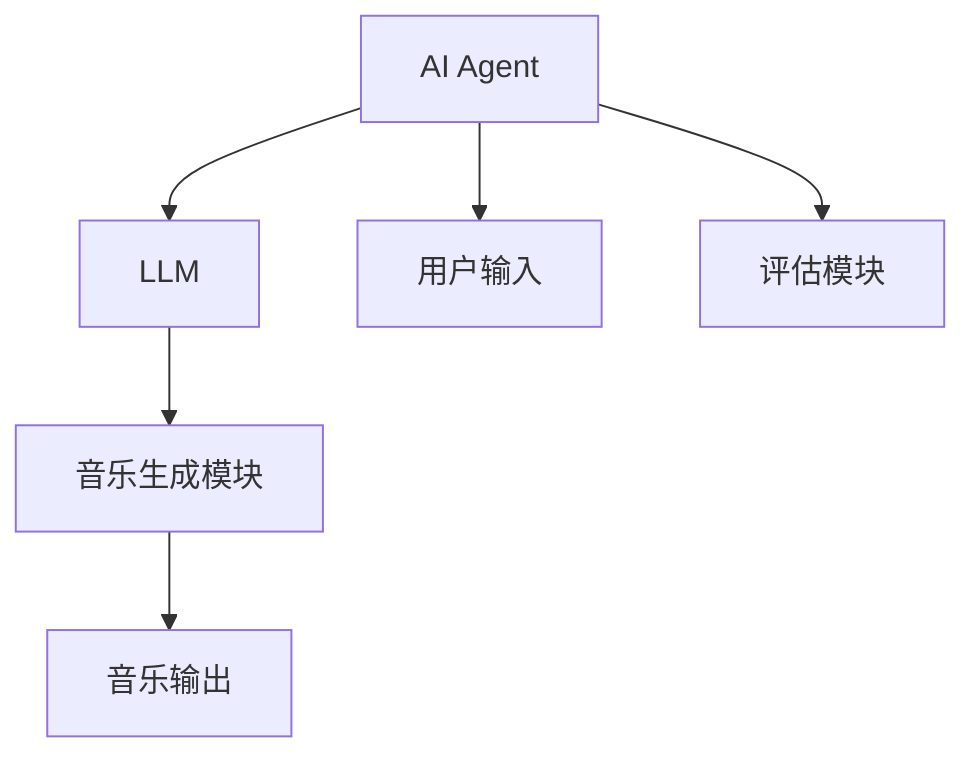
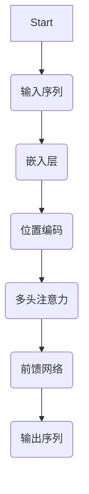
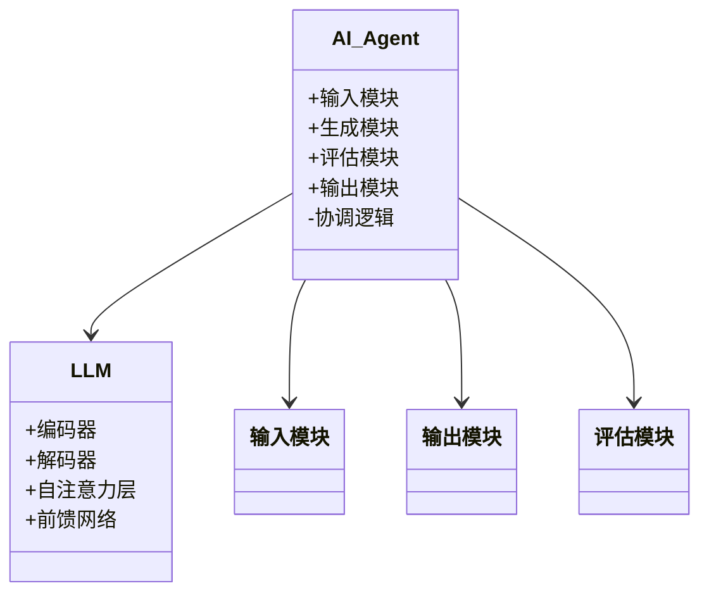
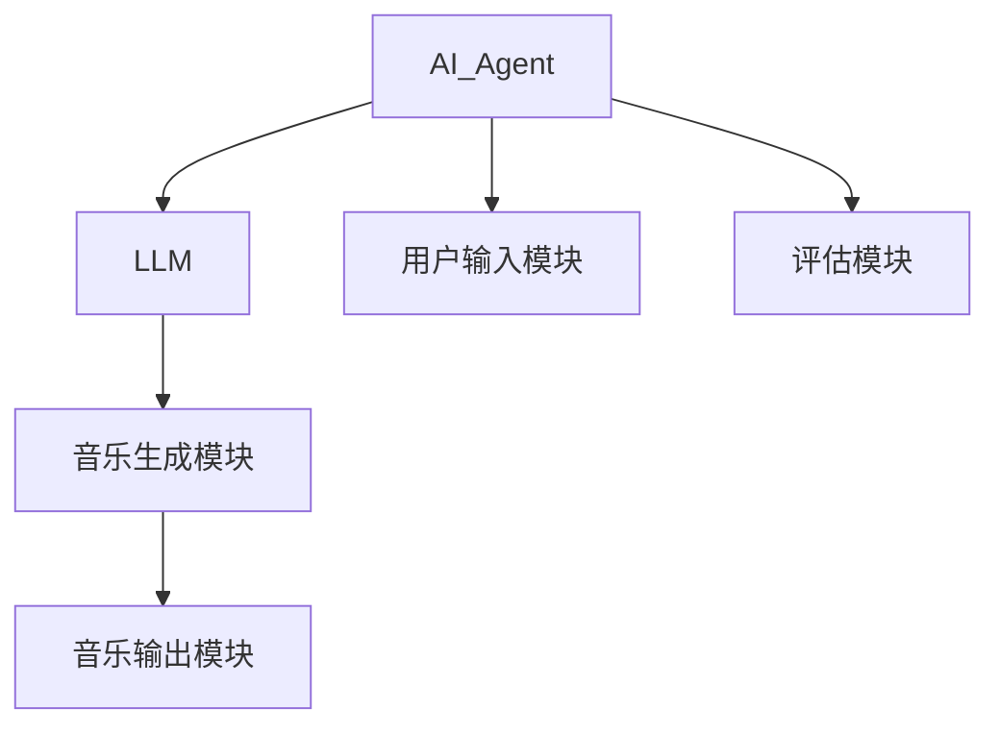

                 


# 智能音乐创作 AI Agent：LLM 在艺术创作中的应用

---

## 关键词：
智能音乐创作, AI Agent, LLM, 艺术创作, 人工智能, 深度学习, Transformer模型

---

## 摘要：
本文探讨了人工智能（AI）在音乐创作中的应用，特别是大语言模型（LLM）与AI代理（AI Agent）的结合。通过分析LLM的原理、系统架构及实际案例，展示了如何利用AI技术生成音乐，以及在艺术创作中的潜力和挑战。文章从背景介绍、核心概念、算法原理、系统设计到项目实战，全面解析智能音乐创作的实现过程，为读者提供深入的技术见解和实践指导。

---

## 第一部分：背景介绍

### 第1章：智能音乐创作的背景与现状

#### 1.1 AI Agent与LLM的基本概念
- **1.1.1 AI Agent的定义与特点**
  - AI Agent是具有感知和决策能力的智能体，能够根据环境信息执行任务。
  - 特点：自主性、反应性、目标导向、社交能力。

- **1.1.2 LLM的定义与技术**
  - LLM是基于深度学习的大型语言模型，如GPT系列。
  - 技术基础：Transformer架构，自注意力机制，大规模数据训练。

- **1.1.3 AI Agent与LLM在音乐创作中的应用背景**
  - 利用LLM生成音乐内容，AI Agent作为创作助手协调创作过程。
  - 当前趋势：AI辅助创作工具在音乐产业中的普及。

---

## 第二部分：核心概念与联系

### 第2章：AI Agent与LLM的核心概念

#### 2.1 核心概念的原理与特征
- **2.1.1 LLM的原理**
  - 基于Transformer的自注意力机制，处理序列数据。
  - 模型特点：并行计算、长距离依赖捕捉。

- **2.1.2 AI Agent的特征**
  - 多模态交互能力：理解并处理文本、音频等多种数据类型。
  - 自适应性：根据用户反馈调整创作方向。

#### 2.2 实体关系与架构图



- **2.2.1 核心概念对比表格**
| 特性 | LLM | AI Agent |
|------|------|-----------|
| 输入 | 文本、序列数据 | 多模态数据 |
| 输出 | 文本生成 | 音乐、文本 |
| 功能 | 生成内容 | 协调创作过程 |

---

## 第三部分：算法原理讲解

### 第3章：LLM与音乐生成算法

#### 3.1 Transformer模型的结构与算法流程



#### 3.2 LLM音乐生成的代码实现

```python
import torch
import torch.nn as nn

class Transformer(nn.Module):
    def __init__(self, d_model, n_head, dff):
        super(Transformer, self).__init__()
        self.multihead_attn = nn.MultiheadAttention(d_model, n_head)
        self.dff = nn.Linear(d_model, dff)
        self.dff_back = nn.Linear(dff, d_model)
        
    def forward(self, x, mask=None):
        attn_output, _ = self.multihead_attn(x, x, x, mask=mask)
        attn_output = attn_output.permute(1, 0, 2)
        ffn_output = self.dff(attn_output)
        ffn_output = ffn_output.permute(1, 0, 2)
        ffn_output = self.dff_back(ffn_output)
        return ffn_output

# 示例用法
model = Transformer(d_model=512, n_head=8, dff=1024)
input_seq = torch.randn(1, 512, 512)
output = model(input_seq)
print(output.shape)  # 输出形状：(1, 512, 512)
```

---

## 第四部分：数学模型

### 第4章：音乐生成的数学模型与公式

#### 4.1 注意力机制公式
$$ \text{Attention}(Q, K, V) = \text{softmax}\left(\frac{QK^T}{\sqrt{d_k}}\right)V $$

#### 4.2 交叉熵损失函数
$$ \mathcal{L} = -\sum_{i=1}^{n} y_i \log(p_i) $$

#### 4.3 概率分布模型
$$ p(x_{i+1}|x_{\leq i}) = \text{softmax}(QK^T)V $$

---

## 第五部分：系统分析与架构设计

### 第5章：音乐创作系统的架构设计

#### 5.1 系统功能模型



#### 5.2 系统架构图



---

## 第六部分：项目实战

### 第6章：智能音乐创作系统的实现

#### 6.1 环境安装
```bash
pip install torch
pip install numpy
pip install librosa
```

#### 6.2 核心代码实现

```python
import torch
import numpy as np
import librosa

def generate_music(model, start_token, length=100):
    outputs = []
    input = start_token
    for _ in range(length):
        output, _ = model(input)
        output = output.argmax(dim=-1)
        outputs.append(output.item())
        input = output
    return outputs

# 示例
start_token = torch.randint(0, 512, (1, 1))
output_seq = generate_music(model, start_token, 100)
print(output_seq)
```

#### 6.3 案例分析
- 输入：旋律片段
- 输出：完整音乐作品
- 分析：模型生成的音符是否符合预期，音乐情感是否一致。

---

## 第七部分：总结与展望

### 第7章：总结与注意事项

#### 7.1 最佳实践
- 数据质量：确保训练数据的多样性和质量。
- 参数调整：根据需求调整模型参数和超参数。
- 评估指标：使用多种指标评估生成音乐的质量。

#### 7.2 小结
- AI Agent与LLM的结合为音乐创作提供了新思路。
- 技术发展：模型能力提升，创作工具的智能化。

#### 7.3 注意事项
- 数据版权：确保训练数据的合法性。
- 技术局限：当前模型无法完全捕捉音乐情感。

#### 7.4 拓展阅读
- 推荐书籍：《深度学习》、《人工智能：一种现代方法》
- 推荐论文：GPT系列论文，Transformer论文

---

## 结语
智能音乐创作通过AI Agent与LLM的结合，正在改变传统音乐创作方式。未来，随着技术的进步，音乐创作将更加多样化和个性化，为艺术创作带来新的可能性。

