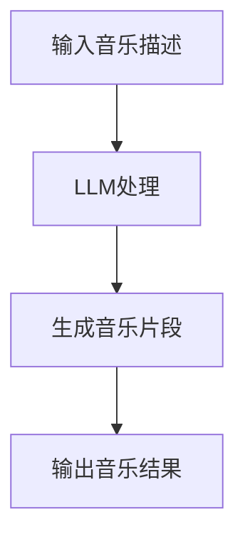
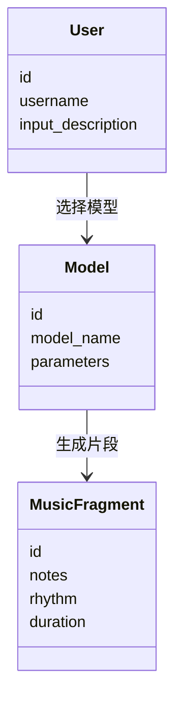
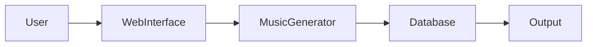
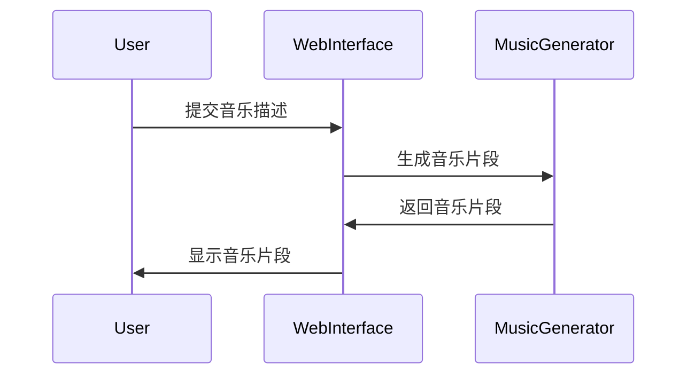

                 


# 智能音乐创作AI Agent：LLM在艺术领域的创新应用

## 关键词：AI音乐创作、LLM、艺术创新、生成模型、智能创作

## 摘要：  
随着人工智能技术的飞速发展，大语言模型（LLM）在艺术领域的应用逐渐崭露头角。音乐创作作为一种高度依赖人类创造力的领域，正在通过智能技术的辅助实现前所未有的创新。本文将详细探讨LLM在音乐创作中的应用原理、技术实现以及实际案例，揭示智能音乐创作AI Agent的核心价值和未来发展方向。

---

## 第一部分：智能音乐创作AI Agent的背景与概念

### 第1章：智能音乐创作的背景与现状

#### 1.1 AI与音乐创作的结合  
音乐创作是人类文化的重要组成部分，传统的音乐创作依赖于作曲家的灵感和技能。然而，随着人工智能技术的发展，AI在音乐创作中的角色日益重要。通过自然语言处理和生成模型，AI能够辅助甚至独立完成音乐创作，为音乐产业带来了新的可能性。

- **音乐创作的定义与传统模式**  
  音乐创作是指通过音符、旋律、节奏等元素组合，创造出具有情感表达和艺术价值的作品。传统音乐创作依赖于人类的创造力和经验，作曲家需要掌握复杂的音乐理论和技巧。

- **AI技术在音乐领域的应用背景**  
  AI技术，尤其是大语言模型（LLM），能够通过学习海量音乐数据，理解音乐的结构和情感表达。这些模型可以生成符合特定风格或主题的音乐作品，甚至能够根据用户提供的描述创作新的音乐片段。

- **智能音乐创作的定义与特点**  
  智能音乐创作是指利用AI技术辅助或独立完成音乐创作的过程。其特点包括自动化、个性化和高效性。AI能够快速生成多种风格的音乐作品，并根据用户需求进行调整。

#### 1.2 LLM在艺术领域的技术背景  
大语言模型（LLM）是近年来人工智能领域的重大突破之一。这些模型基于Transformer架构，通过大量的文本数据进行训练，能够理解和生成自然语言。在音乐创作中，LLM可以用于生成歌词、旋律甚至完整的音乐作品。

- **LLM的基本工作原理**  
  LLM通过自注意力机制捕捉文本中的语义关系，并利用解码器生成连贯的文本输出。在音乐创作中，模型可以接受音乐描述作为输入，并生成相应的音乐片段。

- **LLM在音乐创作中的潜在价值**  
  LLM能够生成多样化、个性化的音乐作品，帮助音乐人快速灵感落地。此外，AI创作的音乐可以用于影视配乐、游戏音效等领域，为创作者提供新的工具和可能性。

- **当前技术发展的现状与挑战**  
  当前，LLM在音乐创作中的应用仍处于起步阶段。主要挑战包括如何提高生成音乐的质量和多样性，以及如何解决版权和伦理问题。

### 第2章：智能音乐创作的核心概念与联系  

#### 2.1 LLM与音乐生成模型的原理  
- **LLM的基本工作原理**  
  LLM通过自注意力机制捕捉输入文本的语义关系，并利用解码器生成连贯的文本输出。在音乐创作中，模型可以接受音乐描述作为输入，并生成相应的音乐片段。

- **音乐生成模型的分类与特点**  
  音乐生成模型可以分为基于规则的生成模型和基于学习的生成模型。基于规则的模型依赖预定义的音乐规则，生成的作品缺乏创新性。基于学习的模型（如深度神经网络）通过学习大量音乐数据，能够生成多样化、高质量的音乐作品。

- **LLM与音乐生成模型的对比分析**  
  LLM的优势在于其强大的自然语言处理能力，能够理解复杂的音乐描述并生成相应的音乐片段。然而，相比于专门的音乐生成模型，LLM在音乐生成方面的能力仍有局限性。

#### 2.2 核心概念的ER实体关系图  
```mermaid
erDiagram
    user {
        id
        username
        role
    }
    model {
        id
        model_name
        model_type
    }
    interaction {
        id
        input
        output
        timestamp
    }
    user --> model : 选择模型
    model --> interaction : 生成交互
```

---

## 第二部分：智能音乐创作的算法原理  

### 第3章：智能音乐创作的算法原理  

#### 3.1 大语言模型的训练与优化  
- **数据预处理与特征提取**  
  在训练LLM时，需要对音乐数据进行预处理，提取有用的特征。例如，可以将音乐数据转换为 MIDI 格式，并提取音符、节奏、调式等特征。

- **模型训练过程**  
  模型通过监督学习的方式进行训练，输入为音乐描述，输出为生成的音乐片段。训练过程中，模型需要不断优化其生成策略，以提高生成质量。

- **模型调优与评估**  
  在模型训练完成后，需要对其进行调优和评估。评估指标可以包括生成音乐的多样性、创新性和与输入描述的匹配程度。

#### 3.2 音乐生成模型的数学模型  
- **概率生成模型的公式**  
  概率生成模型的目标是最大化生成音乐片段的概率，其公式为：  
  $$ P(x) = \prod_{i=1}^{n} P(x_i | x_{<i}) $$  
  其中，$x$ 表示生成的音乐片段，$x_{<i}$ 表示前 $i$ 个元素的条件。

- **基于LLM的音乐生成流程**  


#### 3.3 算法实现的Python代码示例  
```python
import torch
import torch.nn as nn

class MusicGenerator(nn.Module):
    def __init__(self, input_dim, output_dim):
        super(MusicGenerator, self).__init__()
        self.fc1 = nn.Linear(input_dim, 128)
        self.fc2 = nn.Linear(128, output_dim)
    
    def forward(self, x):
        x = torch.relu(self.fc1(x))
        x = torch.sigmoid(self.fc2(x))
        return x

# 初始化模型
input_dim = 100  # 输入维度
output_dim = 88  # 输出维度
model = MusicGenerator(input_dim, output_dim)

# 训练模型
criterion = nn.BCELoss()
optimizer = torch.optim.Adam(model.parameters(), lr=0.001)

# 假设x是输入，y是目标输出
x = torch.randn(1, input_dim)
y = torch.randn(1, output_dim)

# 前向传播
outputs = model(x)
loss = criterion(outputs, y)

# 反向传播和优化
optimizer.zero_grad()
loss.backward()
optimizer.step()
```

---

## 第三部分：智能音乐创作的系统架构设计  

### 第4章：智能音乐创作的系统架构设计  

#### 4.1 项目介绍  
智能音乐创作AI Agent是一个基于LLM的音乐生成系统，旨在为用户提供个性化的音乐创作工具。用户可以通过输入音乐描述，生成符合要求的音乐片段。

- **系统功能设计**  
  - 用户输入音乐描述。
  - 系统通过LLM生成音乐片段。
  - 用户可以调整生成的音乐片段，如修改节奏、调式等。

- **领域模型（类图）**  


- **系统架构图**  


- **系统接口设计**  
  - 用户接口：提供输入音乐描述的功能，显示生成的音乐片段。
  - 模型接口：接受输入描述，生成音乐片段。
  - 数据库接口：存储生成的音乐片段和用户偏好。

- **系统交互流程图**  


---

## 第四部分：智能音乐创作的项目实战  

### 第5章：项目实战  

#### 5.1 环境配置  
- **安装必要的库**  
  - 安装PyTorch、MuseNet等库。
  - 配置音乐生成环境，如安装MIDI库。

#### 5.2 核心代码实现  
```python
import torch
import torch.nn as nn
import numpy as np

# 定义音乐生成模型
class MusicGenerator(nn.Module):
    def __init__(self, input_dim, output_dim):
        super(MusicGenerator, self).__init__()
        self.fc1 = nn.Linear(input_dim, 128)
        self.fc2 = nn.Linear(128, output_dim)
    
    def forward(self, x):
        x = torch.relu(self.fc1(x))
        x = torch.sigmoid(self.fc2(x))
        return x

# 初始化模型和训练参数
input_dim = 100
output_dim = 88
model = MusicGenerator(input_dim, output_dim)
criterion = nn.BCELoss()
optimizer = torch.optim.Adam(model.parameters(), lr=0.001)

# 训练过程
for epoch in range(100):
    for batch in batches:
        x, y = batch['input'], batch['target']
        outputs = model(x)
        loss = criterion(outputs, y)
        optimizer.zero_grad()
        loss.backward()
        optimizer.step()

# 生成音乐片段
x = torch.randn(1, input_dim)
with torch.no_grad():
    outputs = model(x)
    print(outputs)
```

#### 5.3 实际案例分析  
- **案例背景**  
  用户希望生成一首流行风格的音乐，主题为“爱情”。

- **生成过程**  
  用户输入音乐描述：“爱情的旋律，流行风格，中速节奏，主旋律优美”。  
  系统通过LLM生成音乐片段，输出MIDI格式的音乐文件。

- **代码分析与优化**  
  生成的音乐片段可以进一步调整，如修改节奏、调式等，以满足用户需求。

#### 5.4 项目小结  
通过实际案例，可以验证智能音乐创作AI Agent的有效性。生成的音乐片段能够较好地匹配用户描述，为音乐创作提供了新的可能性。

---

## 第五部分：未来展望与总结  

### 第6章：未来展望  

#### 6.1 技术发展趋势  
- **多模态模型的应用**  
  未来的智能音乐创作将更加依赖多模态模型，结合视觉、听觉等多种信息，生成更丰富的音乐作品。

- **更自然流畅的音乐生成**  
  随着算法的优化，生成的音乐将更加接近人类创作的水平，具备更复杂的音乐结构和情感表达。

- **音乐创作工具的普及**  
  随着技术的进步，智能音乐创作工具将更加普及，成为音乐人不可或缺的创作工具。

#### 6.2 技术挑战与解决方案  
- **音乐情感表达的准确性**  
  当前的生成模型在音乐情感表达方面仍有局限性，需要进一步优化模型结构和训练数据。

- **音乐版权与伦理问题**  
  AI生成的音乐作品的版权归属和伦理问题需要进一步明确和规范。

---

## 总结  

智能音乐创作AI Agent的出现，为音乐创作领域带来了新的可能性。通过大语言模型（LLM）的强大能力，AI能够辅助甚至独立完成音乐创作，为音乐人提供了新的工具和思路。然而，当前技术仍存在一些挑战，如生成音乐的质量和多样性、版权问题等，需要进一步研究和探索。未来，随着技术的进步，智能音乐创作将更加普及，为人类文化的发展注入新的活力。

--- 

**关键词**：AI音乐创作、LLM、艺术创新、生成模型、智能创作  

**摘要**：本文探讨了大语言模型（LLM）在音乐创作中的应用，分析了其核心原理、系统架构和实际案例，揭示了智能音乐创作AI Agent的创新价值和未来发展方向。

