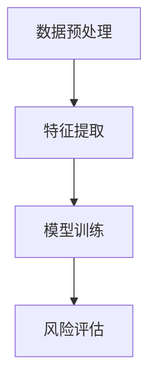

                 


# 智能风险评估AI Agent：LLM在金融领域的应用

## 关键词：
- 智能风险评估
- AI Agent
- 大语言模型（LLM）
- 金融领域
- 机器学习

## 摘要：
本文深入探讨了智能风险评估AI Agent在金融领域的应用，结合大语言模型（LLM）的技术优势，分析了其在金融风险评估中的创新应用和实际价值。文章从背景、核心概念、算法原理、系统架构到项目实战，全面解析了智能风险评估AI Agent的实现过程和应用前景，为读者提供了从理论到实践的系统性指导。

---

# 第一部分: 智能风险评估AI Agent的背景与核心概念

## 第1章: 智能风险评估AI Agent概述

### 1.1 智能风险评估的背景与意义
#### 1.1.1 风险评估的传统方法与局限性
传统的金融风险评估方法依赖于统计分析和经验判断，存在以下问题：
- 数据维度有限，难以捕捉复杂市场波动。
- 人工判断主观性强，难以保证准确性。
- 处理实时数据能力较弱，难以应对快速变化的市场环境。

#### 1.1.2 AI Agent在风险评估中的作用
AI Agent通过实时数据处理、智能决策和自动化执行，显著提升了风险评估的效率和准确性。其主要作用包括：
- 实时监控市场动态，快速识别潜在风险。
- 自动化分析海量数据，发现隐藏的关联性。
- 提供个性化风险评估建议，优化投资决策。

#### 1.1.3 金融领域的风险评估需求
随着金融市场的复杂化和全球化，金融机构对实时、精准的风险评估需求日益增加。AI Agent通过结合LLM的强大语言处理能力，能够更好地满足这些需求。

---

### 1.2 大语言模型（LLM）与AI Agent
#### 1.2.1 大语言模型的定义与特点
大语言模型（LLM）是指基于Transformer架构的大型神经网络模型，具有以下特点：
- 强大的自然语言处理能力。
- 能够理解和生成人类语言。
- 通过大量数据训练，具备泛化能力。

#### 1.2.2 AI Agent的基本概念
AI Agent是一种智能体，能够感知环境、做出决策并采取行动。在风险评估中，AI Agent通常扮演以下角色：
- 数据采集与处理。
- 风险分析与预测。
- 决策支持与自动化执行。

#### 1.2.3 LLM与AI Agent的结合
通过将LLM集成到AI Agent中，可以充分发挥语言模型的自然语言处理能力，提升风险评估的智能化水平。例如：
- 利用LLM分析新闻、报告等非结构化数据，提取关键信息。
- 结合结构化数据，进行多维度风险评估。

---

### 1.3 智能风险评估AI Agent的应用场景
#### 1.3.1 金融领域的典型场景
- 股票市场风险评估。
- 信用风险评估。
- 市场风险监控。

#### 1.3.2 其他行业的潜在应用
- 零售业的信用评估。
- 制造业的风险预测。
- 医疗行业的风险预警。

#### 1.3.3 技术优势与实际需求的结合
通过AI Agent的智能化决策能力，金融机构可以实现以下目标：
- 提高风险评估效率。
- 减少人为错误。
- 实现风险的实时监控与预警。

---

## 第2章: 智能风险评估AI Agent的核心概念与联系

### 2.1 核心概念原理
#### 2.1.1 大语言模型的训练机制
大语言模型通过监督学习和无监督学习相结合的方式进行训练，具体步骤包括：
1. 数据预处理：清洗和标注数据。
2. 模型训练：使用Transformer架构进行参数优化。
3. 微调：针对特定任务进行 fine-tuning。

#### 2.1.2 AI Agent的决策逻辑
AI Agent的决策逻辑基于以下步骤：
1. 数据采集：从多个来源获取相关信息。
2. 数据分析：利用LLM进行理解和分析。
3. 风险评估：结合历史数据和实时信息进行预测。
4. 决策输出：生成风险评估报告或触发预警机制。

#### 2.1.3 智能风险评估的数学模型
智能风险评估模型通常包括以下几个部分：
- 数据预处理模块：特征提取与降维。
- 模型训练模块：基于机器学习或深度学习的方法。
- 风险评分模块：根据模型输出生成风险评分。

---

### 2.2 核心概念属性特征对比
以下是LLM与传统机器学习模型的对比：

| 特性               | LLM                        | 传统机器学习模型       |
|--------------------|---------------------------|------------------------|
| 数据需求           | 需要大量标注数据           | 数据量相对较小           |
| 模型复杂度         | 高复杂度                   | 较低复杂度               |
| 处理能力           | 强大的自然语言处理能力     | 专注于特定任务           |
| 可解释性           | 较低可解释性                | 较高可解释性               |

---

### 2.3 ER实体关系图
以下是智能风险评估AI Agent的ER实体关系图：

```mermaid
er
actor: 用户
agent: 智能风险评估AI Agent
model: 大语言模型
risk: 风险评估结果
training: 训练数据
```

---

## 第3章: 智能风险评估AI Agent的算法原理

### 3.1 大语言模型的训练过程
#### 3.1.1 Transformer模型的结构
Transformer模型由编码器和解码器两部分组成，其核心思想是：
- 编码器负责将输入数据编码为语义向量。
- 解码器负责将编码结果解码为输出序列。

#### 3.1.2 注意力机制的实现
注意力机制通过计算输入数据中每个词的重要性来决定其权重，具体公式如下：

$$\text{Attention}(Q, K, V) = \text{softmax}\left(\frac{QK^T}{\sqrt{d_k}}\right)V$$

其中：
- \(Q\) 是查询向量。
- \(K\) 是键向量。
- \(V\) 是值向量。
- \(d_k\) 是向量的维度。

---

### 3.2 智能风险评估的算法实现
#### 3.2.1 数据预处理
数据预处理步骤包括：
1. 数据清洗：去除缺失值和异常值。
2. 特征提取：从文本数据中提取关键词和实体。
3. 数据标准化：对数值型数据进行标准化处理。

#### 3.2.2 模型训练
模型训练过程如下：



模型训练使用交叉熵损失函数，其数学表达式为：

$$\text{Loss} = -\sum_{i=1}^{n} y_i \log(p_i) + (1-y_i)\log(1-p_i)$$

其中：
- \(y_i\) 是真实标签。
- \(p_i\) 是预测概率。

---

## 第4章: 智能风险评估AI Agent的系统架构设计

### 4.1 项目背景与目标
本项目旨在利用AI Agent和LLM技术，构建一个智能化的金融风险评估系统，帮助金融机构实现风险的实时监控与预警。

### 4.2 系统功能设计
系统功能设计包括以下几个模块：
- 数据采集模块：从多个数据源获取实时信息。
- 数据分析模块：利用LLM进行文本分析和数据挖掘。
- 风险评估模块：基于机器学习模型生成风险评分。
- 决策支持模块：提供风险预警和决策建议。

### 4.3 系统架构设计
系统架构采用分层设计，包括数据层、业务逻辑层和用户界面层。


---

## 第5章: 智能风险评估AI Agent的项目实战

### 5.1 环境安装
项目实战需要以下环境：
- Python 3.8+
- PyTorch 1.9+
- Transformers库 4.12+

### 5.2 核心代码实现
以下是AI Agent的核心代码示例：

```python
import torch
from transformers import AutoTokenizer, AutoModelForCausalLM

class AI-Agent:
    def __init__(self):
        self.tokenizer = AutoTokenizer.from_pretrained("facebook/opt-125m")
        self.model = AutoModelForCausalLM.from_pretrained("facebook/opt-125m")

    def analyze(self, input_text):
        inputs = self.tokenizer(input_text, return_tensors="pt")
        outputs = self.model(**inputs)
        return outputs

    def generate_report(self, input_text):
        inputs = self.tokenizer(input_text, return_tensors="pt")
        outputs = self.model.generate(inputs.input_ids, max_length=500)
        return self.tokenizer.decode(outputs[0], skip_special_tokens=True)
```

### 5.3 代码解读与分析
- `AI-Agent`类初始化加载了预训练的LLM模型。
- `analyze`方法用于对输入文本进行分析。
- `generate_report`方法用于生成风险评估报告。

---

## 第6章: 总结与展望

### 6.1 总结
智能风险评估AI Agent通过结合LLM的强大能力，显著提升了金融风险评估的效率和准确性。本文从理论到实践，详细介绍了其核心概念、算法原理和系统架构。

### 6.2 展望
未来，随着AI技术的不断发展，智能风险评估AI Agent将在金融领域发挥更大的作用，特别是在实时监控和个性化服务方面。

---

## 关键词：
- 智能风险评估
- AI Agent
- 大语言模型（LLM）
- 金融领域
- 机器学习

---

## 摘要：
本文深入探讨了智能风险评估AI Agent在金融领域的应用，结合大语言模型（LLM）的技术优势，分析了其在金融风险评估中的创新应用和实际价值。文章从背景、核心概念、算法原理、系统架构到项目实战，全面解析了智能风险评估AI Agent的实现过程和应用前景，为读者提供了从理论到实践的系统性指导。

