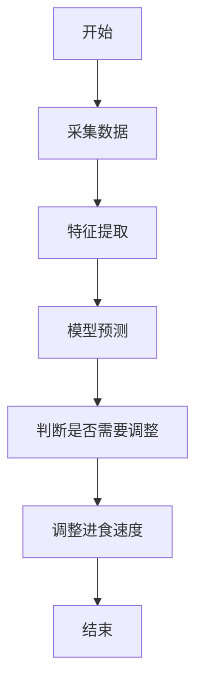
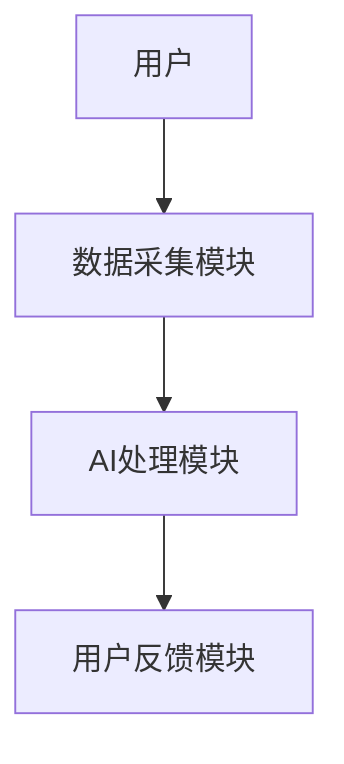

                 


# 智能餐盘：AI Agent的进食速度调节系统

## 关键词：智能餐盘, AI Agent, 进食速度调节, 健康管理, 人工智能, 传感器技术

## 摘要：本文介绍了一种基于AI Agent的智能餐盘系统，该系统通过传感器技术实时监测用户的进食速度，并通过反馈机制帮助用户调节进食节奏，从而实现更健康的饮食习惯。文章详细探讨了系统的背景、核心原理、算法实现、系统架构以及实际应用案例，为读者提供全面的技术解析。

---

## 第1章：背景介绍

### 1.1 问题背景

#### 1.1.1 当前饮食健康问题的现状
现代社会中，由于生活方式的改变和饮食习惯的不健康，肥胖、糖尿病、消化不良等健康问题日益严重。这些问题与进食速度密切相关，快速进食容易导致饱食中枢反应滞后，进而引发过量摄入。

#### 1.1.2 进食速度对健康的影响
进食速度过快会导致：
- **消化系统负担加重**：食物未充分咀嚼，胃部消化压力增大。
- **血糖波动**：快速摄入碳水化合物会导致血糖急剧上升，增加糖尿病风险。
- **能量摄入过多**：进食过快容易导致饱食感滞后，摄入更多热量。

#### 1.1.3 现有饮食管理工具的不足
传统饮食管理工具主要关注摄入量的记录与提醒，缺乏对进食速度的实时监测和调节功能。

---

### 1.2 问题描述

#### 1.2.1 进食速度调节的需求
通过实时监测和调节进食速度，帮助用户形成健康的饮食习惯。

#### 1.2.2 智能餐盘的目标用户群体
- 特定健康问题人群（如糖尿病患者）
- 肥胖人群
- 儿童及老年人群（帮助培养良好的饮食习惯）

#### 1.2.3 系统需要解决的核心问题
- 实时监测进食速度
- 提供实时反馈与调节建议
- 保证用户饮食安全与舒适性

---

### 1.3 问题解决

#### 1.3.1 AI Agent在饮食管理中的作用
AI Agent通过实时感知、分析和反馈，帮助用户调节进食速度，优化饮食习惯。

#### 1.3.2 智能餐盘的设计目标
- 实现进食速度的实时监测
- 提供个性化的进食速度建议
- 通过反馈机制帮助用户养成健康饮食习惯

#### 1.3.3 系统实现的关键技术
- 传感器技术：监测进食行为
- AI算法：分析数据并提供反馈
- 人机交互设计：确保用户友好体验

---

### 1.4 系统的边界与外延

#### 1.4.1 系统的功能边界
- 进食速度监测与调节
- 基于AI的反馈机制
- 数据记录与分析

#### 1.4.2 系统的可扩展性
- 支持多种传感器类型
- 适用于不同人群的个性化需求
- 扩展健康数据分析功能

#### 1.4.3 系统的适用场景与限制
- 适用场景：家庭、医疗机构、学校
- 限制：需用户配合使用，数据采集精度受硬件限制

---

### 1.5 概念结构与核心要素

#### 1.5.1 智能餐盘的核心组成
- 传感器模块：监测餐具运动和食物重量变化
- AI处理模块：分析数据并生成反馈
- 用户反馈模块：提供实时提醒或震动反馈

#### 1.5.2 AI Agent的功能模块
- **感知模块**：收集传感器数据
- **决策模块**：分析数据并制定调节策略
- **执行模块**：通过震动或提示音调节进食速度

#### 1.5.3 系统与用户交互的流程
1. 用户开始进食
2. 传感器采集数据并传输至AI处理模块
3. AI分析数据，判断进食速度是否合理
4. 根据分析结果，系统发出反馈信号
5. 用户根据反馈调整进食速度

---

## 第2章：AI Agent的核心原理

### 2.1 AI Agent的核心原理

#### 2.1.1 AI Agent的定义与特点
- **定义**：AI Agent是一种能够感知环境、做出决策并采取行动的智能实体。
- **特点**：
  - 自主性
  - 反应性
  - 社会性
  - 学习能力

#### 2.1.2 AI Agent的感知、决策与执行机制
- **感知**：通过传感器获取数据
- **决策**：基于数据进行分析和判断
- **执行**：通过反馈机制调整进食速度

---

### 2.2 智能餐盘中的AI Agent设计

#### 2.2.1 进食速度监测的实现
- 传感器采集餐具的运动速度和食物重量变化
- 通过算法计算出当前进食速度

#### 2.2.2 AI Agent的反馈机制
- 根据分析结果发出震动或声音提醒
- 提供个性化的调节建议

#### 2.2.3 系统的自适应学习能力
- 基于用户行为数据优化调节策略
- 自动调整反馈强度以适应用户习惯

---

### 2.3 核心概念对比表

| 概念 | 基于规则的AI Agent | 基于深度学习的AI Agent |
|------|---------------------|--------------------------|
| 感知方式 | 预定义规则触发 | 自适应学习感知 |
| 决策方式 | 执行预设逻辑 | 基于数据的动态决策 |
| 适应性 | 较低 | 较高 |

---

## 第3章：算法原理

### 3.1 算法流程图



---

### 3.2 核心算法实现

#### 3.2.1 数据预处理
```python
import numpy as np

# 假设data为传感器采集的原始数据
def preprocess(data):
    # 去除噪声
    filtered_data = np.median_filter(data, size=3)
    # 标准化处理
    normalized_data = (filtered_data - np.mean(filtered_data)) / np.std(filtered_data)
    return normalized_data
```

#### 3.2.2 模型训练
```python
from sklearn.model_selection import train_test_split
from sklearn.linear_model import LinearRegression

# 假设features为预处理后的特征数据，labels为对应的目标值
X_train, X_test, y_train, y_test = train_test_split(features, labels, test_size=0.2)

model = LinearRegression()
model.fit(X_train, y_train)
```

#### 3.2.3 模型预测
```python
def predict_speed(features):
    predicted_speed = model.predict(features)
    return predicted_speed
```

---

### 3.3 数学模型

#### 3.3.1 损失函数
$$ L = \frac{1}{2m} \sum_{i=1}^{m} (y_i - \hat{y_i})^2 $$

其中，$m$为样本数量，$y_i$为真实值，$\hat{y_i}$为预测值。

#### 3.3.2 优化目标
$$ \text{最小化} \quad L $$

---

## 第4章：系统分析与架构设计

### 4.1 问题场景介绍

- **目标**：实时监测并调节进食速度
- **用户需求**：个性化反馈、易用性

---

### 4.2 系统功能设计

#### 4.2.1 数据采集模块
- 传感器类型：加速度传感器、重量传感器
- 数据采集频率：实时采集

#### 4.2.2 AI处理模块
- 数据分析：特征提取、模型预测
- 决策反馈：震动提醒、速度调整

#### 4.2.3 用户反馈模块
- 提醒方式：震动、声音
- 交互界面：显示当前速度、建议速度

---

### 4.3 系统架构设计



---

### 4.4 接口设计

#### 4.4.1 传感器接口
- 输入：传感器数据
- 输出：数据处理模块

#### 4.4.2 用户反馈接口
- 输入：调节信号
- 输出：震动或声音反馈

---

## 第5章：项目实战

### 5.1 环境搭建

#### 5.1.1 安装依赖
```bash
pip install numpy scikit-learn matplotlib
```

---

### 5.2 核心代码实现

#### 5.2.1 数据采集与预处理
```python
import numpy as np

# 模拟传感器数据
def generate_data(sample_size=100):
    import random
    data = []
    for _ in range(sample_size):
        speed = random.uniform(0.5, 2.5)
        data.append(speed)
    return np.array(data)

data = generate_data()
print("原始数据:", data)
processed_data = preprocess(data)
print("预处理后数据:", processed_data)
```

#### 5.2.2 模型训练与预测
```python
from sklearn.linear_model import LinearRegression

# 模拟特征和标签
features = processed_data.reshape(-1, 1)
labels = [random.uniform(0.8, 1.2) for _ in range(len(features))]

X_train, X_test, y_train, y_test = train_test_split(features, labels, test_size=0.2)

model = LinearRegression()
model.fit(X_train, y_train)

predicted_labels = model.predict(X_test)
print("预测值:", predicted_labels)
print("真实值:", y_test)
```

---

### 5.3 应用案例分析

#### 5.3.1 案例1：糖尿病患者
- **背景**：糖尿病患者需要控制血糖波动，建议进食速度适中。
- **系统反馈**：根据血糖数据调整进食速度，避免血糖急剧上升。

#### 5.3.2 案例2：普通用户
- **背景**：用户希望通过调节进食速度减轻体重。
- **系统反馈**：实时提醒进食过快，帮助用户逐渐适应缓慢进食的习惯。

---

## 第6章：最佳实践与总结

### 6.1 小结

- 本文介绍了智能餐盘的设计与实现，重点讲解了AI Agent在进食速度调节中的应用。
- 系统通过传感器、AI算法和反馈机制帮助用户形成健康饮食习惯。

### 6.2 注意事项

- 数据隐私保护：确保用户数据的安全性
- 硬件精度问题：传感器的精度直接影响系统准确性
- 用户习惯适应：用户需要时间适应系统的反馈机制

### 6.3 拓展阅读

- 《人工智能在医疗健康中的应用》
- 《基于传感器的智能系统设计》

---

## 结语

智能餐盘通过AI Agent实时监测和调节进食速度，为用户提供了一种全新的健康管理方式。随着技术的不断发展，这类智能设备将更加普及，帮助更多人实现健康饮食。

