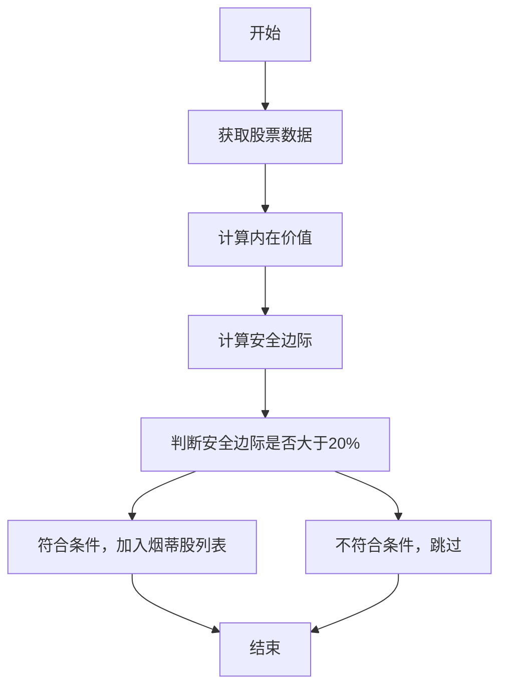
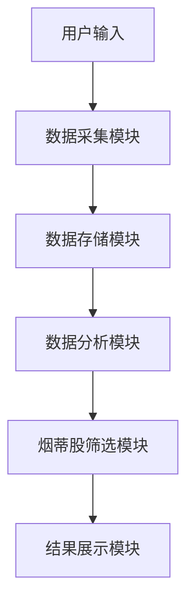
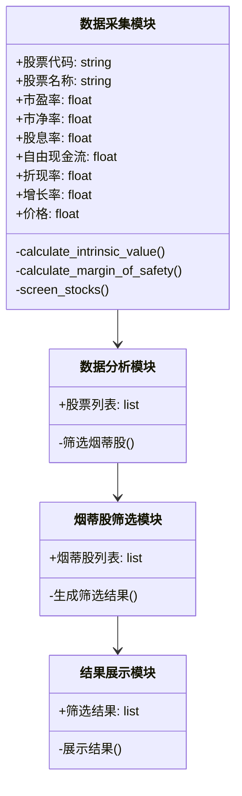
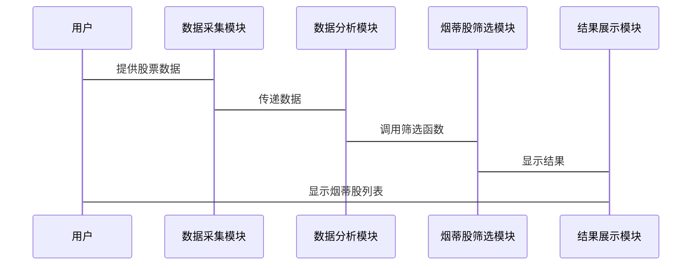

                 


# 本杰明·格雷厄姆的'烟蒂股'策略现代解读

## 关键词：
- 本杰明·格雷厄姆
- 烟蒂股
- 价值投资
- 内在价值
- 安全边际
- 股票分析
- 投资策略

## 摘要：
本文深入探讨了本杰明·格雷厄姆的烟蒂股策略，从其核心理念到现代应用进行了全面解读。文章结合技术分析，通过数学模型和算法实现，展示了如何在当今市场中应用这一策略。通过系统架构设计和项目实战，帮助读者理解并实践烟蒂股投资，同时提供了最佳实践建议。

---

## 第一部分：烟蒂股策略的背景与核心概念

### 第1章：烟蒂股策略的背景与定义

#### 1.1 烟蒂股策略的起源与发展

烟蒂股策略由投资大师本杰明·格雷厄姆提出，是价值投资的重要组成部分。该策略的核心在于寻找市场中被忽视的低估值股票，即“烟蒂股”。这些股票通常具有较高的安全边际，适合长期投资。

- **起源**：20世纪初，格雷厄姆提出烟蒂股概念，强调通过基本面分析寻找低估股票。
- **发展**：随着市场变化，烟蒂股策略不断优化，结合现代技术手段进行分析和筛选。

#### 1.2 烟蒂股策略的核心理念与目标

烟蒂股策略的核心理念是通过分析公司基本面，识别市场低估的股票，追求长期稳定的投资回报。

- **核心理念**：寻找具有安全边际的低估值股票，注重内在价值而非市场情绪。
- **目标**：通过长期持有优质烟蒂股，实现超额收益。

#### 1.3 烟蒂股策略在现代投资中的应用

烟蒂股策略在现代投资中的应用更加广泛，结合量化分析和大数据技术，提高了筛选效率和准确性。

---

### 第2章：烟蒂股策略的核心概念

#### 2.1 烟蒂股的定义与特征

烟蒂股是指那些市场价格低于其内在价值，且具有较高安全边际的股票。其主要特征包括低市盈率、低市净率和高股息率等。

- **定义**：市场价格显著低于内在价值的股票。
- **特征**：
  - 低估值：市盈率、市净率低于行业平均水平。
  - 高质量：公司财务状况健康，盈利能力稳定。
  - 高安全边际：市场价格与内在价值的差距较大。

#### 2.2 烟蒂股与成长股的对比

| 特性       | 烟蒂股             | 成长股             |
|------------|--------------------|--------------------|
| 价值评估   | 低估值             | 高成长性           |
| 投资逻辑   | 寻找低估            | 寻找高增长          |
| 风险偏好   | 低风险             | 高风险             |
| 代表公司   | 需求稳定的公司     | 高科技公司         |

#### 2.3 烟蒂股策略的边界与外延

烟蒂股策略的边界包括市场波动、公司基本面变化等，外延则包括结合技术分析和大数据技术。

---

## 第二部分：烟蒂股策略的核心概念与联系

### 第2章：烟蒂股策略的核心原理

#### 2.1 烟蒂股策略的数学模型

烟蒂股策略的核心是计算股票的内在价值，通常使用现金流贴现模型（DCF）。

- **内在价值公式**：
  $$ V = \frac{CF}{(r - g)} $$
  其中，CF为自由现金流，r为折现率，g为增长率。

- **安全边际公式**：
  $$ \text{安全边际} = V_{\text{估计}} - P $$
  其中，V_{\text{估计}}为内在价值估计值，P为市场价格。

#### 2.2 烟蒂股策略的ER实体关系图

以下是一个烟蒂股筛选的ER图：

```mermaid
erd
    股票
    ----
    - 股票代码: string
    - 股票名称: string
    - 市盈率: float
    - 市净率: float
    - 股息率: float
    - 内在价值: float
    - 安全边际: float

    筛选条件
    ----
    - 市盈率 < 15
    - 市净率 < 2
    - 股息率 > 3%
    - 安全边际 > 20%

    烟蒂股列表
    ----
    - 股票代码
    - 股票名称
    - 筛选结果
```

#### 2.3 烟蒂股策略的Mermaid流程图

以下是一个烟蒂股筛选的流程图：



---

## 第三部分：烟蒂股策略的算法原理与实现

### 第3章：烟蒂股策略的算法原理

#### 3.1 烟蒂股策略的数学模型

以下是DCF模型的Python实现：

```python
def calculate_intrinsic_value(cash_flow, discount_rate, growth_rate):
    return cash_flow / (discount_rate - growth_rate)

def calculate_margin_of_safety(intrinsic_value, price):
    return intrinsic_value - price

# 示例数据
cash_flow = 1000000
discount_rate = 0.1
growth_rate = 0.05
price = 50

# 计算内在价值和安全边际
intrinsic_value = calculate_intrinsic_value(cash_flow, discount_rate, growth_rate)
margin_of_safety = calculate_margin_of_safety(intrinsic_value, price)

print(f"内在价值: ${intrinsic_value:.2f}")
print(f"安全边际: ${margin_of_safety:.2f}")
```

#### 3.2 烟蒂股策略的Python实现

以下是完整的烟蒂股筛选代码：

```python
import pandas as pd

def calculate_intrinsic_value(cash_flow, discount_rate, growth_rate):
    return cash_flow / (discount_rate - growth_rate)

def calculate_margin_of_safety(intrinsic_value, price):
    return intrinsic_value - price

def screen_stidend_stocks(stocks_data):
    selected_stocks = []
    for stock in stocks_data:
        cf = stock['free_cash_flow']
        dr = stock['discount_rate']
        gr = stock['growth_rate']
        p = stock['price']
        
        iv = calculate_intrinsic_value(cf, dr, gr)
        mos = calculate_margin_of_safety(iv, p)
        
        if mos > 0:
            selected_stocks.append({
                'stock_code': stock['stock_code'],
                'stock_name': stock['stock_name'],
                'intrinsic_value': iv,
                'margin_of_safety': mos
            })
    return selected_stocks

# 示例数据
stocks = [
    {
        'stock_code': 'AAPL',
        'stock_name': '苹果',
        'free_cash_flow': 1000000,
        'discount_rate': 0.1,
        'growth_rate': 0.05,
        'price': 150
    },
    # 添加更多股票数据
]

selected = screen_stidend_stocks(stocks)
print(selected)
```

#### 3.3 烟蒂股策略的系统架构设计

以下是烟蒂股投资系统的架构图：



---

## 第四部分：烟蒂股策略的系统分析与架构设计

### 第4章：烟蒂股策略的系统分析

#### 4.1 烟蒂股策略的系统架构设计

以下是烟蒂股投资系统的架构图：



#### 4.2 烟蒂股策略的系统交互设计

以下是系统交互流程图：



---

## 第五部分：烟蒂股策略的项目实战

### 第5章：烟蒂股策略的项目实战

#### 5.1 环境安装与配置

```bash
pip install pandas numpy matplotlib
```

#### 5.2 核心代码实现

以下是核心代码：

```python
import pandas as pd

def calculate_intrinsic_value(cf, dr, gr):
    return cf / (dr - gr)

def calculate_margin_of_safety(iv, p):
    return iv - p

def screen_stocks(stocks_df):
    selected = []
    for idx, row in stocks_df.iterrows():
        iv = calculate_intrinsic_value(row['free_cash_flow'], row['discount_rate'], row['growth_rate'])
        mos = calculate_margin_of_safety(iv, row['price'])
        if mos > 0:
            selected.append({
                'stock_code': idx,
                'intrinsic_value': iv,
                'margin_of_safety': mos
            })
    return pd.DataFrame(selected)

# 示例数据
data = {
    'stock_code': ['AAPL', 'MSFT', 'GOOGL'],
    'free_cash_flow': [1000000, 800000, 1200000],
    'discount_rate': [0.1, 0.1, 0.1],
    'growth_rate': [0.05, 0.04, 0.06],
    'price': [150, 100, 200]
}

df = pd.DataFrame(data)
result = screen_stocks(df)
print(result)
```

#### 5.3 项目小结

通过项目实战，读者可以掌握烟蒂股策略的核心算法，并能够将其应用于实际投资中。代码实现了从数据采集到筛选结果展示的全过程，帮助投资者快速找到潜在的烟蒂股。

---

## 第六部分：烟蒂股策略的最佳实践

### 第6章：烟蒂股策略的最佳实践

#### 6.1 小结

烟蒂股策略是一种有效的投资方法，通过寻找低估值、高质量的股票，能够在市场波动中实现稳定收益。

#### 6.2 注意事项

- **数据准确性**：确保数据来源可靠。
- **市场变化**：定期重新评估股票的内在价值和安全边际。
- **风险管理**：合理分散投资，避免过度集中。

#### 6.3 拓展阅读

建议进一步阅读格雷厄姆的《证券分析》和彼得·林奇的《选股的艺术》，深入了解价值投资的精髓。

---

## 结语

通过本文的详细解读，读者可以全面理解烟蒂股策略的核心思想，并掌握其现代应用方法。结合技术分析和实际案例，本文为投资者提供了实用的投资指南，帮助他们在复杂的市场中实现长期稳定的收益。

