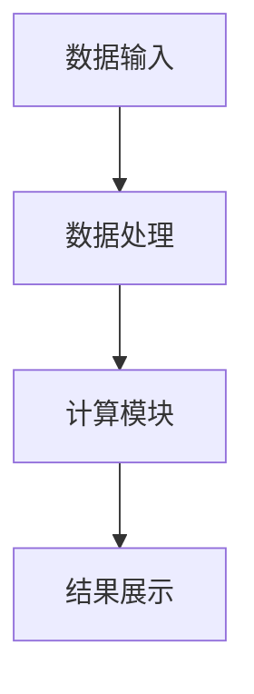
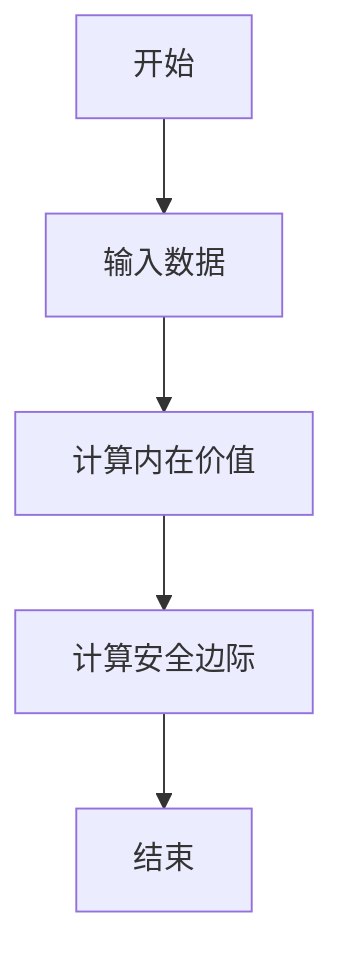

                 


# 本杰明·格雷厄姆的企业价值计算方法

## 关键词：企业价值计算、本杰明·格雷厄姆、投资、安全边际、内在价值、价值投资

## 摘要：  
本杰明·格雷厄姆是价值投资的鼻祖，他的企业价值计算方法为投资者提供了评估企业内在价值的重要工具。本文详细解析了格雷厄姆的企业价值计算方法，包括其核心理论、计算模型、实际案例分析以及系统实现。通过安全边际和内在价值这两个核心概念，本文深入探讨了如何在投资决策中应用这些方法，并通过系统架构和项目实战帮助读者掌握其实现细节。本文适合投资者、金融从业者以及对价值投资感兴趣的技术人员阅读。

---

# 第1章: 企业价值计算的背景与意义

## 1.1 企业价值计算的定义与概念

### 1.1.1 企业价值的定义  
企业价值（Enterprise Value）是指企业整体的经济价值，包括企业所有资产的市场价值，扣除其负债的现值。企业价值的核心在于反映企业的整体实力和潜在盈利能力。

### 1.1.2 企业价值计算的意义  
企业价值计算是投资决策中的关键环节，它能够帮助投资者评估企业的内在价值，识别被低估的投资标的，从而制定合理的投资策略。

### 1.1.3 企业价值计算的核心要素  
- **收入**：企业的收入能力。
- **利润**：企业的盈利能力。
- **资产**：企业的资产价值。
- **负债**：企业的债务负担。
- **现金流**：企业的现金流量情况。

---

## 1.2 传统企业价值评估方法的局限性

### 1.2.1 财务指标法的局限性  
财务指标法（如市盈率、市净率）仅关注企业的表面数据，忽略了企业的实际盈利能力和发展潜力。

### 1.2.2 市盈率法的局限性  
市盈率法容易受到市场波动的影响，且无法全面反映企业的内在价值。

### 1.2.3 市净率法的局限性  
市净率法在评估企业价值时，忽略了企业的盈利能力和发展潜力。

---

## 1.3 格雷厄姆的企业价值计算方法的引入

### 1.3.1 格雷厄姆的背景与贡献  
本杰明·格雷厄姆是价值投资的创始人，他的投资理念强调安全边际和内在价值。

### 1.3.2 格雷厄姆方法的核心思想  
格雷厄姆认为，企业价值应基于其内在价值进行评估，而非市场情绪或短期波动。

### 1.3.3 格雷厄姆方法的适用场景  
格雷厄姆方法适用于长期投资、价值投资以及评估企业的内在价值。

---

## 1.4 本章小结  
本章介绍了企业价值计算的背景与意义，分析了传统方法的局限性，并引出了格雷厄姆的企业价值计算方法。通过对比传统方法与格雷厄姆方法，读者可以理解格雷厄姆方法的独特性和重要性。

---

# 第2章: 格雷厄姆的企业价值计算核心理论

## 2.1 格雷厄姆的安全边际概念

### 2.1.1 安全边际的定义  
安全边际是指股票的市场价格低于其内在价值的部分，是投资者在投资决策中应保留的安全空间。

### 2.1.2 安全边际的计算方法  
$$ \text{安全边际} = \text{内在价值} - \text{市场价格} $$

### 2.1.3 安全边际在投资中的作用  
安全边际能够帮助投资者降低投资风险，确保在市场波动中保持收益。

---

## 2.2 格雷厄姆的内在价值概念

### 2.2.1 内在价值的定义  
内在价值是指企业未来现金流的现值，是企业的真实价值。

### 2.2.2 内在价值的计算公式  
$$ \text{内在价值} = \sum_{t=1}^{n} \frac{\text{现金流}_t}{(1 + r)^t} $$  
其中，\( r \) 是折现率，\( n \) 是评估期限。

### 2.2.3 内在价值与市场价值的关系  
内在价值与市场价值的关系是动态的，市场价值围绕内在价值波动。

---

## 2.3 格雷厄姆的企业价值计算模型

### 2.3.1 企业价值计算的基本公式  
$$ \text{企业价值} = \text{息税前利润} \times \text{市盈率} $$

### 2.3.2 企业价值计算的关键变量  
- 息税前利润（EBIT）
- 市盈率（P/E）

### 2.3.3 企业价值计算的步骤与流程  
1. 收集企业的财务数据。
2. 计算企业的息税前利润。
3. 确定企业的市盈率。
4. 计算企业的价值。

---

## 2.4 本章小结  
本章详细介绍了格雷厄姆的安全边际和内在价值概念，并通过公式和步骤展示了如何计算企业的内在价值。通过理解这些概念，读者可以更好地应用格雷厄姆的方法进行投资决策。

---

# 第3章: 格雷厄姆企业价值计算的具体方法

## 3.1 格雷厄姆的企业价值计算公式

### 3.1.1 企业价值计算的数学模型  
$$ \text{企业价值} = \text{净利润} \times \text{市盈率} $$

### 3.1.2 企业价值计算的公式推导  
企业价值的计算基于企业的未来现金流，通过折现法计算其现值。

### 3.1.3 公式中的变量与参数解释  
- 净利润：企业的净利润。
- 市盈率：企业的市盈率。

---

## 3.2 格雷厄姆的企业价值计算步骤

### 3.2.1 确定企业的财务数据  
包括收入、利润、资产、负债等数据。

### 3.2.2 计算企业的内在价值  
通过公式计算企业的内在价值。

### 3.2.3 确定企业的安全边际  
计算安全边际，确保投资的安全性。

---

## 3.3 格雷厄姆企业价值计算的案例分析

### 3.3.1 案例背景介绍  
假设某企业的净利润为100万元，市盈率为15。

### 3.3.2 数据收集与处理  
收入：2000万元  
利润：100万元  
资产：1500万元  
负债：1000万元

### 3.3.3 计算过程与结果分析  
1. 计算内在价值：  
$$ \text{内在价值} = 100 \times 15 = 1500 \text{万元} $$  
2. 计算安全边际：  
$$ \text{安全边际} = 1500 - 1000 = 500 \text{万元} $$

---

## 3.4 本章小结  
本章通过具体的计算步骤和案例分析，展示了如何应用格雷厄姆的方法计算企业价值。通过实际案例，读者可以更好地理解如何将理论应用于实践。

---

# 第4章: 格雷厄姆企业价值计算的系统架构与实现

## 4.1 系统架构设计

### 4.1.1 系统功能模块划分  
- 数据输入模块：接收企业的财务数据。  
- 计算模块：计算企业的内在价值和安全边际。  
- 结果展示模块：显示计算结果。

### 4.1.2 系统架构的Mermaid图  


### 4.1.3 系统接口设计  
- 数据输入接口：接收企业的财务数据。  
- 计算接口：计算企业的内在价值和安全边际。  
- 结果展示接口：显示计算结果。

---

## 4.2 算法实现

### 4.2.1 算法流程的Mermaid图  


### 4.2.2 Python源代码实现  
```python
def calculate_intrinsic_value(net_profit, pe_ratio):
    return net_profit * pe_ratio

def calculate_margin_of_safety(intrinsic_value, market_value):
    return intrinsic_value - market_value

# 示例
net_profit = 100  # 净利润（万元）
pe_ratio = 15     # 市盈率
market_value = 1000  # 市场价值（万元）

intrinsic_value = calculate_intrinsic_value(net_profit, pe_ratio)
margin_of_safety = calculate_margin_of_safety(intrinsic_value, market_value)

print(f"内在价值: {intrinsic_value}万元")
print(f"安全边际: {margin_of_safety}万元")
```

### 4.2.3 算法原理的数学模型  
$$ \text{内在价值} = \text{净利润} \times \text{市盈率} $$  
$$ \text{安全边际} = \text{内在价值} - \text{市场价值} $$

---

## 4.3 本章小结  
本章通过系统架构和算法实现，展示了如何将格雷厄姆的企业价值计算方法应用于实际投资中。通过Python代码和数学模型，读者可以更好地理解如何实现这些计算。

---

# 第5章: 项目实战

## 5.1 项目背景与目标  
通过实际案例，展示如何应用格雷厄姆的方法计算企业价值。

## 5.2 项目环境与工具  
- Python编程语言  
- 数据分析工具（如Pandas、NumPy）

## 5.3 项目核心实现

### 5.3.1 环境安装  
安装Python和必要的库：  
```bash
pip install pandas numpy
```

### 5.3.2 核心代码实现  
```python
import pandas as pd
import numpy as np

def calculate_intrinsic_value(df):
    df['内在价值'] = df['净利润'] * df['市盈率']
    return df

def calculate_margin_of_safety(df):
    df['安全边际'] = df['内在价值'] - df['市场价值']
    return df

# 示例数据
data = {
    '公司': ['公司A', '公司B', '公司C'],
    '净利润': [100, 150, 200],
    '市盈率': [15, 20, 25],
    '市场价值': [1500, 2000, 2500]
}

df = pd.DataFrame(data)

# 计算内在价值
df = calculate_intrinsic_value(df)
# 计算安全边际
df = calculate_margin_of_safety(df)

print(df)
```

### 5.3.3 代码应用解读与分析  
- 代码首先读取数据，计算内在价值和安全边际。  
- 结果展示企业的内在价值和安全边际，帮助投资者做出决策。

---

## 5.4 项目小结  
本章通过实际案例，展示了如何将格雷厄姆的企业价值计算方法应用于实际投资中。通过Python代码和数据分析工具，读者可以更好地理解和应用这些方法。

---

## 5.5 本章小结  
通过本章的项目实战，读者可以掌握如何将格雷厄姆的企业价值计算方法应用于实际投资中，通过代码实现计算并做出投资决策。

---

# 第6章: 总结与展望

## 6.1 核心观点总结  
格雷厄姆的企业价值计算方法通过内在价值和安全边际的概念，帮助投资者识别被低估的企业，制定合理的投资策略。

## 6.2 投资中的注意事项  
- 确保数据的准确性和完整性。  
- 考虑市场波动和经济环境的影响。  
- 结合多种方法进行综合分析。

## 6.3 未来展望  
随着金融市场的不断发展，企业价值计算方法也将不断创新，投资者需要持续学习和更新知识，以应对新的挑战。

---

## 6.4 最佳实践 Tips  
- 在实际投资中，结合多种方法进行综合分析。  
- 定期更新数据和模型，确保计算结果的准确性。  
- 保持理性，避免被市场情绪左右。

---

## 6.5 小结  
本章总结了格雷厄姆的企业价值计算方法的核心观点，并提出了投资中的注意事项和未来展望。通过这些内容，读者可以更好地应用这些方法进行投资决策。

---

## 6.6 注意事项  
- 投资有风险，需谨慎操作。  
- 数据来源需可靠，确保计算结果的准确性。  
- 定期复盘，总结经验教训。

---

## 6.7 拓展阅读  
- 《证券分析》——本杰明·格雷厄姆  
- 《价值投资入门》——彼得·林奇  

---

# 结语

通过本篇文章，我们详细解析了本杰明·格雷厄姆的企业价值计算方法，从理论到实践，从公式到代码，帮助读者全面掌握这一方法。希望本文能为投资者和金融从业者提供有价值的参考，帮助他们在投资决策中做出明智的选择。

