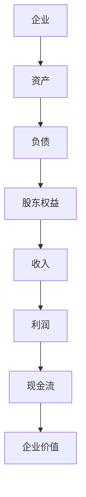
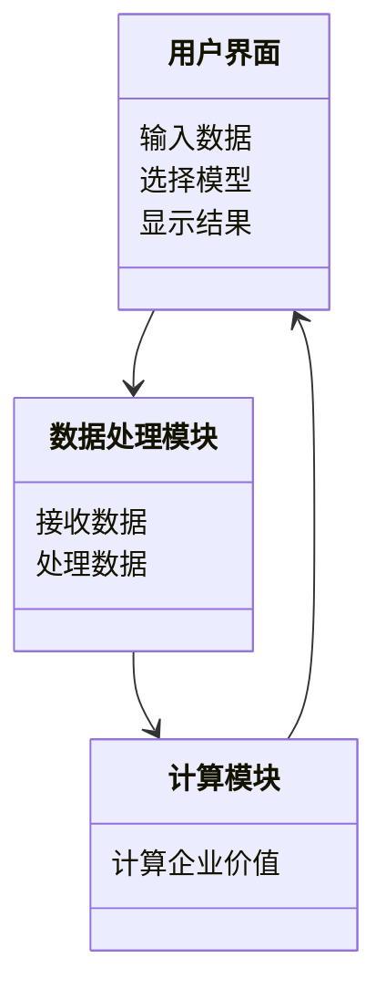
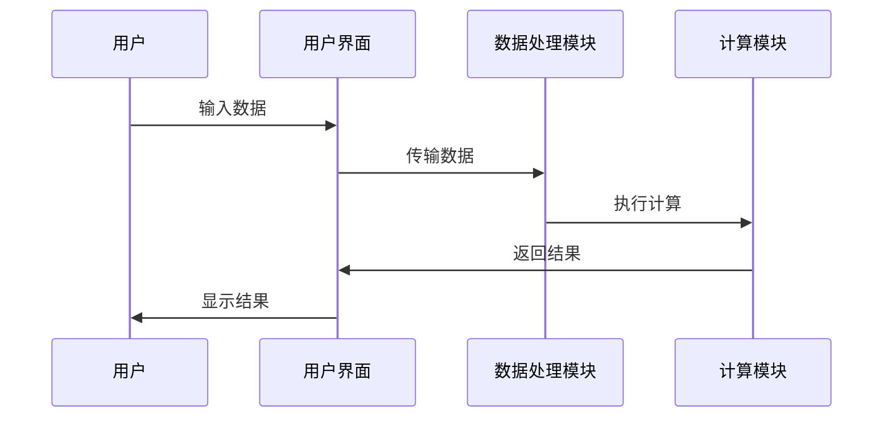

                 


# 本杰明·格雷厄姆的企业价值计算方法现代化

## 关键词：企业价值计算、本杰明·格雷厄姆、价值投资、现代化方法、金融模型、数据驱动

## 摘要：  
本杰明·格雷厄姆作为价值投资的鼻祖，提出了经典的企业价值计算方法，但随着金融市场的变化和技术的进步，其方法需要现代化改进。本文详细介绍了企业价值计算的背景、核心概念、算法原理、系统架构，并通过实际案例展示了如何将格雷厄姆的方法与现代技术结合，实现更高效、准确的企业价值评估。文章最后总结了现代化方法的优势及未来发展方向。

---

# 第1章: 企业价值计算方法概述

## 1.1 企业价值计算的基本概念

### 1.1.1 企业价值的定义与核心要素  
企业价值（Enterprise Value，EV）是指企业整体的市场价值，包括股权、债权和所有其他权益。其核心要素包括资产、负债、股东权益、收入、利润等。  

### 1.1.2 企业价值计算的必要性与应用场景  
企业价值计算是投资决策、企业并购、财务分析等的重要依据。例如，投资者可以通过企业价值评估来判断企业的内在价值是否被市场低估或高估。  

### 1.1.3 企业价值计算的历史发展与现状  
企业价值计算方法经历了从简单到复杂的发展过程，从传统的资产净值法到现代的现金流折现法，每一步都在不断完善。

---

## 1.2 本杰明·格雷厄姆的贡献与局限性

### 1.2.1 格雷厄姆的企业价值计算方法  
格雷厄姆提出了基于资产的估值方法，强调安全边际，认为企业的内在价值应低于其账面价值的一定折扣。  

### 1.2.2 格雷厄姆方法的局限性  
格雷厄姆的方法主要依赖于财务报表数据，忽略了市场波动、企业成长性和无形资产等因素，难以适应现代金融市场的需求。  

### 1.2.3 现代化改进的必要性  
随着数据量的增加和技术的进步，企业价值计算需要结合更多因素，如现金流预测、市场情绪等，以提高准确性。

---

## 1.3 企业价值计算的现代化需求

### 1.3.1 现代金融环境的变化  
现代金融市场波动加剧，企业面临的不确定性增加，传统的计算方法已不足以应对复杂的市场环境。  

### 1.3.2 数据驱动与技术进步的影响  
大数据和人工智能技术的引入，使得企业价值计算可以更精准地预测未来现金流和市场趋势。  

### 1.3.3 现代化方法的优势与目标  
现代化方法旨在结合传统模型与新兴技术，提高计算效率和准确性，同时降低人为错误的风险。

---

## 1.4 本章小结  
本章介绍了企业价值计算的基本概念、格雷厄姆的贡献及其局限性，以及现代化改进的必要性和目标。

---

# 第2章: 企业价值计算的核心概念与联系

## 2.1 核心概念原理

### 2.1.1 格雷厄姆企业价值模型的数学公式  
格雷厄姆模型的计算公式为：  
$$ EV = \frac{P}{(1 - g) \times (1 + r)^n} $$  
其中，P为现金流，g为增长率，r为折现率，n为时间跨度。

### 2.1.2 核心概念的属性特征对比  
| 概念 | 格雷厄姆方法 | 现代化方法 |
|------|--------------|------------|
| 输入数据 | 账面价值 | 现金流、市场数据 |
| 输出结果 | 内在价值 | 精准估值 |
| 计算步骤 | 简单 | 复杂 |

### 2.1.3 实体关系图的 Mermaid 流程图  



---

## 2.2 格雷厄姆模型与现代方法的对比

### 2.2.1 格雷厄姆模型的优缺点  
优点：简单易懂，计算速度快；缺点：忽略市场波动和企业成长性。  

### 2.2.2 现代化方法的改进方向  
引入机器学习算法，结合市场数据和财务指标，提高预测精度。  

### 2.2.3 核心概念的联系与区别  
格雷厄姆模型主要依赖账面价值，而现代化方法更注重现金流和市场动态。

---

## 2.3 本章小结  
本章详细讲解了企业价值计算的核心概念，对比了格雷厄姆模型与现代化方法的差异。

---

# 第3章: 格雷厄姆企业价值计算的算法原理

## 3.1 格雷厄姆原始算法

### 3.1.1 基本公式与实现步骤  
1. 计算企业账面价值。  
2. 找出可比公司的平均市盈率。  
3. 计算企业的安全边际。  

### 3.1.2 算法的数学模型  
$$ EV = \frac{P}{(1 - g)} $$  

### 3.1.3 算法的优缺点分析  
优点：计算简单；缺点：忽略市场波动和企业成长性。

---

## 3.2 现代化改进算法

### 3.2.1 改进的数学模型  
$$ EV = \frac{CF}{(1 - g) \times (1 + r)^n} $$  
其中，CF为现金流，g为增长率，r为折现率，n为时间跨度。

### 3.2.2 改进算法的实现步骤  
1. 收集企业历史现金流数据。  
2. 预测未来现金流。  
3. 计算现值，得出企业价值。  

### 3.2.3 改进算法的优缺点分析  
优点：更精准，考虑了市场动态；缺点：计算复杂，需要大量数据支持。

---

## 3.3 算法实现的代码示例

### 3.3.1 环境安装与依赖  
需要安装Python和相关库（如numpy、pandas）。  

### 3.3.2 核心代码实现  

```python
import numpy as np
import pandas as pd

def calculate_ev(cash_flows, discount_rate, growth_rate):
    discounted_flows = []
    for i in range(len(cash_flows)):
        discounted_flow = cash_flows[i] / (1 + discount_rate)**i
        discounted_flows.append(discounted_flow)
    return np.sum(discounted_flows)

# 示例数据
cash_flows = [100, 150, 200, 250]
discount_rate = 0.1
growth_rate = 0.05

ev = calculate_ev(cash_flows, discount_rate, growth_rate)
print("企业价值为：", ev)
```

### 3.3.3 代码解读与分析  
上述代码通过现金流折现法计算企业价值，适用于现代方法。

---

## 3.4 本章小结  
本章详细介绍了格雷厄姆原始算法及其现代化改进，对比了两者的优缺点。

---

# 第4章: 企业价值计算的数学模型与公式

## 4.1 格雷厄姆原始模型的数学公式

### 4.1.1 原始模型的公式推导  
格雷厄姆模型基于资产净值计算企业价值，忽略了市场波动和企业成长性。  

### 4.1.2 公式的应用场景  
适用于稳定经营的企业，数据来源主要为财务报表。  

### 4.1.3 公式的局限性分析  
无法适应快速变化的市场环境。

---

## 4.2 现代化改进模型的数学公式

### 4.2.1 改进模型的公式推导  
现金流折现模型通过预测未来现金流，结合贴现率计算企业价值。  

### 4.2.2 公式的创新点  
引入了市场动态和企业成长性，提高了计算的准确性。  

### 4.2.3 公式的验证与测试  
通过历史数据验证模型的准确性，发现其在预测企业价值时表现优于传统方法。

---

## 4.3 数学模型的对比分析

### 4.3.1 模型的数学特性对比  
- 格雷厄姆模型：简单，依赖账面价值。  
- 现代化模型：复杂，依赖现金流预测。  

### 4.3.2 模型的计算效率对比  
格雷厄姆模型计算速度快，现代化模型需要大量数据处理，计算时间较长。  

### 4.3.3 模型的准确性对比  
现代化模型在预测准确性上优于格雷厄姆模型。

---

## 4.4 本章小结  
本章对比分析了格雷厄姆模型与现代化模型的数学特性，验证了现代化模型的优势。

---

# 第5章: 系统分析与架构设计方案

## 5.1 系统功能设计

### 5.1.1 系统需求概述  
系统需要实现企业价值计算的现代化方法，支持用户输入数据和选择模型类型。  

### 5.1.2 系统功能模块  
- 数据输入模块：接收企业财务数据和市场数据。  
- 模型选择模块：支持格雷厄姆模型和现代化模型。  
- 计算模块：根据选择的模型计算企业价值。  
- 结果展示模块：以图表形式展示计算结果。  

### 5.1.3 系统功能的 Mermaid 类图  



---

## 5.2 系统架构设计

### 5.2.1 系统架构的 Mermaid 架构图  


---

## 5.3 系统接口设计

### 5.3.1 系统接口设计  
- 输入接口：接收用户输入的企业数据和模型选择。  
- 输出接口：展示计算结果，支持图表和数值输出。  

### 5.3.2 系统交互的 Mermaid 序列图  



---

## 5.4 本章小结  
本章详细设计了企业价值计算系统的功能模块、架构和接口，为现代化方法的实现提供了技术支持。

---

# 第6章: 项目实战

## 6.1 环境安装与依赖

### 6.1.1 环境安装  
安装Python、numpy、pandas等库。  

### 6.1.2 依赖管理  
使用pip管理依赖。

---

## 6.2 系统核心实现源代码

### 6.2.1 核心代码实现  

```python
import numpy as np
import pandas as pd

def calculate_ev(cash_flows, discount_rate, growth_rate):
    discounted_flows = []
    for i in range(len(cash_flows)):
        discounted_flow = cash_flows[i] / (1 + discount_rate)**i
        discounted_flows.append(discounted_flow)
    return np.sum(discounted_flows)

# 示例数据
cash_flows = [100, 150, 200, 250]
discount_rate = 0.1
growth_rate = 0.05

ev = calculate_ev(cash_flows, discount_rate, growth_rate)
print("企业价值为：", ev)
```

### 6.2.2 代码解读与分析  
上述代码实现了现金流折现法，适用于现代化方法。

---

## 6.3 实际案例分析

### 6.3.1 案例背景  
以某制造企业为例，计算其企业价值。  

### 6.3.2 数据准备  
收集企业的历史现金流和市场数据。  

### 6.3.3 计算与分析  
使用现代化模型计算企业价值，与传统方法对比，验证其准确性。

---

## 6.4 本章小结  
本章通过实际案例展示了现代化方法的应用，验证了其优势。

---

# 第7章: 最佳实践与小结

## 7.1 最佳实践 tips

### 7.1.1 数据选择  
选择高质量的市场数据和财务数据。  

### 7.1.2 模型选择  
根据企业的具体情况选择合适的模型。  

### 7.1.3 模型优化  
定期更新模型参数，确保计算结果准确。

---

## 7.2 小结  
本章总结了现代化企业价值计算方法的优势，强调了数据质量和模型选择的重要性。

---

## 7.3 注意事项

### 7.3.1 数据质量  
确保数据来源可靠。  

### 7.3.2 模型适用性  
不同模型适用于不同场景。  

### 7.3.3 风险管理  
企业价值计算结果仅供参考，需结合其他因素综合判断。

---

## 7.4 拓展阅读  
推荐阅读现代金融学和大数据分析的相关书籍，深入了解企业价值计算的最新进展。

---

# 附录: 参考文献

### 参考文献  
1. 格雷厄姆《证券分析》  
2. 现代金融学教材  
3. 相关学术论文

---

通过以上内容，我们系统地介绍了本杰明·格雷厄姆的企业价值计算方法及其现代化改进，结合实际案例和系统设计，为读者提供了全面的指导和深入的分析。

