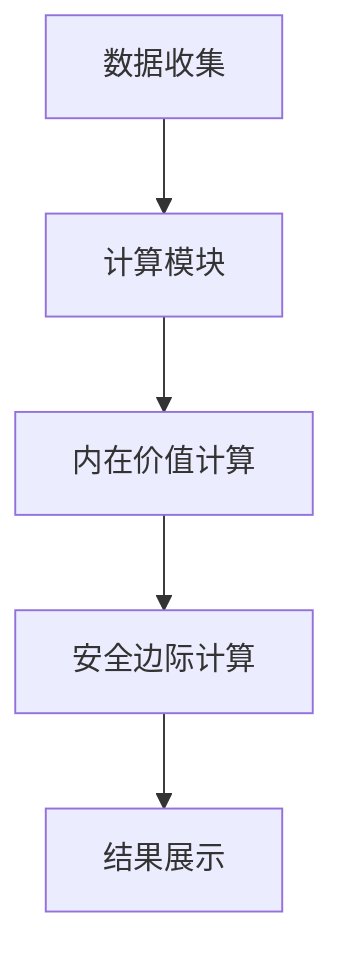

                 


# 《本杰明·格雷厄姆的安全边际现代诠释》

## 关键词：安全边际，本杰明·格雷厄姆，价值投资，内在价值，现代投资策略

## 摘要：本文探讨了本杰明·格雷厄姆提出的安全边际概念在现代投资环境中的应用与演变。通过详细分析安全边际的计算方法、算法原理、系统架构及项目实战，结合价值投资策略，为投资者提供深入的理论支持和实践指导。文章旨在帮助读者理解如何在现代市场中应用安全边际，以实现稳健的投资回报。

---

## # 第一部分：引言

### ## 1.1 安全边际的基本概念

#### ### 1.1.1 安全边际的定义与起源

安全边际是投资学中的一个重要概念，由本杰明·格雷厄姆提出。它是指股票的市场价格低于其内在价值的部分，即投资者在购买股票时所获得的“安全空间”。这一概念源于格雷厄姆的价值投资理论，强调以低于内在价值的价格购买资产，以降低投资风险并确保长期收益。

#### ### 1.1.2 投资中的安全边际

在投资中，安全边际不仅是价值投资的核心原则，也是风险管理的关键工具。通过计算安全边际，投资者可以评估资产的潜在回报和风险，从而做出更明智的投资决策。安全边际的存在使得投资者能够在市场波动中保持稳健，避免因市场价格波动而产生重大损失。

### ## 1.2 安全边际的现代应用

#### ### 1.2.1 现代市场环境下的安全边际

随着市场的复杂化和金融工具的多样化，安全边际的概念也在不断演变。现代投资者需要考虑更多的因素，如全球经济形势、技术进步、企业创新等，这些都会影响内在价值的计算和安全边际的应用。

#### ### 1.2.2 安全边际与价值投资

价值投资强调购买被市场低估的资产，而安全边际正是这一理念的核心。通过计算安全边际，投资者可以识别出那些市场价格低于内在价值的资产，从而实现长期的超额收益。

---

## # 第二部分：安全边际的核心概念

### ## 2.1 安全边际的原理

#### ### 2.1.1 安全边际的原理

安全边际的原理基于价值投资的理念，即市场价格与内在价值之间的差异。当市场价格低于内在价值时，投资者购买该资产将具有安全边际，从而在市场波动中获得保护。

#### ### 2.1.2 内在价值的计算

内在价值是资产在合理市场条件下应有的价格，通常通过现金流折现模型（DCF）进行计算。DCF模型基于未来现金流的现值，计算出资产的内在价值。通过比较市场价格与内在价值，投资者可以确定是否存在安全边际。

### ## 2.2 安全边际与其他投资策略的对比

#### ### 2.2.1 价值投资与成长投资的对比

价值投资注重购买低于内在价值的资产，而成长投资则关注高增长潜力的企业。通过对比这两种策略，可以看出安全边际在价值投资中的独特地位。

#### ### 2.2.2 安全边际与技术分析的对比

技术分析关注市场走势和价格形态，而安全边际则侧重于内在价值与市场价格的差异。通过对比，可以理解安全边际在基本面分析中的重要性。

---

## # 第三部分：安全边际的算法原理

### ## 3.1 安全边际的计算方法

#### ### 3.1.1 现金流折现模型（DCF）

现金流折现模型是计算内在价值的核心工具。通过预测未来现金流并将其折现，可以估算出资产的内在价值。公式如下：

$$
\text{内在价值} = \sum_{t=1}^{n} \frac{CF_t}{(1 + r)^t} + \frac{TV}{(1 + r)^n}
$$

其中，\( CF_t \) 是第 \( t \) 年的现金流，\( r \) 是折现率，\( TV \) 是终值。

#### ### 3.1.2 安全边际的计算

安全边际的计算公式为：

$$
\text{安全边际} = \text{内在价值} - \text{市场价格}
$$

当安全边际为正时，资产具有投资价值。

---

## # 第四部分：系统架构与实现

### ## 4.1 系统架构设计

#### ### 4.1.1 系统模块划分

安全边际分析系统包括数据收集模块、计算模块和展示模块。数据收集模块负责获取企业财务数据和市场数据；计算模块基于DCF模型计算内在价值；展示模块提供直观的分析结果。

#### ### 4.1.2 系统流程图



### ## 4.2 数据处理与计算

#### ### 4.2.1 Python代码实现

以下是使用Python实现DCF模型的代码示例：

```python
import numpy as np

def calculate_intrinsic_value(fcf, discount_rate, perpetuity_growth):
    terminal_value = fcf * (1 + perpetuity_growth) / (discount_rate - perpetuity_growth)
    present_value = 0
    for i in range(len(fcf)):
        if i == 0:
            cash_flow = fcf[i]
        else:
            cash_flow = fcf[i] * (1 + perpetuity_growth)**(i)
        present_value += cash_flow / (1 + discount_rate)**i
    return terminal_value / (1 + discount_rate)**len(fcf) + present_value

# 示例数据
fcf = [100, 100, 100]
discount_rate = 0.1
perpetuity_growth = 0.02

iv = calculate_intrinsic_value(fcf, discount_rate, perpetuity_growth)
print("内在价值:", iv)
```

---

## # 第五部分：项目实战

### ## 5.1 项目介绍

#### ### 5.1.1 项目背景

以苹果公司为例，分析其安全边际。通过收集财务数据，计算其内在价值，并与市场价格进行对比。

#### ### 5.1.2 数据收集

收集苹果公司的自由现金流、折现率和永续增长率等数据。

#### ### 5.1.3 计算分析

使用DCF模型计算苹果公司的内在价值，并与当前股价进行对比，得出安全边际。

### ## 5.2 实战分析

#### ### 5.2.1 计算结果

假设计算得出苹果公司的内在价值为300美元，而当前股价为250美元，则安全边际为50美元。

#### ### 5.2.2 结论

由于安全边际为正，苹果公司当前股价低于其内在价值，具有投资价值。

---

## # 第六部分：最佳实践

### ## 6.1 小结

安全边际是价值投资的核心原则，通过计算内在价值与市场价格的差异，投资者可以在现代市场中识别出具有投资价值的资产。

### ## 6.2 注意事项

- 确保数据的准确性和完整性
- 合理选择折现率和永续增长率
- 定期更新分析结果

### ## 6.3 拓展阅读

- 《证券分析》——本杰明·格雷厄姆
- 《投资学原理》——查理·芒格

---

## 结语

安全边际不仅是价值投资的核心理念，也是现代投资中不可或缺的工具。通过本文的分析，读者可以更好地理解如何在现代市场中应用安全边际，从而做出更明智的投资决策。

