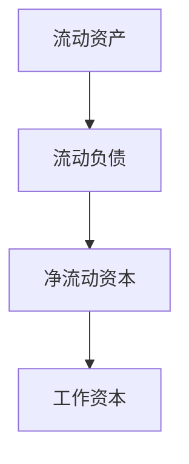
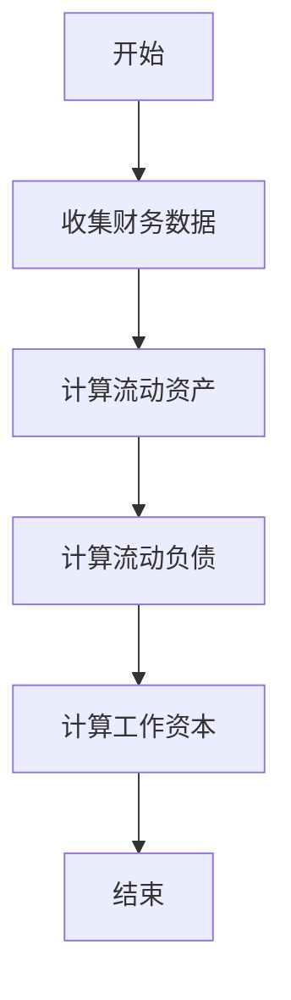

                 


# 《本杰明·格雷厄姆的工作资本分析技巧》

## 关键词：本杰明·格雷厄姆，工作资本分析，价值投资，财务分析，投资技巧

## 摘要：本杰明·格雷厄姆是价值投资的先驱，他的工作资本分析技巧为评估企业内在价值提供了独特视角。本文深入解析工作资本分析的背景、核心概念、算法原理及系统架构，结合实际案例，提供实用的分析工具和方法。

---

## 第一部分：本杰明·格雷厄姆投资理念概述

### 第1章：本杰明·格雷厄姆投资理论基础

#### 1.1 本杰明·格雷厄姆生平简介
- **早年经历**：格雷厄姆出生于伦敦，后移居美国，早期在金融领域积累经验，奠定了其投资理论基础。
- **投资理念形成**：他强调安全边际和内在价值，倡导以合理价格买入优质资产。
- **贡献**：格雷厄姆与大卫·多德共同提出“价值投资”概念，影响了巴菲特等投资者。

#### 1.2 工作资本分析的基本概念
- **定义**：工作资本（Working Capital）= 流动资产 - 流动负债，衡量企业短期偿债能力。
- **背景与意义**：帮助投资者评估企业资金流动性，判断企业财务健康状况。
- **核心要素**：流动资产包括现金、应收账款等，流动负债包括应付账款、短期负债等。

#### 1.3 工作资本分析与传统财务分析的区别
- **传统分析的局限性**：仅关注整体利润，忽视短期流动性。
- **工作资本的独特视角**：专注于流动资产与流动负债的动态关系。
- **应用场景**：适用于评估企业的短期偿债能力和运营效率。

---

## 第二部分：工作资本分析的核心概念与联系

### 第2章：工作资本分析的原理与方法

#### 2.1 工作资本分析的原理
- **构成要素**：流动资产（现金、存货、应收账款）和流动负债（应付账款、短期负债）。
- **基本公式**：工作资本 = 流动资产 - 流动负债。
- **核心假设**：流动资产和流动负债的准确计量。

#### 2.2 工作资本分析与企业价值的关系
- **影响因素**：高工作资本可能显示企业资金充裕，但过高可能表明资金利用不善。
- **企业估值应用**：工作资本健康与否影响企业整体价值评估。
- **局限性**：不考虑长期资产和负债，仅反映短期财务状况。

#### 2.3 实体关系图


---

## 第三部分：工作资本分析的算法原理讲解

### 第3章：工作资本分析的计算方法

#### 3.1 计算公式
- 工作资本 = 流动资产 - 流动负债
- 流动资产 = 现金 + 存货 + 应收账款
- 流动负债 = 应付账款 + 短期负债

#### 3.2 流程图


#### 3.3 Python代码实现
```python
# 计算流动资产和流动负债
流动资产 = 现金 + 存货 + 应收账款
流动负债 = 应付账款 + 短期负债
工作资本 = 流动资产 - 流动负债

# 示例数据
现金 = 100000
存货 = 50000
应收账款 = 150000
应付账款 = 80000
短期负债 = 70000

流动资产 = cash + inventory + accounts_receivable
流动负债 = accounts_payable + short_term_liabilities
工作资本 = 流动资产 - 流动负债

print("工作资本 =", 工作资本)
```

#### 3.4 数学模型
$$工作资本 = 流动资产 - 流动负债$$
$$流动资产 = 现金 + 存货 + 应收账款$$
$$流动负债 = 应付账款 + 短期负债$$

---

## 第四部分：工作资本分析的系统架构设计

### 第4章：系统分析与架构设计方案

#### 4.1 问题场景介绍
投资者需要一个工具来自动化计算工作资本，评估企业财务健康状况。

#### 4.2 系统功能设计
- **领域模型**：定义数据结构，如公司财务数据表。
- **功能模块**：数据输入、计算工作资本、生成报告。

#### 4.3 系统架构图


#### 4.4 接口设计
- 数据接口：接收财务数据，格式为JSON或CSV。
- 计算接口：返回工作资本值。

#### 4.5 交互设计


---

## 第五部分：项目实战

### 第5章：工作资本分析的项目实现

#### 5.1 环境安装
- 安装Python和必要的库（Pandas、NumPy）。

#### 5.2 核心代码实现
```python
import pandas as pd

def 计算工作资本(data):
    流动资产 = data['现金'] + data['存货'] + data['应收账款']
    流动负债 = data['应付账款'] + data['短期负债']
    工作资本 = 流动资产 - 流动负债
    return 工作资本

# 示例数据
data = {
    '现金': 100000,
    '存货': 50000,
    '应收账款': 150000,
    '应付账款': 80000,
    '短期负债': 70000
}

result = 计算工作资本(data)
print("工作资本 =", result)
```

#### 5.3 案例分析
以某公司为例，分析其工作资本状况，判断其财务健康性。

#### 5.4 项目小结
实现了一个简单的工作资本分析工具，展示了如何利用Python进行自动化分析。

---

## 第六部分：最佳实践与小结

### 6.1 最佳实践
- 数据准确性至关重要。
- 结合其他财务指标进行综合分析。

### 6.2 小结
工作资本分析是评估企业财务健康的重要工具，结合本杰明·格雷厄姆的投资理念，投资者可以更精准地做出决策。

### 6.3 注意事项
- 工作资本仅为短期指标，需结合长期指标分析。
- 数据来源和准确性直接影响分析结果。

### 6.4 拓展阅读
推荐阅读《证券分析》和《聪明的投资者》，深入理解价值投资理念。

---

通过以上结构，文章详细介绍了本杰明·格雷厄姆的工作资本分析技巧，结合理论与实践，为投资者提供了实用的工具和方法。

