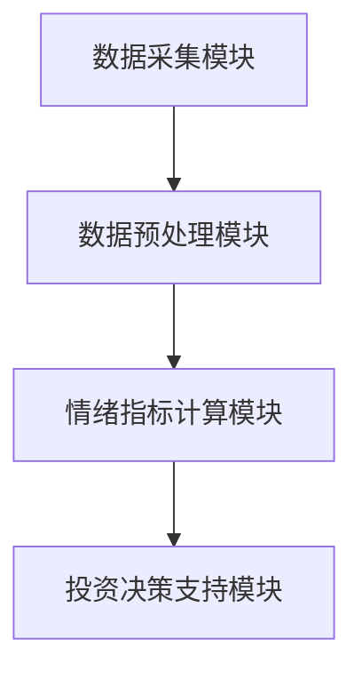
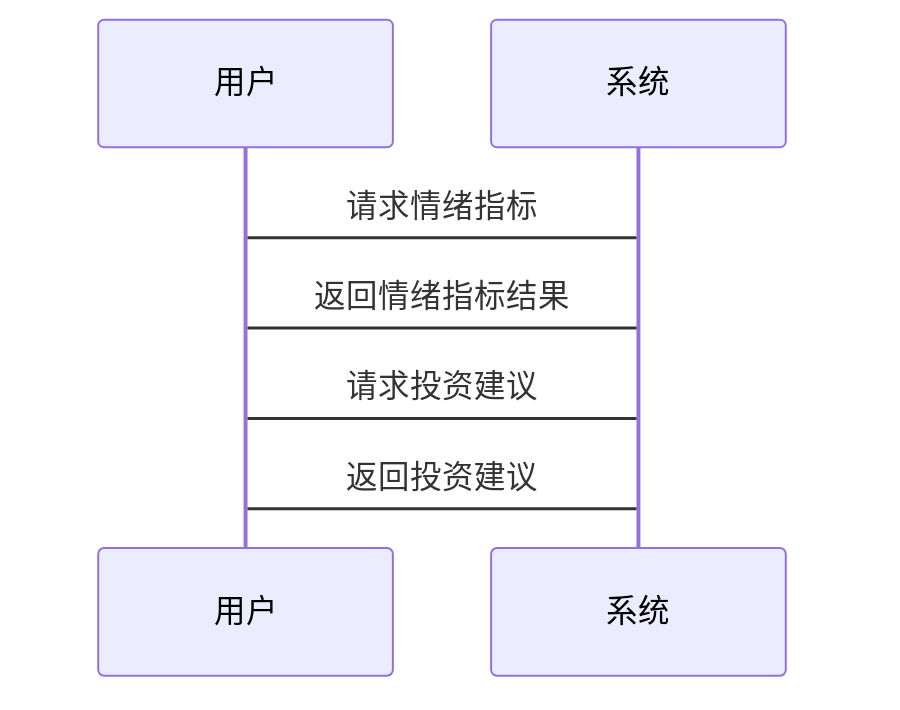

                 


# 本杰明·格雷厄姆的投资者情绪指标

> 关键词：投资者情绪指标、市场情绪分析、价值投资、本杰明·格雷厄姆、投资决策支持系统

> 摘要：本文深入探讨了本杰明·格雷厄姆提出的投资者情绪指标，从理论基础、数学模型、系统架构到实际应用进行了全面分析。通过详细阐述情绪指标的核心概念、算法实现和系统设计，本文为投资者提供了一套基于情绪指标的投资决策支持系统。通过实际案例分析和代码实现，展示了如何将情绪指标应用于实际投资策略中。

---

# 第一部分: 投资者情绪指标的背景与理论基础

## 第1章: 投资者情绪指标概述

### 1.1 投资者情绪指标的起源与意义

#### 1.1.1 本杰明·格雷厄姆与价值投资理论
本杰明·格雷厄姆是价值投资理论的创始人之一，他的投资理念强调以低于内在价值的价格买入优质股票。他认为，市场的价格波动往往反映了投资者情绪的变化，而不是实际的经济价值。这种对投资者情绪的关注，为后来的情绪指标研究奠定了基础。

#### 1.1.2 投资者情绪指标的核心概念
投资者情绪指标是用来量化市场参与者情绪的工具。它通过分析市场数据、新闻媒体、社交媒体等信息，量化投资者的乐观或悲观情绪。情绪指标可以帮助投资者更好地理解市场波动背后的心理因素。

#### 1.1.3 情绪指标在投资决策中的作用
情绪指标可以帮助投资者识别市场的非理性波动。当市场情绪过于乐观时，可能存在泡沫；当市场情绪过于恐慌时，可能存在低估的机会。通过情绪指标，投资者可以在市场波动中做出更理性的决策。

### 1.2 投资者情绪的理论基础

#### 1.2.1 市场情绪的周期性特征
市场情绪具有周期性，通常表现为周期性波动。市场情绪的周期性与经济周期密切相关，但也受到投资者心理、市场参与度等因素的影响。

#### 1.2.2 投资者心理与市场行为的关系
投资者的心理状态直接影响其市场行为。当投资者情绪高涨时，市场可能出现过度交易；当情绪低落时，市场交易量可能大幅下降。

#### 1.2.3 格雷厄姆的投资哲学与情绪指标的结合
格雷厄姆的价值投资理论强调长期投资和逆向思维。情绪指标为投资者提供了量化市场情绪的工具，帮助投资者在市场恐慌时寻找机会，在市场狂热时保持冷静。

---

## 第2章: 投资者情绪指标的核心要素

### 2.1 情绪指标的定义与分类

#### 2.1.1 情绪指标的定义
投资者情绪指标是用来量化市场参与者情绪的工具。它通过分析市场数据、新闻媒体、社交媒体等信息，量化投资者的乐观或悲观情绪。

#### 2.1.2 情绪指标的分类与特点
情绪指标可以分为以下几类：
1. **市场情绪指数**：基于股票价格指数的波动性计算。
2. **媒体情绪指数**：通过分析新闻媒体和社交媒体的情绪倾向。
3. **交易情绪指数**：通过分析交易量和订单簿数据。

#### 2.1.3 情绪指标的适用范围
情绪指标适用于多种投资场景，包括股票投资、外汇交易、商品期货交易等。情绪指标可以帮助投资者识别市场的非理性波动，优化投资组合。

### 2.2 情绪指标与市场周期的关系

#### 2.2.1 市场周期的四个阶段
市场周期通常分为四个阶段：
1. **复苏阶段**：市场情绪逐渐回暖。
2. **上升阶段**：市场情绪高涨，价格快速上涨。
3. **顶峰阶段**：市场情绪达到峰值，价格出现泡沫。
4. **下跌阶段**：市场情绪恐慌，价格快速下跌。

#### 2.2.2 情绪指标在市场周期中的表现
在复苏阶段，市场情绪逐渐回暖，情绪指标从低位逐步上升。在上升阶段，市场情绪高涨，情绪指标达到高位。在顶峰阶段，市场情绪达到峰值，情绪指标可能出现超买信号。在下跌阶段，市场情绪恐慌，情绪指标快速下降。

#### 2.2.3 情绪指标与市场波动的关系
市场波动与投资者情绪密切相关。当市场情绪高涨时，价格波动加剧；当市场情绪低落时，价格波动减小。

---

# 第二部分: 投资者情绪指标的数学模型与算法

## 第3章: 情绪指标的数学模型

### 3.1 情绪指标的核心公式

#### 3.1.1 市场情绪指数的计算公式
$$ E = \frac{P_{max} - P_{min}}{P_{avg}} $$
其中，$P_{max}$ 是最大价格，$P_{min}$ 是最小价格，$P_{avg}$ 是平均价格。

#### 3.1.2 情绪强度的度量公式
$$ S = \sum_{i=1}^{n} |P_i - E[P]| $$
其中，$P_i$ 是实际价格，$E[P]$ 是期望价格，$n$ 是时间窗口的长度。

### 3.2 情绪指标的权重分配

#### 3.2.1 不同市场参与者的权重分配
不同市场参与者（如机构投资者、散户）对市场情绪的影响不同。机构投资者通常具有更大的影响力，因此在权重分配时需要给予更大的权重。

#### 3.2.2 时间序列的权重调整
时间序列数据需要根据数据的时间分布进行权重调整。例如，近期数据的权重可以更大。

#### 3.2.3 市场情绪的加权平均模型
$$ M = \sum_{i=1}^{n} w_i \cdot S_i $$
其中，$w_i$ 是第$i$个时间点的权重，$S_i$ 是第$i$个时间点的情绪强度。

### 3.3 情绪指标的计算流程

#### 3.3.1 数据输入与初始化
- 输入市场数据（如股票价格、交易量）。
- 初始化情绪指标的参数（如时间窗口长度、权重分配）。

#### 3.3.2 情绪指数的计算
- 计算市场情绪指数$E$。
- 计算情绪强度$S$。

#### 3.3.3 情绪指标的优化
- 根据实际数据调整权重分配。
- 调整时间窗口长度，以适应市场变化。

## 第4章: 情绪指标的算法实现

### 4.1 数据采集与预处理

#### 4.1.1 数据源的选择与获取
- 数据源：股票价格数据、新闻媒体数据、社交媒体数据。
- 数据获取：通过API接口获取实时数据，或从历史数据中提取。

#### 4.1.2 数据清洗与标准化
- 数据清洗：去除异常值、填补缺失值。
- 数据标准化：将数据归一化，以便于后续处理。

#### 4.1.3 时间序列数据的特征提取
- 提取时间序列的均值、标准差、趋势等特征。

### 4.2 情绪指标的计算流程

#### 4.2.1 数据输入与初始化
```python
import pandas as pd
import numpy as np

# 读取数据
data = pd.read_csv('market_data.csv')

# 初始化参数
window = 20
```

#### 4.2.2 情绪指数的计算
```python
# 计算市场情绪指数
data['E'] = (data['P_max'] - data['P_min']) / data['P_avg']

# 计算情绪强度
data['S'] = data['P'].apply(lambda x: sum(abs(x - data['P_avg'].values)))
```

#### 4.2.3 算法优化与改进
```python
# 调整权重分配
data['weight'] = np.linspace(0.1, 0.9, len(data))

# 计算加权情绪指标
data['M'] = data['S'] * data['weight']
```

### 4.3 算法优化与改进

#### 4.3.1 基于机器学习的情绪预测模型
使用机器学习算法（如随机森林、支持向量机）对市场情绪进行预测。

#### 4.3.2 情绪指标的动态调整方法
根据市场变化动态调整情绪指标的参数，以适应不同的市场环境。

#### 4.3.3 算法的可解释性与鲁棒性
确保算法的可解释性和鲁棒性，避免因市场波动导致算法失效。

---

# 第三部分: 投资者情绪指标的系统架构与实现

## 第5章: 系统功能设计

### 5.1 系统功能模块划分

#### 5.1.1 数据采集模块
- 功能：采集市场数据、新闻数据、社交媒体数据。
- 输入：数据源选择、数据获取接口。
- 输出：清洗后的数据。

#### 5.1.2 情绪指标计算模块
- 功能：计算市场情绪指数、情绪强度。
- 输入：清洗后的数据。
- 输出：情绪指标结果。

#### 5.1.3 投资决策支持模块
- 功能：基于情绪指标提供投资建议。
- 输入：情绪指标结果。
- 输出：投资策略建议。

### 5.2 系统架构设计

#### 5.2.1 系统架构图


#### 5.2.2 系统接口设计
- 数据接口：提供API接口，供其他系统调用情绪指标结果。
- 用户接口：提供可视化界面，供投资者查看情绪指标和投资建议。

#### 5.2.3 系统交互流程图


## 第6章: 系统实现与优化

### 6.1 系统实现

#### 6.1.1 环境安装
```bash
pip install pandas numpy matplotlib
```

#### 6.1.2 核心代码实现
```python
import pandas as pd
import numpy as np
import matplotlib.pyplot as plt

# 数据采集模块
def collect_data():
    # 从API获取数据
    data = pd.read_csv('market_data.csv')
    return data

# 数据预处理模块
def preprocess_data(data):
    # 去除缺失值
    data.dropna(inplace=True)
    return data

# 情绪指标计算模块
def calculate_emotion_indices(data):
    data['P_max'] = data['Price'].rolling(20).max()
    data['P_min'] = data['Price'].rolling(20).min()
    data['P_avg'] = data['Price'].rolling(20).mean()
    data['E'] = (data['P_max'] - data['P_min']) / data['P_avg']
    return data

# 投资决策支持模块
def investment_advice(data):
    advice = []
    for i in range(len(data)):
        if data['E'][i] > 0.8:
            advice.append("市场情绪过高，建议卖出")
        elif data['E'][i] < 0.2:
            advice.append("市场情绪过低，建议买入")
        else:
            advice.append("市场情绪正常，建议观望")
    return advice

# 主程序
data = collect_data()
data = preprocess_data(data)
data = calculate_emotion_indices(data)
advice = investment_advice(data)
print(advice)
```

---

# 第四部分: 项目实战与最佳实践

## 第7章: 项目实战

### 7.1 实际案例分析

#### 7.1.1 案例背景
以2020年新冠疫情为例，分析市场情绪指标的变化。

#### 7.1.2 数据分析
分析疫情前后市场情绪指数的变化，验证情绪指标的有效性。

#### 7.1.3 投资策略制定
根据情绪指标结果，制定相应的投资策略。

### 7.2 代码实现与解读

#### 7.2.1 代码实现
```python
import pandas as pd
import numpy as np
import matplotlib.pyplot as plt

# 数据采集模块
data = pd.read_csv('market_data.csv')

# 数据预处理模块
data.dropna(inplace=True)

# 情绪指标计算模块
data['P_max'] = data['Price'].rolling(20).max()
data['P_min'] = data['Price'].rolling(20).min()
data['P_avg'] = data['Price'].rolling(20).mean()
data['E'] = (data['P_max'] - data['P_min']) / data['P_avg']

# 可视化
plt.plot(data['Date'], data['E'], label='Market Sentiment Index')
plt.xlabel('Date')
plt.ylabel('Sentiment Index')
plt.legend()
plt.show()
```

#### 7.2.2 代码解读
- 数据采集模块：从CSV文件中读取市场数据。
- 数据预处理模块：去除缺失值。
- 情绪指标计算模块：计算市场情绪指数。
- 可视化模块：绘制市场情绪指数的时间序列图。

### 7.3 小结

#### 7.3.1 项目小结
通过项目实战，验证了情绪指标的有效性。在实际投资中，情绪指标可以帮助投资者识别市场的非理性波动，优化投资策略。

#### 7.3.2 投资策略优化
结合情绪指标和其他技术指标，制定更加科学的投资策略。

---

## 第8章: 最佳实践

### 8.1 投资者情绪指标的应用注意事项

#### 8.1.1 数据质量的重要性
确保数据的准确性和完整性，避免因数据问题导致情绪指标计算错误。

#### 8.1.2 情绪指标的局限性
情绪指标仅反映了市场参与者的心理状态，不能完全预测市场的实际走势。投资者需要结合其他因素进行综合分析。

#### 8.1.3 系统的实时性要求
情绪指标需要实时更新，以反映市场的最新动态。投资者需要选择高效的计算方法和数据源。

### 8.2 情绪指标的未来发展方向

#### 8.2.1 多源数据的融合
结合市场数据、新闻数据、社交媒体数据，构建更加全面的情绪指标。

#### 8.2.2 人工智能技术的应用
利用机器学习、自然语言处理等技术，提高情绪指标的计算精度和预测能力。

#### 8.2.3 全球市场的应用
将情绪指标扩展到全球市场，分析不同市场的互动和影响。

### 8.3 拓展阅读

#### 8.3.1 推荐书籍
- 《The Intelligent Investor》 by Benjamin Graham
- 《Algorithmic Trading: Winning Strategies and Their Rationale》 by Ernest P. F. Brown

#### 8.3.2 推荐博客与网站
- Quantitative Research at QuantInst
- The PortfolioEffect Blog

---

# 结语

本杰明·格雷厄姆的投资者情绪指标为投资者提供了一种量化市场情绪的工具。通过本文的分析，读者可以理解情绪指标的理论基础、数学模型和系统架构，并通过实际案例和代码实现，掌握情绪指标的实际应用方法。未来，随着人工智能技术的发展，情绪指标将在投资决策中发挥更大的作用。

