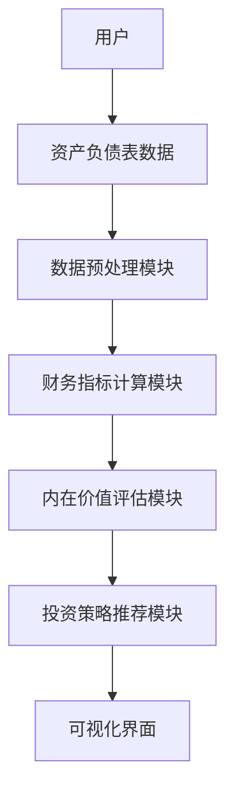
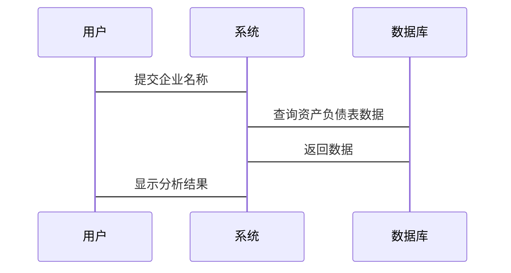

                 


# 本杰明·格雷厄姆的资产负债表分析方法

## 关键词：资产负债表分析、价值投资、净流动资产测试、保守投资策略、内在价值计算

## 摘要：  
本杰明·格雷厄姆是价值投资的鼻祖，他的资产负债表分析方法深刻影响了现代投资理念。本文将从资产负债表的基本概念出发，详细解析其核心要素，并结合格雷厄姆的特殊分析方法，如净流动资产测试和保守投资策略，探讨如何通过资产负债表评估企业内在价值。文章还将提供数学模型、系统架构设计和实际案例分析，帮助读者掌握这一经典方法。

---

# 第一部分: 资产负债表的基本概念与结构

## 第1章: 资产负债表的基本概念与结构

### 1.1 资产负债表的定义与作用

#### 1.1.1 资产负债表的定义  
资产负债表是企业财务报表的重要组成部分，反映企业在特定时点的资产、负债和所有者权益的构成及其金额。它通过平衡关系“资产 = 负债 + 所有者权益”展示企业的财务状况。

#### 1.1.2 资产负债表的作用  
- 描述企业的财务状况，包括资产、负债和所有者权益的构成。  
- 评估企业的偿债能力、运营能力和财务健康状况。  
- 为投资者、债权人和管理层提供决策依据。  

#### 1.1.3 资产负债表的编制与披露要求  
- 按照会计准则编制，确保数据准确性和可比性。  
- 公开披露，便于利益相关者分析和评估。  

### 1.2 资产负债表的基本结构

#### 1.2.1 资产、负债和所有者权益的定义与分类  
- **资产**：企业拥有的资源，预期能带来经济利益。  
- **负债**：企业承担的义务，预期会导致经济利益流出。  
- **所有者权益**：资产减去负债的余额，代表所有者对企业净资产的要求权。  

#### 1.2.2 资产负债表的平衡关系：资产 = 负债 + 所有者权益  
$$ 资产 = 负债 + 所有者权益 $$  
这一公式是资产负债表的核心，确保数据的准确性。

#### 1.2.3 资产负债表的列报格式与规范  
- 资产按流动性分类：流动资产、非流动资产。  
- 负债按流动性分类：流动负债、非流动负债。  
- 所有者权益按构成分类：股本、资本公积、盈余公积、未分配利润等。  

### 1.3 本杰明·格雷厄姆与价值投资概述

#### 1.3.1 本杰明·格雷厄姆的生平简介  
本杰明·格雷厄姆（Benjamin Graham）是价值投资的创始人，被誉为“价值投资之父”。他在20世纪初提出了许多投资理念，尤其是对资产负债表的分析方法，影响了后来的投资大师，如沃伦·巴菲特。

#### 1.3.2 价值投资的核心理念  
价值投资强调以低于内在价值的价格买入优质股票，长期持有，获得超额收益。格雷厄姆认为，市场短期是投票机，长期是称重机，企业的真实价值最终会反映在股价中。

#### 1.3.3 资产负债表在价值投资中的重要性  
格雷厄姆通过分析资产负债表，评估企业的财务健康状况和内在价值。他认为，企业的价值主要体现在其资产和负债的结构上，尤其是流动资产和流动负债的比率关系。

---

## 第2章: 资产负债表的核心要素分析

### 2.1 流动资产分析

#### 2.1.1 流动资产的定义与分类  
流动资产是指可以在一年内或一个正常营业周期内变现或耗用的资产。  
- 主要包括：现金及现金等价物、应收账款、存货、短期投资等。

#### 2.1.2 主要流动资产项目  
- **现金及现金等价物**：企业的“备用金”，流动性最强。  
- **应收账款**：企业因赊销而产生的债权，需关注其可收回性。  
- **存货**：企业生产或销售过程中持有的原材料、在制品和产成品，需评估其周转率和质量。  

#### 2.1.3 流动资产周转率与流动性分析  
流动资产周转率 = 营业收入 / 平均流动资产  
$$ 流动资产周转率 = \frac{\text{营业收入}}{\text{平均流动资产}} $$  
周转率高，说明流动资产利用效率高，企业经营能力强。

---

### 2.2 非流动资产分析

#### 2.2.1 非流动资产的定义与分类  
非流动资产是指无法在一年内变现的资产，包括固定资产、无形资产、长期投资等。

#### 2.2.2 主要非流动资产项目  
- **固定资产**：如厂房、设备、建筑物等，需关注其折旧和维护情况。  
- **无形资产**：如专利权、商标权等，需评估其使用寿命和价值。  
- **长期投资**：如股权投资，需关注其盈利能力和减值风险。  

#### 2.2.3 非流动资产的减值与评估  
企业需定期对非流动资产进行减值测试，确保其账面价值不超过可收回金额。  
$$ 减值损失 = 账面价值 - 可收回金额 $$  

---

### 2.3 流动负债分析

#### 2.3.1 流动负债的定义与分类  
流动负债是指企业在一年内或一个正常营业周期内需要偿还的债务。  
- 主要包括：短期借款、应付账款、应付工资、应交税费等。

#### 2.3.2 主要流动负债项目  
- **短期借款**：企业为满足短期资金需求而借入的款项。  
- **应付账款**：企业因采购原材料或服务而产生的债务。  
- **应交税费**：企业应缴纳的各项税费，如增值税、企业所得税等。  

#### 2.3.3 流动负债的偿付压力分析  
流动比率 = 流动资产 / 流动负债  
$$ 流动比率 = \frac{\text{流动资产}}{\text{流动负债}} $$  
流动比率越低，偿付压力越大，企业可能面临流动性风险。

---

### 2.4 非流动负债分析

#### 2.4.1 非流动负债的定义与分类  
非流动负债是指企业在一年以上或一个正常营业周期以上需要偿还的债务。  
- 主要包括：长期借款、应付债券、递延税款等。

#### 2.4.2 主要非流动负债项目  
- **长期借款**：企业为固定资产投资或其他长期需求而借入的款项。  
- **应付债券**：企业发行的长期债券，需按期支付利息和本金。  
- **递延税款**：由于会计政策与税法差异产生的暂时性负债。  

#### 2.4.3 非流动负债的期限结构与偿付风险  
企业应关注非流动负债的期限分布，合理安排偿债计划，避免集中偿付压力过大。

---

### 2.5 所有者权益分析

#### 2.5.1 所有者权益的定义与构成  
所有者权益是企业净资产的价值，包括股本、资本公积、盈余公积、未分配利润等。

#### 2.5.2 主要所有者权益项目  
- **股本**：企业发行的普通股和优先股的面值总额。  
- **资本公积**：企业发行股票溢价或其他原因形成的公积。  
- **盈余公积**：企业从净利润中提取的公积金。  
- **未分配利润**：企业尚未分配的利润。  

#### 2.5.3 所有者权益变动的分析  
所有者权益的变化反映了企业的盈利能力和股利分配政策。  
$$ 净利润 = 收入 - 费用 $$  

---

## 第3章: 本杰明·格雷厄姆的特殊分析方法

### 3.1 净流动资产测试

#### 3.1.1 净流动资产的定义与计算  
净流动资产 = 流动资产 - 流动负债  
$$ 净流动资产 = \text{流动资产} - \text{流动负债} $$  
格雷厄姆认为，如果净流动资产为正，说明企业有一定的偿债能力和运营空间。

#### 3.1.2 净流动资产测试的步骤与应用  
- 计算企业的净流动资产。  
- 比较净流动资产与市场价值，判断是否存在低估。  
- 选择净流动资产为正且市场价值低于账面价值的企业进行投资。  

#### 3.1.3 净流动资产测试的优缺点  
- **优点**：简单易行，能够快速评估企业的财务健康状况。  
- **缺点**：仅关注流动资产和流动负债，忽视了非流动资产和长期负债的影响。

---

### 3.2 保守投资策略

#### 3.2.1 保守投资策略的核心思想  
格雷厄姆倡导“买入便宜”的投资策略，即寻找市场价值低于账面价值的股票。  
$$ 市场价值 < 账面价值 $$  

#### 3.2.2 保守投资策略中的资产负债表分析  
- 重点关注企业的流动资产和流动负债，确保流动比率较高。  
- 评估企业的净流动资产是否为正，判断是否存在安全边际。  

#### 3.2.3 保守投资策略的实施步骤  
1. 筛选市场价值低于账面价值的企业。  
2. 分析企业的流动资产和流动负债，计算流动比率。  
3. 考虑企业的盈利能力和发展潜力，选择优质标的。  

---

### 3.3 格雷厄姆的内在价值计算方法

#### 3.3.1 内在价值的定义与计算公式  
内在价值是企业未来现金流的现值。  
$$ 内在价值 = \sum_{t=1}^{n} \frac{\text{现金流}_t}{(1 + r)^t} $$  
其中，\( r \) 为折现率，\( n \) 为企业的生命周期。

#### 3.3.2 内在价值计算中的关键假设  
- 确定企业的未来现金流。  
- 选择合适的折现率 \( r \)。  
- 评估企业的生命周期 \( n \)。  

#### 3.3.3 内在价值与市场价值的对比分析  
- 如果市场价值 < 内在价值，说明企业被低估，适合买入。  
- 如果市场价值 > 内在价值，说明企业被高估，应谨慎投资。  

---

## 第4章: 资产负债表分析的数学模型与公式

### 4.1 资产负债表的基本公式

#### 4.1.1 资产 = 负债 + 所有者权益  
$$ 资产 = \text{负债} + \text{所有者权益} $$  
这是资产负债表的核心公式，确保数据的平衡性。

#### 4.1.2 流动比率  
$$ 流动比率 = \frac{\text{流动资产}}{\text{流动负债}} $$  
流动比率越高，企业的短期偿债能力越强。

#### 4.1.3 速动比率  
速动资产 = 流动资产 - 存货  
$$ 速动比率 = \frac{\text{速动资产}}{\text{流动负债}} $$  
速动比率进一步排除了存货的影响，更保守地评估企业的偿债能力。

---

## 第5章: 系统分析与架构设计方案

### 5.1 问题场景介绍  
为了实现对企业的资产负债表分析，我们需要构建一个基于价值投资理念的分析系统，帮助投资者快速评估企业的财务状况。

### 5.2 系统功能设计  
- 数据采集与处理：获取企业的资产负债表数据。  
- 财务指标计算：计算流动比率、速动比率、净流动资产等指标。  
- 内在价值评估：基于现金流折现法计算企业的内在价值。  
- 投资策略推荐：根据分析结果推荐适合的投资策略。  

### 5.3 系统架构设计  



### 5.4 系统交互设计  



---

## 第6章: 项目实战

### 6.1 环境安装  
- 安装Python和Pandas库：  
  ```bash
  pip install pandas
  ```

### 6.2 系统核心实现源代码

```python
import pandas as pd

# 假设data是企业的资产负债表数据
data = {
    '流动资产': [1000, 2000, 1500],
    '流动负债': [500, 800, 600],
    '非流动资产': [3000, 4000, 3500],
    '非流动负债': [100, 150, 120],
    '所有者权益': [1500, 2000, 2300]
}

df = pd.DataFrame(data)

# 计算流动比率
df['流动比率'] = df['流动资产'] / df['流动负债']

# 计算速动比率
df['速动资产'] = df['流动资产'] - df['存货']  # 假设存货数据已包含在data中
df['速动比率'] = df['速动资产'] / df['流动负债']

# 计算净流动资产
df['净流动资产'] = df['流动资产'] - df['流动负债']

print(df)
```

### 6.3 代码应用解读与分析  
上述代码展示了如何利用Python和Pandas库进行资产负债表数据的处理和分析。通过计算流动比率、速动比率和净流动资产，我们可以评估企业的短期偿债能力和财务健康状况。

---

## 第7章: 总结与最佳实践

### 7.1 总结  
本杰明·格雷厄姆的资产负债表分析方法为我们提供了一套系统且实用的投资工具。通过分析流动资产、流动负债和所有者权益，我们能够准确评估企业的财务状况和内在价值，从而做出明智的投资决策。

### 7.2 最佳实践 Tips  
- 在实际投资中，结合多个财务指标和行业背景进行综合分析。  
- 定期更新和调整分析模型，以适应市场变化。  
- 保持对企业的长期关注，避免短期波动影响判断。  

### 7.3 拓展阅读  
- 《证券分析》（The Interpretation of Financial Statements）—— 本杰明·格雷厄姆  
- 《投资学原理》（Principles of Investment）—— 查尔斯·埃勒里·莫迪  

---

通过以上分析，我们可以看到，资产负债表分析不仅是价值投资的核心工具，也是企业财务管理的重要手段。希望本文能够帮助读者深入理解本杰明·格雷厄姆的分析方法，并将其应用于实际投资和管理中。

